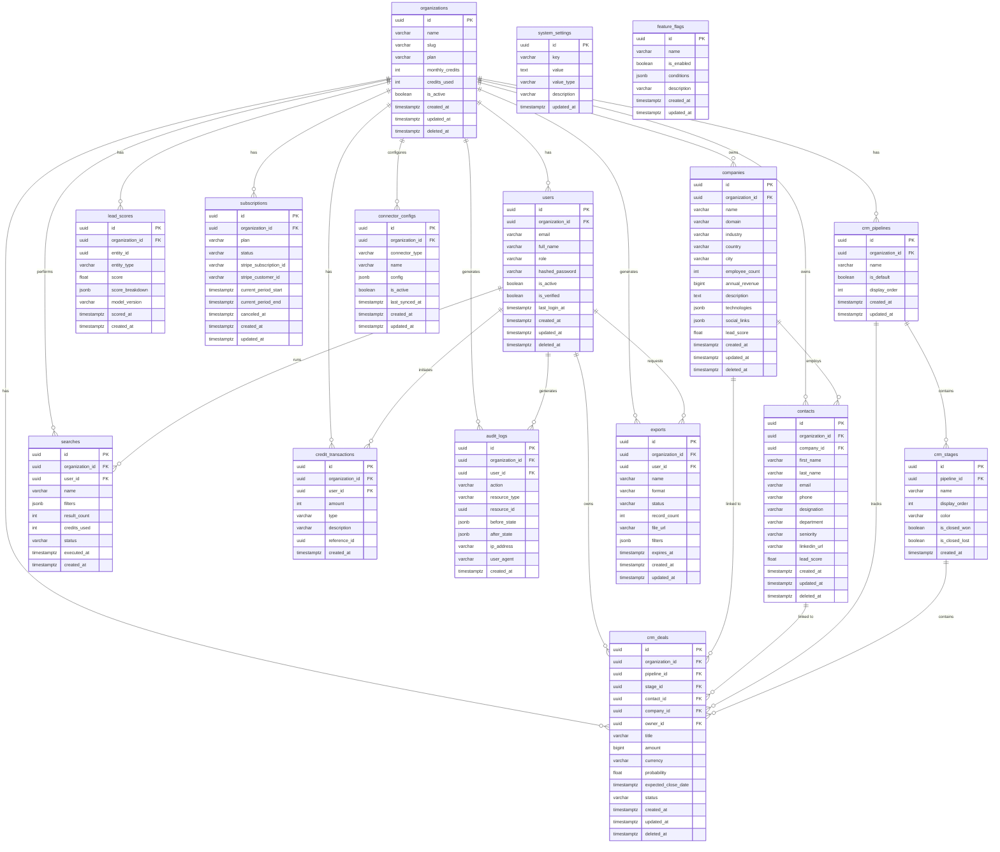

# Database Reference — AI Lead Intelligence Platform

This document is the authoritative reference for the platform's PostgreSQL schema, indexing strategy, partitioning, archiving, data-retention policies, query performance guidelines, and naming conventions.

---

## Table of Contents

1. [ER Diagram](#er-diagram)
2. [Table Descriptions](#table-descriptions)
3. [Indexing Strategy](#indexing-strategy)
4. [Partitioning Strategy](#partitioning-strategy)
5. [Archiving Strategy](#archiving-strategy)
6. [Data Retention Policies](#data-retention-policies)
7. [Query Performance Guidelines](#query-performance-guidelines)
8. [Naming Conventions](#naming-conventions)

---

## ER Diagram



---

## Table Descriptions

### Core Identity Domain

| Table | Purpose |
|---|---|
| `organizations` | Top-level tenant. Every row in every other table is scoped to an `organization_id`. Stores plan tier, credit quota, and soft-delete timestamp. |
| `users` | Platform users belonging to an organization. Roles: `admin`, `manager`, `viewer`. Passwords are bcrypt-hashed. |
| `subscriptions` | Stripe subscription lifecycle per organization. One active subscription per org at any time. |
| `credit_transactions` | Append-only ledger of credit debits and credits. `type` is one of `purchase`, `usage`, `refund`, `bonus`. |
| `system_settings` | Key-value store for platform-wide configuration (string, int, bool, json value types). |
| `feature_flags` | Boolean toggles with optional JSONB `conditions` for percentage rollout or org targeting. |

### Lead Intelligence Domain

| Table | Purpose |
|---|---|
| `companies` | Enriched firmographic records. `technologies` and `social_links` stored as JSONB for flexibility. `lead_score` is a cached denormalized float. |
| `contacts` | Individual professionals linked to a company. `seniority` enum: `C_LEVEL`, `VP`, `DIRECTOR`, `MANAGER`, `INDIVIDUAL`. `lead_score` is cached. |
| `searches` | Saved and executed search queries with JSONB filters. Tracks credit consumption per execution. |
| `lead_scores` | Immutable scoring history for any entity (company or contact). Stores per-signal `score_breakdown` and the model version used. |

### CRM Domain

| Table | Purpose |
|---|---|
| `crm_pipelines` | Named deal pipelines per organization. Each org has one default pipeline. |
| `crm_stages` | Ordered stages within a pipeline. Flags `is_closed_won` and `is_closed_lost` mark terminal states. |
| `crm_deals` | Deal records linking contacts and companies to a stage. `amount` in cents. `probability` is 0.0–1.0. |

### Operational Domain

| Table | Purpose |
|---|---|
| `exports` | Tracks file export jobs (CSV/XLSX/JSON). `file_url` is a signed S3 URL. Records expire after `expires_at`. |
| `connector_configs` | OAuth and API credentials for external integrations (Salesforce, HubSpot, LinkedIn, etc.). Sensitive fields inside `config` are encrypted at rest. |
| `audit_logs` | Immutable compliance log of every mutating API call. Partitioned by month (see below). |

---

## Indexing Strategy

### Full-Text / Trigram Indexes

Full-text search on names and emails uses the `pg_trgm` extension for ILIKE acceleration:

```sql
CREATE EXTENSION IF NOT EXISTS pg_trgm;

-- Companies
CREATE INDEX idx_companies_name_trgm
    ON companies USING GIN (name gin_trgm_ops);

CREATE INDEX idx_companies_domain_trgm
    ON companies USING GIN (domain gin_trgm_ops);

-- Contacts
CREATE INDEX idx_contacts_email_trgm
    ON contacts USING GIN (email gin_trgm_ops);

CREATE INDEX idx_contacts_full_name_trgm
    ON contacts USING GIN ((first_name || ' ' || last_name) gin_trgm_ops);

-- Users
CREATE INDEX idx_users_email_trgm
    ON users USING GIN (email gin_trgm_ops);
```

### BRIN Indexes (append-only time-series)

BRIN is orders of magnitude smaller than B-Tree for monotonically increasing timestamps:

```sql
CREATE INDEX idx_audit_logs_created_at_brin
    ON audit_logs USING BRIN (created_at) WITH (pages_per_range = 128);

CREATE INDEX idx_credit_transactions_created_at_brin
    ON credit_transactions USING BRIN (created_at);

CREATE INDEX idx_searches_executed_at_brin
    ON searches USING BRIN (executed_at);
```

### Partial Indexes (soft-delete pattern)

Only active (non-deleted) rows are typically queried. Partial indexes exclude deleted rows and are far smaller:

```sql
CREATE INDEX idx_organizations_active
    ON organizations (created_at)
    WHERE deleted_at IS NULL;

CREATE INDEX idx_users_org_active
    ON users (organization_id, email)
    WHERE deleted_at IS NULL;

CREATE INDEX idx_companies_org_active
    ON companies (organization_id, lead_score DESC)
    WHERE deleted_at IS NULL;

CREATE INDEX idx_contacts_org_active
    ON contacts (organization_id, company_id)
    WHERE deleted_at IS NULL;

CREATE INDEX idx_crm_deals_org_active
    ON crm_deals (organization_id, stage_id, expected_close_date)
    WHERE deleted_at IS NULL;
```

### JSONB Indexes

```sql
-- GIN index for contains queries on technologies
CREATE INDEX idx_companies_technologies_gin
    ON companies USING GIN (technologies);

-- GIN index for lead score breakdown queries
CREATE INDEX idx_lead_scores_breakdown_gin
    ON lead_scores USING GIN (score_breakdown);
```

### Standard B-Tree Indexes

```sql
CREATE UNIQUE INDEX idx_organizations_slug ON organizations (slug);
CREATE UNIQUE INDEX idx_users_email ON users (email) WHERE deleted_at IS NULL;
CREATE INDEX idx_searches_user_id ON searches (user_id, created_at DESC);
CREATE INDEX idx_lead_scores_entity ON lead_scores (entity_type, entity_id, scored_at DESC);
CREATE INDEX idx_exports_org_status ON exports (organization_id, status, created_at DESC);
CREATE INDEX idx_connector_configs_org_type ON connector_configs (organization_id, connector_type);
```

---

## Partitioning Strategy

High-volume append-only tables are range-partitioned by month on `created_at`. This enables:
- Partition pruning so queries touching a date range scan only relevant partitions
- Instant partition drops for archiving old data
- Parallel partition scans

### audit_logs — monthly RANGE partitioning

```sql
CREATE TABLE audit_logs (
    id              uuid        NOT NULL DEFAULT gen_random_uuid(),
    organization_id uuid        NOT NULL,
    user_id         uuid,
    action          varchar(128) NOT NULL,
    resource_type   varchar(64),
    resource_id     uuid,
    before_state    jsonb,
    after_state     jsonb,
    ip_address      inet,
    user_agent      text,
    created_at      timestamptz NOT NULL DEFAULT now()
) PARTITION BY RANGE (created_at);

-- Auto-create monthly partitions via pg_partman (recommended) or manually:
CREATE TABLE audit_logs_2024_01
    PARTITION OF audit_logs
    FOR VALUES FROM ('2024-01-01') TO ('2024-02-01');

CREATE TABLE audit_logs_2024_02
    PARTITION OF audit_logs
    FOR VALUES FROM ('2024-02-01') TO ('2024-03-01');
-- ... and so on
```

### notifications — monthly RANGE partitioning

```sql
CREATE TABLE notifications (
    id              uuid        NOT NULL DEFAULT gen_random_uuid(),
    organization_id uuid        NOT NULL,
    user_id         uuid        NOT NULL,
    type            varchar(64) NOT NULL,
    title           varchar(256),
    body            text,
    is_read         boolean     NOT NULL DEFAULT false,
    metadata        jsonb,
    created_at      timestamptz NOT NULL DEFAULT now()
) PARTITION BY RANGE (created_at);
```

> **Recommendation:** Use [pg_partman](https://github.com/pgpartman/pg_partman) with `run_maintenance_proc()` called hourly to auto-create future partitions and drop expired ones.

---

## Archiving Strategy

Rows older than **2 years** are moved from live tables to mirror `_archive` tables. This keeps working set sizes small and vacuums fast.

### Archive Table Pattern

```sql
-- Mirror table with identical structure plus an archived_at timestamp
CREATE TABLE companies_archive (
    LIKE companies INCLUDING ALL,
    archived_at timestamptz NOT NULL DEFAULT now()
);

CREATE TABLE contacts_archive   (LIKE contacts   INCLUDING ALL, archived_at timestamptz NOT NULL DEFAULT now());
CREATE TABLE searches_archive   (LIKE searches   INCLUDING ALL, archived_at timestamptz NOT NULL DEFAULT now());
CREATE TABLE crm_deals_archive  (LIKE crm_deals  INCLUDING ALL, archived_at timestamptz NOT NULL DEFAULT now());
```

### Archive Job (run nightly)

```sql
-- Example for companies
WITH archived AS (
    DELETE FROM companies
    WHERE created_at < now() - INTERVAL '2 years'
      AND deleted_at IS NOT NULL  -- only soft-deleted rows
    RETURNING *
)
INSERT INTO companies_archive
SELECT *, now() AS archived_at FROM archived;
```

For `audit_logs` and `notifications` (partitioned), archiving is done by detaching and renaming old partitions rather than row-level moves:

```sql
ALTER TABLE audit_logs DETACH PARTITION audit_logs_2022_01;
ALTER TABLE audit_logs_2022_01 RENAME TO audit_logs_archive_2022_01;
```

---

## Data Retention Policies

| Table | Retention Period | Archive After | Hard Delete After | Notes |
|---|---|---|---|---|
| `audit_logs` | 7 years | Never (partition detach) | 7 years | Compliance requirement |
| `credit_transactions` | 7 years | 2 years | 7 years | Financial records |
| `searches` | 1 year | 1 year | 2 years | Usage analytics |
| `exports` | 90 days | N/A | 90 days (file) / 1 year (record) | S3 object TTL policy |
| `lead_scores` | 1 year | 1 year | 2 years | Scoring history |
| `notifications` | 6 months | 6 months (partition detach) | 1 year | UX relevance window |
| `companies` | Indefinite | 2 years post-deletion | Manual | Core data asset |
| `contacts` | Indefinite | 2 years post-deletion | Manual | GDPR right-to-erasure applies |
| `crm_deals` | Indefinite | 2 years post-deletion | Manual | Sales record |
| `connector_configs` | Active tenure | On deactivation | On org deletion | Credentials rotated on archive |

> **GDPR Note:** Contact deletion requests must cascade to `lead_scores`, `crm_deals`, `searches` (filter metadata), and `exports` within 30 days.

---

## Query Performance Guidelines

### 1. Never use `SELECT *`

Always project only the columns you need. JSONB columns (`technologies`, `config`, `score_breakdown`) can be large and should only be fetched when required.

```sql
-- Bad
SELECT * FROM companies WHERE organization_id = $1;

-- Good
SELECT id, name, domain, industry, lead_score FROM companies
WHERE organization_id = $1 AND deleted_at IS NULL
ORDER BY lead_score DESC
LIMIT 50;
```

### 2. Always filter by `organization_id` first

Every multi-tenant query must include `organization_id` as the first filter predicate. All indexes on tenant-scoped tables are prefixed with `organization_id`.

```sql
-- The planner will use idx_companies_org_active only if organization_id is present
SELECT id, name, lead_score
FROM companies
WHERE organization_id = $1
  AND deleted_at IS NULL
  AND industry = 'SaaS'
ORDER BY lead_score DESC;
```

### 3. Use `EXPLAIN ANALYZE` before deploying any new query

```sql
EXPLAIN (ANALYZE, BUFFERS, FORMAT TEXT)
SELECT c.id, c.name, c.lead_score, COUNT(ct.id) AS contact_count
FROM companies c
LEFT JOIN contacts ct ON ct.company_id = c.id AND ct.deleted_at IS NULL
WHERE c.organization_id = $1
  AND c.deleted_at IS NULL
GROUP BY c.id
HAVING COUNT(ct.id) > 5
ORDER BY c.lead_score DESC
LIMIT 20;
```

Watch for:
- `Seq Scan` on large tables — add an index
- `Hash Join` with large hash tables — consider batch processing
- High `actual rows` vs `estimated rows` discrepancy — run `ANALYZE` on the table

### 4. Prefer CTEs for complex queries

CTEs improve readability and allow the planner to materialize intermediate results. Use `WITH` for multi-step aggregations:

```sql
WITH active_companies AS (
    SELECT id, name, industry, lead_score
    FROM companies
    WHERE organization_id = $1
      AND deleted_at IS NULL
      AND lead_score > 70
),
top_contacts AS (
    SELECT company_id, COUNT(*) AS contact_count
    FROM contacts
    WHERE organization_id = $1
      AND deleted_at IS NULL
      AND seniority IN ('C_LEVEL', 'VP')
    GROUP BY company_id
)
SELECT ac.name, ac.industry, ac.lead_score, COALESCE(tc.contact_count, 0) AS exec_contacts
FROM active_companies ac
LEFT JOIN top_contacts tc ON tc.company_id = ac.id
ORDER BY ac.lead_score DESC, exec_contacts DESC;
```

### 5. Additional Guidelines

- **Use connection pooling** (PgBouncer in transaction mode) — never open a connection per request
- **Pagination**: use keyset pagination (`WHERE id > $last_id`) over `OFFSET` for large result sets
- **Bulk inserts**: use `COPY` or multi-row `INSERT ... VALUES` batched in 500-row chunks
- **Avoid N+1**: use `JOIN` or `IN (SELECT ...)` subqueries instead of per-row queries in application code
- **JSONB containment** (`@>`) is index-accelerated with GIN; avoid `->>` casts in `WHERE` clauses without functional indexes
- **Lock contention**: use `SELECT ... FOR UPDATE SKIP LOCKED` for queue-style workloads (e.g., export jobs)

---

## Naming Conventions

| Convention | Rule | Example |
|---|---|---|
| Case | All identifiers in `snake_case` | `lead_score`, `organization_id` |
| Tables | Plural nouns | `companies`, `users`, `audit_logs` |
| Primary keys | Always `id` (UUID) | `id uuid DEFAULT gen_random_uuid()` |
| Foreign keys | Referenced table singular + `_id` suffix | `organization_id`, `company_id`, `user_id` |
| Timestamps | `_at` suffix, always `timestamptz` | `created_at`, `updated_at`, `deleted_at`, `last_login_at` |
| Booleans | `is_` or `has_` prefix | `is_active`, `is_verified`, `has_trial_used` |
| JSONB columns | Descriptive noun, no suffix | `technologies`, `config`, `score_breakdown`, `filters` |
| Indexes | `idx_<table>_<columns>` | `idx_companies_org_active` |
| Unique indexes | `uniq_<table>_<columns>` | `uniq_users_email` |
| Partitions | `<table>_<YYYY>_<MM>` | `audit_logs_2024_03` |
| Archive tables | `<table>_archive` or `<table>_archive_<YYYY>_<MM>` | `companies_archive` |
| Enums | All caps, underscore separated | `C_LEVEL`, `VP`, `DIRECTOR` |
| Junction tables | Both table names joined with `_` | `contact_tags`, `deal_contacts` |
