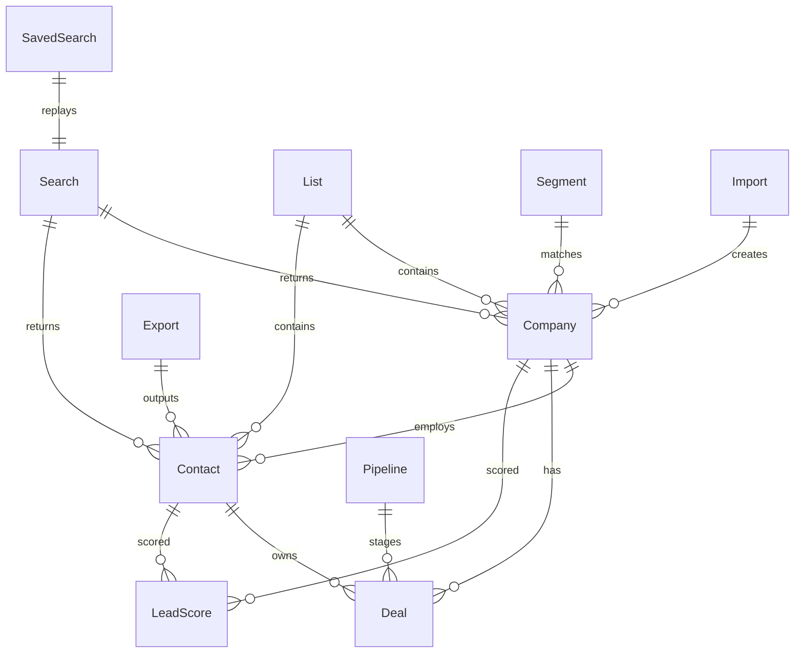

# 01 — Information Architecture

**Frontend v3.0** | AI Lead Intelligence Platform | Codename: Aurora

---

## Table of Contents

1. [Purpose](#1-purpose)
2. [Platform Mental Model](#2-platform-mental-model)
3. [Information Hierarchy](#3-information-hierarchy)
4. [Content Taxonomy](#4-content-taxonomy)
5. [Navigation Model](#5-navigation-model)
6. [Route Architecture](#6-route-architecture)
7. [User Personas & Jobs-to-be-Done](#7-user-personas--jobs-to-be-done)
8. [Permission-Based IA](#8-permission-based-ia)
9. [Search & Discovery IA](#9-search--discovery-ia)
10. [Cross-Module Relationships](#10-cross-module-relationships)
11. [IA Decision Log](#11-ia-decision-log)

---

## 1. Purpose

Information Architecture (IA) defines how users **find**, **understand**, and **act on** lead intelligence data. v3.0 IA optimizes for:

- **Speed** — Command palette + persistent sidebar reduce clicks to any screen to ≤2
- **Context** — Entity-centric 360° views keep related data in one workspace
- **AI transparency** — Parsed intent, confidence scores, and reasoning visible at decision points
- **Enterprise scale** — Bulk operations, saved views, and segments for teams managing 100K+ records

---

## 2. Platform Mental Model

Users should internalize this model within their first session:

```text
┌─────────────────────────────────────────────────────────────────────┐
│                     AI LEAD INTELLIGENCE                            │
│                                                                     │
│   DISCOVER ──→ QUALIFY ──→ ENGAGE ──→ CLOSE ──→ ANALYZE            │
│      │            │           │          │          │               │
│   Search/AI    Score/360°   CRM/Tasks   Pipeline   Reports          │
│   Lists        Enrich       Assistant   Deals      Dashboard        │
│   Segments     Verify       Outreach    Calendar   Exports          │
└─────────────────────────────────────────────────────────────────────┘
```

### Core Objects (Mental Entities)

| Object | User Understanding | Primary Home |
|--------|-------------------|--------------|
| **Company** | A business account to pursue | Records → Companies → 360° |
| **Contact** | A person at a company | Records → Contacts → 360° |
| **Search** | A discovery query (ephemeral or saved) | Discover → Lead Discovery |
| **List** | A curated collection of entities | Discover → Lists |
| **Segment** | A dynamic rule-based group | Discover → Segments |
| **Deal** | A revenue opportunity | CRM → Pipeline |
| **Score** | AI-generated fit rating (0–100) | Inline everywhere + Lead Scoring |
| **Credit** | Consumable unit for AI/enrichment | Status bar + Billing |

### Spatial Model

```text
┌──────────┬──────────────────────────────────────────────────────────┐
│ SIDEBAR  │  TOP BAR: Breadcrumbs · Global Search · ⌘K · 🔔 · 👤   │
│ (260px)  ├──────────────────────────────────────────────────────────┤
│          │  PAGE HEADER: Title · Description · Primary Actions      │
│  Nav     ├──────────────────────────────────────────────────────────┤
│  Groups  │  PAGE CONTENT: Tables · Wizards · 360° · Charts          │
│          ├──────────────────────────────────────────────────────────┤
│  Credits │  STATUS BAR: Credits · Sync · Environment · Version      │
└──────────┴──────────────────────────────────────────────────────────┘
```

---

## 3. Information Hierarchy

### Level 0 — Platform

```text
AI Lead Intelligence Platform
```

### Level 1 — Primary Domains (Sidebar Sections)

| Domain | Label | Icon | Purpose |
|--------|-------|------|---------|
| Home | Dashboard | `LayoutDashboard` | Executive KPIs, activity, AI recommendations |
| Discover | Lead Discovery, Saved Searches, Lists, Segments | `Search`, `Bookmark`, `List`, `Target` | Find and organize prospects |
| Records | Companies, Contacts | `Building2`, `Users` | Master data management |
| Intelligence | AI Assistant, Lead Scoring | `Brain`, `Sparkles` | AI-powered analysis and actions |
| CRM | Pipeline, Tasks, Activities | `Kanban`, `CheckSquare`, `Calendar` | Sales execution |
| Analytics | Reports | `BarChart3` | Performance and trends |
| Data Ops | Imports, Exports | `Upload`, `Download` | Bulk data movement |
| System | Notifications, Settings, Admin, Help | `Bell`, `Settings`, `Shield`, `HelpCircle` | Configuration and governance |

### Level 2 — Screens

Each domain contains 2–12 screens. Full inventory: [02-screens-and-flows.md](./02-screens-and-flows.md).

### Level 3 — Sub-Views (Tabs, Panels, Modals)

| Parent Screen | Sub-Views |
|---------------|-----------|
| Company 360° | Overview, Contacts, Tech Stack, Timeline, Files, Relationships |
| Contact 360° | Overview, Activity, Notes, Tasks, Lists |
| Settings | Profile, Organization, Users, Integrations, Billing, API Keys, Preferences |
| Admin | Audit Logs, Feature Flags, System Health, Connectors, Users (org-wide) |
| Import Wizard | Upload → Map → Preview → Import (4 steps) |
| Export Wizard | Select → Configure → Download (3 steps) |

### Level 4 — Atomic UI Elements

Fields, badges, score gauges, action menus, inline editors — specified in [04-component-library.md](./04-component-library.md).

---

## 4. Content Taxonomy

### Content Types

| Type | Definition | Rendering Pattern | Examples |
|------|------------|-------------------|----------|
| **Entity** | Single identifiable record | 360° page with header + tabs | Company, Contact, Deal |
| **Collection** | Set of entities | Data table or Kanban | Company list, Pipeline |
| **Action Flow** | Multi-step task | Wizard or modal sequence | Import CSV, Export contacts |
| **Insight** | AI-generated analysis | Card or side panel | Score, Summary, Recommendation |
| **Configuration** | Org/user settings | Form with sections | Billing, API keys, Roles |
| **Temporal Stream** | Time-ordered events | Timeline or feed | Activity, Audit log, Notifications |
| **Metric** | Aggregated KPI | KPI card or chart widget | Total companies, Avg score |
| **Search Artifact** | Query + results | Search bar + results table | Lead Discovery session |

### Content Relationships



---

## 5. Navigation Model

### 5.1 Primary Navigation — Left Sidebar

**Source:** `frontend/src/config/navigation.ts`

| State | Width | Behavior |
|-------|-------|----------|
| Expanded | 260px (`--sidebar-width`) | Default on desktop ≥1024px |
| Collapsed | 72px (`--sidebar-collapsed-width`) | Icons only + tooltip; toggle via button or `Ctrl+B` |
| Mobile hidden | 0px | Overlay sheet triggered by hamburger |

**Section order (top to bottom):**

1. Logo + Org Switcher
2. Dashboard (ungrouped)
3. DISCOVER — Lead Discovery, Saved Searches, Lists, Segments
4. RECORDS — Companies, Contacts
5. INTELLIGENCE — AI Assistant, Lead Scoring
6. CRM — Pipeline, Tasks, Activities
7. ANALYTICS — Reports
8. DATA OPS — Imports, Exports
9. *(divider)*
10. Connectors, Notifications, Settings, Admin*, Help
11. User avatar + credit balance

*Admin visible only when `admin:read` permission present.

### 5.2 Secondary Navigation — Top Bar

| Element | Position | Function |
|---------|----------|----------|
| Sidebar toggle | Left | Collapse/expand sidebar |
| Breadcrumbs | Left-center | Hierarchical path (max 4 levels) |
| Global Search | Center | AI-first NL search; `Ctrl+Enter` for AI mode |
| Command palette trigger | Right | `⌘K` badge button |
| Notification bell | Right | Unread count badge |
| User avatar menu | Right | Profile, theme, logout |

### 5.3 Tertiary Navigation — In-Page

| Pattern | Used On |
|---------|---------|
| Tab bar | 360° views, Settings, Analytics reports |
| Sub-sidebar | Settings (left nav), Admin (left nav) |
| Step indicator | Import/Export wizards |
| View switcher | CRM (Kanban / List / Calendar) |
| Filter chips | Search Results, entity lists |

### 5.4 Global Shortcuts (Navigation)

| Shortcut | Action |
|----------|--------|
| `Ctrl+K` / `⌘K` | Open command palette |
| `Ctrl+B` / `⌘B` | Toggle sidebar |
| `G then D` | Go to Dashboard |
| `G then C` | Go to Companies |
| `G then L` | Go to Lead Discovery |
| `G then A` | Go to AI Assistant |
| `?` | Open keyboard shortcuts dialog |
| `Esc` | Close overlay / deselect |

Full map: [05-states-and-interactions.md §6](./05-states-and-interactions.md#6-keyboard-interactions)

### 5.5 Command Palette Groups

| Group | Priority | Examples |
|-------|----------|----------|
| Recent | 1 | Last 10 visited entities |
| Navigation | 2 | Go to Dashboard, Companies, Lead Discovery… |
| Actions | 3 | Create company, Start AI search, Export contacts |
| Search | 4 | Quick NL query execution |
| Settings | 5 | Toggle dark mode, Open keyboard shortcuts |

---

## 6. Route Architecture

### Route Groups (Next.js App Router)

```text
src/app/
├── (auth)/           # Public — no AppShell
│   ├── login/
│   ├── register/
│   ├── forgot-password/
│   └── reset-password/
├── (dashboard)/      # Protected — AppShell wrapper
│   ├── dashboard/
│   ├── search/       # Lead Discovery
│   │   ├── page.tsx
│   │   ├── results/
│   │   └── saved/
│   ├── lists/
│   ├── segments/
│   ├── companies/
│   │   ├── page.tsx
│   │   ├── [id]/
│   │   ├── new/
│   │   └── [id]/edit/
│   ├── contacts/
│   ├── ai/
│   ├── ai-scoring/
│   ├── crm/
│   ├── analytics/
│   ├── imports/
│   ├── exports/
│   ├── notifications/
│   ├── settings/
│   └── admin/
└── layout.tsx        # Root providers
```

### Complete Route Table

| Route | Screen Name | Auth | Layout | Permission |
|-------|-------------|------|--------|------------|
| `/login` | Login | Public | Auth | — |
| `/register` | Register | Public | Auth | — |
| `/forgot-password` | Forgot Password | Public | Auth | — |
| `/reset-password` | Reset Password | Public | Auth | — |
| `/login/2fa` | Two-Factor Auth | Public | Auth | — |
| `/dashboard` | Executive Dashboard | Protected | AppShell | `dashboard:read` |
| `/search` | Lead Discovery | Protected | AppShell | `search:execute` |
| `/search/results` | Search Results | Protected | AppShell | `search:execute` |
| `/search/saved` | Saved Searches | Protected | AppShell | `search:read` |
| `/lists` | Lists Hub | Protected | AppShell | `lists:read` |
| `/lists/[id]` | List Detail | Protected | AppShell | `lists:read` |
| `/segments` | Segments Hub | Protected | AppShell | `segments:read` |
| `/segments/[id]` | Segment Detail | Protected | AppShell | `segments:read` |
| `/companies` | Company List | Protected | AppShell | `companies:read` |
| `/companies/new` | Create Company | Protected | AppShell | `companies:write` |
| `/companies/[id]` | Company 360° | Protected | AppShell | `companies:read` |
| `/companies/[id]/edit` | Edit Company | Protected | AppShell | `companies:write` |
| `/companies/merge` | Merge Companies | Protected | AppShell | `companies:write` |
| `/contacts` | Contact List | Protected | AppShell | `contacts:read` |
| `/contacts/new` | Create Contact | Protected | AppShell | `contacts:write` |
| `/contacts/[id]` | Contact 360° | Protected | AppShell | `contacts:read` |
| `/contacts/[id]/edit` | Edit Contact | Protected | AppShell | `contacts:write` |
| `/contacts/merge` | Merge Contacts | Protected | AppShell | `contacts:write` |
| `/ai` | AI Assistant | Protected | AppShell | `ai:use` |
| `/ai-scoring` | Lead Scoring Dashboard | Protected | AppShell | `ai:score` |
| `/crm` | Pipeline Kanban | Protected | AppShell | `crm:read` |
| `/crm/deals/[id]` | Deal Detail | Protected | AppShell | `crm:read` |
| `/crm/tasks` | Tasks | Protected | AppShell | `crm:read` |
| `/crm/activities` | Activities | Protected | AppShell | `crm:read` |
| `/crm/calendar` | Calendar | Protected | AppShell | `crm:read` |
| `/analytics` | Analytics Hub | Protected | AppShell | `analytics:read` |
| `/analytics/[report]` | Report Detail | Protected | AppShell | `analytics:read` |
| `/imports` | Import Hub | Protected | AppShell | `imports:execute` |
| `/imports/new` | Import Wizard | Protected | AppShell | `imports:execute` |
| `/imports/[id]` | Import Progress | Protected | AppShell | `imports:read` |
| `/exports` | Export Hub | Protected | AppShell | `exports:execute` |
| `/exports/new` | Export Wizard | Protected | AppShell | `exports:execute` |
| `/notifications` | Notification Center | Protected | AppShell | — |
| `/settings` | Profile & Preferences | Protected | Settings | — |
| `/settings/organization` | Organization | Protected | Settings | `org:manage` |
| `/settings/users` | Users & Permissions | Protected | Settings | `users:manage` |
| `/settings/integrations` | Integrations | Protected | Settings | `integrations:manage` |
| `/settings/billing` | Billing & Credits | Protected | Settings | `billing:read` |
| `/settings/api-keys` | API Keys | Protected | Settings | `api_keys:manage` |
| `/admin` | Admin Overview | Admin | Admin | `admin:read` |
| `/admin/audit-logs` | Audit Logs | Admin | Admin | `admin:read` |
| `/admin/feature-flags` | Feature Flags | Admin | Admin | `admin:write` |
| `/admin/health` | System Health | Admin | Admin | `admin:read` |
| `/admin/connectors` | Connector Config | Admin | Admin | `connectors:manage` |
| `/developer` | Developer Portal | Protected | Developer | `api_keys:read` |
| `/developer/webhooks` | Webhooks | Protected | Developer | `webhooks:manage` |
| `/*` (404) | Not Found | Any | Minimal | — |
| `/403` | Forbidden | Protected | Minimal | — |

### Breadcrumb Rules

| Rule | Example |
|------|---------|
| Always show module + current page | `Discover > Lead Discovery` |
| Entity pages include entity name | `Records > Companies > Acme Inc` |
| Wizard shows step context | `Data Ops > Imports > Map Fields` |
| Max 4 segments; truncate middle with `…` | `Records > … > Acme Inc > Edit` |
| Last segment is never a link | — |
| Tab state NOT in breadcrumbs (use page title) | Company 360° tab "Tech" → breadcrumb stays `Acme Inc` |

---

## 7. User Personas & Jobs-to-be-Done

### Persona 1 — Sales Representative (Primary)

| Attribute | Value |
|-----------|-------|
| Goals | Find qualified leads fast, personalize outreach |
| Frequency | Daily, 2–4 hours in platform |
| Key screens | Lead Discovery, Search Results, Contact 360°, AI Assistant |
| Pain points | Too many unqualified leads, manual research |

**Jobs-to-be-Done:**

1. *When I need new prospects,* I want to describe my ideal customer in plain English *so that* I get a ranked list without building complex filters.
2. *When I find a promising contact,* I want AI-drafted outreach *so that* I can send personalized emails in minutes.
3. *When I'm preparing for a call,* I want a 360° company view *so that* I have firmographics, tech stack, and score in one place.

### Persona 2 — Sales Manager

| Attribute | Value |
|-----------|-------|
| Goals | Monitor pipeline health, coach team, forecast revenue |
| Frequency | Daily check-ins, weekly deep dives |
| Key screens | Dashboard, CRM Pipeline, Analytics, Lead Scoring |
| Pain points | No visibility into lead quality, stale pipeline data |

**Jobs-to-be-Done:**

1. *When reviewing team performance,* I want a dashboard with pipeline funnel and score distribution *so that* I identify bottlenecks.
2. *When a deal stalls,* I want activity timeline and AI recommendations *so that* I know the next action.

### Persona 3 — Revenue Operations

| Attribute | Value |
|-----------|-------|
| Goals | Data quality, segmentation, CRM sync, imports |
| Frequency | Weekly data maintenance, monthly audits |
| Key screens | Companies, Imports, Segments, Lists, Admin |
| Pain points | Duplicate records, inconsistent enrichment |

**Jobs-to-be-Done:**

1. *When receiving a lead list,* I want a guided import with duplicate detection *so that* our CRM stays clean.
2. *When defining ICP segments,* I want dynamic rules *so that* lists auto-update as data changes.

### Persona 4 — Organization Admin

| Attribute | Value |
|-----------|-------|
| Goals | User management, billing, connector config, security |
| Frequency | As needed |
| Key screens | Settings, Admin, Billing |
| Pain points | Credit overages, connector failures |

### Persona 5 — Executive

| Attribute | Value |
|-----------|-------|
| Goals | High-level KPIs, trend analysis |
| Frequency | Weekly |
| Key screens | Dashboard, Analytics Reports |
| Pain points | Information overload |

---

## 8. Permission-Based IA

Navigation and actions are filtered by RBAC permissions from JWT claims.

### Role → Default Permissions

| Role | Discover | Records | CRM | Admin | Billing |
|------|----------|---------|-----|-------|---------|
| `owner` | Full | Full | Full | Full | Full |
| `admin` | Full | Full | Full | Full | Read |
| `member` | Execute | Read/Write | Read/Write | — | — |
| `viewer` | Read | Read | Read | — | — |

### UI Gating Patterns

| Pattern | Implementation |
|---------|----------------|
| Hide nav item | `permission` field on `NavItem` in `navigation.ts` |
| Disable button | `hasPermission()` check + tooltip "Insufficient permissions" |
| 403 page | Middleware + page-level guard for `/admin/*` |
| Read-only 360° | Hide Edit/Delete/Enrich actions for `viewer` role |
| Credit-gated actions | Disable + show credit cost badge when `credits < required` |

---

## 9. Search & Discovery IA

### Search Surfaces (3 Entry Points)

| Surface | Location | Behavior |
|---------|----------|----------|
| **Global Search** | Top bar | Keyword autocomplete + AI mode (`Ctrl+Enter`) |
| **Lead Discovery** | `/search` | Full-page AI search with filters, history, saved |
| **Command Palette** | `Ctrl+K` | Quick navigation + inline NL search |

### Search Result Destinations

```text
Keyword match → Entity suggestion → 360° page
NL query → Intent preview → Search Results table
Saved search → Replay → Search Results table
Semantic "similar to X" → AI results → Company list filter
```

### Filter Persistence

| Context | Storage |
|---------|---------|
| Active search | URL query params (`nuqs`) |
| Saved search | Backend `SavedSearch` entity |
| Table filters | Saved View (per user, localStorage + API) |
| Segment rules | Backend `Segment` entity |

---

## 10. Cross-Module Relationships

### Entity Action Propagation

| Action | Origin | Destinations |
|--------|--------|--------------|
| Score company | Company 360°, bulk table | Updates score badge everywhere; triggers notification |
| Add to list | Search Results, 360° | Appears in List Detail; segment may auto-include |
| Create deal | Company/Contact 360° | Appears in CRM Pipeline |
| Enrich | 360° header | Updates firmographics; timeline event logged |
| Export | Any table | Export Hub history; notification on completion |
| CRM sync | 360° header | Updates CRM status panel; activity logged |

### Notification Routing

| Event Type | Deep Link Target |
|------------|------------------|
| `search.completed` | `/search/results?id={searchId}` |
| `export.completed` | `/exports` (history tab) |
| `import.completed` | `/imports/{id}` |
| `score.updated` | `/companies/{id}` or `/contacts/{id}` |
| `deal.stage_changed` | `/crm/deals/{id}` |
| `credits.low` | `/settings/billing` |

---

## 11. IA Decision Log

| ID | Decision | Rationale | Date |
|----|----------|-----------|------|
| IA-001 | `/search` not `/discover` | Matches implemented routes; "search" is user vocabulary | v3.0 |
| IA-002 | AI Assistant as top-level nav | AI is core differentiator, not buried in search | v3.0 |
| IA-003 | 360° right panel for AI | Keeps AI context visible without leaving entity workspace | v3.0 |
| IA-004 | Status bar for credits | Always-visible credit balance prevents surprise 402 errors | v3.0 |
| IA-005 | Settings sub-layout | 8 settings pages need secondary nav, not sidebar clutter | v3.0 |
| IA-006 | Admin separate layout | Distinct visual treatment signals elevated permissions | v3.0 |
| IA-007 | Lists + Segments under Discover | Both are outputs of discovery workflow | v3.0 |
| IA-008 | Merge as modal/route, not tab | Infrequent destructive action; shouldn't clutter 360° | v3.0 |

---

*Next: [02-screens-and-flows.md](./02-screens-and-flows.md) — Complete screen inventory and user journeys*