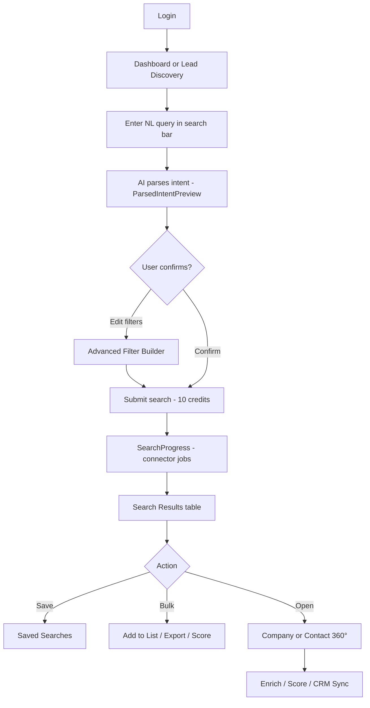
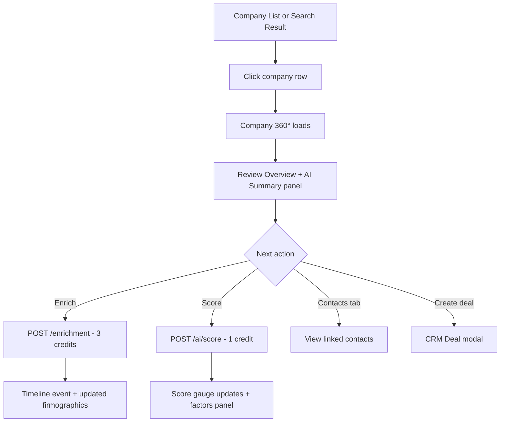
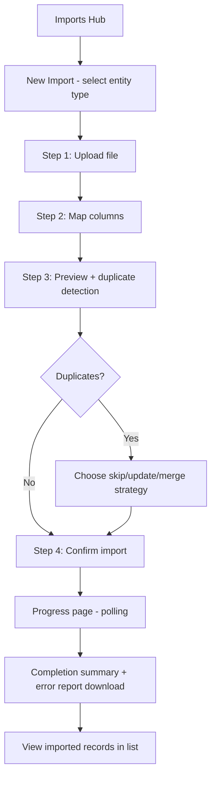
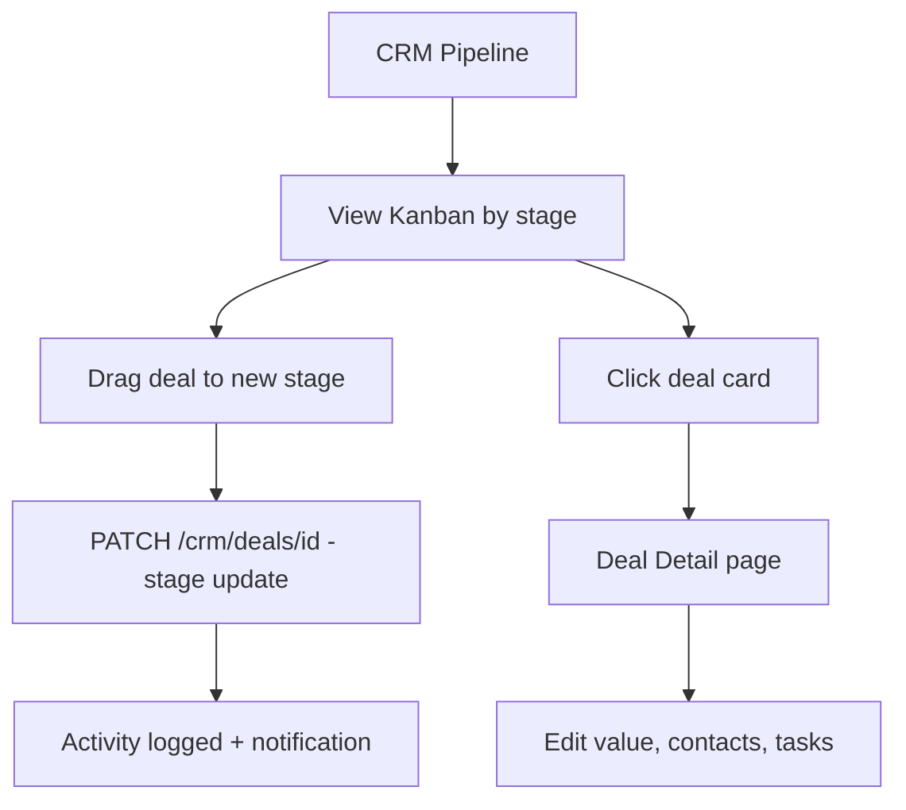
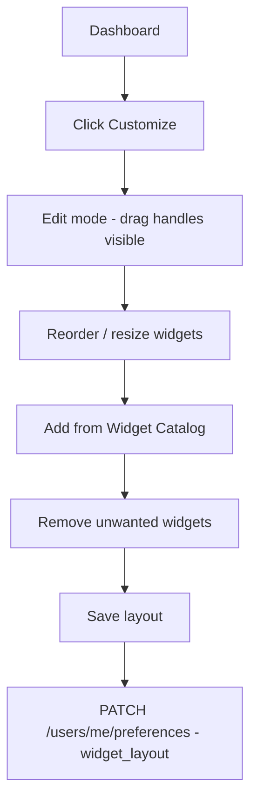

# 02 — Screens, Flows & Page Inventory

**Frontend v3.0** | AI Lead Intelligence Platform

---

## Table of Contents

1. [Site Map](#1-site-map)
2. [Screen Inventory Summary](#2-screen-inventory-summary)
3. [User Journeys](#3-user-journeys)
4. [Auth Module](#4-auth-module)
5. [Dashboard Module](#5-dashboard-module)
6. [Discover Module](#6-discover-module)
7. [Records Module — Companies](#7-records-module--companies)
8. [Records Module — Contacts](#8-records-module--contacts)
9. [Intelligence Module](#9-intelligence-module)
10. [CRM Module](#10-crm-module)
11. [Analytics Module](#11-analytics-module)
12. [Data Ops Module](#12-data-ops-module)
13. [Notifications Module](#13-notifications-module)
14. [Settings Module](#14-settings-module)
15. [Admin Module](#15-admin-module)
16. [Developer Module](#16-developer-module)
17. [System Pages](#17-system-pages)

---

## 1. Site Map

```text
AI Lead Intelligence (v3.0)
│
├── AUTH
│   ├── /login
│   ├── /register
│   ├── /forgot-password
│   ├── /reset-password
│   └── /login/2fa
│
├── HOME
│   └── /dashboard
│       └── [customize mode overlay]
│
├── DISCOVER
│   ├── /search                    Lead Discovery
│   ├── /search/results            Search Results
│   ├── /search/saved              Saved Searches
│   ├── /lists                     Lists Hub
│   ├── /lists/[id]                List Detail
│   ├── /segments                  Segments Hub
│   └── /segments/[id]             Segment Detail
│
├── RECORDS
│   ├── /companies                 Company List
│   ├── /companies/new             Create Company
│   ├── /companies/[id]            Company 360° (6 tabs)
│   ├── /companies/[id]/edit       Edit Company
│   ├── /companies/merge           Merge Companies
│   ├── /contacts                  Contact List
│   ├── /contacts/new              Create Contact
│   ├── /contacts/[id]             Contact 360° (5 tabs)
│   ├── /contacts/[id]/edit        Edit Contact
│   └── /contacts/merge            Merge Contacts
│
├── INTELLIGENCE
│   ├── /ai                        AI Assistant
│   └── /ai-scoring                Lead Scoring Dashboard
│
├── CRM
│   ├── /crm                       Pipeline Kanban
│   ├── /crm/deals/[id]            Deal Detail
│   ├── /crm/tasks                 Tasks
│   ├── /crm/activities            Activities
│   └── /crm/calendar              Calendar
│
├── ANALYTICS
│   ├── /analytics                 Analytics Hub
│   └── /analytics/[report]        Report Detail (6 types)
│
├── DATA OPS
│   ├── /imports                   Import Hub
│   ├── /imports/new               Import Wizard (4 steps)
│   ├── /imports/[id]              Import Progress
│   ├── /exports                   Export Hub
│   └── /exports/new               Export Wizard (3 steps)
│
├── NOTIFICATIONS
│   └── /notifications             Notification Center
│
├── SETTINGS
│   ├── /settings                  Profile & Preferences
│   ├── /settings/organization     Organization
│   ├── /settings/users            Users & Permissions
│   ├── /settings/integrations     Integrations
│   ├── /settings/billing          Billing & Credits
│   └── /settings/api-keys         API Keys
│
├── ADMIN
│   ├── /admin                     Admin Overview
│   ├── /admin/audit-logs          Audit Logs
│   ├── /admin/feature-flags       Feature Flags
│   ├── /admin/health              System Health
│   └── /admin/connectors          Connector Config
│
├── DEVELOPER
│   ├── /developer                 API Docs Portal
│   └── /developer/webhooks        Webhooks
│
└── SYSTEM
    ├── /403                       Forbidden
    ├── /404                         Not Found
    └── error boundary               Global Error
```

---

## 2. Screen Inventory Summary

| Module | Screens | Count |
|--------|---------|-------|
| Auth | Login, Register, Forgot Password, Reset Password, 2FA | 5 |
| Dashboard | Executive Dashboard, Customize Mode | 2 |
| Discover | Lead Discovery, Search Results, Saved Searches, Lists Hub, List Detail, Segments Hub, Segment Detail | 7 |
| Companies | List, 360° (6 tabs), Create, Edit, Merge | 10 |
| Contacts | List, 360° (5 tabs), Create, Edit, Merge | 10 |
| Intelligence | AI Assistant, Lead Scoring Dashboard | 2 |
| CRM | Pipeline, Deal Detail, Tasks, Activities, Calendar | 5 |
| Analytics | Hub, 6 report types | 7 |
| Data Ops | Import Hub, Wizard (4 steps), Progress, Export Hub, Wizard (3 steps) | 6 |
| Notifications | Center, Preferences (tab) | 2 |
| Settings | 6 sub-pages | 6 |
| Admin | Overview + 4 sub-pages | 5 |
| Developer | API Docs, Webhooks | 2 |
| System | 404, 403, Error, Loading | 4 |
| **Total** | | **72** |

---

## 3. User Journeys

### Journey 1: AI Lead Discovery (Primary)



**Success criteria:** User finds ≥5 qualified leads in <3 minutes from login.

### Journey 2: Company Investigation



### Journey 3: CSV Import



### Journey 4: Pipeline Management



### Journey 5: Dashboard Customization



---

## 4. Auth Module

### 4.1 Login — `/login`

| Attribute | Specification |
|-----------|---------------|
| **Purpose** | Authenticate user via email/password or OAuth |
| **Layout** | Centered card (max 480px), split optional brand panel on ≥1024px |
| **Auth** | Public |

**Components:**
- `Card` with logo
- `FormField` — email, password
- `Button` primary — "Sign in"
- `Button` outline — "Continue with Google", "Continue with Microsoft"
- `Link` — Forgot password, Register
- `Checkbox` — Remember me (30-day refresh token)

**API:**
- `POST /auth/login` — credentials → JWT
- `GET /auth/oauth/google` — redirect
- `GET /auth/oauth/microsoft` — redirect

**States:** Loading on submit, inline validation errors, lockout message after 5 failures.

---

### 4.2 Register — `/register`

| Attribute | Specification |
|-----------|---------------|
| **Purpose** | Create user + organization |
| **Layout** | Same as Login |

**Components:** Full name, email, password (strength meter), organization name, terms checkbox.

**API:** `POST /auth/register`

**Validation:** Password min 8 chars, 1 upper, 1 lower, 1 digit. Email unique.

---

### 4.3 Forgot Password — `/forgot-password`

**Purpose:** Request password reset email.  
**API:** `POST /auth/password/forgot`  
**Components:** Email input, success message (always shown regardless of email existence).

---

### 4.4 Reset Password — `/reset-password?token=`

**Purpose:** Set new password from email link.  
**API:** `POST /auth/password/reset`  
**Components:** New password, confirm password, strength meter.

---

### 4.5 Two-Factor Auth — `/login/2fa`

**Purpose:** TOTP verification after primary auth.  
**API:** `POST /auth/2fa/verify`  
**Components:** 6-digit code input (auto-advance), backup code link.

---

## 5. Dashboard Module

### 5.1 Executive Dashboard — `/dashboard`

| Attribute | Specification |
|-----------|---------------|
| **Purpose** | At-a-glance KPIs, trends, activity, AI recommendations |
| **Layout** | `PageHeader` + 12-col `DashboardGrid` |
| **Permission** | `dashboard:read` |

**Page Header:**
- Title: "Dashboard"
- Actions: `[Customize]` `[+ Add Widget]` `[Date Range ▾]`

**Widgets (default layout):**

| Widget | Size | Component | API |
|--------|------|-----------|-----|
| Companies KPI | 1×1 | `KpiCard` | `GET /analytics/dashboard` → `total_companies` |
| Contacts KPI | 1×1 | `KpiCard` | → `total_contacts` |
| Avg Score KPI | 1×1 | `KpiCard` | → `avg_lead_score` |
| Credits KPI | 1×1 | `KpiCard` | → `credits_remaining` |
| Searches KPI | 1×1 | `KpiCard` | → `searches_this_month` |
| Lead Pipeline Funnel | 2×2 | `FunnelChart` | `GET /crm/pipelines` + deal counts |
| Industry Breakdown | 2×2 | `PieChart` | `GET /analytics/full` → `by_industry` |
| Connector Health | 1×2 | `ConnectorHealthList` | `GET /connectors/status` |
| Search Trends | 2×2 | `AreaChart` | `GET /analytics/full` → `search_trends` |
| Activity Feed | 2×2 | `ActivityFeed` | `GET /notifications?limit=20` |
| Top Companies | 2×2 | `DataTable` (compact) | `GET /companies?sort=score&limit=10` |
| AI Recommendations | 2×2 | `RecommendationPanel` | `GET /ai/recommendations` |

**API (aggregate):**
```typescript
// Primary
GET /analytics/dashboard
GET /analytics/full?period=30d

// Widget-specific
GET /ai/recommendations
GET /connectors/status
GET /crm/pipelines/{id}/summary
```

**Zustand:** `dashboard-store` — widget layout, edit mode, date range.

---

### 5.2 Customize Mode — `/dashboard` (overlay state)

| Attribute | Specification |
|-----------|---------------|
| **Purpose** | Drag, resize, add/remove dashboard widgets |
| **Trigger** | "Customize" button → `editMode: true` |

**Components:**
- `DashboardGrid` with `react-grid-layout` drag/resize
- `WidgetCatalog` modal — categorized widget list
- `Button` — Save Layout, Cancel, Reset to Default

**Persistence:** `PATCH /users/me` → `preferences.dashboard_layout`

---

## 6. Discover Module

### 6.1 Lead Discovery — `/search`

| Attribute | Specification |
|-----------|---------------|
| **Purpose** | AI-powered natural language lead search with filter refinement |
| **Layout** | Full-width search hero + 2-column history/saved below |
| **Permission** | `search:execute` |

**Wireframe:**
```text
┌─────────────────────────────────────────────────────────────────┐
│ Lead Discovery                                                  │
├─────────────────────────────────────────────────────────────────┤
│ ┌─────────────────────────────────────────────────────────────┐ │
│ │ 🔍  Find logistics companies in Dubai with verified emails  │ │
│ │                                                    [AI ✨]  │ │
│ └─────────────────────────────────────────────────────────────┘ │
│ ┌─ ParsedIntentPreview ───────────────────────────────────────┐ │
│ │ Intent: find_companies · Location: Dubai · Industry: logistics│ │
│ │ Connectors: apollo, clearbit · Est. credits: 10             │ │
│ │                              [Edit Filters]  [Search →]     │ │
│ └─────────────────────────────────────────────────────────────┘ │
│ ┌─ Advanced Filters (collapsible) ────────────────────────────┐ │
│ │ Industry · Country · Employees · Technologies · Score     │ │
│ └─────────────────────────────────────────────────────────────┘ │
│ ┌─ Search History ──────┐  ┌─ Saved Searches ─────────────────┐ │
│ │ Recent queries (10)   │  │ Starred saved searches           │ │
│ └───────────────────────┘  └──────────────────────────────────┘ │
└─────────────────────────────────────────────────────────────────┘
```

**Components:**
- `AISearchBar` — NL input, debounced intent parsing
- `ParsedIntentPreview` — chips for parsed filters
- `FilterBuilder` — collapsible advanced filters
- `SearchHistoryList` — last 10 queries (localStorage + API)
- `SavedSearchCards` — quick replay

**API:**
- `POST /search/ai` — parse NL query → `SearchFilters` + connector plan
- `POST /search` — execute search (deducts credits)
- `GET /search/saved` — list saved searches

**Hooks:** `useAISearch`, `useSavedSearches`

---

### 6.2 Search Results — `/search/results`

| Attribute | Specification |
|-----------|---------------|
| **Purpose** | Display paginated search results with bulk actions |
| **Layout** | `PageHeader` + `BulkActionBar` + `EntityDataTable` |
| **Query params** | `?searchId={id}` or `?q={encoded query}` |

**Page Header:**
- Title: "Results: {count} {entityType}"
- Meta: "{credits_used} credits · {duration}s"
- Actions: `[Save Search]` `[Export]` `[New Search]`

**Table columns (companies):**
| Column | Width | Sortable | Component |
|--------|-------|----------|-----------|
| Checkbox | 48px | — | `Checkbox` |
| Name | 200px | ✓ | Link to 360° |
| Domain | 160px | ✓ | `ExternalLink` |
| Industry | 140px | ✓ | `Badge` |
| Country | 100px | ✓ | Flag + code |
| Employees | 100px | ✓ | Number |
| Score | 80px | ✓ | `ScoreGauge` (32px) |
| Confidence | 80px | ✓ | `ConfidenceBar` |
| Actions | 48px | — | `RowActionsMenu` |

**Bulk actions:** Add to List, Export, Score, Enrich (companies only)

**API:**
- `GET /search/{id}/results?page=1&page_size=25`
- `POST /search/{id}/save` — save as SavedSearch
- `POST /ai/score` — bulk score (body: `entity_ids[]`)

**Pagination:** Server-side, 25/50/100 page sizes. Optional infinite scroll toggle.

---

### 6.3 Saved Searches — `/search/saved`

| Attribute | Specification |
|-----------|---------------|
| **Purpose** | Manage and replay saved search queries |
| **Layout** | Card grid or table view toggle |

**Components:**
- `SavedSearchCard` — name, query preview, last run, result count, actions
- `Dialog` — rename, delete confirmation
- `Button` — Run Now, Edit Filters, Duplicate

**API:**
- `GET /search/saved`
- `PATCH /search/saved/{id}`
- `DELETE /search/saved/{id}`
- `POST /search` — replay with saved filters

---

### 6.4 Lists Hub — `/lists`

| Attribute | Specification |
|-----------|---------------|
| **Purpose** | Static curated collections of companies/contacts |
| **Layout** | `PageHeader` + card grid |

**Components:**
- `ListCard` — name, entity count, type badge, updated date
- `Button` — Create List
- `Dialog` — create list (name, entity type, description)

**API:**
- `GET /lists`
- `POST /lists`
- `DELETE /lists/{id}`

---

### 6.5 List Detail — `/lists/[id]`

| Attribute | Specification |
|-----------|---------------|
| **Purpose** | View and manage entities in a list |
| **Layout** | `PageHeader` + `EntityDataTable` |

**Actions:** Add entities (search modal), Remove from list, Export list, Score all

**API:**
- `GET /lists/{id}`
- `GET /lists/{id}/entities`
- `POST /lists/{id}/entities` — add IDs
- `DELETE /lists/{id}/entities` — remove IDs

---

### 6.6 Segments Hub — `/segments`

| Attribute | Specification |
|-----------|---------------|
| **Purpose** | Dynamic rule-based entity groups |
| **Layout** | Same as Lists Hub |

**Components:**
- `SegmentCard` — name, rule summary, live count, refresh status
- `Button` — Create Segment

**API:** `GET /segments`, `POST /segments`

---

### 6.7 Segment Detail — `/segments/[id]`

| Attribute | Specification |
|-----------|---------------|
| **Purpose** | View segment members + edit rules |
| **Layout** | Rule builder panel + `EntityDataTable` |

**Components:**
- `RuleBuilder` — AND/OR conditions on fields
- `SegmentPreview` — live count as rules change
- `EntityDataTable` — matching entities

**API:**
- `GET /segments/{id}`
- `PATCH /segments/{id}` — update rules
- `POST /segments/{id}/refresh` — recalculate membership

---

## 7. Records Module — Companies

### 7.1 Company List — `/companies`

| Attribute | Specification |
|-----------|---------------|
| **Purpose** | Browse, filter, bulk-manage all companies |
| **Layout** | `PageHeader` + `DataTableToolbar` + `EntityDataTable` |
| **Permission** | `companies:read` |

**Page Header Actions:** `[+ New Company]` `[Import]` `[Export]`

**Default columns:** Name, Domain, Industry, Country, Employees, Score, Status, Updated, Actions

**API:**
- `GET /companies?page&page_size&sort&q&filters`
- `DELETE /companies` — bulk delete (body: `ids[]`)

**Features:** Saved views, column config, virtualization (10K+ rows), inline status edit.

---

### 7.2 Company 360° — `/companies/[id]`

| Attribute | Specification |
|-----------|---------------|
| **Purpose** | Unified company workspace with all related data |
| **Layout** | `Entity360Layout` — header + tabs (8/12) + `AISummaryPanel` (4/12) |

**Header (`EntityHeader`):**
- Logo (Clearbit/favicon), name, domain (link), industry, location
- `ScoreGauge` linear + grade label
- Actions: `[Enrich]` `[Score]` `[Sync CRM ▾]` `[Export]` `[Edit]` `[•••]`

**Tabs:**

| Tab | Content | API |
|-----|---------|-----|
| Overview | Description, firmographics, social links, tags | `GET /companies/{id}` |
| Contacts | Linked contacts table | `GET /contacts?company_id={id}` |
| Tech Stack | Technology badges | `GET /companies/{id}/technologies` |
| Timeline | Event stream | `GET /companies/{id}/timeline` |
| Files | Attachments | `GET /companies/{id}/files` |
| Relationships | Parent/subsidiary graph | `GET /companies/{id}/relationships` |

**AI Panel (`AISummaryPanel`):**
- AI-generated summary paragraph
- Recommendations list (3–5 items)
- CRM sync status
- Tags with add/remove

**API:**
- `GET /companies/{id}`
- `POST /enrichment/companies/{id}` — 3 credits
- `POST /ai/score` — `{ entity_type: 'company', entity_id }`
- `GET /ai/recommendations?entity_id={id}`
- `POST /crm/sync` — push to connected CRM

---

### 7.3 Create Company — `/companies/new`

**Layout:** Form (max 640px), sections: Basic Info, Firmographics, Social.

**API:** `POST /companies`  
**Validation:** Zod schema — name required, domain format, unique domain check.

---

### 7.4 Edit Company — `/companies/[id]/edit`

Same form as Create, pre-populated.  
**API:** `GET /companies/{id}`, `PATCH /companies/{id}`

---

### 7.5 Merge Companies — `/companies/merge`

**Layout:** Side-by-side comparison of 2+ records, field-level winner selection.  
**API:** `POST /companies/merge` — `{ primary_id, secondary_ids[], field_resolutions }`

---

## 8. Records Module — Contacts

### 8.1 Contact List — `/contacts`

Mirror of Company List with contact-specific columns: Name, Email, Title, Company, Phone, Score, Status, Verified, Actions.

**API:** `GET /contacts?...`, bulk endpoints same pattern.

**Additional bulk action:** Verify Email (`POST /contacts/verify`)

---

### 8.2 Contact 360° — `/contacts/[id]`

**Header:** Full name, title, company (link), email with `VerificationBadge`, phone, score.

**Tabs:**

| Tab | Content | API |
|-----|---------|-----|
| Overview | Bio, designation, seniority, social | `GET /contacts/{id}` |
| Activity | Communication timeline | `GET /contacts/{id}/activities` |
| Notes | Team notes with @mentions | `GET /contacts/{id}/notes` |
| Tasks | Assigned tasks | `GET /crm/tasks?contact_id={id}` |
| Lists | Lists containing this contact | `GET /lists?contact_id={id}` |

**AI Panel:** Insights, verification status, relationship map, recent activity.

---

### 8.3–8.5 Create / Edit / Merge Contacts

Same patterns as Companies.  
**API:** `POST /contacts`, `PATCH /contacts/{id}`, `POST /contacts/merge`

---

## 9. Intelligence Module

### 9.1 AI Assistant — `/ai`

| Attribute | Specification |
|-----------|---------------|
| **Purpose** | Full-page conversational AI for lead discovery, scoring, outreach |
| **Layout** | Split: chat (8/12) + context panel (4/12) |
| **Permission** | `ai:use` |

**Wireframe:**
```text
┌──────────────────────────────────────────────┬──────────────────┐
│ AI Assistant          [Pin] [History] [New]  │ CONTEXT          │
├──────────────────────────────────────────────┼──────────────────┤
│ 🤖 Welcome message + capabilities            │ Entity: (none)   │
│                                              │ or attached      │
│ 👤 User message                              │ entity card      │
│ 🤖 Assistant response with result cards      │                  │
│                                              │ QUICK ACTIONS    │
│ Suggested follow-ups chips                   │ [Score] [Similar] │
├──────────────────────────────────────────────┤ [Draft email]    │
│ [📎] [🎤]  Ask anything...          [Send]  │ PINNED CHATS     │
└──────────────────────────────────────────────┴──────────────────┘
```

**Components:**
- `AIChat` — message list, input, streaming
- `AIMessage` — user/assistant bubbles
- `AIResultCard` — embedded search results
- `ContextPanel` — entity card, quick actions, pinned chats
- `ChatHistoryDropdown`

**Slash commands:** `/search`, `/score`, `/summarize`, `/draft`, `/similar`

**API:**
- `POST /search/ai` — NL queries from chat
- `POST /ai/score`
- `GET /ai/recommendations`

**Zustand:** `ai-assistant-store` — messages, pinned chats, entity context.

**Also available as:** `AIAssistantDrawer` slide-over from any 360° page.

---

### 9.2 Lead Scoring Dashboard — `/ai-scoring`

| Attribute | Specification |
|-----------|---------------|
| **Purpose** | Org-wide score distribution, batch scoring, model insights |
| **Layout** | KPI row + charts + scorable entities table |

**Widgets:**
- Score distribution histogram (`BarChart`)
- Avg score trend (`LineChart`)
- Grade breakdown pie (`PieChart`)
- Unscored entities table with batch score action

**API:**
- `GET /analytics/full` → score metrics
- `GET /companies?has_score=false` + contacts equivalent
- `POST /ai/score/batch` — `{ entity_ids[], entity_type }`

---

## 10. CRM Module

### 10.1 Pipeline Kanban — `/crm`

| Attribute | Specification |
|-----------|---------------|
| **Purpose** | Visual deal pipeline management |
| **Layout** | `PageHeader` + horizontal `KanbanBoard` |
| **Permission** | `crm:read` |

**Page Header:**
- Pipeline selector dropdown
- Actions: `[+ Deal]` `[Filter]` `[View ▾: Kanban | List]`

**Kanban columns:** One per `CRMStage`, ordered by `stage.order`.

**Deal card (`DealCard`):**
- Title, value (formatted currency), primary contact, company name, score badge
- Drag between columns → `PATCH /crm/deals/{id}` stage update

**API:**
- `GET /crm/pipelines`
- `GET /crm/deals?pipeline_id={id}`
- `POST /crm/deals`
- `PATCH /crm/deals/{id}`

**Summary bar:** Total pipeline value, deal count, won this month.

---

### 10.2 Deal Detail — `/crm/deals/[id]`

**Layout:** Header (title, value, stage bar) + tabs (Details, Contacts, Activities, Tasks, Files).

**API:** `GET /crm/deals/{id}`, `PATCH /crm/deals/{id}`, `GET /crm/activities?deal_id={id}`

---

### 10.3 Tasks — `/crm/tasks`

**Layout:** `PageHeader` + filter bar + `TaskList` (grouped by due date: Overdue, Today, Upcoming, Done).

**Task item:** Checkbox, title, due date, assignee avatar, linked entity, priority badge.

**API:** `GET /crm/tasks`, `POST /crm/tasks`, `PATCH /crm/tasks/{id}`

---

### 10.4 Activities — `/crm/activities`

**Layout:** Chronological `ActivityFeed` with type filters (call, email, meeting, note, system).

**API:** `GET /crm/activities?page&filters`

---

### 10.5 Calendar — `/crm/calendar`

**Layout:** Month/week/day view toggle, `CalendarView` component.

**API:** `GET /crm/activities?type=meeting&from&to`

---

## 11. Analytics Module

### 11.1 Analytics Hub — `/analytics`

| Attribute | Specification |
|-----------|---------------|
| **Purpose** | Report catalog with preview thumbnails |
| **Layout** | Card grid of report types |

**Report cards:**

| Report | Route | Description |
|--------|-------|-------------|
| Lead Velocity | `/analytics/lead-velocity` | New leads over time |
| Score Distribution | `/analytics/score-distribution` | Grade breakdown |
| Industry Analysis | `/analytics/industry` | Companies by industry |
| Geographic Distribution | `/analytics/geographic` | Map + table by country |
| Connector Performance | `/analytics/connectors` | Success rate, latency |
| Search Analytics | `/analytics/search` | Query volume, credits used |
| Team Activity | `/analytics/team` | Actions per user |

**API:** `GET /analytics/reports` — list available reports with metadata.

---

### 11.2 Report Detail — `/analytics/[report]`

**Layout:** `PageHeader` (title, date range, export) + chart(s) + data table.

**Shared controls:** Date range picker (7d, 30d, 90d, custom), export CSV, refresh.

**API:** `GET /analytics/{report}?from&to&group_by`

---

## 12. Data Ops Module

### 12.1 Import Hub — `/imports`

| Attribute | Specification |
|-----------|---------------|
| **Purpose** | Manage data imports |
| **Layout** | `PageHeader` + recent imports table + `[+ New Import]` |

**Table columns:** File name, Entity type, Rows, Status, Created, Actions (View, Download errors).

**API:** `GET /imports`

---

### 12.2 Import Wizard — `/imports/new`

**4-step wizard:**

| Step | Title | Components | API |
|------|-------|------------|-----|
| 1 | Upload | `FileUpload` drag-drop zone | `POST /imports/upload` |
| 2 | Map | `FieldMapper` — CSV columns → entity fields | `GET /imports/{id}/columns` |
| 3 | Preview | Validation table, `DuplicatePreview` | `POST /imports/{id}/validate` |
| 4 | Import | Summary, confirm button | `POST /imports/{id}/execute` |

**Supported formats:** CSV, XLSX, JSON (max 50MB).

---

### 12.3 Import Progress — `/imports/[id]`

**Layout:** Progress bar, row counter, live log, cancel button.

**API:** `GET /imports/{id}` — poll every 2s until `status: completed|failed`.

**Completion:** Summary card (imported, skipped, errors) + download error report link.

---

### 12.4 Export Hub — `/exports`

**Layout:** Recent exports table + `[+ New Export]`.

**API:** `GET /exports`

---

### 12.5 Export Wizard — `/exports/new`

**3-step wizard:**

| Step | Title | Components | API |
|------|-------|------------|-----|
| 1 | Select | Entity type, source (list/segment/filter/all) | — |
| 2 | Configure | `ColumnPicker`, format (CSV/XLSX/JSON) | — |
| 3 | Download | Confirm, async generation | `POST /exports` |

**API:** `POST /exports` → poll `GET /exports/{id}` → download URL.

---

## 13. Notifications Module

### 13.1 Notification Center — `/notifications`

| Attribute | Specification |
|-----------|---------------|
| **Purpose** | View and manage all notifications |
| **Layout** | Tabs: All, Unread, Preferences |

**All/Unread tab:**
- `NotificationList` — grouped by date (Today, Yesterday, Earlier)
- `NotificationItem` — icon, title, body, time, unread dot, deep link
- Actions: Mark all read, clear all

**Preferences tab:**
- Toggle per notification type (search, export, import, score, deal, credits, system)
- Channel: in-app, email (future)

**API:**
- `GET /notifications?page&unread_only`
- `PATCH /notifications/{id}/read`
- `PATCH /notifications/read-all`
- `PATCH /users/me` → `notification_preferences`

**Top bar bell:** Badge count from `GET /notifications/unread-count`.

---

## 14. Settings Module

**Layout:** Settings sub-layout with left sidebar nav (240px) + content area (max 768px).

### 14.1 Profile & Preferences — `/settings`

**Sections:**
- Avatar upload, full name, email (read-only), password change
- Theme selector (light/dark/system)
- Language (en-US default)
- Keyboard shortcuts link
- Timezone

**API:** `GET /users/me`, `PATCH /users/me`

---

### 14.2 Organization — `/settings/organization`

**Sections:** Org name, slug, logo, default currency, data retention policy.

**API:** `GET /organizations/current`, `PATCH /organizations/current`  
**Permission:** `org:manage`

---

### 14.3 Users & Permissions — `/settings/users`

**Layout:** Users table + invite button + role editor.

**Table columns:** Name, Email, Role, Status, Last active, Actions.

**API:** `GET /users`, `POST /users/invite`, `PATCH /users/{id}/role`, `DELETE /users/{id}`

---

### 14.4 Integrations — `/settings/integrations`

**Layout:** Integration cards (Salesforce, HubSpot, Slack, Zapier).

**Card:** Logo, status (connected/disconnected), last sync, configure/disconnect buttons.

**API:** `GET /integrations`, `POST /integrations/{provider}/connect`, `DELETE /integrations/{id}`

---

### 14.5 Billing & Credits — `/settings/billing`

**Sections:**
- Current plan card with usage
- Credit balance + purchase packs
- Invoice history table
- Payment method (Stripe portal link)

**API:** `GET /billing/subscription`, `GET /billing/invoices`, `POST /billing/purchase-credits`

---

### 14.6 API Keys — `/settings/api-keys`

**Layout:** Keys table + create key dialog.

**Table columns:** Name, Key prefix (`ali_...`), Created, Last used, Scopes, Actions (revoke).

**API:** `GET /api-keys`, `POST /api-keys`, `DELETE /api-keys/{id}`

---

## 15. Admin Module

**Layout:** Admin sub-layout — distinct `border-l-4 border-l-destructive` accent, admin sidebar.

**Guard:** `admin:read` permission required. Redirect to `/403` otherwise.

### 15.1 Admin Overview — `/admin`

**Content:** System summary cards — active users, total orgs, connector health, error rate (24h).

**API:** `GET /admin/overview`

---

### 15.2 Audit Logs — `/admin/audit-logs`

**Layout:** Filterable `DataTable` — timestamp, user, action, resource, IP, details.

**API:** `GET /admin/audit-logs?page&user&action&from&to`

---

### 15.3 Feature Flags — `/admin/feature-flags`

**Layout:** Flag list with `Switch` toggles, description, rollout percentage slider.

**API:** `GET /admin/feature-flags`, `PATCH /admin/feature-flags/{id}`

---

### 15.4 System Health — `/admin/health`

**Layout:** Service status grid (API, DB, Redis, Celery, Connectors) + metrics charts.

**API:** `GET /admin/health`, `GET /admin/metrics`

---

### 15.5 Connector Config — `/admin/connectors`

**Layout:** Connector cards with config form (API keys, rate limits, priority, enabled toggle).

**API:** `GET /connectors`, `PATCH /connectors/{id}/config`

---

## 16. Developer Module

### 16.1 API Docs Portal — `/developer`

**Layout:** Embedded OpenAPI/Swagger UI or custom docs with endpoint reference.

**Sections:** Authentication, rate limits, webhooks overview, SDK links.

**API:** `GET /developer/openapi.json`

---

### 16.2 Webhooks — `/developer/webhooks`

**Layout:** Webhook endpoints table + create/edit form (URL, events, secret).

**API:** `GET /webhooks`, `POST /webhooks`, `PATCH /webhooks/{id}`, `DELETE /webhooks/{id}`

---

## 17. System Pages

### 17.1 404 — Not Found

**Layout:** Centered illustration, "Page not found", `[Go to Dashboard]` button.  
**Component:** `EmptyState` variant `not-found`

### 17.2 403 — Forbidden

**Layout:** Shield icon, "You don't have permission", `[Go back]` + `[Contact admin]`.

### 17.3 Error Boundary — Global

**Layout:** "Something went wrong", error ID, `[Retry]` + `[Go to Dashboard]`.  
**Behavior:** `error.tsx` in App Router, logs to observability.

### 17.4 Loading — Global

**Layout:** Full-page skeleton matching `AppShell` shape.  
**Component:** `loading.tsx` per route segment where beneficial.

---

## Page Specification Template Reference

Every page above follows this structure:

| Field | Description |
|-------|-------------|
| Route | URL path |
| Purpose | Why this screen exists |
| Layout | Shell components and grid |
| Permission | Required RBAC permission |
| Components | React components used |
| API | Backend endpoints consumed |
| States | See [05-states-and-interactions.md](./05-states-and-interactions.md) |

---

*Next: [04-component-library.md](./04-component-library.md) — Component specifications*