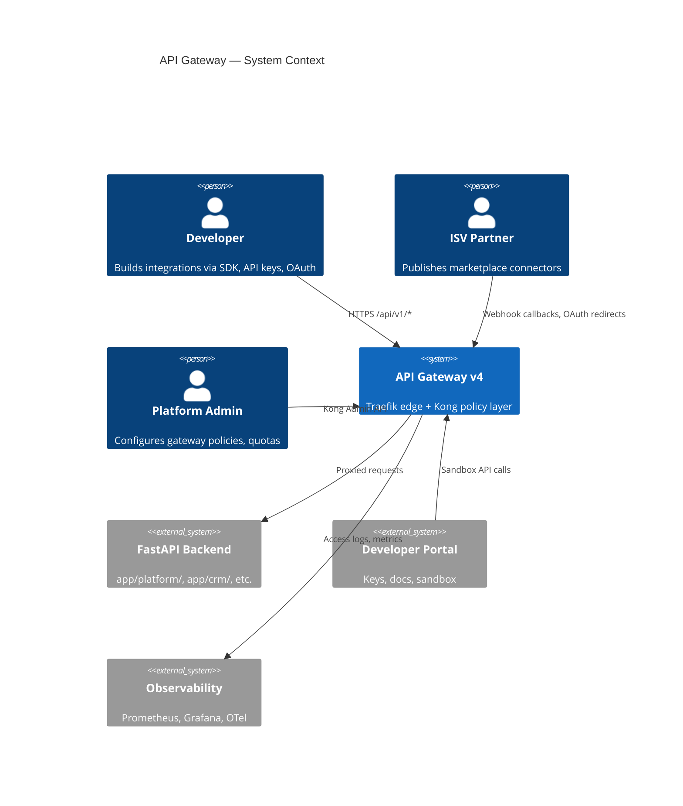
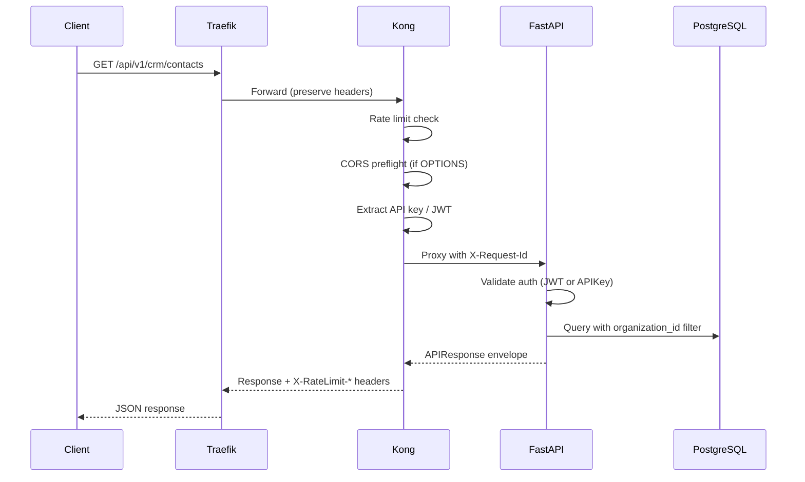
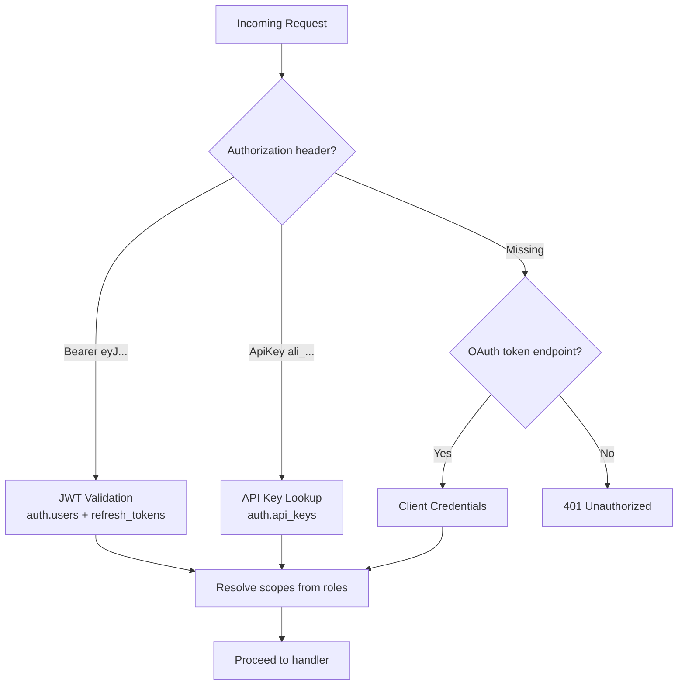
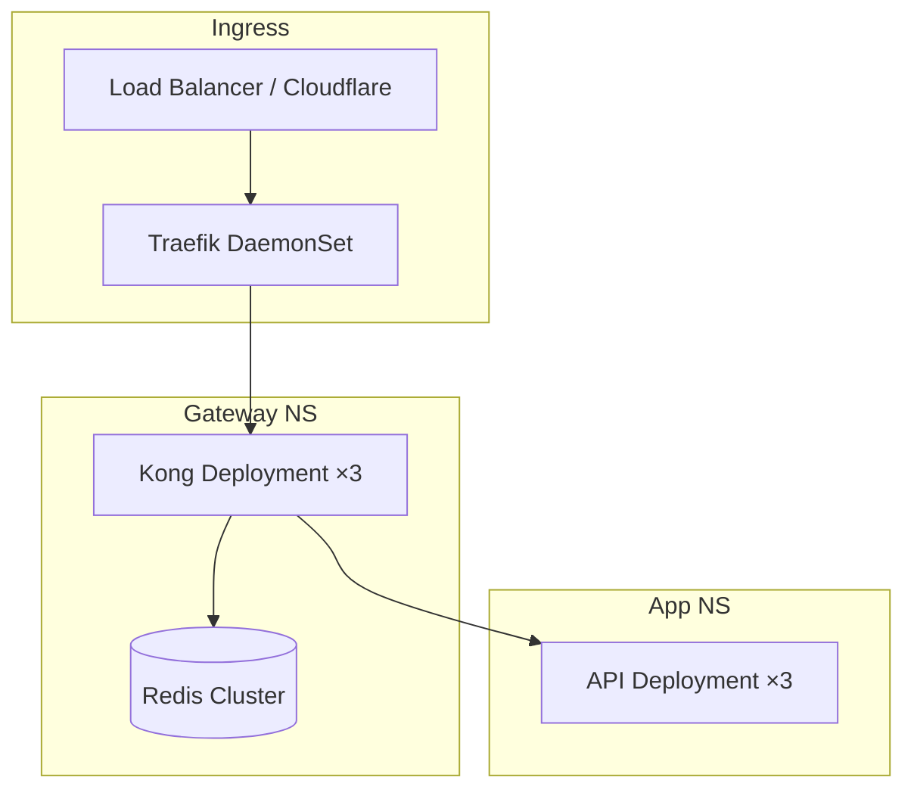

# 01 — API Gateway Architecture

**Version 4.0** | Phase 10 | AI Lead Intelligence Platform

---

## Table of Contents

1. [Executive Summary](#1-executive-summary)
2. [System Context](#2-system-context)
3. [Gateway Topology](#3-gateway-topology)
4. [Request Lifecycle](#4-request-lifecycle)
5. [Kong Plugin Pipeline](#5-kong-plugin-pipeline)
6. [Routing & Versioning](#6-routing--versioning)
7. [Authentication at the Edge](#7-authentication-at-the-edge)
8. [Rate Limiting & Quotas](#8-rate-limiting--quotas)
9. [Deployment Topology](#9-deployment-topology)
10. [Non-Functional Requirements](#10-non-functional-requirements)

---

## 1. Executive Summary

Phase 10 establishes **Traefik + Kong** as the mandatory single entry point for all external API traffic. Direct exposure of the FastAPI backend on port 8000 is permitted only in local development; staging and production require gateway routing.

The gateway enforces:

- TLS termination at Traefik (production)
- Cross-cutting policies at Kong (rate limits, CORS, auth pre-validation)
- Stable URL namespace: `https://{host}/api/v1/*`
- Request correlation via `X-Request-Id` and `X-Correlation-Id`
- Per-tenant usage metering forwarded to `backend/app/platform/usage/`

Existing configuration lives in `infra/gateway/` with compose overlay `docker-compose.gateway.yml`.

---

## 2. System Context



### Stakeholders

| Stakeholder | Primary Concern |
|-------------|-----------------|
| External Developers | Predictable APIs, clear errors, sandbox access |
| Customer IT | SSO, IP allowlists, audit logs |
| Platform Engineering | Zero-downtime route updates, plugin extensibility |
| Security | Auth enforcement, DDoS protection, secret handling |
| SRE | Gateway SLOs, latency budgets, failover |

---

## 3. Gateway Topology

```mermaid
flowchart LR
    subgraph Internet
        Client[API Clients]
    end

    subgraph Edge Layer
        CF[Cloudflare Tunnel<br/>optional]
        TR[Traefik v3.2<br/>infra/gateway/traefik/]
    end

    subgraph Policy Layer
        KONG[Kong 3.8<br/>infra/gateway/kong/kong.yml]
    end

    subgraph Application Layer
        API[FastAPI :8000<br/>backend/app/]
        GQL[GraphQL<br/>/api/v1/graphql]
    end

    Client --> CF --> TR
    Client --> TR
    TR -->|PathPrefix /api| KONG
    TR -->|PathPrefix /| Frontend :3000
    KONG --> API
    KONG --> GQL
```

### Layer Responsibilities

| Layer | Component | Responsibility |
|-------|-----------|----------------|
| Edge | Traefik | TLS, path routing, strip prefixes, health checks |
| Policy | Kong | Auth plugins, rate limits, CORS, request/response transforms |
| App | FastAPI | Business logic, tenant isolation, OpenAPI generation |
| Data | PostgreSQL | API keys (`auth.api_keys`), platform usage, OAuth tokens |

### Current Traefik Routes (`dynamic.yml`)

| Router | Rule | Priority | Target |
|--------|------|----------|--------|
| `api-gateway` | `PathPrefix(/api)` | 10 | Kong proxy `:8000` |
| `frontend` | `PathPrefix(/)` | 1 | Frontend `:3000` |
| `kong-admin` | `PathPrefix(/kong)` | 20 | Kong admin `:8001` |

---

## 4. Request Lifecycle



### Header Contract

| Header | Direction | Purpose |
|--------|-----------|---------|
| `Authorization` | Request | `Bearer {jwt}` or `ApiKey {key}` |
| `X-Request-Id` | Request/Response | Unique request identifier (UUID v7) |
| `X-Correlation-Id` | Request | Cross-service trace grouping |
| `X-Organization-Id` | Response | Resolved tenant (admin/debug only) |
| `X-RateLimit-Limit` | Response | Per-minute quota |
| `X-RateLimit-Remaining` | Response | Remaining quota |
| `X-RateLimit-Reset` | Response | Unix timestamp of reset |
| `Idempotency-Key` | Request | Safe retry for POST/PUT (platform endpoints) |

---

## 5. Kong Plugin Pipeline

### Current Configuration (`kong.yml`)

```yaml
_format_version: "3.0"

services:
  - name: ai-lead-api
    url: http://api:8000
    routes:
      - name: api-v1
        paths:
          - /api
        strip_path: false
    plugins:
      - name: rate-limiting
        config:
          minute: 300
          policy: local
      - name: cors
        config:
          origins: ["*"]
          methods: [GET, POST, PUT, PATCH, DELETE, OPTIONS]
          headers: [Authorization, Content-Type, X-Request-Id, Idempotency-Key]
          credentials: true
          max_age: 3600
```

### v4 Plugin Additions

| Plugin | Phase | Config |
|--------|-------|--------|
| `request-transformer` | 10.1 | Inject `X-Gateway-Version: 4.0` |
| `prometheus` | 10.1 | Export Kong metrics to `:9542` |
| `correlation-id` | 10.2 | Generate `X-Request-Id` if missing |
| `key-auth` | 10.4 | Optional Kong-level API key validation |
| `jwt` | 10.4 | JWT signature pre-check (RS256) |
| `request-size-limiting` | 10.3 | Max body 10 MB (default), 50 MB uploads |
| `ip-restriction` | 10.6 | Per-org IP allowlists (enterprise) |

### Recommended Kong Service Split (v4)

```yaml
services:
  - name: ai-lead-api-public
    url: http://api:8000
    routes:
      - name: api-v1-public
        paths: [/api/v1]
        strip_path: false
    plugins:
      - name: rate-limiting
        config:
          minute: 300
          policy: redis
          redis_host: redis

  - name: ai-lead-api-graphql
    url: http://api:8000
    routes:
      - name: graphql
        paths: [/api/v1/graphql]
    plugins:
      - name: rate-limiting
        config:
          minute: 60
          policy: redis

  - name: ai-lead-api-admin
    url: http://api:8000
    routes:
      - name: admin
        paths: [/api/v1/admin, /api/v1/platform/admin]
    plugins:
      - name: ip-restriction
        config:
          allow: ["10.0.0.0/8"]
```

---

## 6. Routing & Versioning

### URL Namespace

| Path | Version | Stability |
|------|---------|-----------|
| `/api/v1/*` | Current | Stable — 12-month deprecation |
| `/api/v2/*` | Future | Preview via feature flag |
| `/api/v1/graphql` | Current | Stable read layer |
| `/api/v1/platform/*` | Current | Integration platform APIs |
| `/api/v1/workflows/hooks/*` | Phase 8 | Stable inbound webhooks |

### Version Selection

- **URL path** is the primary version selector (no `Accept-Version` header)
- Breaking changes require new path version (`/api/v2/`)
- Non-breaking additions ship in-place with OpenAPI `deprecated` markers
- Sunset headers: `Sunset: Sat, 01 Jan 2028 00:00:00 GMT` + `Link: </api/v2/...>; rel="successor-version"`

---

## 7. Authentication at the Edge

Phase 10 supports three authentication modes, evaluated in order:



### API Key Model (Existing)

From `backend/app/users/models.py`:

```python
class APIKey(BaseModel):
    __tablename__ = "api_keys"
    user_id: Mapped[uuid.UUID]
    organization_id: Mapped[uuid.UUID]
    name: Mapped[str]
    key_hash: Mapped[str]       # bcrypt hash — never store plaintext
    key_prefix: Mapped[str]     # "ali_" + first 8 chars for identification
    is_active: Mapped[bool]
    last_used_at: Mapped[datetime | None]
    expires_at: Mapped[datetime | None]
    scopes: Mapped[list]        # JSONB — e.g. ["crm:read", "webhooks:manage"]
```

**Key format:** `ali_{env}_{random32}` — e.g. `ali_live_a1b2c3d4e5f6g7h8i9j0k1l2m3n4o5p6`

---

## 8. Rate Limiting & Quotas

### Tier Defaults

| Plan Tier | Requests/min | Burst | Webhooks/day | GraphQL complexity |
|-----------|-------------|-------|--------------|-------------------|
| Free | 60 | 10 | 1,000 | 500 |
| Pro | 300 | 50 | 10,000 | 2,000 |
| Enterprise | 1,000 | 200 | 100,000 | 10,000 |
| Partner | 2,000 | 500 | Unlimited | 20,000 |

### Enforcement Points

1. **Kong** — Global and per-route rate limits (Redis-backed in production)
2. **FastAPI** — Per-organization quota from `platform.usage_quotas`
3. **GraphQL** — Query complexity scoring before execution

### Quota Response

```http
HTTP/1.1 429 Too Many Requests
Retry-After: 42
X-RateLimit-Limit: 300
X-RateLimit-Remaining: 0
X-RateLimit-Reset: 1719590400

{
  "success": false,
  "message": "Rate limit exceeded",
  "data": {
    "code": "RATE_LIMIT_EXCEEDED",
    "retry_after_seconds": 42
  }
}
```

---

## 9. Deployment Topology

### Local Development

```powershell
docker compose -f docker-compose.yml -f docker-compose.gateway.yml --profile gateway up -d
# API via gateway: http://localhost/api/v1/health
# Direct API (dev only): http://localhost:8000/api/v1/health
```

### Production (Kubernetes)



| Environment | Gateway | Kong DB Mode | Rate Limit Policy |
|-------------|---------|--------------|-------------------|
| Local | Traefik + Kong | Declarative (`kong.yml`) | `local` |
| Staging | Traefik + Kong | Declarative | `redis` |
| Production | Traefik + Kong | PostgreSQL or declarative GitOps | `redis` |

---

## 10. Non-Functional Requirements

| NFR | Target | Measurement |
|-----|--------|-------------|
| Gateway latency overhead | < 15 ms p99 | Kong + Traefik span duration |
| Availability | 99.95% | Uptime of `/api/v1/health` via gateway |
| Throughput | 5,000 RPS per Kong instance | Load test baseline |
| Config propagation | < 30 s | Kong declarative reload |
| Zero-downtime deploy | Blue/green API pods | Traefik health check drain |
| TLS | TLS 1.2+ only | Traefik TLS options |
| Audit | 100% API admin actions | `audit.audit_logs` |

### Failure Modes

| Failure | Behavior |
|---------|----------|
| Kong unavailable | Traefik returns 503; no direct API bypass in prod |
| Redis unavailable (rate limit) | Kong falls back to `local` policy per instance |
| API pod unhealthy | Traefik/Kong upstream health check removes from pool |
| Auth service slow | 5 s timeout → 504 Gateway Timeout |

---

## Related Documents

- [02-rest-api-specification.md](./02-rest-api-specification.md) — Public API contracts
- [08-oauth-platform-design.md](./08-oauth-platform-design.md) — OAuth 2.0 flows
- [13-security-architecture.md](./13-security-architecture.md) — Security model
- [20-production-deployment-guide.md](./20-production-deployment-guide.md) — Gateway deployment