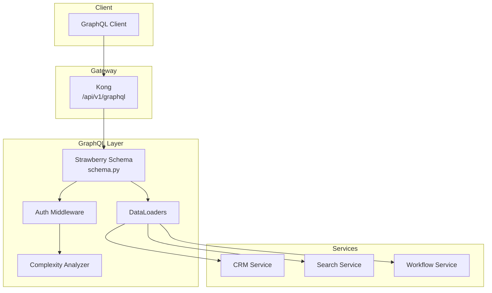

# 03 — GraphQL Schema Design

**Version 4.0** | Phase 10 | AI Lead Intelligence Platform

---

## Table of Contents

1. [Overview](#1-overview)
2. [Design Principles](#2-design-principles)
3. [Schema Architecture](#3-schema-architecture)
4. [Type Definitions](#4-type-definitions)
5. [Queries](#5-queries)
6. [Mutations](#6-mutations)
7. [Subscriptions](#7-subscriptions)
8. [Authorization](#8-authorization)
9. [Complexity & Rate Limiting](#9-complexity--rate-limiting)
10. [Implementation](#10-implementation)

---

## 1. Overview

Phase 10 adds an optional **read-optimized GraphQL layer** at `/api/v1/graphql` for integrators who need flexible field selection and nested resource fetching. GraphQL complements — not replaces — the REST API.

**Technology:** Strawberry GraphQL (`strawberry-graphql`) integrated with FastAPI  
**Module:** `backend/app/platform/graphql/`  
**Feature flag:** `graphql_enabled` (per org or global)

### When to Use GraphQL vs REST

| Use Case | Recommended |
|----------|-------------|
| Mobile app with variable field needs | GraphQL |
| Webhook payload construction | REST (stable schemas) |
| Bulk export / ETL | REST with pagination |
| CI/CD automation | REST + SDK |
| Dashboard widgets with nested data | GraphQL |
| Write operations with idempotency | REST |

---

## 2. Design Principles

| Principle | Implementation |
|-----------|----------------|
| **Read-first** | v4 GraphQL is read-only; mutations via REST |
| **Tenant isolation** | `organization_id` injected from auth context |
| **Stable contracts** | Schema published to registry; breaking changes versioned |
| **Complexity limits** | Max score 2,000 (Pro), 10,000 (Enterprise) |
| **N+1 prevention** | DataLoader for contacts, companies, deals |
| **No introspection in prod** | Disabled unless `platform:admin` |

---

## 3. Schema Architecture



---

## 4. Type Definitions

### Core Types

```graphql
"""ISO 8601 datetime scalar"""
scalar DateTime

"""UUID v7 identifier"""
scalar UUID

type PageInfo {
  hasNextPage: Boolean!
  hasPreviousPage: Boolean!
  startCursor: String
  endCursor: String
  totalCount: Int!
}

type Contact {
  id: UUID!
  firstName: String
  lastName: String
  email: String
  phone: String
  title: String
  leadScore: Float
  company: Company
  tags: [Tag!]!
  deals: [Deal!]!
  createdAt: DateTime!
  updatedAt: DateTime!
}

type Company {
  id: UUID!
  name: String!
  domain: String
  industry: String
  employeeCount: Int
  country: String
  contacts(page: Int = 1, perPage: Int = 25): ContactConnection!
  leadScore: Float
  createdAt: DateTime!
  updatedAt: DateTime!
}

type Deal {
  id: UUID!
  title: String!
  value: Float
  currency: String!
  stage: PipelineStage!
  contact: Contact
  company: Company
  probability: Float
  expectedCloseDate: DateTime
  createdAt: DateTime!
}

type PipelineStage {
  id: UUID!
  name: String!
  order: Int!
  pipeline: Pipeline!
}

type Pipeline {
  id: UUID!
  name: String!
  stages: [PipelineStage!]!
}

type Tag {
  id: UUID!
  name: String!
  color: String
}

type ContactConnection {
  edges: [ContactEdge!]!
  pageInfo: PageInfo!
}

type ContactEdge {
  node: Contact!
  cursor: String!
}

type WorkflowExecution {
  id: UUID!
  workflowId: UUID!
  status: ExecutionStatus!
  entityType: String!
  entityId: UUID!
  startedAt: DateTime!
  completedAt: DateTime
  steps: [ExecutionStep!]!
}

enum ExecutionStatus {
  PENDING
  RUNNING
  COMPLETED
  FAILED
  CANCELLED
}

type ExecutionStep {
  nodeId: String!
  nodeType: String!
  status: ExecutionStatus!
  output: JSON
  startedAt: DateTime
  completedAt: DateTime
}

scalar JSON
```

---

## 5. Queries

### Root Query Type

```graphql
type Query {
  """Fetch a single contact by ID"""
  contact(id: UUID!): Contact

  """Search and list contacts with filters"""
  contacts(
    search: String
    tags: [String!]
    minScore: Float
    updatedSince: DateTime
    page: Int = 1
    perPage: Int = 25
  ): ContactConnection!

  """Fetch a single company by ID"""
  company(id: UUID!): Company

  """List companies with optional filters"""
  companies(
    search: String
    industry: String
    page: Int = 1
    perPage: Int = 25
  ): CompanyConnection!

  """Fetch workflow execution status"""
  workflowExecution(id: UUID!): WorkflowExecution

  """Platform capabilities for current organization"""
  platformCapabilities: PlatformCapabilities!
}

type PlatformCapabilities {
  apiVersion: String!
  enabledFeatures: [String!]!
  rateLimit: RateLimitInfo!
}

type RateLimitInfo {
  limit: Int!
  windowSeconds: Int!
  tier: String!
}

type CompanyConnection {
  edges: [CompanyEdge!]!
  pageInfo: PageInfo!
}

type CompanyEdge {
  node: Company!
  cursor: String!
}
```

### Example Query

```graphql
query GetContactWithDeals($id: UUID!) {
  contact(id: $id) {
    id
    firstName
    lastName
    email
    leadScore
    company {
      name
      domain
      industry
    }
    deals {
      title
      value
      stage {
        name
        pipeline {
          name
        }
      }
    }
  }
}
```

### Example Response

```json
{
  "data": {
    "contact": {
      "id": "019f0c1f-7a3b-7890-abcd-ef1234567890",
      "firstName": "Jane",
      "lastName": "Smith",
      "email": "jane@acme.com",
      "leadScore": 82.5,
      "company": {
        "name": "Acme Corp",
        "domain": "acme.com",
        "industry": "Software"
      },
      "deals": [
        {
          "title": "Enterprise License",
          "value": 50000,
          "stage": {
            "name": "Proposal",
            "pipeline": { "name": "Sales Pipeline" }
          }
        }
      ]
    }
  }
}
```

---

## 6. Mutations

v4 GraphQL is **read-only**. All write operations use REST for idempotency guarantees:

| Operation | REST Endpoint |
|-----------|---------------|
| Create contact | `POST /api/v1/crm/contacts` |
| Update contact | `PATCH /api/v1/crm/contacts/{id}` |
| Execute workflow | `POST /api/v1/workflows/{id}/execute` |
| Create webhook | `POST /api/v1/platform/webhooks` |

v5 may add guarded mutations with `Idempotency-Key` support.

---

## 7. Subscriptions

Real-time subscriptions are deferred to v5. v4 integrators should use **webhooks** for event-driven updates.

Planned subscription types (v5 preview):

```graphql
type Subscription {
  contactUpdated(organizationId: UUID!): Contact!
  dealStageChanged(pipelineId: UUID!): Deal!
  workflowExecutionUpdated(workflowId: UUID!): WorkflowExecution!
}
```

Transport: WebSocket at `/api/v1/graphql/ws` with JWT authentication.

---

## 8. Authorization

GraphQL inherits the same auth context as REST:

```python
# backend/app/platform/graphql/context.py

@dataclass
class GraphQLContext:
    user_id: UUID
    organization_id: UUID
    scopes: list[str]
    auth_method: Literal["jwt", "api_key", "oauth2"]

async def get_graphql_context(request: Request) -> GraphQLContext:
    auth = await resolve_auth(request)  # shared with REST
    return GraphQLContext(
        user_id=auth.user_id,
        organization_id=auth.organization_id,
        scopes=auth.scopes,
        auth_method=auth.method,
    )
```

### Field-Level Authorization

| Type | Required Scope |
|------|----------------|
| `Contact` | `contacts:read` or `crm:read` |
| `Company` | `crm:read` |
| `Deal` | `crm:read` |
| `WorkflowExecution` | `workflows:read` |
| `platformCapabilities` | `platform:read` |

Unauthorized fields return `null` with GraphQL error extension:

```json
{
  "errors": [{
    "message": "Insufficient scope",
    "extensions": {
      "code": "SCOPE_INSUFFICIENT",
      "required": ["crm:read"]
    }
  }]
}
```

---

## 9. Complexity & Rate Limiting

### Complexity Scoring

| Field | Cost |
|-------|------|
| Scalar field | 1 |
| Object field | 2 |
| List field (per item) | 1 × `perPage` |
| Nested connection | 5 + child costs |

### Limits by Tier

| Tier | Max Complexity | Max Depth |
|------|---------------|-----------|
| Free | 500 | 5 |
| Pro | 2,000 | 8 |
| Enterprise | 10,000 | 12 |

### Kong Rate Limit

GraphQL endpoint: 60 requests/minute (Pro) — separate from REST quota due to query weight variability.

### Rejection Example

```json
{
  "errors": [{
    "message": "Query complexity 2450 exceeds limit 2000",
    "extensions": { "code": "COMPLEXITY_LIMIT_EXCEEDED" }
  }]
}
```

---

## 10. Implementation

### FastAPI Integration

```python
# backend/app/platform/graphql/router.py

from strawberry.fastapi import GraphQLRouter
from backend.app.platform.graphql.schema import schema
from backend.app.platform.graphql.context import get_graphql_context

graphql_router = GraphQLRouter(
    schema,
    context_getter=get_graphql_context,
    graphiql=True,  # disabled in production
)

# backend/app/main.py
app.include_router(graphql_router, prefix="/api/v1/graphql")
```

### Schema Registry

Published schemas stored in MinIO:

```
s3://ali-artifacts/graphql/
  v1/
    schema.graphql
    schema.json
    changelog.md
```

### Dependencies

```
# backend/requirements-platform.txt
strawberry-graphql[fastapi]>=0.230.0
```

---

## Related Documents

- [02-rest-api-specification.md](./02-rest-api-specification.md)
- [13-security-architecture.md](./13-security-architecture.md)
- [16-api-governance-guide.md](./16-api-governance-guide.md)