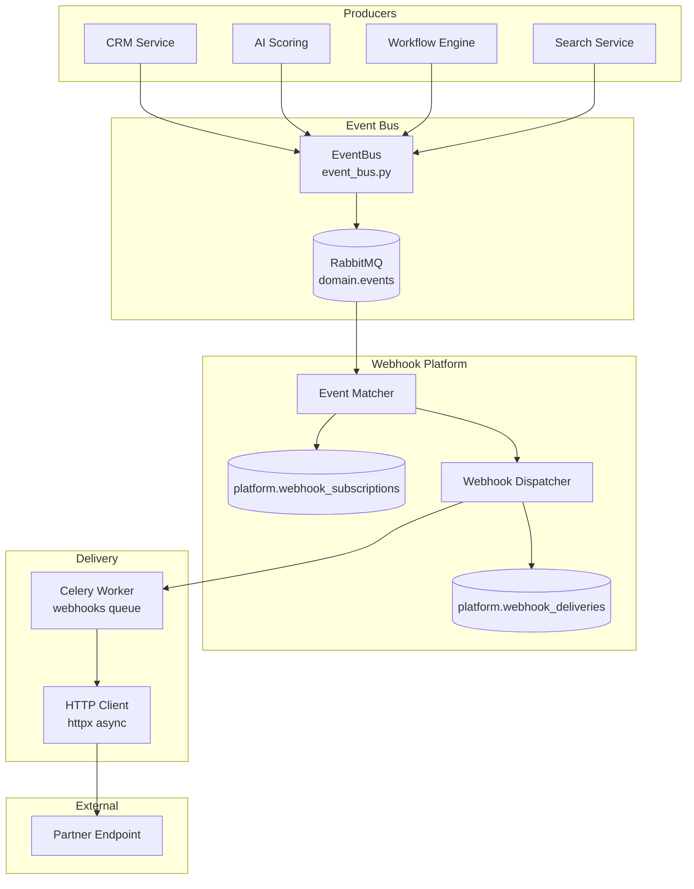
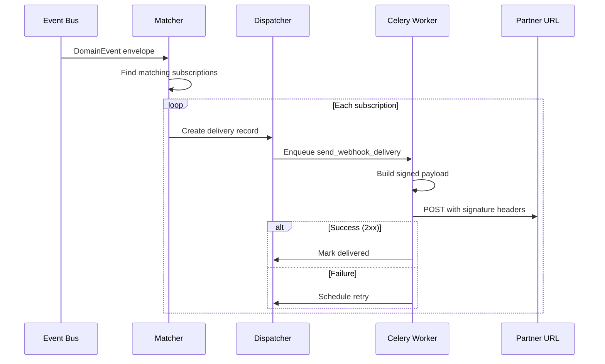
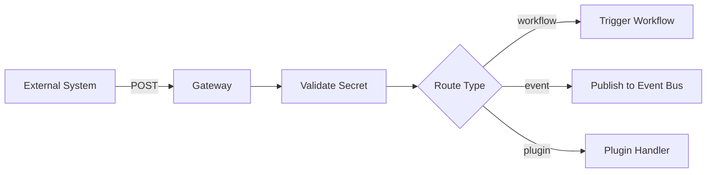

# 04 — Webhook Platform Design

**Version 4.0** | Phase 10 | AI Lead Intelligence Platform

---

## Table of Contents

1. [Overview](#1-overview)
2. [Architecture](#2-architecture)
3. [Event Catalog](#3-event-catalog)
4. [Subscription Model](#4-subscription-model)
5. [Delivery Pipeline](#5-delivery-pipeline)
6. [Payload Format](#6-payload-format)
7. [Signature Verification](#7-signature-verification)
8. [Retry & DLQ](#8-retry--dlq)
9. [Inbound Webhooks](#9-inbound-webhooks)
10. [Monitoring & SLOs](#10-monitoring--slos)

---

## 1. Overview

The webhook platform provides **reliable outbound event delivery** to integrator endpoints. It extends the existing `notifications.send_webhook` Celery task (`backend/workers/tasks/notifications.py`) into a full subscription management system.

**Module:** `backend/app/platform/webhooks/`  
**Worker:** `backend/workers/tasks/webhooks.py`  
**Queue:** `webhooks` (dedicated Celery queue)

### Design Goals

| Goal | Implementation |
|------|----------------|
| At-least-once delivery | Outbox + retry with exponential backoff |
| Tamper detection | HMAC-SHA256 signature on every payload |
| Tenant isolation | Subscriptions scoped to `organization_id` |
| Recoverability | DLQ + manual replay API |
| Developer-friendly | Test endpoint, delivery logs, CLI tools |

---

## 2. Architecture



---

## 3. Event Catalog

Public webhook events map to `DomainEvent` enum values in `event_bus.py`:

| Event Type | Trigger | Payload Keys |
|------------|---------|--------------|
| `company.created` | New company record | `company_id`, `name`, `domain` |
| `company.updated` | Company field change | `company_id`, `changes` |
| `contact.created` | New contact | `contact_id`, `email`, `company_id` |
| `contact.updated` | Contact field change | `contact_id`, `changes` |
| `lead.scored` | AI scoring complete | `entity_id`, `entity_type`, `score`, `factors` |
| `search.completed` | Search job done | `search_id`, `result_count` |
| `workflow.executed` | Workflow run complete | `execution_id`, `workflow_id`, `status` |
| `export.completed` | Export job done | `export_id`, `download_url` |
| `connector.finished` | Connector sync done | `connector_id`, `records_synced` |
| `subscription.updated` | Billing change | `plan_tier`, `credits` |

### Event Versioning

```json
{
  "api_version": "v1",
  "event_version": 1
}
```

Breaking payload changes increment `event_version`; old versions supported for 12 months.

---

## 4. Subscription Model

### Database Table

```sql
CREATE TABLE platform.webhook_subscriptions (
    id              UUID PRIMARY KEY DEFAULT gen_random_uuid(),
    organization_id UUID NOT NULL REFERENCES core.organizations(id),
    created_by      UUID NOT NULL REFERENCES auth.users(id),
    url             TEXT NOT NULL,
    secret_hash     VARCHAR(255) NOT NULL,
    events          JSONB NOT NULL DEFAULT '[]',
    description     VARCHAR(500),
    is_active       BOOLEAN NOT NULL DEFAULT TRUE,
    metadata        JSONB DEFAULT '{}',
    created_at      TIMESTAMPTZ NOT NULL DEFAULT NOW(),
    updated_at      TIMESTAMPTZ NOT NULL DEFAULT NOW(),
    deleted_at      TIMESTAMPTZ
);
```

### Subscription Rules

- Maximum **10 active subscriptions** per org (Free), **50** (Pro), **unlimited** (Enterprise)
- URL must be HTTPS in production (HTTP allowed in sandbox)
- Events array must contain valid catalog entries
- Secret auto-generated as `whsec_{random32}` if not provided

---

## 5. Delivery Pipeline



### Delivery States

| Status | Description |
|--------|-------------|
| `pending` | Queued, not yet attempted |
| `delivering` | HTTP request in flight |
| `delivered` | Partner returned 2xx |
| `retrying` | Failed, scheduled for retry |
| `failed` | Exhausted retries, moved to DLQ |
| `cancelled` | Subscription deactivated mid-delivery |

---

## 6. Payload Format

### Envelope Structure

```json
{
  "id": "019f0c1f-7a3b-7890-abcd-ef1234567890",
  "type": "contact.created",
  "api_version": "v1",
  "event_version": 1,
  "created_at": "2026-06-29T12:00:00.000Z",
  "organization_id": "019f0c1f-0000-7000-8000-000000000001",
  "data": {
    "contact_id": "019f0c1f-aaaa-bbbb-cccc-ddddeeeeffff",
    "email": "jane@acme.com",
    "first_name": "Jane",
    "last_name": "Smith",
    "company_id": "019f0c1f-bbbb-cccc-dddd-eeeeffff0000"
  }
}
```

### HTTP Request

```http
POST https://partner.example.com/hooks/ali HTTP/1.1
Content-Type: application/json
User-Agent: AI-Lead-Webhook/4.0
X-Webhook-Id: 019f0c1f-7a3b-7890-abcd-ef1234567890
X-Webhook-Timestamp: 1719662400
X-Webhook-Signature: sha256=5d2e8f1a3b4c5d6e7f8a9b0c1d2e3f4a5b6c7d8e9f0a1b2c3d4e5f6a7b8c9d0
X-Request-Id: 019f0c1f-1111-2222-3333-444455556666
```

---

## 7. Signature Verification

### Algorithm

```
signature = HMAC-SHA256(secret, "{timestamp}.{raw_body}")
header    = "sha256=" + hex(signature)
```

### Verification (Partner Side)

```python
import hmac
import hashlib
import time

def verify_webhook(payload: bytes, signature: str, timestamp: str, secret: str) -> bool:
    # Reject stale timestamps (> 5 minutes)
    if abs(time.time() - int(timestamp)) > 300:
        return False

    expected = hmac.new(
        secret.encode(),
        f"{timestamp}.{payload.decode()}".encode(),
        hashlib.sha256,
    ).hexdigest()

    return hmac.compare_digest(f"sha256={expected}", signature)
```

### TypeScript Verification

```typescript
import { createHmac, timingSafeEqual } from 'crypto';

function verifyWebhook(
  payload: string,
  signature: string,
  timestamp: string,
  secret: string
): boolean {
  const signed = `${timestamp}.${payload}`;
  const expected = 'sha256=' + createHmac('sha256', secret)
    .update(signed)
    .digest('hex');
  return timingSafeEqual(Buffer.from(expected), Buffer.from(signature));
}
```

---

## 8. Retry & DLQ

### Retry Schedule

| Attempt | Delay | Cumulative |
|---------|-------|------------|
| 1 | Immediate | 0 |
| 2 | 30 s | 30 s |
| 3 | 2 min | 2.5 min |
| 4 | 10 min | 12.5 min |
| 5 | 1 hr | ~1.2 hr |
| 6 | 4 hr | ~5.2 hr |

After 6 attempts → status `failed`, moved to `platform.webhook_dlq`.

### DLQ Processing

- Admin notification after 3 consecutive failures on same subscription
- Auto-disable subscription after 50 failures in 24 hours
- Replay via `POST /api/v1/platform/webhooks/deliveries/{id}/replay`

### Worker Implementation

```python
# backend/workers/tasks/webhooks.py

@shared_task(
    bind=True,
    max_retries=6,
    name="webhooks.send_delivery",
    queue="webhooks",
    autoretry_for=(httpx.TimeoutException, httpx.ConnectError),
    retry_backoff=True,
    retry_backoff_max=14400,
)
def send_webhook_delivery(self, delivery_id: str):
    delivery = get_delivery(delivery_id)
    payload = build_payload(delivery.event_envelope)
    headers = sign_payload(payload, delivery.subscription.secret_hash)
    response = httpx.post(delivery.url, json=payload, headers=headers, timeout=30)
    response.raise_for_status()
    mark_delivered(delivery_id, response.status_code)
```

---

## 9. Inbound Webhooks

Phase 8 established inbound workflow hooks at `/api/v1/workflows/hooks/{hook_id}`. Phase 10 unifies inbound patterns:

| Endpoint | Purpose | Auth |
|----------|---------|------|
| `/api/v1/workflows/hooks/{hook_id}` | Trigger workflow | `X-Webhook-Secret` |
| `/api/v1/platform/inbound/{endpoint_id}` | Generic inbound (v4) | `X-Webhook-Secret` or API key |

### Inbound Processing



---

## 10. Monitoring & SLOs

| Metric | Target | Alert Threshold |
|--------|--------|-----------------|
| Delivery success rate | > 99% | < 95% over 1 hr |
| Delivery latency p99 | < 5 s | > 15 s |
| Queue depth | < 1,000 | > 5,000 |
| DLQ size | < 100 | > 500 |
| Signature verification failures (inbound) | 0 | > 10/hr |

### Prometheus Metrics

```
webhook_deliveries_total{status="delivered|failed|retrying"}
webhook_delivery_duration_seconds{quantile="0.99"}
webhook_queue_depth
webhook_subscription_count{organization_id}
```

### Grafana Dashboard

`infra/monitoring/grafana/dashboards/platform-webhooks.json`

---

## Related Documents

- [02-rest-api-specification.md](./02-rest-api-specification.md)
- [11-event-platform-design.md](./11-event-platform-design.md)
- [19-integration-playbook.md](./19-integration-playbook.md)