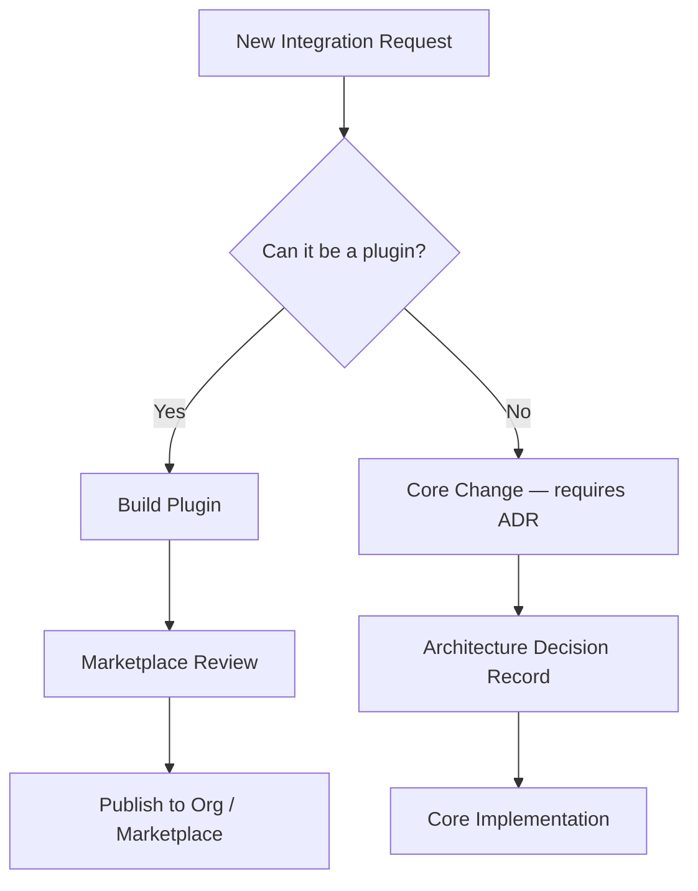
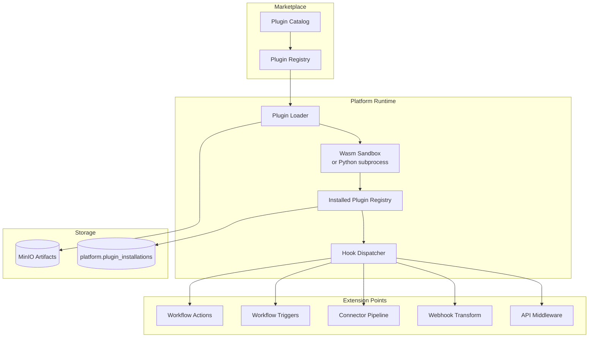
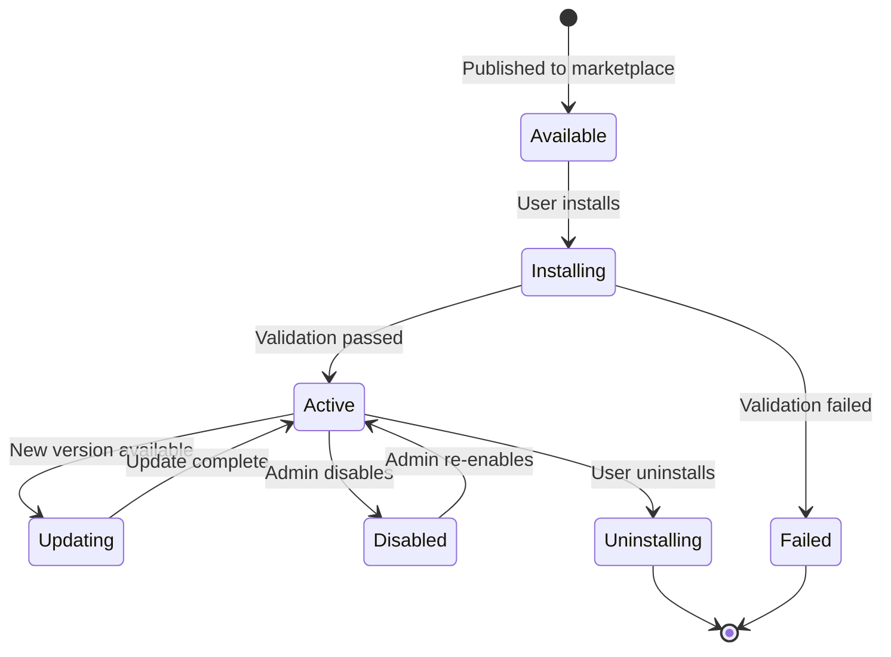
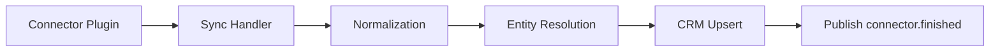

# 05 — Plugin Framework Architecture

**Version 4.0** | Phase 10 | AI Lead Intelligence Platform

---

## Table of Contents

1. [Overview](#1-overview)
2. [Extension-First Philosophy](#2-extension-first-philosophy)
3. [Plugin Types](#3-plugin-types)
4. [Architecture](#4-architecture)
5. [Plugin Manifest](#5-plugin-manifest)
6. [Runtime & Sandbox](#6-runtime--sandbox)
7. [Lifecycle Management](#7-lifecycle-management)
8. [Workflow Node Plugins](#8-workflow-node-plugins)
9. [Connector Plugins](#9-connector-plugins)
10. [Security Model](#10-security-model)

---

## 1. Overview

The plugin framework enables **extension-first development** — new integrations ship as plugins rather than core code changes. Plugins extend workflows, connectors, webhooks, and API middleware.

**Module:** `backend/app/platform/plugins/`  
**Artifact storage:** MinIO (`s3://ali-artifacts/plugins/`)  
**Distribution:** Marketplace ([10-marketplace-architecture.md](./10-marketplace-architecture.md))

### CTO Mandate: Extension-First

> "If a feature can be a plugin, it must be a plugin. Core changes are reserved for platform infrastructure, security, and contract stability."

---

## 2. Extension-First Philosophy



### Decision Matrix

| Scenario | Approach |
|----------|----------|
| Salesforce bi-directional sync | Connector plugin |
| Custom Slack notification format | Workflow action plugin |
| New CRM field mapping | Connector plugin config |
| Rate limit algorithm change | Core change (ADR required) |
| New public API endpoint | Core change + OpenAPI update |
| Custom lead scoring model | AI workflow node plugin |
| PagerDuty incident creation | Workflow action plugin |

---

## 3. Plugin Types

| Type | ID Prefix | Extends | Example |
|------|-----------|---------|---------|
| `workflow-action` | `wfa:` | Workflow engine actions | `wfa:slack-notify` |
| `workflow-trigger` | `wft:` | Workflow triggers | `wft:inbound-form` |
| `workflow-condition` | `wfc:` | Workflow conditions | `wfc:timezone-check` |
| `connector` | `conn:` | Connector framework | `conn:salesforce-v2` |
| `webhook-transformer` | `wht:` | Outbound payload shaping | `wht:hubspot-format` |
| `middleware` | `mid:` | Request/response hooks | `mid:request-logger` |
| `enrichment` | `enr:` | Discovery enrichment | `enr:clearbit` |

---

## 4. Architecture



### Component Responsibilities

| Component | Path | Role |
|-----------|------|------|
| Plugin Loader | `plugins/loader.py` | Download, verify, install artifacts |
| Runtime | `plugins/runtime.py` | Execute plugin hooks in sandbox |
| Registry | `plugins/registry.py` | In-memory hook → plugin mapping |
| Manifest Validator | `plugins/manifest.py` | JSON Schema validation |
| Hook Dispatcher | `plugins/dispatcher.py` | Route events to plugin handlers |

---

## 5. Plugin Manifest

Every plugin ships a `manifest.json`:

```json
{
  "id": "conn:salesforce-v2",
  "name": "Salesforce Connector",
  "version": "2.1.0",
  "type": "connector",
  "author": {
    "name": "AI Lead Intelligence",
    "email": "integrations@example.com"
  },
  "description": "Bi-directional Salesforce CRM sync",
  "license": "MIT",
  "min_platform_version": "4.0.0",
  "permissions": [
    "crm:read",
    "crm:write",
    "contacts:read"
  ],
  "config_schema": {
    "type": "object",
    "required": ["instance_url", "client_id", "client_secret"],
    "properties": {
      "instance_url": { "type": "string", "format": "uri" },
      "client_id": { "type": "string" },
      "client_secret": { "type": "string", "format": "password" },
      "sync_direction": {
        "type": "string",
        "enum": ["inbound", "outbound", "bidirectional"],
        "default": "bidirectional"
      }
    }
  },
  "hooks": {
    "connector.sync": "handlers.sync:handle",
    "connector.test_connection": "handlers.sync:test",
    "connector.schema_map": "handlers.mapping:get_schema"
  },
  "artifacts": {
    "main": "dist/plugin.wasm",
    "python_fallback": "src/handlers/"
  },
  "signature": "base64-ed25519-signature..."
}
```

### Manifest Validation Rules

- `id` must match `^[a-z]+:[a-z0-9-]+$`
- `version` must be valid semver
- `permissions` must be subset of platform scope catalog
- `signature` verified against marketplace publisher key
- `min_platform_version` checked against running platform

---

## 6. Runtime & Sandbox

### Execution Modes

| Mode | Use Case | Isolation |
|------|----------|-----------|
| **Wasm** (preferred) | Third-party marketplace plugins | Memory-limited sandbox, no network by default |
| **Python subprocess** | First-party / trusted plugins | Separate process, seccomp profile |
| **In-process** (dev only) | Local development | No sandbox — `PLUGIN_SANDBOX=disabled` |

### Wasm Sandbox Limits

| Resource | Limit |
|----------|-------|
| Memory | 128 MB |
| CPU time | 30 s per invocation |
| Network | Denied by default; allowlist per plugin |
| File system | Read-only plugin bundle |
| Secrets | Injected via platform secret store |

### Hook Invocation

```python
# backend/app/platform/plugins/runtime.py

async def invoke_hook(
    hook_name: str,
    plugin_id: str,
    payload: dict,
    context: PluginContext,
) -> PluginResult:
    installation = await registry.get_installation(
        plugin_id, context.organization_id
    )
    manifest = installation.manifest

    async with sandbox.create(manifest) as runtime:
        result = await runtime.call(
            manifest.hooks[hook_name],
            payload=payload,
            config=installation.config,
            secrets=await secret_store.get(installation.id),
        )
    await audit_log.record_hook_invocation(plugin_id, hook_name, result)
    return result
```

---

## 7. Lifecycle Management



### API Operations

| Operation | Endpoint | Description |
|-----------|----------|-------------|
| Install | `POST /platform/plugins/install` | Download, verify, activate |
| Update | `POST /platform/plugins/{id}/update` | Rolling update to new version |
| Disable | `PATCH /platform/plugins/{id}` | Disable without uninstall |
| Uninstall | `DELETE /platform/plugins/{id}` | Remove hooks, clean config |
| Test | `POST /platform/plugins/{id}/test` | Dry-run hook invocation |

### Database

```sql
CREATE TABLE platform.plugin_installations (
    id              UUID PRIMARY KEY DEFAULT gen_random_uuid(),
    organization_id UUID NOT NULL,
    plugin_id       VARCHAR(100) NOT NULL,
    version         VARCHAR(20) NOT NULL,
    config          JSONB NOT NULL DEFAULT '{}',
    status          VARCHAR(20) NOT NULL DEFAULT 'active',
    installed_by    UUID NOT NULL,
    installed_at    TIMESTAMPTZ NOT NULL DEFAULT NOW(),
    updated_at      TIMESTAMPTZ NOT NULL DEFAULT NOW(),
    UNIQUE (organization_id, plugin_id)
);
```

---

## 8. Workflow Node Plugins

Workflow plugins register as custom node types in the Phase 8 workflow engine:

```json
{
  "id": "wfa:slack-notify",
  "node_type": "action",
  "display_name": "Send Slack Message",
  "icon": "slack",
  "inputs": {
    "channel": { "type": "string", "required": true },
    "message_template": { "type": "string", "required": true }
  },
  "outputs": {
    "message_ts": { "type": "string" },
    "success": { "type": "boolean" }
  }
}
```

### Workflow DSL Integration

```json
{
  "id": "node-slack-1",
  "type": "wfa:slack-notify",
  "config": {
    "channel": "#sales-alerts",
    "message_template": "New lead: {{contact.name}} (score: {{contact.lead_score}})"
  }
}
```

The workflow compiler (`backend/app/workflows/engine/compiler.py`) resolves `wfa:*` types via the plugin registry.

---

## 9. Connector Plugins

Connector plugins extend the existing `connector` schema (`backend/app/common/db_schemas.py` → `DBSchema.CONNECTOR`):



See [06-connector-sdk-specification.md](./06-connector-sdk-specification.md) for SDK details.

---

## 10. Security Model

| Control | Implementation |
|---------|----------------|
| Code signing | Ed25519 signatures on plugin artifacts |
| Permission scoping | Manifest `permissions` enforced at runtime |
| Secret isolation | Platform secret store; never in plugin bundle |
| Network policy | Wasm sandbox deny-by-default |
| Audit trail | All hook invocations logged to `audit.audit_logs` |
| Vulnerability scan | CI pipeline scans plugin dependencies |
| Review process | Marketplace manual review for third-party plugins |

### Threat Model

| Threat | Mitigation |
|--------|------------|
| Malicious plugin code | Wasm sandbox + code signing |
| Privilege escalation | Manifest permissions ⊆ org scopes |
| Data exfiltration | Network deny + audit logging |
| Supply chain attack | Signature verification + dependency scanning |
| Resource exhaustion | CPU/memory limits + circuit breaker |

---

## Related Documents

- [06-connector-sdk-specification.md](./06-connector-sdk-specification.md)
- [10-marketplace-architecture.md](./10-marketplace-architecture.md)
- [13-security-architecture.md](./13-security-architecture.md)