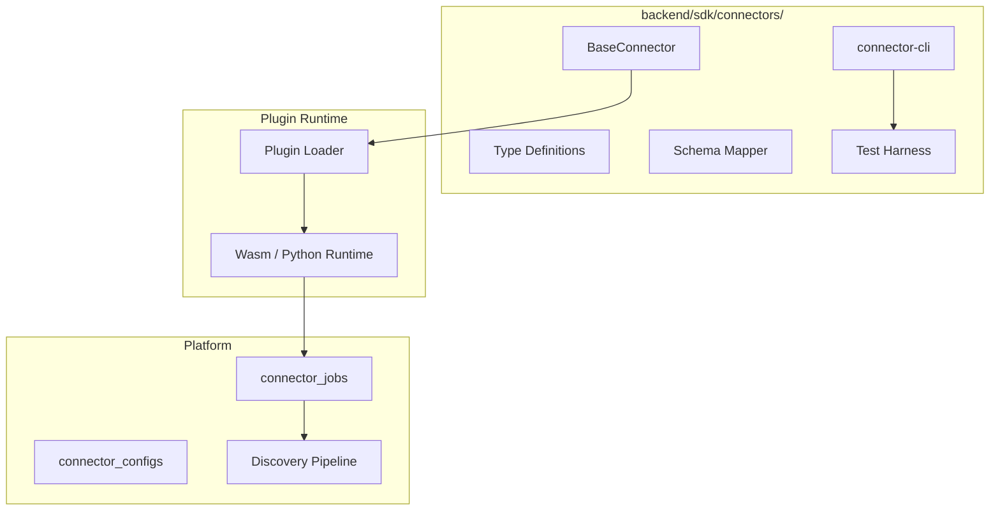
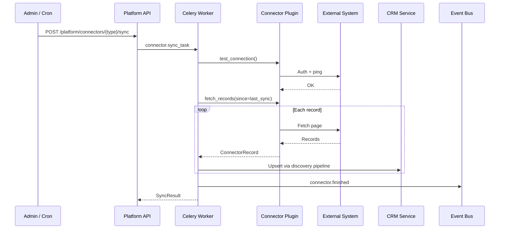

# 06 — Connector SDK Specification

**Version 4.0** | Phase 10 | AI Lead Intelligence Platform

---

## Table of Contents

1. [Overview](#1-overview)
2. [SDK Architecture](#2-sdk-architecture)
3. [Connector Interface](#3-connector-interface)
4. [Schema Mapping](#4-schema-mapping)
5. [Sync Lifecycle](#5-sync-lifecycle)
6. [Error Handling](#6-error-handling)
7. [Testing Connectors](#7-testing-connectors)
8. [Packaging & Publishing](#8-packaging--publishing)
9. [Reference Implementation](#9-reference-implementation)

---

## 1. Overview

The Connector SDK enables developers to build **data sync connectors** as plugins that integrate with the existing connector framework (`DBSchema.CONNECTOR`). Connectors pull data from external systems into the CRM/search domains or push platform data outbound.

**Package:** `backend/sdk/connectors/`  
**Plugin type:** `conn:*`  
**Base class:** `BaseConnector`

---

## 2. SDK Architecture



### Installation

```bash
pip install -e backend/sdk/connectors
```

---

## 3. Connector Interface

### BaseConnector

```python
# backend/sdk/connectors/base.py

from abc import ABC, abstractmethod
from dataclasses import dataclass
from typing import AsyncIterator
from uuid import UUID

@dataclass
class ConnectorContext:
    organization_id: UUID
    connector_id: UUID
    config: dict
    secrets: dict
    sync_direction: str  # inbound | outbound | bidirectional

@dataclass
class ConnectorRecord:
    external_id: str
    entity_type: str  # company | contact | deal
    data: dict
    updated_at: str | None = None

@dataclass
class SyncResult:
    records_processed: int
    records_created: int
    records_updated: int
    records_failed: int
    errors: list[dict]

class BaseConnector(ABC):
    """Base class for all connector plugins."""

    @property
    @abstractmethod
    def connector_type(self) -> str:
        """Unique connector identifier, e.g. 'salesforce'."""
        ...

    @abstractmethod
    async def test_connection(self, ctx: ConnectorContext) -> bool:
        """Verify credentials and connectivity."""
        ...

    @abstractmethod
    async def fetch_records(
        self, ctx: ConnectorContext, since: str | None = None
    ) -> AsyncIterator[ConnectorRecord]:
        """Yield records from external system (inbound sync)."""
        ...

    @abstractmethod
    async def push_record(
        self, ctx: ConnectorContext, record: ConnectorRecord
    ) -> str:
        """Push a single record to external system (outbound). Returns external_id."""
        ...

    @abstractmethod
    def get_schema_map(self) -> dict:
        """Return field mapping between external and platform schemas."""
        ...

    async def on_sync_complete(self, ctx: ConnectorContext, result: SyncResult) -> None:
        """Optional hook after sync completes."""
        pass
```

### Required Methods

| Method | Purpose | Called By |
|--------|---------|-----------|
| `test_connection` | Validate config/secrets | Install wizard, health checks |
| `fetch_records` | Inbound data pull | Celery `connector.sync` task |
| `push_record` | Outbound data push | Workflow action / manual sync |
| `get_schema_map` | Field mapping UI | Developer portal, marketplace |

---

## 4. Schema Mapping

### Mapping Format

```python
def get_schema_map(self) -> dict:
    return {
        "entity_type": "contact",
        "fields": {
            "FirstName": {"platform": "first_name", "type": "string"},
            "LastName": {"platform": "last_name", "type": "string"},
            "Email": {"platform": "email", "type": "email", "required": True},
            "Title": {"platform": "title", "type": "string"},
            "Account.Name": {"platform": "company_name", "type": "string"},
            "Lead_Score__c": {"platform": "custom_fields.lead_score", "type": "float"},
        },
        "identity_keys": ["email"],
        "transformations": {
            "email": "lowercase",
            "company_name": "trim",
        },
    }
```

### Mapping Rules

- `identity_keys` used for entity resolution (dedup)
- `required` fields cause record skip on null (logged, not fatal)
- `transformations` applied before normalization pipeline
- Nested paths supported via dot notation

---

## 5. Sync Lifecycle



### Sync Modes

| Mode | Trigger | `since` Parameter |
|------|---------|-------------------|
| Full | Manual / weekly cron | `None` |
| Incremental | Hourly cron / webhook | Last successful sync timestamp |
| Real-time | External webhook → inbound | Event payload |

### Celery Task

```python
# backend/workers/tasks/connectors.py

@shared_task(name="connectors.sync", queue="connectors", bind=True, max_retries=3)
def sync_connector(self, connector_id: str, mode: str = "incremental"):
    ctx = build_connector_context(connector_id)
    plugin = plugin_registry.get(f"conn:{ctx.connector_type}")
    result = run_sync(plugin, ctx, mode=mode)
    event_bus.publish(EventEnvelope.create(
        event_type=DomainEvent.CONNECTOR_FINISHED,
        aggregate_type="connector",
        aggregate_id=ctx.connector_id,
        organization_id=ctx.organization_id,
        payload=result.to_dict(),
    ))
```

---

## 6. Error Handling

### Error Categories

| Category | Retry | Example |
|----------|-------|---------|
| `TRANSIENT` | Yes (3×) | HTTP 503, timeout |
| `AUTH` | No | Invalid credentials → disable connector |
| `RATE_LIMIT` | Yes (backoff) | HTTP 429 with Retry-After |
| `VALIDATION` | No | Skip record, log error |
| `MAPPING` | No | Unknown field → skip with warning |

### Error Record Format

```json
{
  "external_id": "003xx000004TmiQAAS",
  "entity_type": "contact",
  "error_category": "VALIDATION",
  "message": "Required field 'email' is null",
  "raw_data": { "FirstName": "John", "LastName": "Doe" }
}
```

---

## 7. Testing Connectors

### Test Harness

```python
# backend/sdk/connectors/testing.py

from ali_connectors.testing import ConnectorTestHarness

async def test_salesforce_connector():
    harness = ConnectorTestHarness(
        connector_class=SalesforceConnector,
        config={
            "instance_url": "https://test.salesforce.com",
            "client_id": "test_client_id",
            "client_secret": "test_secret",
        },
        fixtures_dir="tests/fixtures/salesforce/",
    )

    await harness.test_connection()
    records = await harness.fetch_all()
    assert len(records) == 10
    assert records[0].entity_type == "contact"

    mapped = harness.apply_schema_map(records[0])
    assert mapped["email"] == "jane@acme.com"
```

### CLI

```bash
# Test connection
connector-cli test conn:salesforce-v2 --config config.json

# Dry-run sync (no writes)
connector-cli sync conn:salesforce-v2 --dry-run --limit 10

# Validate manifest
connector-cli validate ./manifest.json

# Package for marketplace
connector-cli package ./ --output dist/salesforce-v2-2.1.0.tar.gz
```

---

## 8. Packaging & Publishing

### Package Structure

```
salesforce-connector/
├── manifest.json
├── src/
│   ├── __init__.py
│   ├── connector.py      # SalesforceConnector(BaseConnector)
│   └── handlers/
│       ├── sync.py
│       └── mapping.py
├── tests/
│   ├── test_connection.py
│   ├── test_sync.py
│   └── fixtures/
├── dist/
│   └── plugin.wasm       # Compiled (optional)
├── README.md
└── CHANGELOG.md
```

### Publishing Flow

1. `connector-cli validate` — manifest + tests pass
2. `connector-cli package` — create signed artifact
3. `connector-cli publish --marketplace` — upload to marketplace
4. Marketplace review → approved → available for install

---

## 9. Reference Implementation

### HubSpot Connector (Simplified)

```python
# examples/connectors/hubspot/connector.py

import httpx
from ali_connectors import BaseConnector, ConnectorContext, ConnectorRecord

class HubSpotConnector(BaseConnector):
    connector_type = "hubspot"

    async def test_connection(self, ctx: ConnectorContext) -> bool:
        async with httpx.AsyncClient() as client:
            resp = await client.get(
                "https://api.hubapi.com/crm/v3/objects/contacts",
                headers={"Authorization": f"Bearer {ctx.secrets['api_key']}"},
                params={"limit": 1},
            )
            return resp.status_code == 200

    async def fetch_records(self, ctx, since=None):
        async with httpx.AsyncClient() as client:
            params = {"limit": 100, "properties": "firstname,lastname,email,jobtitle"}
            if since:
                params["updatedAfter"] = since

            after = None
            while True:
                if after:
                    params["after"] = after
                resp = await client.get(
                    "https://api.hubapi.com/crm/v3/objects/contacts",
                    headers={"Authorization": f"Bearer {ctx.secrets['api_key']}"},
                    params=params,
                )
                data = resp.json()
                for item in data["results"]:
                    props = item["properties"]
                    yield ConnectorRecord(
                        external_id=item["id"],
                        entity_type="contact",
                        data={
                            "first_name": props.get("firstname"),
                            "last_name": props.get("lastname"),
                            "email": props.get("email"),
                            "title": props.get("jobtitle"),
                        },
                        updated_at=item.get("updatedAt"),
                    )
                after = data.get("paging", {}).get("next", {}).get("after")
                if not after:
                    break

    async def push_record(self, ctx, record):
        async with httpx.AsyncClient() as client:
            resp = await client.post(
                "https://api.hubapi.com/crm/v3/objects/contacts",
                headers={"Authorization": f"Bearer {ctx.secrets['api_key']}"},
                json={"properties": record.data},
            )
            resp.raise_for_status()
            return resp.json()["id"]

    def get_schema_map(self):
        return {
            "entity_type": "contact",
            "fields": {
                "firstname": {"platform": "first_name", "type": "string"},
                "lastname": {"platform": "last_name", "type": "string"},
                "email": {"platform": "email", "type": "email", "required": True},
                "jobtitle": {"platform": "title", "type": "string"},
            },
            "identity_keys": ["email"],
        }
```

---

## Related Documents

- [05-plugin-framework-architecture.md](./05-plugin-framework-architecture.md)
- [10-marketplace-architecture.md](./10-marketplace-architecture.md)
- [19-integration-playbook.md](./19-integration-playbook.md)