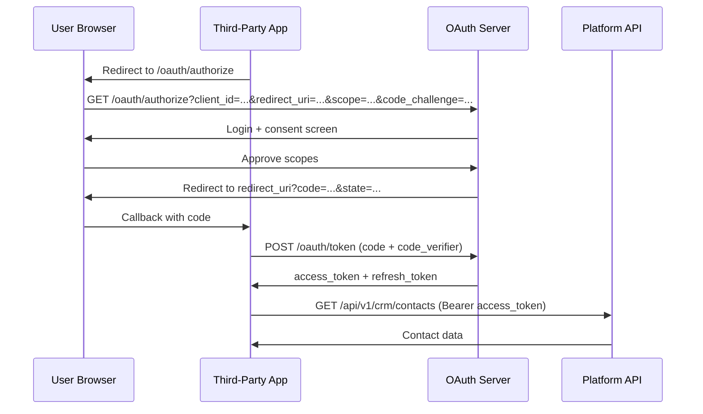

# 08 — OAuth Platform Design

**Version 4.0** | Phase 10 | AI Lead Intelligence Platform

---

## Table of Contents

1. [Overview](#1-overview)
2. [Supported Flows](#2-supported-flows)
3. [Architecture](#3-architecture)
4. [Application Registration](#4-application-registration)
5. [Authorization Code Flow](#5-authorization-code-flow)
6. [Client Credentials Flow](#6-client-credentials-flow)
7. [Token Management](#7-token-management)
8. [Scope Model](#8-scope-model)
9. [Database Schema](#9-database-schema)
10. [Security Considerations](#10-security-considerations)

---

## 1. Overview

Phase 10 implements **OAuth 2.0** (RFC 6749) with OpenID Connect discovery for third-party applications. OAuth complements existing JWT (user sessions) and API keys (`auth.api_keys`) for machine-to-machine and user-delegated access.

**Module:** `backend/app/platform/oauth/`  
**Library:** `authlib`  
**Discovery:** `/.well-known/openid-configuration`

---

## 2. Supported Flows

| Flow | Grant Type | Use Case |
|------|------------|----------|
| Authorization Code + PKCE | `authorization_code` | User-delegated third-party apps |
| Client Credentials | `client_credentials` | Server-to-server (no user context) |
| Refresh Token | `refresh_token` | Token renewal |

**Not supported in v4:** Implicit grant (deprecated), Resource Owner Password Credentials.

---

## 3. Architecture

```mermaid
flowchart TB
    subgraph Third-Party App
        APP[Partner Application]
    end

    subgraph OAuth Server
        AUTH[/oauth/authorize]
        TOKEN[/oauth/token]
        REVOKE[/oauth/revoke]
        DISC[/.well-known/openid-configuration]
        JWKS[/oauth/jwks]
    end

    subgraph Storage
        APPS[(platform.oauth_applications)]
        TOKENS[(platform.oauth_tokens)]
        AUTH_CODES[(platform.oauth_authorization_codes)]
    end

    subgraph Existing Auth
        USERS[auth.users]
        KEYS[auth.api_keys]
        PERMS[RBAC Permissions]
    end

    APP --> AUTH
    APP --> TOKEN
    AUTH --> USERS
    TOKEN --> TOKENS
    TOKEN --> PERMS
    AUTH --> AUTH_CODES
```

### Endpoints

| Endpoint | Method | Purpose |
|----------|--------|---------|
| `/api/v1/oauth/authorize` | GET | Authorization endpoint |
| `/api/v1/oauth/token` | POST | Token endpoint |
| `/api/v1/oauth/revoke` | POST | Token revocation (RFC 7009) |
| `/api/v1/oauth/introspect` | POST | Token introspection (RFC 7662) |
| `/api/v1/.well-known/openid-configuration` | GET | OIDC discovery |
| `/api/v1/oauth/jwks` | GET | JSON Web Key Set |
| `/api/v1/platform/oauth/apps` | CRUD | Application management |

---

## 4. Application Registration

### Create Application

```http
POST /api/v1/platform/oauth/apps
Authorization: Bearer {admin_token}

{
  "name": "Acme CRM Sync",
  "description": "Bi-directional CRM integration",
  "redirect_uris": [
    "https://acme.example.com/oauth/callback",
    "http://localhost:3001/oauth/callback"
  ],
  "scopes": ["crm:read", "contacts:read", "contacts:write"],
  "grant_types": ["authorization_code", "refresh_token"],
  "logo_url": "https://acme.example.com/logo.png",
  "homepage_url": "https://acme.example.com"
}
```

### Application Types

| Type | `grant_types` | `client_secret` | PKCE Required |
|------|---------------|-------------------|---------------|
| Confidential | `authorization_code`, `client_credentials` | Yes (hashed) | Recommended |
| Public | `authorization_code` | No | **Required** |

---

## 5. Authorization Code Flow



### Authorization Request

```http
GET /api/v1/oauth/authorize?
  response_type=code&
  client_id=ali_app_7f3a2b1c0d9e&
  redirect_uri=https://app.example.com/oauth/callback&
  scope=crm:read%20contacts:read&
  state=random_state_value&
  code_challenge=E9Melhoa2OwvFrEMTJguCHaoeK1t8URWbuGJSstw-cM&
  code_challenge_method=S256
```

### Token Exchange

```http
POST /api/v1/oauth/token
Content-Type: application/x-www-form-urlencoded

grant_type=authorization_code&
code=auth_code_here&
redirect_uri=https://app.example.com/oauth/callback&
client_id=ali_app_7f3a2b1c0d9e&
client_secret=ali_sec_...&
code_verifier=dBjftJeZ4CVP-mB92K27uhbUJU1p1r_wW1gFWFOEjXk
```

### Token Response

```json
{
  "access_token": "eyJhbGciOiJSUzI1NiIs...",
  "token_type": "Bearer",
  "expires_in": 3600,
  "refresh_token": "rt_8f3a2b1c0d9e8f7a6b5c4d3e2f1a0b9",
  "scope": "crm:read contacts:read"
}
```

---

## 6. Client Credentials Flow

For server-to-server integrations without user context:

```http
POST /api/v1/oauth/token
Content-Type: application/x-www-form-urlencoded

grant_type=client_credentials&
client_id=ali_app_7f3a2b1c0d9e&
client_secret=ali_sec_...&
scope=crm:read
```

**Response:**

```json
{
  "access_token": "eyJhbGciOiJSUzI1NiIs...",
  "token_type": "Bearer",
  "expires_in": 3600,
  "scope": "crm:read"
}
```

> Client Credentials tokens are scoped to the **organization** that registered the application. No `user_id` claim.

---

## 7. Token Management

### Access Token (JWT)

```json
{
  "sub": "019f0c1f-user-uuid",
  "org": "019f0c1f-org-uuid",
  "client_id": "ali_app_7f3a2b1c0d9e",
  "scope": "crm:read contacts:read",
  "iss": "https://api.example.com",
  "aud": "ali-platform",
  "exp": 1719666000,
  "iat": 1719662400,
  "jti": "019f0c1f-token-uuid"
}
```

| Claim | Description |
|-------|-------------|
| `sub` | User ID (Authorization Code) or client ID (Client Credentials) |
| `org` | Organization ID |
| `scope` | Space-separated granted scopes |
| `client_id` | OAuth application ID |

### Token Lifetimes

| Token | Lifetime | Renewable |
|-------|----------|-----------|
| Access token | 1 hour | Via refresh token |
| Refresh token | 30 days | Rotated on use |
| Authorization code | 10 minutes | Single use |

### Refresh

```http
POST /api/v1/oauth/token
Content-Type: application/x-www-form-urlencoded

grant_type=refresh_token&
refresh_token=rt_8f3a2b1c0d9e...&
client_id=ali_app_7f3a2b1c0d9e&
client_secret=ali_sec_...
```

### Revocation

```http
POST /api/v1/oauth/revoke
Content-Type: application/x-www-form-urlencoded

token=rt_8f3a2b1c0d9e...&
client_id=ali_app_7f3a2b1c0d9e&
client_secret=ali_sec_...
```

---

## 8. Scope Model

OAuth scopes align with API key scopes and RBAC permissions:

| Scope | Grants Access To |
|-------|------------------|
| `openid` | OIDC identity (`sub`, `email`) |
| `profile` | User profile read |
| `crm:read` | Read companies, deals, pipelines |
| `crm:write` | Create/update CRM entities |
| `contacts:read` | Read contacts |
| `contacts:write` | Create/update contacts |
| `search:read` | Read search results |
| `search:write` | Execute searches |
| `workflows:read` | Read workflows and executions |
| `workflows:execute` | Trigger workflow executions |
| `analytics:read` | Read analytics dashboards |
| `webhooks:manage` | CRUD webhook subscriptions |
| `platform:read` | Read platform capabilities, usage |

### Consent Screen

Users see requested scopes with human-readable descriptions:

| Scope | Display |
|-------|---------|
| `crm:read` | View your companies, deals, and pipelines |
| `contacts:write` | Create and update contacts in your account |
| `webhooks:manage` | Manage webhook subscriptions |

---

## 9. Database Schema

```sql
CREATE TABLE platform.oauth_applications (
    id              UUID PRIMARY KEY DEFAULT gen_random_uuid(),
    organization_id UUID NOT NULL,
    client_id       VARCHAR(50) NOT NULL UNIQUE,
    client_secret_hash VARCHAR(255),
    name            VARCHAR(200) NOT NULL,
    description     TEXT,
    redirect_uris   JSONB NOT NULL DEFAULT '[]',
    grant_types     JSONB NOT NULL DEFAULT '[]',
    scopes          JSONB NOT NULL DEFAULT '[]',
    logo_url        TEXT,
    homepage_url    TEXT,
    is_active       BOOLEAN NOT NULL DEFAULT TRUE,
    created_by      UUID NOT NULL,
    created_at      TIMESTAMPTZ NOT NULL DEFAULT NOW(),
    updated_at      TIMESTAMPTZ NOT NULL DEFAULT NOW()
);

CREATE TABLE platform.oauth_tokens (
    id              UUID PRIMARY KEY DEFAULT gen_random_uuid(),
    application_id  UUID NOT NULL REFERENCES platform.oauth_applications(id),
    user_id         UUID,
    organization_id UUID NOT NULL,
    token_type      VARCHAR(20) NOT NULL,  -- access | refresh
    token_hash      VARCHAR(255) NOT NULL,
    scopes          JSONB NOT NULL DEFAULT '[]',
    expires_at      TIMESTAMPTZ NOT NULL,
    revoked_at      TIMESTAMPTZ,
    created_at      TIMESTAMPTZ NOT NULL DEFAULT NOW()
);

CREATE TABLE platform.oauth_authorization_codes (
    id              UUID PRIMARY KEY DEFAULT gen_random_uuid(),
    application_id  UUID NOT NULL REFERENCES platform.oauth_applications(id),
    user_id         UUID NOT NULL,
    code_hash       VARCHAR(255) NOT NULL UNIQUE,
    redirect_uri    TEXT NOT NULL,
    scopes          JSONB NOT NULL,
    code_challenge  VARCHAR(128),
    code_challenge_method VARCHAR(10),
    expires_at      TIMESTAMPTZ NOT NULL,
    used_at         TIMESTAMPTZ,
    created_at      TIMESTAMPTZ NOT NULL DEFAULT NOW()
);
```

---

## 10. Security Considerations

| Control | Implementation |
|---------|----------------|
| PKCE | Required for public clients; S256 method |
| Secret storage | bcrypt hash for `client_secret` |
| Token storage | SHA-256 hash; never store plaintext tokens |
| Redirect URI validation | Exact match against registered URIs |
| Scope enforcement | Token scopes checked per endpoint |
| Rate limiting | Token endpoint: 30 req/min per client |
| Audit | All token grants logged to `audit.audit_logs` |
| Key rotation | JWKS endpoint with `kid` header; quarterly rotation |

### OIDC Discovery

```json
{
  "issuer": "https://api.example.com",
  "authorization_endpoint": "https://api.example.com/api/v1/oauth/authorize",
  "token_endpoint": "https://api.example.com/api/v1/oauth/token",
  "revocation_endpoint": "https://api.example.com/api/v1/oauth/revoke",
  "jwks_uri": "https://api.example.com/api/v1/oauth/jwks",
  "scopes_supported": ["openid", "crm:read", "contacts:read", "..."],
  "response_types_supported": ["code"],
  "grant_types_supported": ["authorization_code", "client_credentials", "refresh_token"],
  "code_challenge_methods_supported": ["S256"]
}
```

---

## Related Documents

- [01-api-gateway-architecture.md](./01-api-gateway-architecture.md)
- [02-rest-api-specification.md](./02-rest-api-specification.md)
- [13-security-architecture.md](./13-security-architecture.md)