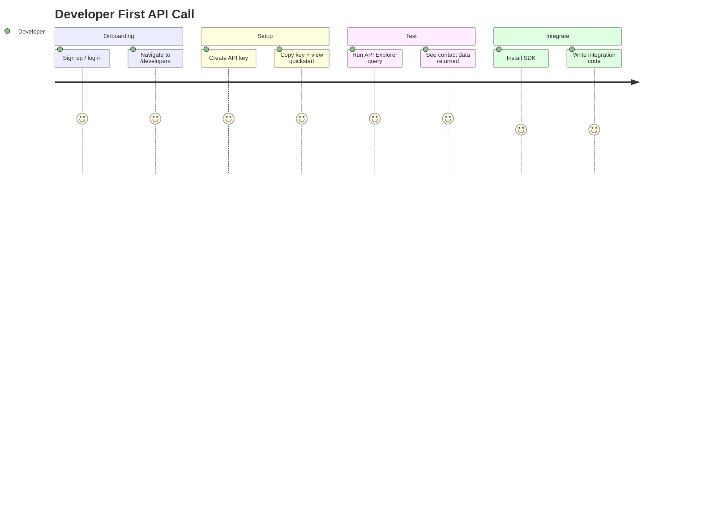
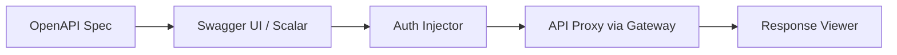

# 09 — Developer Portal Design

**Version 4.0** | Phase 10 | AI Lead Intelligence Platform

---

## Table of Contents

1. [Overview](#1-overview)
2. [Portal Architecture](#2-portal-architecture)
3. [User Journeys](#3-user-journeys)
4. [Page Specifications](#4-page-specifications)
5. [Interactive API Explorer](#5-interactive-api-explorer)
6. [Sandbox Environment](#6-sandbox-environment)
7. [Documentation Hub](#7-documentation-hub)
8. [Usage Dashboard](#8-usage-dashboard)
9. [Component Library](#9-component-library)
10. [Implementation Plan](#10-implementation-plan)

---

## 1. Overview

The Developer Portal is the **self-service hub** for external developers and customer IT teams. It provides API key management, OAuth app registration, interactive documentation, sandbox testing, and usage analytics.

**URL:** `http://localhost:3000/developers`  
**Frontend:** `frontend/src/features/developers/`  
**Feature flag:** `integration_platform_v4`

### CTO Mandate: Excellent DevEx

> "A developer should go from signup to first successful API call in under 10 minutes."

---

## 2. Portal Architecture

```mermaid
flowchart TB
    subgraph Developer Portal UI
        Home[Dashboard Home]
        Keys[API Keys]
        OAuth[OAuth Apps]
        WH[Webhooks]
        Docs[Documentation]
        Explorer[API Explorer]
        Sandbox[Sandbox]
        Usage[Usage Analytics]
    end

    subgraph Backend APIs
        PlatformAPI[/api/v1/platform/*]
        OpenAPI[/api/v1/openapi.json]
        AuthAPI[/api/v1/auth/*]
    end

    subgraph External
        SDK[SDK Downloads]
        GH[GitHub Examples]
        Postman[Postman Collection]
    end

    Home --> PlatformAPI
    Keys --> PlatformAPI
    OAuth --> PlatformAPI
    WH --> PlatformAPI
    Explorer --> OpenAPI
    Sandbox --> PlatformAPI
    Usage --> PlatformAPI
    Docs --> SDK
    Docs --> GH
    Docs --> Postman
```

---

## 3. User Journeys

### Journey 1: First API Call (< 10 minutes)



### Journey 2: Webhook Integration

1. Navigate to **Webhooks** → **Create Subscription**
2. Select events from catalog (checkbox UI)
3. Enter endpoint URL → **Test Delivery**
4. Copy webhook secret → implement verification
5. Monitor deliveries in **Delivery Log**

### Journey 3: OAuth Application

1. Navigate to **OAuth Apps** → **Register Application**
2. Configure redirect URIs and scopes
3. Copy `client_id` + `client_secret`
4. Follow embedded OAuth flow guide
5. Test token exchange in API Explorer

---

## 4. Page Specifications

### 4.1 Dashboard Home (`/developers`)

| Widget | Content |
|--------|---------|
| Quick Start Card | 3-step guide: Create key → Test API → Install SDK |
| API Health | Gateway status, latency, error rate (last 24h) |
| Recent Activity | Last 10 API calls with status codes |
| Quick Links | Docs, SDK, Postman, Support |

### 4.2 API Keys (`/developers/keys`)

| Feature | Description |
|---------|-------------|
| Key list | Name, prefix, scopes, last used, expires, status |
| Create key | Modal: name, scopes (checkbox), expiry (optional) |
| Key reveal | Show full key once on creation with copy button |
| Revoke | Soft-delete with confirmation |
| Scope picker | Visual scope groups: CRM, Search, Workflows, Platform |

Reuses existing `auth.api_keys` model — portal is a UI over existing endpoints.

### 4.3 OAuth Apps (`/developers/oauth`)

| Feature | Description |
|---------|-------------|
| App list | Name, client_id, scopes, grant types, status |
| Register app | Form: name, redirect URIs, scopes, logo |
| Secret reveal | One-time `client_secret` display |
| Token test | Embedded OAuth flow tester |

### 4.4 Webhooks (`/developers/webhooks`)

| Feature | Description |
|---------|-------------|
| Subscription list | URL, events, status, last delivery |
| Create/edit | Event picker, URL input, test button |
| Delivery log | Table: timestamp, event, status, response code, duration |
| Replay | Button on failed deliveries |

### 4.5 Documentation (`/developers/docs`)

| Section | Content |
|---------|---------|
| Getting Started | Auth, first call, error handling |
| API Reference | Auto-generated from OpenAPI |
| Webhooks Guide | Event catalog, signature verification |
| SDK Guides | Python, TypeScript, CLI |
| GraphQL | Schema explorer (if enabled) |
| Changelog | API version history |

---

## 5. Interactive API Explorer

Embedded OpenAPI explorer at `/developers/explorer`:



### Features

| Feature | Implementation |
|---------|----------------|
| Auth injection | Auto-attach API key or JWT from session |
| Try it out | Execute real requests against sandbox/prod |
| Code snippets | Generate Python, TypeScript, curl examples |
| Response viewer | Syntax-highlighted JSON with schema validation |
| History | Last 20 explorer requests saved locally |

### Technology

- **Scalar** or **Swagger UI** embedded in React
- OpenAPI spec fetched from `/api/v1/openapi.json`
- Requests proxied through gateway (not direct to :8000)

---

## 6. Sandbox Environment

### Sandbox Organization

Each developer account gets an isolated sandbox org:

| Property | Sandbox | Production |
|----------|---------|------------|
| Org flag | `is_sandbox: true` | `is_sandbox: false` |
| Rate limit | 60 req/min | Per plan tier |
| Data | Seeded demo data | Real data |
| Webhooks | HTTP allowed | HTTPS required |
| API keys | `ali_test_*` prefix | `ali_live_*` prefix |

### Sandbox Toggle

```tsx
// Portal header toggle
<SandboxToggle
  isSandbox={org.is_sandbox}
  onToggle={() => switchEnvironment()}
/>
```

### Seeded Data

- 50 demo companies across 5 industries
- 200 demo contacts with lead scores
- 3 sample workflows
- 10 sample deals in pipeline

---

## 7. Documentation Hub

### Content Sources

| Source | Location | Update Cadence |
|--------|----------|----------------|
| OpenAPI spec | Auto-generated from FastAPI | Every deploy |
| Markdown guides | `docs/phase10/` | Per sprint |
| SDK READMEs | `backend/sdk/ali/README.md` | Per SDK release |
| Changelog | `docs/phase10/CHANGELOG.md` | Per API change |
| Examples | `examples/integrations/` | Per integration pattern |

### Search

Full-text search across all documentation with filters:

- API Reference
- Guides
- SDK
- Webhooks
- Examples

---

## 8. Usage Dashboard

### Metrics Displayed

| Metric | Visualization |
|--------|---------------|
| Requests/day | Line chart (30 days) |
| Error rate | Percentage with breakdown by code |
| Top endpoints | Bar chart |
| Latency p50/p99 | Line chart |
| Webhook deliveries | Success/fail donut chart |
| Quota usage | Progress bar vs. limit |

### Data Source

`GET /api/v1/platform/usage` with optional `group_by=endpoint|key|day`

---

## 9. Component Library

### Shared Components (`frontend/src/features/developers/components/`)

| Component | Purpose |
|-----------|---------|
| `ApiKeyCard` | Display key with prefix, scopes, actions |
| `ScopePicker` | Grouped checkbox scope selector |
| `EventCatalog` | Searchable event type picker for webhooks |
| `DeliveryLog` | Paginated delivery history table |
| `CodeSnippet` | Syntax-highlighted code with copy button |
| `SecretReveal` | One-time secret display with warning |
| `UsageChart` | Recharts-based usage visualization |
| `QuickStartWizard` | 3-step onboarding wizard |

### Design Tokens

Follows platform design system with developer-focused accents:

| Token | Value |
|-------|-------|
| `--dev-primary` | `#6366F1` (indigo) |
| `--dev-code-bg` | `#1E1E2E` |
| `--dev-success` | `#22C55E` |
| `--dev-error` | `#EF4444` |

---

## 10. Implementation Plan

| Sprint | Deliverable | Components |
|--------|-------------|------------|
| 10.7a | Portal shell + navigation | Layout, routing, auth |
| 10.7b | API Keys page | `ApiKeyCard`, `ScopePicker` |
| 10.7c | Webhooks page | `EventCatalog`, `DeliveryLog` |
| 10.7d | API Explorer | Scalar embed, auth injector |
| 10.7e | OAuth Apps page | Registration form, flow tester |
| 10.7f | Usage dashboard | `UsageChart`, quota display |
| 10.7g | Sandbox + quickstart | `QuickStartWizard`, seed data |

### Route Map

```typescript
// frontend/src/features/developers/routes.tsx
const developerRoutes = [
  { path: '/developers', element: <DeveloperHome /> },
  { path: '/developers/keys', element: <ApiKeysPage /> },
  { path: '/developers/keys/new', element: <CreateApiKeyPage /> },
  { path: '/developers/oauth', element: <OAuthAppsPage /> },
  { path: '/developers/oauth/new', element: <RegisterOAuthAppPage /> },
  { path: '/developers/webhooks', element: <WebhooksPage /> },
  { path: '/developers/webhooks/:id', element: <WebhookDetailPage /> },
  { path: '/developers/explorer', element: <ApiExplorerPage /> },
  { path: '/developers/docs', element: <DocsHubPage /> },
  { path: '/developers/docs/:slug', element: <DocPage /> },
  { path: '/developers/usage', element: <UsageDashboardPage /> },
];
```

---

## Related Documents

- [07-public-sdk-specifications.md](./07-public-sdk-specifications.md)
- [17-developer-experience-guide.md](./17-developer-experience-guide.md)
- [02-rest-api-specification.md](./02-rest-api-specification.md)