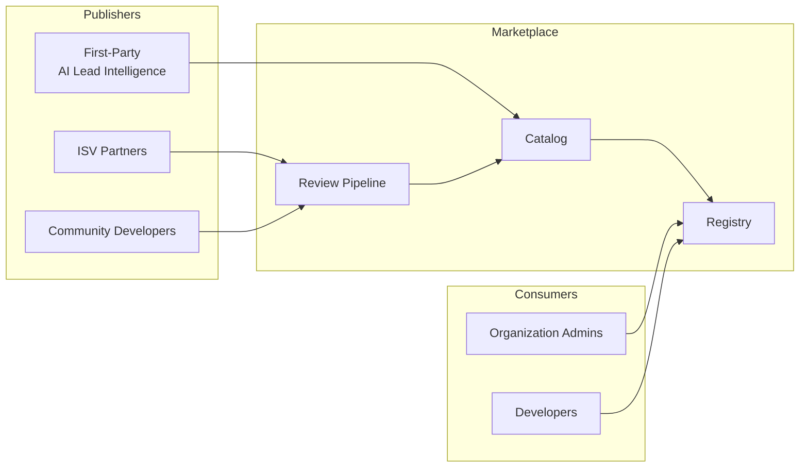
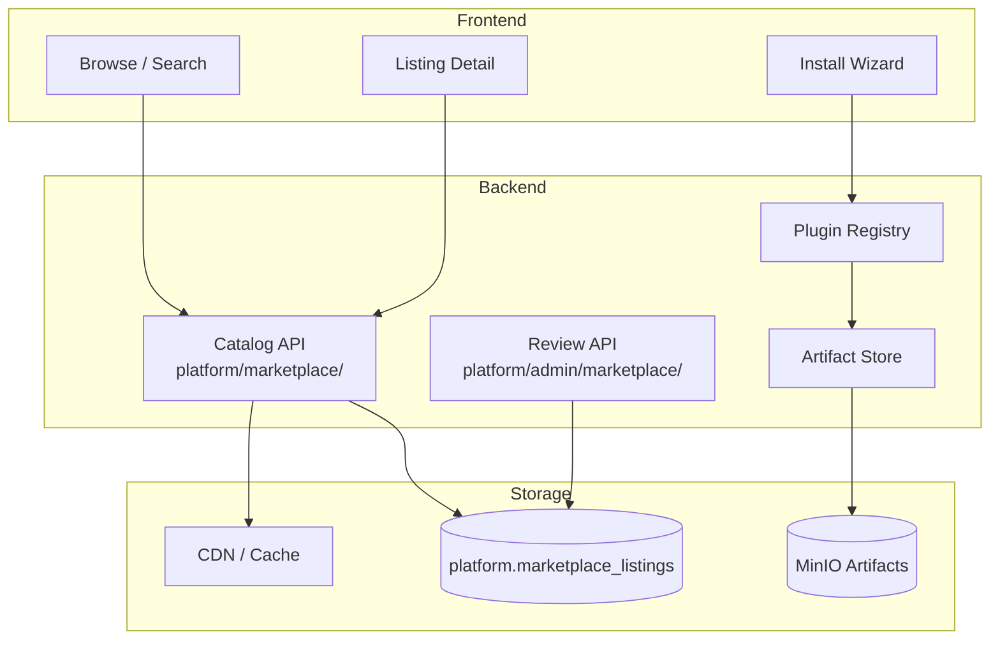
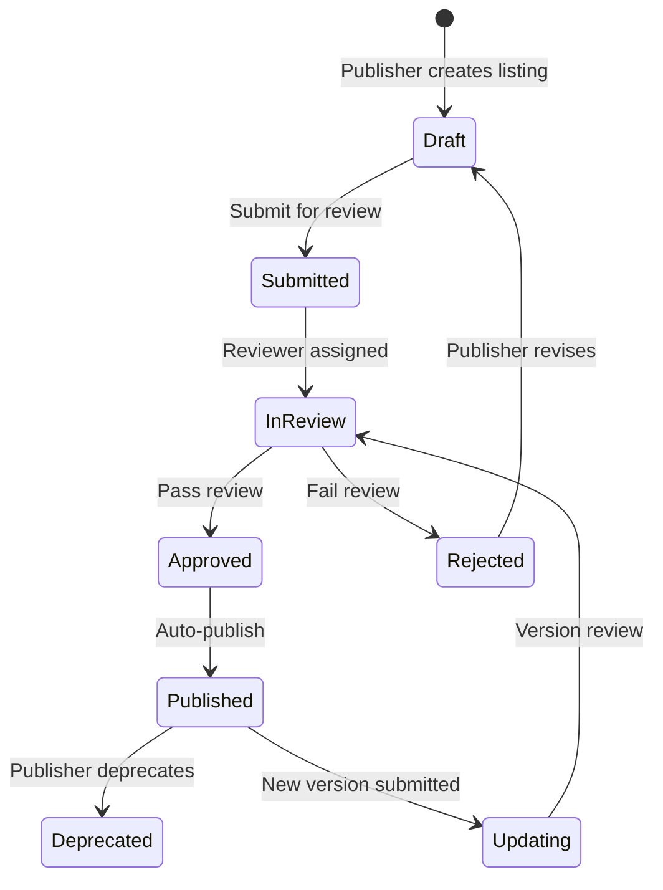
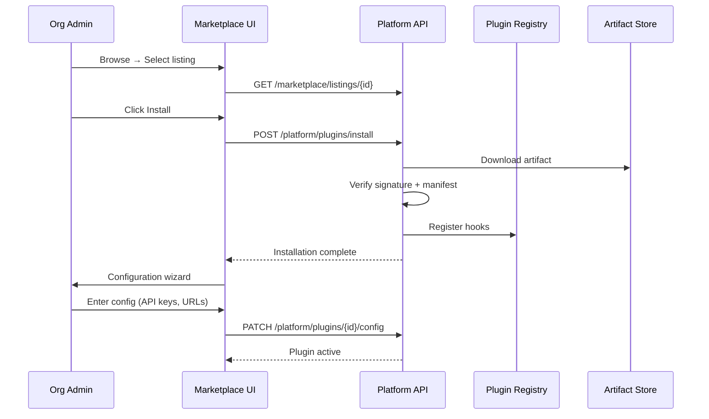

# 10 — Marketplace Architecture

**Version 4.0** | Phase 10 | AI Lead Intelligence Platform

---

## Table of Contents

1. [Overview](#1-overview)
2. [Marketplace Model](#2-marketplace-model)
3. [Architecture](#3-architecture)
4. [Catalog Structure](#4-catalog-structure)
5. [Publisher Workflow](#5-publisher-workflow)
6. [Review & Approval](#6-review--approval)
7. [Installation Flow](#7-installation-flow)
8. [Pricing & Licensing](#8-pricing--licensing)
9. [Database Schema](#9-database-schema)
10. [Governance](#10-governance)

---

## 1. Overview

The Marketplace is a **curated catalog** of connectors, workflow plugins, and integration templates. It enables the extension-first strategy by distributing vetted third-party and first-party extensions.

**URL:** `http://localhost:3000/marketplace`  
**Frontend:** `frontend/src/features/marketplace/`  
**Artifact storage:** MinIO `s3://ali-artifacts/marketplace/`

---

## 2. Marketplace Model



### Listing Types

| Type | Description | Review Required |
|------|-------------|-----------------|
| **Connector** | Data sync plugin (`conn:*`) | Yes (ISV), Auto (first-party) |
| **Workflow Template** | Pre-built workflow JSON | Auto |
| **Workflow Plugin** | Custom node (`wfa:*`, `wft:*`) | Yes |
| **Integration Template** | Multi-component bundle | Yes |
| **Webhook Transformer** | Payload format plugin (`wht:*`) | Yes |

---

## 3. Architecture



---

## 4. Catalog Structure

### Listing Metadata

```json
{
  "id": "marketplace:salesforce-sync-v2",
  "name": "Salesforce Bi-Directional Sync",
  "type": "connector",
  "version": "2.1.0",
  "publisher": {
    "id": "pub-ali-official",
    "name": "AI Lead Intelligence",
    "verified": true
  },
  "description": "Sync contacts, companies, and deals between Salesforce and AI Lead Intelligence.",
  "short_description": "Bi-directional Salesforce CRM sync",
  "category": "crm",
  "tags": ["salesforce", "crm", "sync", "bidirectional"],
  "icon_url": "https://cdn.example.com/icons/salesforce.svg",
  "screenshots": ["https://cdn.example.com/screenshots/sf-sync-1.png"],
  "pricing": { "model": "free" },
  "rating": { "average": 4.7, "count": 128 },
  "install_count": 1542,
  "min_platform_version": "4.0.0",
  "permissions": ["crm:read", "crm:write", "contacts:read"],
  "changelog": "https://cdn.example.com/changelogs/sf-sync-v2.md",
  "documentation_url": "/developers/docs/connectors/salesforce",
  "support_url": "https://support.example.com/salesforce-connector",
  "status": "published",
  "published_at": "2026-03-15T00:00:00Z"
}
```

### Categories

| Category | Listings |
|----------|----------|
| `crm` | Salesforce, HubSpot, Pipedrive connectors |
| `communication` | Slack, Teams, Email plugins |
| `enrichment` | Clearbit, ZoomInfo enrichment |
| `automation` | Workflow templates, Zapier-style bundles |
| `analytics` | Custom KPI plugins, export connectors |
| `productivity` | Google Sheets, Notion integrations |

### Search & Discovery

| Feature | Implementation |
|---------|----------------|
| Full-text search | PostgreSQL `tsvector` on name + description |
| Category filter | Faceted navigation |
| Tag filter | Multi-select tag chips |
| Sort | Popular, newest, highest rated |
| Featured | Curated homepage carousel |

---

## 5. Publisher Workflow



### Publisher Registration

```http
POST /api/v1/platform/marketplace/publishers
Authorization: Bearer {token}

{
  "name": "Acme Integrations Inc.",
  "website": "https://acme-integrations.com",
  "contact_email": "dev@acme-integrations.com"
}
```

### Submit Listing

```http
POST /api/v1/platform/marketplace/listings
Authorization: Bearer {publisher_token}

{
  "name": "Custom Pipedrive Sync",
  "type": "connector",
  "category": "crm",
  "description": "...",
  "artifact_url": "s3://ali-artifacts/marketplace/pipedrive-v1.0.0.tar.gz",
  "manifest": { /* plugin manifest */ },
  "pricing": { "model": "free" }
}
```

---

## 6. Review & Approval

### Review Checklist

| Check | Automated | Manual |
|-------|-----------|--------|
| Manifest validation | ✅ JSON Schema | — |
| Signature verification | ✅ Ed25519 | — |
| Dependency scan | ✅ OSV/Snyk | — |
| Permission scope review | — | ✅ |
| Code review (Python fallback) | — | ✅ |
| Test execution | ✅ Connector test harness | — |
| Documentation completeness | — | ✅ |
| Security assessment | — | ✅ (third-party) |

### Review SLA

| Publisher Tier | Review Time |
|----------------|-------------|
| First-party | Auto-approved |
| Verified ISV | 2 business days |
| Community | 5 business days |

### Rejection Reasons

| Code | Description |
|------|-------------|
| `SECURITY_ISSUE` | Vulnerability or unsafe pattern detected |
| `PERMISSION_EXCESSIVE` | Requests more permissions than needed |
| `DOCUMENTATION_INCOMPLETE` | Missing setup guide or changelog |
| `TEST_FAILURE` | Automated tests failed |
| `POLICY_VIOLATION` | Violates marketplace policies |

---

## 7. Installation Flow



### Install Wizard Steps

1. **Review** — Permissions, description, publisher info
2. **Configure** — Dynamic form from `config_schema`
3. **Test** — Run `test_connection` hook
4. **Activate** — Enable plugin for organization

---

## 8. Pricing & Licensing

### Pricing Models (v4)

| Model | Description | v4 Support |
|-------|-------------|------------|
| Free | No cost | ✅ |
| Freemium | Free tier + paid features | v5 |
| Paid | One-time or subscription | v5 |
| Revenue share | Platform takes % | v5 |

### License Types

| License | Marketplace Badge |
|---------|-------------------|
| MIT | Open source |
| Apache 2.0 | Open source |
| Proprietary | Commercial |
| Platform | First-party |

---

## 9. Database Schema

```sql
CREATE TABLE platform.marketplace_publishers (
    id              UUID PRIMARY KEY DEFAULT gen_random_uuid(),
    name            VARCHAR(200) NOT NULL,
    website         TEXT,
    contact_email   VARCHAR(255) NOT NULL,
    is_verified     BOOLEAN NOT NULL DEFAULT FALSE,
    created_at      TIMESTAMPTZ NOT NULL DEFAULT NOW()
);

CREATE TABLE platform.marketplace_listings (
    id              UUID PRIMARY KEY DEFAULT gen_random_uuid(),
    listing_id      VARCHAR(100) NOT NULL UNIQUE,
    publisher_id    UUID NOT NULL REFERENCES platform.marketplace_publishers(id),
    name            VARCHAR(200) NOT NULL,
    type            VARCHAR(50) NOT NULL,
    category        VARCHAR(50) NOT NULL,
    description     TEXT NOT NULL,
    short_description VARCHAR(500),
    version         VARCHAR(20) NOT NULL,
    tags            JSONB DEFAULT '[]',
    icon_url        TEXT,
    screenshots     JSONB DEFAULT '[]',
    pricing         JSONB NOT NULL DEFAULT '{"model": "free"}',
    permissions     JSONB NOT NULL DEFAULT '[]',
    manifest        JSONB NOT NULL,
    artifact_url    TEXT NOT NULL,
    artifact_hash   VARCHAR(64) NOT NULL,
    min_platform_version VARCHAR(20) NOT NULL,
    status          VARCHAR(20) NOT NULL DEFAULT 'draft',
    install_count   INT NOT NULL DEFAULT 0,
    rating_avg      DECIMAL(3,2) DEFAULT 0,
    rating_count    INT NOT NULL DEFAULT 0,
    published_at    TIMESTAMPTZ,
    created_at      TIMESTAMPTZ NOT NULL DEFAULT NOW(),
    updated_at      TIMESTAMPTZ NOT NULL DEFAULT NOW()
);

CREATE TABLE platform.marketplace_reviews (
    id              UUID PRIMARY KEY DEFAULT gen_random_uuid(),
    listing_id      UUID NOT NULL REFERENCES platform.marketplace_listings(id),
    reviewer_id     UUID NOT NULL,
    status          VARCHAR(20) NOT NULL,
    checklist       JSONB NOT NULL DEFAULT '{}',
    notes           TEXT,
    created_at      TIMESTAMPTZ NOT NULL DEFAULT NOW(),
    completed_at    TIMESTAMPTZ
);

CREATE TABLE platform.marketplace_ratings (
    id              UUID PRIMARY KEY DEFAULT gen_random_uuid(),
    listing_id      UUID NOT NULL REFERENCES platform.marketplace_listings(id),
    organization_id UUID NOT NULL,
    user_id         UUID NOT NULL,
    rating          SMALLINT NOT NULL CHECK (rating BETWEEN 1 AND 5),
    review_text     TEXT,
    created_at      TIMESTAMPTZ NOT NULL DEFAULT NOW(),
    UNIQUE (listing_id, organization_id)
);
```

---

## 10. Governance

### Marketplace Policies

| Policy | Rule |
|--------|------|
| No credential storage in artifacts | Secrets via platform secret store only |
| Minimum documentation | README + setup guide + changelog |
| Permission justification | Each permission must be documented |
| No core modification | Plugins cannot modify core platform code |
| Update compatibility | Major version bumps require re-review |
| Deprecation notice | 90-day notice before removal |

### Featured Listings

Platform team curates featured listings based on:

- Install count > 100
- Rating > 4.0
- First-party or verified ISV
- Active maintenance (update within 6 months)

---

## Related Documents

- [05-plugin-framework-architecture.md](./05-plugin-framework-architecture.md)
- [06-connector-sdk-specification.md](./06-connector-sdk-specification.md)
- [18-platform-administration-guide.md](./18-platform-administration-guide.md)