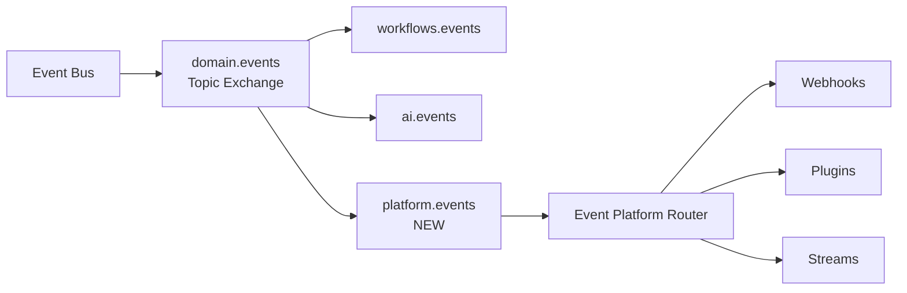

# 11 — Event Platform Design

**Version 4.0** | Phase 10 | AI Lead Intelligence Platform

---

## Table of Contents

1. [Overview](#1-overview)
2. [Event Platform Architecture](#2-event-platform-architecture)
3. [Public Event Catalog](#3-public-event-catalog)
4. [Event Schema Registry](#4-event-schema-registry)
5. [Subscription Routing](#5-subscription-routing)
6. [Partner Event Streams](#6-partner-event-streams)
7. [Event Replay API](#7-event-replay-api)
8. [Integration with Event Bus](#8-integration-with-event-bus)
9. [Event Versioning](#9-event-versioning)
10. [Monitoring](#10-monitoring)

---

## 1. Overview

The Event Platform exposes the internal event bus (`backend/infrastructure/messaging/event_bus.py`) as a **public integration surface**. It provides a documented event catalog, schema registry, webhook routing, and partner event streams.

Phase 8 established the RabbitMQ-backed event bus. Phase 10 adds the **public-facing layer** without modifying the core publish/subscribe infrastructure.

---

## 2. Event Platform Architecture

```mermaid
flowchart TB
    subgraph Domain Services
        CRM[CRM]
        AI[AI Scoring]
        WF[Workflows]
        Search[Search]
        Billing[Billing]
    end

    subgraph Core Event Bus — Phase 8
        EB[EventBus<br/>event_bus.py]
        OUTBOX[(event_store)]
        RMQ[(RabbitMQ<br/>domain.events)]
    end

    subgraph Event Platform — Phase 10
        Catalog[Public Event Catalog]
        Registry[Schema Registry]
        Router[Subscription Router]
        Stream[Partner Event Streams]
        Replay[Replay API]
    end

    subgraph Delivery
        WH[Webhook Platform]
        Plugin[Plugin Subscribers]
        SDK[SDK Event Handlers]
    end

    CRM --> EB
    AI --> EB
    WF --> EB
    Search --> EB
    Billing --> EB
    EB --> OUTBOX
    EB --> RMQ
    RMQ --> Router
    Router --> Catalog
    Router --> WH
    Router --> Plugin
    Router --> Stream
    Registry --> Catalog
    Replay --> OUTBOX
```

---

## 3. Public Event Catalog

### API Endpoint

```http
GET /api/v1/platform/events
Authorization: Bearer {token}
```

**Response:**

```json
{
  "data": {
    "events": [
      {
        "type": "contact.created",
        "version": 1,
        "category": "crm",
        "description": "Fired when a new contact is created",
        "payload_schema": "contact.created.v1",
        "is_webhook_enabled": true,
        "is_stream_enabled": true,
        "sample_payload": {
          "contact_id": "019f0c1f-...",
          "email": "jane@acme.com",
          "first_name": "Jane",
          "last_name": "Smith"
        }
      }
    ],
    "categories": ["crm", "ai", "workflow", "search", "billing", "connector"]
  }
}
```

### Complete Event Catalog

| Event | Category | Webhook | Stream | Since |
|-------|----------|---------|--------|-------|
| `company.created` | crm | ✅ | ✅ | v3 |
| `company.updated` | crm | ✅ | ✅ | v3 |
| `company.merged` | crm | ✅ | ✅ | v3 |
| `contact.created` | crm | ✅ | ✅ | v3 |
| `contact.updated` | crm | ✅ | ✅ | v3 |
| `contact.merged` | crm | ✅ | ✅ | v3 |
| `lead.scored` | ai | ✅ | ✅ | v3 |
| `search.completed` | search | ✅ | ✅ | v3 |
| `workflow.executed` | workflow | ✅ | ✅ | v8 |
| `export.completed` | export | ✅ | ✅ | v3 |
| `import.completed` | export | ✅ | ✅ | v3 |
| `connector.finished` | connector | ✅ | ✅ | v5 |
| `subscription.updated` | billing | ✅ | ❌ | v3 |
| `notification.sent` | notification | ❌ | ❌ | internal |
| `email.verified` | enrichment | ✅ | ✅ | v3 |

---

## 4. Event Schema Registry

### Schema Storage

```
s3://ali-artifacts/events/
  schemas/
    contact.created.v1.json
    contact.updated.v1.json
    lead.scored.v1.json
    workflow.executed.v1.json
  changelog.md
```

### Schema Format (JSON Schema)

```json
{
  "$id": "contact.created.v1",
  "$schema": "https://json-schema.org/draft/2020-12/schema",
  "title": "Contact Created Event",
  "type": "object",
  "required": ["contact_id", "email"],
  "properties": {
    "contact_id": { "type": "string", "format": "uuid" },
    "email": { "type": "string", "format": "email" },
    "first_name": { "type": "string" },
    "last_name": { "type": "string" },
    "company_id": { "type": "string", "format": "uuid" },
    "source": { "type": "string", "enum": ["manual", "import", "connector", "search"] }
  },
  "additionalProperties": false
}
```

### Schema API

```http
GET /api/v1/platform/events/{event_type}/schema
GET /api/v1/platform/events/{event_type}/schema?version=1
```

---

## 5. Subscription Routing

### Router Logic

```python
# backend/app/platform/events/router.py

async def route_event(envelope: EventEnvelope) -> list[DeliveryTarget]:
    targets = []

    # 1. Webhook subscriptions
    subscriptions = await webhook_repo.find_by_event(
        event_type=envelope.event_type,
        organization_id=envelope.organization_id,
    )
    for sub in subscriptions:
        targets.append(WebhookTarget(subscription=sub))

    # 2. Plugin event handlers
    plugins = await plugin_registry.get_event_handlers(envelope.event_type)
    for plugin in plugins:
        targets.append(PluginTarget(plugin=plugin))

    # 3. Partner event streams
    streams = await stream_repo.find_by_event(
        event_type=envelope.event_type,
        organization_id=envelope.organization_id,
    )
    for stream in streams:
        targets.append(StreamTarget(stream=stream))

    return targets
```

### Consumer Registration (SDK)

```python
from ali import Client
from ali.events import EventHandler

client = Client(api_key="...")

@client.events.on("contact.created")
async def handle_contact_created(event):
    contact = event.data
    await sync_to_external_crm(contact)

@client.events.on("lead.scored", filter={"min_score": 80})
async def handle_hot_lead(event):
    await notify_sales_team(event.data)
```

---

## 6. Partner Event Streams

For high-volume partners needing push-based streaming beyond webhooks:

### Stream Types

| Type | Protocol | Use Case |
|------|----------|----------|
| Webhook | HTTP POST | Standard integrations (< 1000 events/day) |
| SSE | Server-Sent Events | Real-time dashboards |
| RabbitMQ | AMQP | High-volume partners (enterprise) |

### SSE Endpoint

```http
GET /api/v1/platform/events/stream?events=contact.created,lead.scored
Authorization: Bearer {token}
Accept: text/event-stream
```

```
event: contact.created
id: 019f0c1f-7a3b-7890-abcd-ef1234567890
data: {"contact_id":"...","email":"jane@acme.com"}

event: lead.scored
id: 019f0c1f-aaaa-bbbb-cccc-ddddeeeeffff
data: {"entity_id":"...","score":85.5}
```

### Dedicated RabbitMQ Queue (Enterprise)

```python
# Partner receives dedicated queue: partner.{org_id}.events
# Bound to domain.events exchange with org-specific routing key
```

---

## 7. Event Replay API

### Replay by Time Range

```http
POST /api/v1/platform/events/replay
Authorization: Bearer {token}

{
  "event_types": ["contact.created"],
  "since": "2026-06-01T00:00:00Z",
  "until": "2026-06-29T00:00:00Z",
  "target": "webhook",
  "target_id": "019f0c1f-webhook-sub-id"
}
```

### Replay by Event ID

```http
POST /api/v1/platform/events/{event_id}/replay
Authorization: Bearer {token}

{
  "target": "webhook",
  "target_id": "019f0c1f-webhook-sub-id"
}
```

### Constraints

| Constraint | Value |
|------------|-------|
| Max replay window | 30 days |
| Max events per replay | 10,000 |
| Replay rate | 100 events/second |
| Permission required | `platform:admin` |

---

## 8. Integration with Event Bus

### No Changes to Core Event Bus

Phase 10 adds a **consumer** on the existing RabbitMQ topology:



### RabbitMQ Queue Configuration

```python
# platform.events queue binding
QUEUE_CONFIG = {
    "name": "platform.events",
    "exchange": "domain.events",
    "routing_key": "#",  # all events
    "arguments": {
        "x-dead-letter-exchange": "domain.events.dlx",
        "x-dead-letter-routing-key": "platform.dlq",
    },
}
```

### Worker

```python
# backend/workers/tasks/platform_events.py

@shared_task(name="platform.route_event", queue="platform")
def route_platform_event(envelope_dict: dict):
    envelope = EventEnvelope(**envelope_dict)
    targets = asyncio.run(event_router.route_event(envelope))
    for target in targets:
        dispatch(target, envelope)
```

---

## 9. Event Versioning

### Versioning Policy

| Change Type | Action |
|-------------|--------|
| Add optional field | Same version (backward compatible) |
| Add required field | New version (`v2`) |
| Remove field | New version with 12-month dual-publish |
| Rename field | New version |
| Change field type | New version |

### Dual-Publish Period

During migration, both versions are published:

```json
{
  "type": "contact.created",
  "event_version": 2,
  "data": { "contact_id": "...", "email": "..." },
  "data_v1": { "contact_id": "...", "email_address": "..." }
}
```

---

## 10. Monitoring

### Metrics

```
platform_events_routed_total{event_type, target_type}
platform_event_routing_duration_seconds{quantile="0.99"}
platform_event_replay_total{status}
platform_event_stream_connections_active
```

### Alerts

| Alert | Condition |
|-------|-----------|
| Event routing lag | Queue depth > 5,000 for 5 min |
| Routing failures | Error rate > 1% for 10 min |
| Replay backlog | Replay queue > 1,000 events |

---

## Related Documents

- [04-webhook-platform-design.md](./04-webhook-platform-design.md)
- [05-plugin-framework-architecture.md](./05-plugin-framework-architecture.md)
- [docs/phase8/05-event-bus-architecture.md](../phase8/05-event-bus-architecture.md)