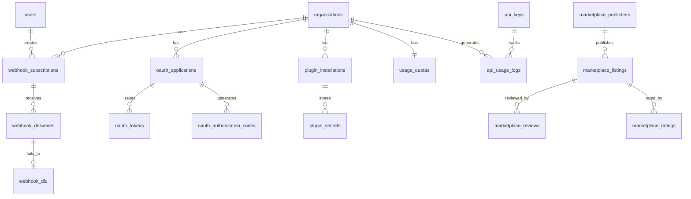

# 12 — API Database Schema

**Version 4.0** | Phase 10 | AI Lead Intelligence Platform

---

## Table of Contents

1. [Overview](#1-overview)
2. [Schema DDL](#2-schema-ddl)
3. [Webhook Tables](#3-webhook-tables)
4. [OAuth Tables](#4-oauth-tables)
5. [Plugin Tables](#5-plugin-tables)
6. [Marketplace Tables](#6-marketplace-tables)
7. [Usage & Quota Tables](#7-usage--quota-tables)
8. [Event Platform Tables](#8-event-platform-tables)
9. [Migration Script](#9-migration-script)
10. [Entity Relationship Diagram](#10-entity-relationship-diagram)

---

## 1. Overview

All Phase 10 integration platform tables reside in the `platform` PostgreSQL schema, following the multi-schema pattern in `backend/app/common/db_schemas.py`.

**Migration:** `backend/migrations/versions/016_phase10_integration_platform.py`

**Conventions:**
- `organization_id UUID NOT NULL` on every tenant-scoped table
- `created_at TIMESTAMPTZ NOT NULL DEFAULT NOW()` on all tables
- UUIDs via `gen_random_uuid()` (migrating to `uuid7()` in application layer)
- Soft deletes via `deleted_at TIMESTAMPTZ`
- Secrets stored as hashes only

### Schema Constant Addition

```python
# backend/app/common/db_schemas.py
class DBSchema:
    # ... existing schemas ...
    PLATFORM = "platform"  # webhooks, oauth, plugins, marketplace, usage
```

---

## 2. Schema DDL

```sql
-- 016_phase10_integration_platform.py

CREATE SCHEMA IF NOT EXISTS platform;

GRANT USAGE ON SCHEMA platform TO app_user;
GRANT ALL ON ALL TABLES IN SCHEMA platform TO app_user;
ALTER DEFAULT PRIVILEGES IN SCHEMA platform GRANT ALL ON TABLES TO app_user;
```

---

## 3. Webhook Tables

### 3.1 webhook_subscriptions

```sql
CREATE TABLE platform.webhook_subscriptions (
    id              UUID PRIMARY KEY DEFAULT gen_random_uuid(),
    organization_id UUID NOT NULL,
    created_by      UUID NOT NULL,
    url             TEXT NOT NULL,
    secret_hash     VARCHAR(255) NOT NULL,
    events          JSONB NOT NULL DEFAULT '[]',
    description     VARCHAR(500),
    is_active       BOOLEAN NOT NULL DEFAULT TRUE,
    metadata        JSONB DEFAULT '{}',
    failure_count   INT NOT NULL DEFAULT 0,
    last_delivery_at TIMESTAMPTZ,
    created_at      TIMESTAMPTZ NOT NULL DEFAULT NOW(),
    updated_at      TIMESTAMPTZ NOT NULL DEFAULT NOW(),
    deleted_at      TIMESTAMPTZ
);

CREATE INDEX ix_webhook_subs_org ON platform.webhook_subscriptions(organization_id)
    WHERE deleted_at IS NULL;
CREATE INDEX ix_webhook_subs_events ON platform.webhook_subscriptions
    USING GIN (events);
```

### 3.2 webhook_deliveries

```sql
CREATE TABLE platform.webhook_deliveries (
    id              UUID PRIMARY KEY DEFAULT gen_random_uuid(),
    subscription_id UUID NOT NULL REFERENCES platform.webhook_subscriptions(id),
    organization_id UUID NOT NULL,
    event_id        UUID NOT NULL,
    event_type      VARCHAR(100) NOT NULL,
    payload         JSONB NOT NULL,
    status          VARCHAR(20) NOT NULL DEFAULT 'pending',
    attempt_count   INT NOT NULL DEFAULT 0,
    response_status INT,
    response_body   TEXT,
    response_time_ms INT,
    next_retry_at   TIMESTAMPTZ,
    delivered_at    TIMESTAMPTZ,
    created_at      TIMESTAMPTZ NOT NULL DEFAULT NOW()
);

CREATE INDEX ix_webhook_deliveries_sub ON platform.webhook_deliveries(subscription_id);
CREATE INDEX ix_webhook_deliveries_status ON platform.webhook_deliveries(status)
    WHERE status IN ('pending', 'retrying');
CREATE INDEX ix_webhook_deliveries_org_created ON platform.webhook_deliveries(organization_id, created_at DESC);
```

### 3.3 webhook_dlq

```sql
CREATE TABLE platform.webhook_dlq (
    id              UUID PRIMARY KEY DEFAULT gen_random_uuid(),
    delivery_id     UUID NOT NULL REFERENCES platform.webhook_deliveries(id),
    subscription_id UUID NOT NULL,
    organization_id UUID NOT NULL,
    event_type      VARCHAR(100) NOT NULL,
    payload         JSONB NOT NULL,
    last_error      TEXT,
    attempt_count   INT NOT NULL,
    created_at      TIMESTAMPTZ NOT NULL DEFAULT NOW()
);
```

---

## 4. OAuth Tables

### 4.1 oauth_applications

```sql
CREATE TABLE platform.oauth_applications (
    id                  UUID PRIMARY KEY DEFAULT gen_random_uuid(),
    organization_id     UUID NOT NULL,
    client_id           VARCHAR(50) NOT NULL UNIQUE,
    client_secret_hash  VARCHAR(255),
    name                VARCHAR(200) NOT NULL,
    description         TEXT,
    redirect_uris       JSONB NOT NULL DEFAULT '[]',
    grant_types         JSONB NOT NULL DEFAULT '[]',
    scopes              JSONB NOT NULL DEFAULT '[]',
    logo_url            TEXT,
    homepage_url        TEXT,
    is_active           BOOLEAN NOT NULL DEFAULT TRUE,
    created_by          UUID NOT NULL,
    created_at          TIMESTAMPTZ NOT NULL DEFAULT NOW(),
    updated_at          TIMESTAMPTZ NOT NULL DEFAULT NOW()
);

CREATE INDEX ix_oauth_apps_org ON platform.oauth_applications(organization_id);
```

### 4.2 oauth_tokens

```sql
CREATE TABLE platform.oauth_tokens (
    id              UUID PRIMARY KEY DEFAULT gen_random_uuid(),
    application_id  UUID NOT NULL REFERENCES platform.oauth_applications(id) ON DELETE CASCADE,
    user_id         UUID,
    organization_id UUID NOT NULL,
    token_type      VARCHAR(20) NOT NULL,
    token_hash      VARCHAR(255) NOT NULL,
    scopes          JSONB NOT NULL DEFAULT '[]',
    expires_at      TIMESTAMPTZ NOT NULL,
    revoked_at      TIMESTAMPTZ,
    created_at      TIMESTAMPTZ NOT NULL DEFAULT NOW()
);

CREATE INDEX ix_oauth_tokens_app ON platform.oauth_tokens(application_id);
CREATE INDEX ix_oauth_tokens_hash ON platform.oauth_tokens(token_hash);
CREATE INDEX ix_oauth_tokens_expires ON platform.oauth_tokens(expires_at)
    WHERE revoked_at IS NULL;
```

### 4.3 oauth_authorization_codes

```sql
CREATE TABLE platform.oauth_authorization_codes (
    id                      UUID PRIMARY KEY DEFAULT gen_random_uuid(),
    application_id          UUID NOT NULL REFERENCES platform.oauth_applications(id) ON DELETE CASCADE,
    user_id                 UUID NOT NULL,
    code_hash               VARCHAR(255) NOT NULL UNIQUE,
    redirect_uri            TEXT NOT NULL,
    scopes                  JSONB NOT NULL,
    code_challenge          VARCHAR(128),
    code_challenge_method   VARCHAR(10),
    expires_at              TIMESTAMPTZ NOT NULL,
    used_at                 TIMESTAMPTZ,
    created_at              TIMESTAMPTZ NOT NULL DEFAULT NOW()
);
```

---

## 5. Plugin Tables

### 5.1 plugin_installations

```sql
CREATE TABLE platform.plugin_installations (
    id              UUID PRIMARY KEY DEFAULT gen_random_uuid(),
    organization_id UUID NOT NULL,
    plugin_id       VARCHAR(100) NOT NULL,
    version         VARCHAR(20) NOT NULL,
    config          JSONB NOT NULL DEFAULT '{}',
    status          VARCHAR(20) NOT NULL DEFAULT 'active',
    installed_by    UUID NOT NULL,
    installed_at    TIMESTAMPTZ NOT NULL DEFAULT NOW(),
    updated_at      TIMESTAMPTZ NOT NULL DEFAULT NOW(),
    UNIQUE (organization_id, plugin_id)
);

CREATE INDEX ix_plugin_install_org ON platform.plugin_installations(organization_id);
```

### 5.2 plugin_secrets

```sql
CREATE TABLE platform.plugin_secrets (
    id              UUID PRIMARY KEY DEFAULT gen_random_uuid(),
    installation_id UUID NOT NULL REFERENCES platform.plugin_installations(id) ON DELETE CASCADE,
    key             VARCHAR(100) NOT NULL,
    value_encrypted BYTEA NOT NULL,
    created_at      TIMESTAMPTZ NOT NULL DEFAULT NOW(),
    updated_at      TIMESTAMPTZ NOT NULL DEFAULT NOW(),
    UNIQUE (installation_id, key)
);
```

---

## 6. Marketplace Tables

See [10-marketplace-architecture.md](./10-marketplace-architecture.md) for full definitions:

- `platform.marketplace_publishers`
- `platform.marketplace_listings`
- `platform.marketplace_reviews`
- `platform.marketplace_ratings`

---

## 7. Usage & Quota Tables

### 7.1 api_usage_logs

Partitioned by month for high-volume append-only writes.

```sql
CREATE TABLE platform.api_usage_logs (
    id              UUID NOT NULL DEFAULT gen_random_uuid(),
    organization_id UUID NOT NULL,
    api_key_id      UUID,
    oauth_app_id    UUID,
    user_id         UUID,
    method          VARCHAR(10) NOT NULL,
    endpoint        VARCHAR(500) NOT NULL,
    status_code     SMALLINT NOT NULL,
    response_time_ms INT NOT NULL,
    request_id      UUID,
    auth_method     VARCHAR(20) NOT NULL,
    created_at      TIMESTAMPTZ NOT NULL DEFAULT NOW(),
    PRIMARY KEY (id, created_at)
) PARTITION BY RANGE (created_at);

CREATE TABLE platform.api_usage_logs_2026_06
    PARTITION OF platform.api_usage_logs
    FOR VALUES FROM ('2026-06-01') TO ('2026-07-01');

CREATE INDEX ix_usage_org_created ON platform.api_usage_logs(organization_id, created_at DESC);
CREATE INDEX ix_usage_endpoint ON platform.api_usage_logs(endpoint, created_at DESC);
```

### 7.2 usage_quotas

```sql
CREATE TABLE platform.usage_quotas (
    id              UUID PRIMARY KEY DEFAULT gen_random_uuid(),
    organization_id UUID NOT NULL UNIQUE,
    tier            VARCHAR(20) NOT NULL DEFAULT 'free',
    requests_per_minute INT NOT NULL DEFAULT 60,
    webhooks_per_day INT NOT NULL DEFAULT 1000,
    graphql_complexity_limit INT NOT NULL DEFAULT 500,
    max_api_keys    INT NOT NULL DEFAULT 5,
    max_webhooks    INT NOT NULL DEFAULT 10,
    max_oauth_apps  INT NOT NULL DEFAULT 3,
    updated_at      TIMESTAMPTZ NOT NULL DEFAULT NOW()
);
```

### 7.3 usage_aggregates (daily rollup)

```sql
CREATE TABLE platform.usage_aggregates (
    id              UUID PRIMARY KEY DEFAULT gen_random_uuid(),
    organization_id UUID NOT NULL,
    date            DATE NOT NULL,
    total_requests  INT NOT NULL DEFAULT 0,
    error_count     INT NOT NULL DEFAULT 0,
    avg_response_ms INT NOT NULL DEFAULT 0,
    p99_response_ms INT NOT NULL DEFAULT 0,
    webhook_deliveries INT NOT NULL DEFAULT 0,
    webhook_failures INT NOT NULL DEFAULT 0,
    by_endpoint     JSONB DEFAULT '{}',
    UNIQUE (organization_id, date)
);
```

---

## 8. Event Platform Tables

### 8.1 event_replay_jobs

```sql
CREATE TABLE platform.event_replay_jobs (
    id              UUID PRIMARY KEY DEFAULT gen_random_uuid(),
    organization_id UUID NOT NULL,
    created_by      UUID NOT NULL,
    event_types     JSONB NOT NULL,
    since           TIMESTAMPTZ NOT NULL,
    until           TIMESTAMPTZ NOT NULL,
    target_type     VARCHAR(20) NOT NULL,
    target_id       UUID NOT NULL,
    status          VARCHAR(20) NOT NULL DEFAULT 'pending',
    events_total    INT NOT NULL DEFAULT 0,
    events_processed INT NOT NULL DEFAULT 0,
    created_at      TIMESTAMPTZ NOT NULL DEFAULT NOW(),
    completed_at    TIMESTAMPTZ
);
```

### 8.2 event_schema_registry

```sql
CREATE TABLE platform.event_schema_registry (
    id              UUID PRIMARY KEY DEFAULT gen_random_uuid(),
    event_type      VARCHAR(100) NOT NULL,
    version         INT NOT NULL,
    schema_json     JSONB NOT NULL,
    is_current      BOOLEAN NOT NULL DEFAULT TRUE,
    published_at    TIMESTAMPTZ NOT NULL DEFAULT NOW(),
    deprecated_at   TIMESTAMPTZ,
    UNIQUE (event_type, version)
);
```

---

## 9. Migration Script

```python
# backend/migrations/versions/016_phase10_integration_platform.py

"""Phase 10: Integration Platform schema

Revision ID: 016_phase10
Revises: 015_phase9
"""

from alembic import op

revision = "016_phase10"
down_revision = "015_phase9"


def upgrade() -> None:
    op.execute("CREATE SCHEMA IF NOT EXISTS platform")
    # Execute all CREATE TABLE statements from sections 3-8
    # Seed event_schema_registry with v1 schemas
    # Seed default usage_quotas for existing organizations
    op.execute("""
        INSERT INTO platform.usage_quotas (organization_id, tier)
        SELECT id, 'free' FROM core.organizations
        ON CONFLICT (organization_id) DO NOTHING
    """)


def downgrade() -> None:
    op.execute("DROP SCHEMA IF EXISTS platform CASCADE")
```

### Seed Data

```sql
-- Event schema registry (v1 schemas)
INSERT INTO platform.event_schema_registry (event_type, version, schema_json, is_current)
VALUES
    ('contact.created', 1, '{"$id":"contact.created.v1", ...}', TRUE),
    ('contact.updated', 1, '{"$id":"contact.updated.v1", ...}', TRUE),
    ('lead.scored', 1, '{"$id":"lead.scored.v1", ...}', TRUE),
    ('workflow.executed', 1, '{"$id":"workflow.executed.v1", ...}', TRUE);

-- Feature flag
INSERT INTO system.feature_flags (key, is_enabled, description)
VALUES ('integration_platform_v4', FALSE, 'Phase 10 Integration Platform');
```

---

## 10. Entity Relationship Diagram



### Cross-Schema References

| Platform Table | References | Schema |
|----------------|------------|--------|
| `webhook_subscriptions.organization_id` | `organizations.id` | `core` |
| `webhook_subscriptions.created_by` | `users.id` | `auth` |
| `oauth_applications.created_by` | `users.id` | `auth` |
| `api_usage_logs.api_key_id` | `api_keys.id` | `auth` |
| `plugin_installations.installed_by` | `users.id` | `auth` |

> Foreign keys to `core` and `auth` schemas use application-level enforcement to avoid cross-schema FK complexity in migrations.

---

## Related Documents

- [04-webhook-platform-design.md](./04-webhook-platform-design.md)
- [08-oauth-platform-design.md](./08-oauth-platform-design.md)
- [10-marketplace-architecture.md](./10-marketplace-architecture.md)