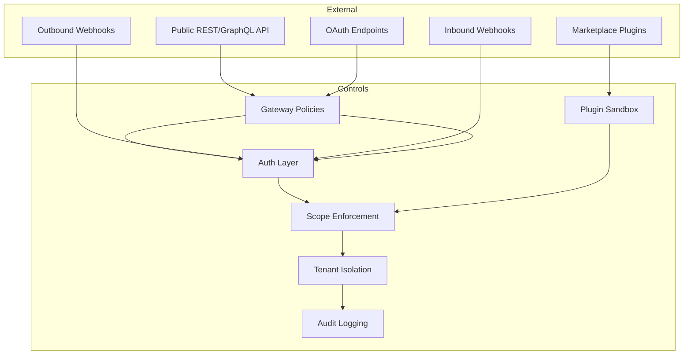
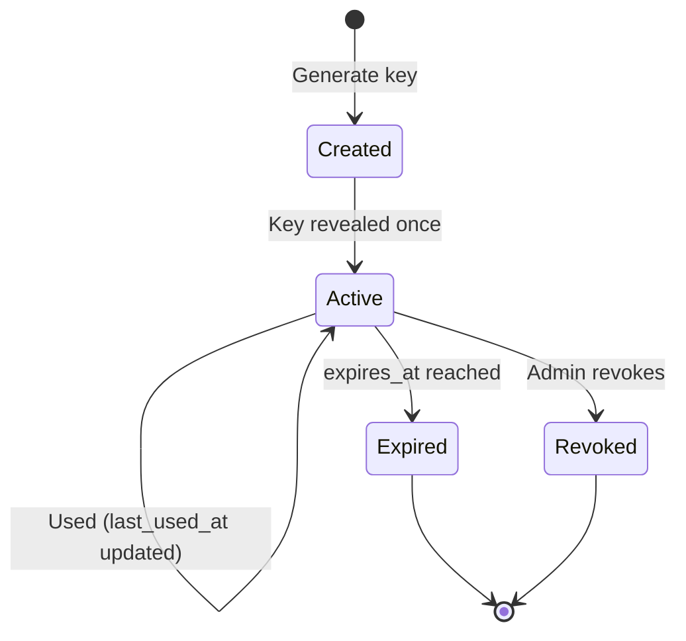

# 13 — Security Architecture

**Version 4.0** | Phase 10 | AI Lead Intelligence Platform

---

## Table of Contents

1. [Overview](#1-overview)
2. [Threat Model](#2-threat-model)
3. [Authentication Layers](#3-authentication-layers)
4. [Authorization Model](#4-authorization-model)
5. [API Key Security](#5-api-key-security)
6. [OAuth Security](#6-oauth-security)
7. [Webhook Security](#7-webhook-security)
8. [Plugin Sandbox Security](#8-plugin-sandbox-security)
9. [Gateway Security](#9-gateway-security)
10. [Compliance & Audit](#10-compliance--audit)

---

## 1. Overview

Phase 10 security extends the platform-wide model from Phase 8 (`docs/phase8/13-security-model.md`) and Phase 9 (`docs/phase9/13-security-architecture.md`) with integration-specific controls for public APIs, third-party applications, and plugin execution.

**Defense in depth:** Gateway → Auth → Scope → Tenant isolation → Audit

---

## 2. Threat Model

### STRIDE Analysis

| Threat | Vector | Mitigation |
|--------|--------|------------|
| **Spoofing** | Stolen API key / OAuth token | Key hashing, token expiry, rotation |
| **Tampering** | Modified webhook payloads | HMAC-SHA256 signatures |
| **Repudiation** | Denied API actions | Audit logs with request_id |
| **Information Disclosure** | Cross-tenant data access | organization_id enforcement |
| **Denial of Service** | API flooding | Gateway rate limits, quotas |
| **Elevation of Privilege** | Plugin permission escalation | Sandbox + manifest scope limits |

### Attack Surfaces



---

## 3. Authentication Layers

### Layer 1: Gateway (Kong)

| Control | Plugin |
|---------|--------|
| TLS termination | Traefik |
| Rate limiting | `rate-limiting` |
| Request size | `request-size-limiting` |
| IP restriction | `ip-restriction` (enterprise) |
| CORS | `cors` |

### Layer 2: Application (FastAPI)

```python
# backend/app/platform/auth/dependencies.py

async def resolve_auth(request: Request) -> AuthContext:
    header = request.headers.get("Authorization", "")

    if header.startswith("Bearer "):
        token = header[7:]
        if is_jwt(token):
            return await validate_jwt(token)
        return await validate_oauth_token(token)

    if header.startswith("ApiKey "):
        return await validate_api_key(header[7:])

    raise UnauthorizedError("Missing or invalid Authorization header")
```

### Layer 3: Per-Endpoint Scope Check

```python
def require_scopes(*scopes: str):
    async def checker(auth: AuthContext = Depends(resolve_auth)):
        missing = set(scopes) - set(auth.scopes)
        if missing:
            raise ScopeInsufficientError(missing)
        return auth
    return checker
```

---

## 4. Authorization Model

### Permission Hierarchy

```
platform:admin
├── platform:write
│   ├── webhooks:manage
│   ├── integration:write
│   └── platform:read
│       └── integration:read
```

### Scope-to-Endpoint Mapping

| Endpoint Pattern | Required Scope |
|------------------|----------------|
| `GET /api/v1/crm/*` | `crm:read` |
| `POST/PATCH /api/v1/crm/*` | `crm:write` |
| `GET /api/v1/crm/contacts/*` | `contacts:read` |
| `POST /api/v1/platform/webhooks` | `webhooks:manage` |
| `POST /api/v1/search` | `search:write` |
| `POST /api/v1/workflows/*/execute` | `workflows:execute` |
| `GET /api/v1/platform/usage` | `platform:read` |
| `POST /api/v1/platform/admin/*` | `platform:admin` |

### Tenant Isolation

Every query includes `organization_id` from auth context:

```python
async def get_contacts(auth: AuthContext, db: AsyncSession):
    return await db.execute(
        select(Contact).where(Contact.organization_id == auth.organization_id)
    )
```

---

## 5. API Key Security

### Key Lifecycle



### Storage (Existing Model)

```python
# backend/app/users/models.py — APIKey
key_hash: str      # bcrypt — never reversible
key_prefix: str    # "ali_live_" + 8 chars for identification
scopes: list       # JSONB scope array
expires_at: datetime | None
```

### Key Generation

```python
import secrets

def generate_api_key(env: str = "live") -> tuple[str, str, str]:
    raw = f"ali_{env}_{secrets.token_hex(16)}"
    prefix = raw[:16]
    key_hash = bcrypt.hashpw(raw.encode(), bcrypt.gensalt()).decode()
    return raw, prefix, key_hash  # raw shown once, never stored
```

### Key Security Rules

| Rule | Implementation |
|------|----------------|
| Show once | Full key returned only on `POST /users/me/api-keys` |
| Hash at rest | bcrypt with cost factor 12 |
| Prefix lookup | Index on `key_prefix` for fast candidate filtering |
| Scope minimum | Keys must have at least one scope |
| Expiry optional | Default: no expiry; recommend 90 days for CI keys |
| Revocation immediate | `is_active = false` checked on every request |
| Audit | Key creation, usage, revocation logged |

---

## 6. OAuth Security

| Control | Implementation |
|---------|----------------|
| PKCE | Required for public clients (S256) |
| Client secret | bcrypt hash; shown once on registration |
| Redirect URI | Exact match validation |
| Token storage | SHA-256 hash in `platform.oauth_tokens` |
| Access token | JWT RS256, 1-hour expiry |
| Refresh rotation | New refresh token on each use; old invalidated |
| Scope downgrading | Refresh cannot grant broader scopes |
| Token introspection | RFC 7662 for resource servers |

---

## 7. Webhook Security

### Outbound

| Control | Implementation |
|---------|----------------|
| HTTPS required | Production URL validation |
| HMAC-SHA256 | `X-Webhook-Signature` header |
| Timestamp | 5-minute tolerance window |
| Secret rotation | Generate new secret; grace period for old |
| SSRF prevention | Block private IP ranges (10.x, 172.16.x, 192.168.x, 127.x) |
| Timeout | 30-second HTTP timeout |

### Inbound

| Control | Implementation |
|---------|----------------|
| Secret validation | `X-Webhook-Secret` header |
| Rate limiting | 100 req/min per endpoint |
| Payload size | Max 1 MB |
| Schema validation | JSON Schema per inbound type |

### SSRF Protection

```python
BLOCKED_RANGES = [
    ipaddress.ip_network("10.0.0.0/8"),
    ipaddress.ip_network("172.16.0.0/12"),
    ipaddress.ip_network("192.168.0.0/16"),
    ipaddress.ip_network("127.0.0.0/8"),
    ipaddress.ip_network("169.254.0.0/16"),
]

async def validate_webhook_url(url: str) -> None:
    parsed = urlparse(url)
    if parsed.scheme not in ("https", "http"):
        raise ValidationError("URL must be HTTP(S)")
    resolved = await resolve_hostname(parsed.hostname)
    for ip in resolved:
        for blocked in BLOCKED_RANGES:
            if ipaddress.ip_address(ip) in blocked:
                raise ValidationError("URL resolves to private IP")
```

---

## 8. Plugin Sandbox Security

| Control | Wasm | Python Subprocess |
|---------|------|-------------------|
| Memory limit | 128 MB | 256 MB |
| CPU time | 30 s | 60 s |
| Network | Deny (allowlist) | Deny (allowlist) |
| File system | Read-only bundle | Temp dir only |
| Secrets | Platform injection | Platform injection |
| Code signing | Ed25519 required | Ed25519 required |

### Permission Enforcement

```python
async def invoke_hook(hook_name, plugin_id, payload, context):
    installation = await get_installation(plugin_id, context.organization_id)
    manifest = installation.manifest

    # Enforce manifest permissions ⊆ auth scopes
    for perm in manifest["permissions"]:
        if perm not in context.scopes:
            raise PluginPermissionError(f"Plugin requires {perm}")
```

---

## 9. Gateway Security

### Production Hardening

| Setting | Value |
|---------|-------|
| TLS version | 1.2+ |
| HSTS | `max-age=31536000; includeSubDomains` |
| Admin API | Internal network only |
| CORS origins | Explicit allowlist (not `*` in production) |
| Request body limit | 10 MB default, 50 MB uploads |

### Kong Production `kong.yml` Changes

```yaml
plugins:
  - name: cors
    config:
      origins:
        - "https://app.example.com"
        - "https://developers.example.com"
      credentials: true
  - name: rate-limiting
    config:
      minute: 300
      policy: redis
      redis_host: redis
      fault_tolerant: true
```

---

## 10. Compliance & Audit

### Audit Events

| Action | Logged Fields |
|--------|---------------|
| API key created/revoked | `user_id`, `key_prefix`, `scopes` |
| OAuth app registered | `client_id`, `scopes`, `grant_types` |
| Token issued | `client_id`, `scopes`, `grant_type` |
| Webhook created/deleted | `subscription_id`, `url`, `events` |
| Plugin installed/uninstalled | `plugin_id`, `version` |
| Rate limit exceeded | `organization_id`, `endpoint` |
| Admin quota change | `admin_id`, `old_tier`, `new_tier` |

### Audit Storage

Uses existing `audit.audit_logs` table with new `module = 'platform'` entries.

### Data Protection

| Data Type | Protection |
|-----------|------------|
| API keys | bcrypt hash only |
| OAuth secrets | bcrypt hash only |
| Webhook secrets | bcrypt hash only |
| Plugin secrets | AES-256-GCM encrypted in `platform.plugin_secrets` |
| PII in webhook payloads | No additional PII beyond event data |
| Usage logs | No request/response bodies logged |

### Compliance Readiness

| Standard | Phase 10 Coverage |
|----------|-------------------|
| SOC 2 Type II | Audit logs, access controls, encryption |
| GDPR | Data export, deletion via existing endpoints |
| OWASP API Top 10 | Auth, rate limiting, input validation, SSRF prevention |

---

## Related Documents

- [01-api-gateway-architecture.md](./01-api-gateway-architecture.md)
- [08-oauth-platform-design.md](./08-oauth-platform-design.md)
- [05-plugin-framework-architecture.md](./05-plugin-framework-architecture.md)
- [docs/phase8/13-security-model.md](../phase8/13-security-model.md)