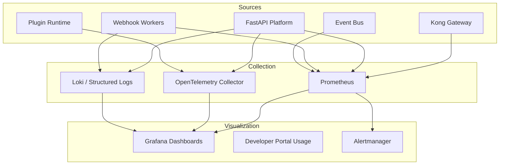
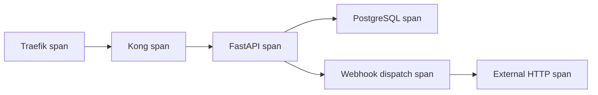

# 14 — Observability Strategy

**Version 4.0** | Phase 10 | AI Lead Intelligence Platform

---

## Table of Contents

1. [Overview](#1-overview)
2. [Observability Pillars](#2-observability-pillars)
3. [Metrics](#3-metrics)
4. [Logging](#4-logging)
5. [Tracing](#5-tracing)
6. [Gateway Observability](#6-gateway-observability)
7. [Dashboards](#7-dashboards)
8. [Alerting](#8-alerting)
9. [SLOs](#9-slos)
10. [Developer-Facing Analytics](#10-developer-facing-analytics)

---

## 1. Overview

Phase 10 observability extends the platform-wide strategy from Phase 8 (`docs/phase8/14-observability-strategy.md`) and Phase 11 (`docs/phase11/09-observability-architecture.md`) with integration-specific metrics for API gateway, webhooks, OAuth, and plugin execution.

**Stack:** Prometheus + Grafana + OpenTelemetry + structured logging (free/OSS)

---

## 2. Observability Pillars



---

## 3. Metrics

### API Gateway Metrics (Kong)

```
# Kong Prometheus plugin (:9542/metrics)
kong_http_requests_total{service, route, code}
kong_latency_ms{service, type="request|proxy|upstream"}
kong_bandwidth_bytes{service, type="ingress|egress"}
```

### Platform API Metrics

```python
# backend/infrastructure/observability/metrics.py

from prometheus_client import Counter, Histogram, Gauge

api_requests_total = Counter(
    "platform_api_requests_total",
    "Total API requests",
    ["method", "endpoint", "status_code", "auth_method", "organization_id"],
)

api_request_duration_seconds = Histogram(
    "platform_api_request_duration_seconds",
    "API request duration",
    ["method", "endpoint"],
    buckets=[0.01, 0.05, 0.1, 0.25, 0.5, 1.0, 2.5, 5.0, 10.0],
)

api_rate_limit_hits_total = Counter(
    "platform_rate_limit_hits_total",
    "Rate limit rejections",
    ["organization_id", "tier"],
)

webhook_deliveries_total = Counter(
    "webhook_deliveries_total",
    "Webhook delivery attempts",
    ["status", "event_type"],
)

webhook_delivery_duration_seconds = Histogram(
    "webhook_delivery_duration_seconds",
    "Webhook HTTP delivery time",
    ["event_type"],
    buckets=[0.1, 0.5, 1.0, 2.0, 5.0, 10.0, 30.0],
)

oauth_token_grants_total = Counter(
    "oauth_token_grants_total",
    "OAuth token grants",
    ["grant_type", "client_id"],
)

plugin_invocations_total = Counter(
    "plugin_invocations_total",
    "Plugin hook invocations",
    ["plugin_id", "hook_name", "status"],
)

graphql_query_complexity = Histogram(
    "graphql_query_complexity",
    "GraphQL query complexity scores",
    buckets=[100, 500, 1000, 2000, 5000, 10000],
)

event_routing_total = Counter(
    "platform_events_routed_total",
    "Events routed to delivery targets",
    ["event_type", "target_type"],
)
```

### Usage Aggregation

Daily rollups written to `platform.usage_aggregates` by Celery task:

```python
@shared_task(name="platform.aggregate_usage", queue="platform")
def aggregate_daily_usage(date: str):
    # Roll up api_usage_logs → usage_aggregates
    ...
```

---

## 4. Logging

### Structured Log Format

```json
{
  "timestamp": "2026-06-29T12:00:00.000Z",
  "level": "INFO",
  "service": "platform-api",
  "request_id": "019f0c1f-7a3b-7890-abcd-ef1234567890",
  "correlation_id": "019f0c1f-1111-2222-3333-444455556666",
  "organization_id": "019f0c1f-org-uuid",
  "user_id": "019f0c1f-user-uuid",
  "auth_method": "api_key",
  "method": "GET",
  "endpoint": "/api/v1/crm/contacts",
  "status_code": 200,
  "duration_ms": 45,
  "message": "Request completed"
}
```

### Log Levels by Component

| Component | INFO | WARN | ERROR |
|-----------|------|------|-------|
| API requests | All completed | 4xx responses | 5xx responses |
| Webhook delivery | Successful delivery | Retry scheduled | DLQ after exhaustion |
| OAuth | Token granted | Invalid grant attempt | Token validation failure |
| Plugin runtime | Hook completed | Slow execution (>10s) | Sandbox violation |
| Gateway | — | Rate limit hit | Upstream timeout |

### Sensitive Data Exclusion

Never log: API key values, OAuth secrets, webhook secrets, request/response bodies containing PII, plugin secret values.

---

## 5. Tracing

### OpenTelemetry Spans



### Key Span Attributes

| Attribute | Example |
|-----------|---------|
| `http.method` | `GET` |
| `http.route` | `/api/v1/crm/contacts` |
| `ali.organization_id` | `019f0c1f-...` |
| `ali.auth_method` | `api_key` |
| `ali.api_key_prefix` | `ali_live_a1b2` |
| `ali.webhook.event_type` | `contact.created` |
| `ali.plugin.id` | `conn:salesforce-v2` |

### Sampling

| Environment | Sample Rate |
|-------------|-------------|
| Local | 100% |
| Staging | 50% |
| Production | 10% (100% for errors) |

---

## 6. Gateway Observability

### Kong Access Log Format

```json
{
  "time": "2026-06-29T12:00:00Z",
  "client_ip": "203.0.113.42",
  "method": "GET",
  "uri": "/api/v1/crm/contacts",
  "status": 200,
  "upstream_status": 200,
  "upstream_latency_ms": 42,
  "kong_latency_ms": 3,
  "request_id": "019f0c1f-...",
  "user_agent": "ali-sdk/1.2.0 python/3.12"
}
```

### Traefik Access Log

Configured in `infra/gateway/traefik/traefik.yml`:

```yaml
accessLog:
  format: json
  fields:
    headers:
      names:
        X-Request-Id: keep
        Authorization: drop
```

---

## 7. Dashboards

### Grafana Dashboards

| Dashboard | Path | Audience |
|-----------|------|----------|
| Platform API Overview | `infra/monitoring/grafana/dashboards/platform-api.json` | SRE |
| Webhook Delivery | `infra/monitoring/grafana/dashboards/platform-webhooks.json` | SRE |
| Gateway Performance | `infra/monitoring/grafana/dashboards/gateway.json` | SRE |
| OAuth & Auth | `infra/monitoring/grafana/dashboards/platform-auth.json` | Security |
| Per-Tenant Usage | `infra/monitoring/grafana/dashboards/platform-tenants.json` | Admin |

### Key Panels (Platform API Overview)

| Panel | Query |
|-------|-------|
| Request Rate | `rate(platform_api_requests_total[5m])` |
| Error Rate | `rate(platform_api_requests_total{status_code=~"5.."}[5m])` |
| P99 Latency | `histogram_quantile(0.99, platform_api_request_duration_seconds)` |
| Top Endpoints | `topk(10, sum by (endpoint) (rate(...)))` |
| Rate Limit Hits | `rate(platform_rate_limit_hits_total[5m])` |
| Auth Method Split | `sum by (auth_method) (rate(...))` |

---

## 8. Alerting

### Alert Rules

| Alert | Condition | Severity | Channel |
|-------|-----------|----------|---------|
| API Error Rate High | 5xx > 1% for 5 min | Critical | PagerDuty |
| Gateway Latency High | p99 > 500 ms for 10 min | Warning | Slack |
| Webhook Delivery Failures | Failed > 5% for 15 min | Warning | Slack |
| Webhook DLQ Growing | DLQ > 500 entries | Warning | Slack |
| Rate Limit Spike | 429 rate > 100/min | Info | Slack |
| OAuth Token Errors | Error rate > 10% for 5 min | Warning | Slack |
| Plugin Sandbox Violation | Any violation | Critical | PagerDuty |
| Event Routing Lag | Queue depth > 5,000 | Warning | Slack |

### Alertmanager Configuration

```yaml
# infra/monitoring/alertmanager/rules/platform.yml
groups:
  - name: platform-api
    rules:
      - alert: PlatformAPIErrorRateHigh
        expr: |
          sum(rate(platform_api_requests_total{status_code=~"5.."}[5m]))
          / sum(rate(platform_api_requests_total[5m])) > 0.01
        for: 5m
        labels:
          severity: critical
        annotations:
          summary: "Platform API error rate above 1%"
```

---

## 9. SLOs

| SLO | Target | Window | Error Budget |
|-----|--------|--------|--------------|
| API availability | 99.95% | 30 days | 21.6 min downtime |
| API latency p99 | < 500 ms | 30 days | 1% of requests may exceed |
| Webhook delivery success | 99% | 7 days | 1% failure budget |
| Gateway overhead | < 15 ms p99 | 30 days | — |
| OAuth token endpoint | 99.9% | 30 days | 43.2 min downtime |

### SLO Dashboard

```
SLI: API Availability = successful_requests / total_requests
SLO: 99.95% over 30 days
Error Budget Remaining: 18.2 minutes (84% consumed)
```

---

## 10. Developer-Facing Analytics

Exposed via Developer Portal (`/developers/usage`) and API (`GET /api/v1/platform/usage`):

| Metric | Granularity | Retention |
|--------|-------------|-----------|
| Request count | Per hour / day | 90 days |
| Error rate | Per day | 90 days |
| Top endpoints | Per day | 30 days |
| Webhook deliveries | Per day | 90 days |
| Quota utilization | Real-time | Current period |

Raw `api_usage_logs` retained 90 days; aggregates retained 2 years.

---

## Related Documents

- [01-api-gateway-architecture.md](./01-api-gateway-architecture.md)
- [04-webhook-platform-design.md](./04-webhook-platform-design.md)
- [09-developer-portal-design.md](./09-developer-portal-design.md)
- [docs/phase11/09-observability-architecture.md](../phase11/09-observability-architecture.md)