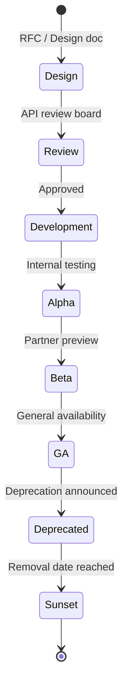
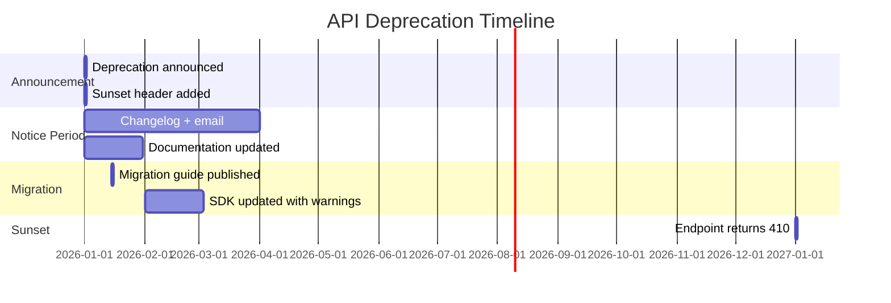

# 16 — API Governance Guide

**Version 4.0** | Phase 10 | AI Lead Intelligence Platform

---

## Table of Contents

1. [Overview](#1-overview)
2. [Governance Principles](#2-governance-principles)
3. [API Lifecycle](#3-api-lifecycle)
4. [Versioning Policy](#4-versioning-policy)
5. [Deprecation Process](#5-deprecation-process)
6. [Change Classification](#6-change-classification)
7. [Review Process](#7-review-process)
8. [OpenAPI Standards](#8-openapi-standards)
9. [Breaking Change Checklist](#9-breaking-change-checklist)
10. [Changelog Management](#10-changelog-management)

---

## 1. Overview

API governance ensures **stable contracts** — a core CTO mandate for Phase 10. This guide defines how APIs are designed, reviewed, versioned, deprecated, and retired across the integration platform.

**Applies to:** All public endpoints under `/api/v1/*`, GraphQL schema, webhook event payloads, and SDK interfaces.

---

## 2. Governance Principles

| Principle | Rule |
|-----------|------|
| **Stability first** | No breaking changes within a major version |
| **Explicit versioning** | URL path versioning (`/api/v1/`, `/api/v2/`) |
| **Deprecation window** | Minimum 12 months before removal |
| **Documentation-driven** | No endpoint ships without OpenAPI spec |
| **Consumer notification** | Changelog + email + `Sunset` header |
| **Backward compatibility** | Additive changes only within version |
| **Extension-first** | New integrations via plugins, not core API changes |

---

## 3. API Lifecycle



### Lifecycle Stages

| Stage | Access | Stability Guarantee |
|-------|--------|---------------------|
| **Design** | Internal docs only | None |
| **Alpha** | Feature flag, internal orgs | None — may change freely |
| **Beta** | Feature flag, partner orgs | Breaking changes with 2-week notice |
| **GA** | All orgs (flag enabled) | Full stability guarantee |
| **Deprecated** | All orgs | 12-month sunset window |
| **Sunset** | Removed | N/A |

---

## 4. Versioning Policy

### URL Path Versioning

```
/api/v1/crm/contacts     ← Current stable
/api/v2/crm/contacts     ← Future (when needed)
```

### What Constitutes a New Version

| Change | New Version Required? |
|--------|----------------------|
| Add optional response field | No |
| Add optional request parameter | No |
| Add new endpoint | No |
| Remove response field | **Yes** |
| Rename response field | **Yes** |
| Change field type | **Yes** |
| Change error response format | **Yes** |
| Change authentication method | **Yes** |
| Change pagination format | **Yes** |

### Version Support Matrix

| Version | Status | Support Until |
|---------|--------|---------------|
| v1 | GA | Indefinite (current) |
| v2 | — | Not yet planned |

---

## 5. Deprecation Process

### Timeline



### Deprecation Headers

```http
HTTP/1.1 200 OK
Sunset: Wed, 01 Jan 2027 00:00:00 GMT
Deprecation: true
Link: </api/v2/crm/contacts>; rel="successor-version"
X-Deprecation-Notice: This endpoint will be removed on 2027-01-01. Use /api/v2/crm/contacts instead.
```

### OpenAPI Deprecation Marker

```yaml
paths:
  /api/v1/crm/contacts/legacy:
    get:
      deprecated: true
      description: |
        **Deprecated.** Use `GET /api/v1/crm/contacts` instead.
        Sunset date: 2027-01-01.
```

---

## 6. Change Classification

### Non-Breaking (Patch/Minor)

| Change | Example | Approval |
|--------|---------|----------|
| Add optional field | `contact.linkedin_url` | Team lead |
| Add new endpoint | `GET /platform/events` | Team lead |
| Add new scope | `analytics:read` | Team lead |
| Add new event type | `deal.created` | Team lead |
| Performance improvement | Query optimization | Team lead |
| Documentation fix | Typo in description | Self-merge |

### Breaking (Major)

| Change | Example | Approval |
|--------|---------|----------|
| Remove field | Drop `contact.phone2` | API review board |
| Rename field | `email` → `email_address` | API review board |
| Change type | `score: string` → `score: float` | API review board |
| Change auth | API key format change | CTO + API review board |
| New major version | `/api/v2/` launch | CTO |

---

## 7. Review Process

### API Review Board

| Role | Responsibility |
|------|----------------|
| API Lead | Design review, consistency |
| Security | Auth, scope, data exposure |
| Platform Engineering | Performance, gateway impact |
| Developer Relations | DevEx, documentation |
| CTO | Breaking changes, new major versions |

### Review Checklist

- [ ] OpenAPI spec updated
- [ ] Response envelope follows `APIResponse[T]`
- [ ] Authentication and scopes documented
- [ ] Tenant isolation enforced (`organization_id`)
- [ ] Rate limit tier assigned
- [ ] Error codes defined
- [ ] Pagination follows `PaginatedResponse[T]`
- [ ] Idempotency support for write operations
- [ ] Changelog entry written
- [ ] SDK impact assessed
- [ ] Webhook event schema updated (if applicable)
- [ ] Tests written (unit + integration + contract)
- [ ] Performance benchmark run
- [ ] Security review completed

### RFC Template

```markdown
# RFC: [Title]

## Summary
One-paragraph description.

## Motivation
Why is this change needed?

## API Design
Endpoint, request/response schemas.

## Alternatives Considered
What else was evaluated?

## Breaking Changes
None / List of breaking changes.

## Migration Path
How do consumers adapt?

## Timeline
Alpha → Beta → GA dates.
```

---

## 8. OpenAPI Standards

### Required Tags

Every endpoint must have exactly one primary tag matching its router module.

### Response Envelope

All responses must use the standard envelope:

```yaml
components:
  schemas:
    APIResponseContact:
      type: object
      required: [success]
      properties:
        success:
          type: boolean
        data:
          $ref: '#/components/schemas/Contact'
        message:
          type: string
          nullable: true
```

### Naming Conventions

| Element | Convention | Example |
|---------|------------|---------|
| Endpoints | kebab-case paths | `/api/v1/platform/webhooks` |
| Query params | snake_case | `per_page`, `min_score` |
| JSON fields | snake_case | `first_name`, `lead_score` |
| Error codes | SCREAMING_SNAKE | `RATE_LIMIT_EXCEEDED` |
| Scopes | module:action | `crm:read`, `webhooks:manage` |

### Schema Registry

OpenAPI specs versioned in MinIO:

```
s3://ali-artifacts/openapi/
  v1/
    openapi.json
    openapi.yaml
    diff-from-previous.json
```

---

## 9. Breaking Change Checklist

Before any breaking change:

- [ ] RFC approved by API review board
- [ ] New version path created (`/api/v2/`)
- [ ] Migration guide published
- [ ] Sunset date set (minimum 12 months)
- [ ] `Sunset` and `Deprecation` headers implemented
- [ ] Changelog updated
- [ ] Email notification to affected developers
- [ ] SDK major version released with migration helpers
- [ ] Developer portal documentation updated
- [ ] Webhook event version incremented (if applicable)
- [ ] Contract tests updated
- [ ] Monitoring alerts for deprecated endpoint usage

---

## 10. Changelog Management

### Format

```markdown
# API Changelog

## [Unreleased]

### Added
- `GET /api/v1/platform/events` — Public event catalog (10.3)

### Changed
- `GET /api/v1/crm/contacts` — Added `updated_since` filter parameter

### Deprecated
- `GET /api/v1/crm/contacts/legacy` — Use `GET /api/v1/crm/contacts` (sunset: 2027-01-01)

### Removed
- None

### Security
- API key scope enforcement tightened for `platform:*` endpoints
```

### Notification Channels

| Channel | Audience | Timing |
|---------|----------|--------|
| Changelog (`docs/phase10/CHANGELOG.md`) | All | On release |
| Developer portal banner | Active developers | On deprecation |
| Email | API key holders, OAuth app owners | 90, 30, 7 days before sunset |
| `Sunset` HTTP header | API consumers | On deprecation |
| SDK release notes | SDK users | On SDK release |

---

## Related Documents

- [02-rest-api-specification.md](./02-rest-api-specification.md)
- [03-graphql-schema-design.md](./03-graphql-schema-design.md)
- [17-developer-experience-guide.md](./17-developer-experience-guide.md)