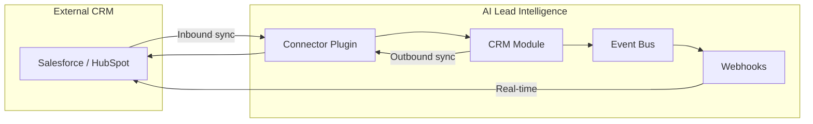
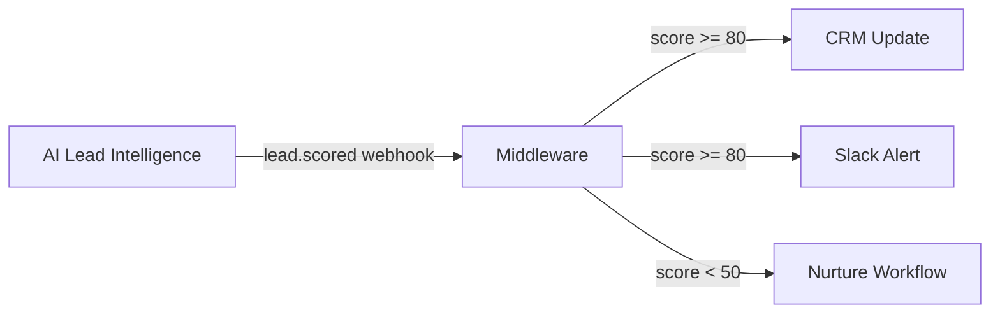
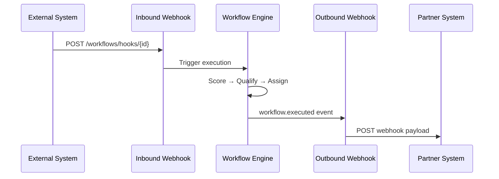
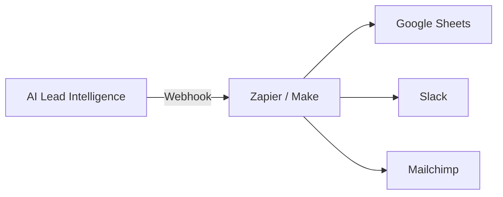
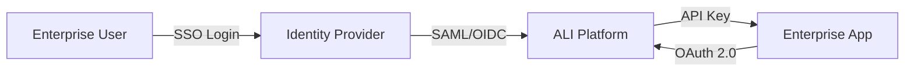

# 19 — Integration Playbook

**Version 4.0** | Phase 10 | AI Lead Intelligence Platform

---

## Table of Contents

1. [Overview](#1-overview)
2. [Integration Patterns](#2-integration-patterns)
3. [CRM Sync Integration](#3-crm-sync-integration)
4. [Lead Scoring Pipeline](#4-lead-scoring-pipeline)
5. [Workflow Automation](#5-workflow-automation)
6. [BI / Analytics Export](#6-bi--analytics-export)
7. [Zapier / Make Pattern](#7-zapier--make-pattern)
8. [Enterprise SSO + API](#8-enterprise-sso--api)
9. [Custom Connector Development](#9-custom-connector-development)
10. [Go-Live Checklist](#10-go-live-checklist)

---

## 1. Overview

This playbook provides **step-by-step recipes** for common integration scenarios. Each pattern includes architecture, implementation steps, and production considerations.

**Prerequisites:**
- Integration platform enabled (`integration_platform_v4`)
- Gateway running (`docker-compose.gateway.yml`)
- API key or OAuth app configured

---

## 2. Integration Patterns

| Pattern | Auth | Direction | Complexity |
|---------|------|-----------|------------|
| [CRM Sync](#3-crm-sync-integration) | API Key / Connector | Bi-directional | Medium |
| [Lead Scoring Pipeline](#4-lead-scoring-pipeline) | Webhooks + API Key | Outbound | Low |
| [Workflow Automation](#5-workflow-automation) | API Key | Bi-directional | Medium |
| [BI Export](#6-bi--analytics-export) | API Key / OAuth | Outbound | Low |
| [Zapier/Make](#7-zapier--make-pattern) | Webhooks | Outbound | Low |
| [Enterprise SSO](#8-enterprise-sso--api) | OAuth 2.0 | Inbound | High |
| [Custom Connector](#9-custom-connector-development) | Connector SDK | Bi-directional | High |

---

## 3. CRM Sync Integration

### Architecture



### Option A: Marketplace Connector (Recommended)

```powershell
# 1. Install from marketplace
curl -X POST http://localhost/api/v1/platform/plugins/install `
  -H "Authorization: Bearer $TOKEN" `
  -d '{
    "plugin_id": "marketplace:hubspot-sync-v2",
    "version": "2.1.0",
    "config": { "sync_direction": "bidirectional" }
  }'

# 2. Configure secrets (via portal UI or API)
# 3. Test connection
curl -X POST http://localhost/api/v1/platform/plugins/{id}/test `
  -H "Authorization: Bearer $TOKEN"

# 4. Trigger initial full sync
curl -X POST http://localhost/api/v1/platform/connectors/hubspot/sync `
  -H "Authorization: Bearer $TOKEN" `
  -d '{ "mode": "full" }'

# 5. Set up webhook for real-time outbound
curl -X POST http://localhost/api/v1/platform/webhooks `
  -H "Authorization: Bearer $TOKEN" `
  -d '{
    "url": "https://your-middleware.example.com/sync",
    "events": ["contact.created", "contact.updated", "lead.scored"]
  }'
```

### Option B: Custom API Sync

```python
from ali import Client

client = Client(api_key="ali_live_...")

# Inbound: Pull from external, push to ALI
external_contacts = external_crm.get_updated_since(last_sync)
for ext in external_contacts:
    client.crm.contacts.create(
        first_name=ext["first_name"],
        email=ext["email"],
        idempotency_key=f"sync-{ext['id']}",
    )

# Outbound: Webhook handler pushes to external
@webhook_handler("contact.created")
async def sync_to_external(event):
    contact = client.crm.contacts.get(event.data["contact_id"])
    external_crm.upsert_contact(contact)
```

### Sync Schedule

| Mode | Frequency | Use Case |
|------|-----------|----------|
| Real-time | Webhooks | Active sales teams |
| Incremental | Every 15 min | Standard sync |
| Full | Weekly | Data reconciliation |

---

## 4. Lead Scoring Pipeline

### Architecture



### Implementation

```python
from ali import Client
from ali.webhooks import verify_signature
from flask import Flask, request

app = Flask(__name__)
client = Client(api_key="ali_live_...")

@app.route("/hooks/ali", methods=["POST"])
def handle_scoring_event():
    body = request.get_data()
    if not verify_signature(body, request.headers["X-Webhook-Signature"],
                            request.headers["X-Webhook-Timestamp"], WEBHOOK_SECRET):
        return "", 401

    event = request.get_json()
    if event["type"] != "lead.scored":
        return "", 200

    data = event["data"]
    score = data["score"]

    if score >= 80:
        # Hot lead — update CRM and alert sales
        client.crm.contacts.update(data["entity_id"], tags=["hot-lead"])
        send_slack_alert(f"Hot lead! Score: {score}, ID: {data['entity_id']}")
    elif score < 50:
        # Cold lead — trigger nurture workflow
        client.workflows.execute(
            workflow_id=NURTURE_WORKFLOW_ID,
            entity_type=data["entity_type"],
            entity_id=data["entity_id"],
        )

    return "", 200
```

### Webhook Subscription

```python
client.platform.webhooks.create(
    url="https://middleware.example.com/hooks/ali",
    events=["lead.scored"],
)
```

---

## 5. Workflow Automation

### Trigger Workflow on External Event

```python
# External system POSTs to inbound webhook
# → Triggers ALI workflow

# 1. Create inbound webhook endpoint
# POST /api/v1/workflows/hooks (Phase 8)
hook = client.workflows.create_hook(
    workflow_id="019f0c1f-workflow-uuid",
    secret="whsec_custom_secret",
)

# 2. External system calls hook
# POST /api/v1/workflows/hooks/{hook_id}
# X-Webhook-Secret: whsec_custom_secret
# {"entity_type": "contact", "entity_id": "...", "payload": {"source": "webform"}}
```

### Execute Workflow via API

```python
execution = client.workflows.execute(
    workflow_id="019f0c1f-qualification-workflow",
    entity_type="contact",
    entity_id="019f0c1f-contact-uuid",
    async_mode=True,
)

result = client.workflows.executions.wait(execution.id, timeout=300)
print(f"Status: {result.status}, Steps: {len(result.steps)}")
```

### Workflow + Webhook Chain



---

## 6. BI / Analytics Export

### Pull Analytics Data

```python
from ali import Client

client = Client(api_key="ali_live_...", scopes=["analytics:read"])

# Dashboard KPIs
dashboard = client.analytics.dashboard()
print(f"Companies: {dashboard.total_companies}")
print(f"Avg lead score: {dashboard.avg_lead_score}")

# Lead velocity trend
velocity = client.analytics.lead_velocity(days=90)

# Export to your BI tool
import pandas as pd
df = pd.DataFrame(velocity.data)
df.to_csv("lead_velocity_export.csv", index=False)
```

### Scheduled Export via Workflow

Use a scheduled workflow (Phase 8 cron) to:
1. Fetch analytics data via API
2. Format as CSV/JSON
3. Upload to S3/Google Sheets via workflow action plugin

---

## 7. Zapier / Make Pattern

### Architecture

No custom code required — use webhooks as Zapier/Make triggers:



### Setup Steps

1. **Create webhook subscription** pointing to Zapier webhook URL:
   ```
   https://hooks.zapier.com/hooks/catch/123456/abcdef/
   ```

2. **Select events:** `contact.created`, `lead.scored`

3. **In Zapier:** Configure trigger → map fields → set action

4. **Test:** Use `ali webhooks test <id> --event contact.created`

### Supported Zapier Triggers

| ALI Event | Zapier Trigger Name |
|-----------|---------------------|
| `contact.created` | New Contact |
| `lead.scored` | Lead Scored |
| `workflow.executed` | Workflow Completed |
| `deal.updated` | Deal Updated (via `contact.updated`) |
| `search.completed` | Search Completed |

---

## 8. Enterprise SSO + API

### Architecture



### Setup

1. Configure SSO in ALI admin (existing auth module)
2. Register OAuth application for enterprise app
3. Use Authorization Code + PKCE flow
4. Request minimum scopes: `crm:read`, `contacts:read`

```python
flow = OAuthFlow(
    client_id="ali_app_enterprise_...",
    client_secret="ali_sec_...",
    redirect_uri="https://enterprise-app.example.com/callback",
    scopes=["crm:read", "contacts:read"],
)
```

### IP Allowlisting

```yaml
# Kong config for enterprise org
plugins:
  - name: ip-restriction
    config:
      allow: ["198.51.100.0/24"]
```

---

## 9. Custom Connector Development

### Steps

1. **Scaffold connector:**
   ```bash
   connector-cli init my-erp --type conn:my-erp
   ```

2. **Implement `BaseConnector`:**
   - `test_connection()`
   - `fetch_records()`
   - `push_record()`
   - `get_schema_map()`

3. **Test locally:**
   ```bash
   connector-cli test conn:my-erp --config config.json
   connector-cli sync conn:my-erp --dry-run --limit 10
   ```

4. **Package and publish:**
   ```bash
   connector-cli validate ./manifest.json
   connector-cli package ./ --output dist/my-erp-1.0.0.tar.gz
   connector-cli publish --marketplace
   ```

5. **Install in production org:**
   ```bash
   ali plugins install marketplace:my-erp --version 1.0.0
   ```

See [06-connector-sdk-specification.md](./06-connector-sdk-specification.md) for full SDK reference.

---

## 10. Go-Live Checklist

### Pre-Production

- [ ] API keys use `ali_live_` prefix (not `ali_test_`)
- [ ] Webhook URLs use HTTPS
- [ ] Webhook signature verification implemented
- [ ] Error handling and retry logic in place
- [ ] Rate limit handling implemented
- [ ] Idempotency keys used for write operations
- [ ] Logging and monitoring configured
- [ ] Scopes follow least-privilege principle
- [ ] Secrets stored in environment variables (not code)
- [ ] Gateway routing verified (not direct :8000)

### Production Validation

```powershell
# 1. Health check via gateway
curl https://api.example.com/api/v1/platform/health

# 2. Auth test
curl https://api.example.com/api/v1/crm/contacts `
  -H "Authorization: ApiKey ali_live_..."

# 3. Webhook test
ali webhooks test $WEBHOOK_ID --event contact.created

# 4. Rate limit check
curl -v https://api.example.com/api/v1/crm/contacts `
  -H "Authorization: ApiKey ali_live_..." 2>&1 | Select-String "X-RateLimit"

# 5. Usage tracking
curl https://api.example.com/api/v1/platform/usage?period=1d `
  -H "Authorization: Bearer $TOKEN"
```

### Post-Go-Live Monitoring

| Metric | Target | Alert |
|--------|--------|-------|
| API error rate | < 1% | > 5% |
| Webhook delivery rate | > 99% | < 95% |
| API latency p99 | < 500 ms | > 1 s |
| Rate limit hits | < 10/day | > 100/day |

---

## Related Documents

- [04-webhook-platform-design.md](./04-webhook-platform-design.md)
- [06-connector-sdk-specification.md](./06-connector-sdk-specification.md)
- [07-public-sdk-specifications.md](./07-public-sdk-specifications.md)
- [17-developer-experience-guide.md](./17-developer-experience-guide.md)