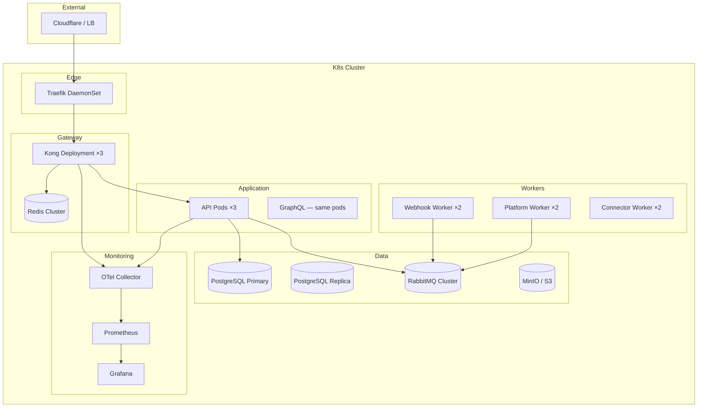

# 20 — Production Deployment Guide

**Version 4.0** | Phase 10 | AI Lead Intelligence Platform

---

## Table of Contents

1. [Overview](#1-overview)
2. [Prerequisites](#2-prerequisites)
3. [Infrastructure Requirements](#3-infrastructure-requirements)
4. [Gateway Deployment](#4-gateway-deployment)
5. [Platform Module Deployment](#5-platform-module-deployment)
6. [Database Setup](#6-database-setup)
7. [Worker Configuration](#7-worker-configuration)
8. [Monitoring Setup](#8-monitoring-setup)
9. [Post-Deployment Validation](#9-post-deployment-validation)
10. [Rollback Procedure](#10-rollback-procedure)
11. [Capacity Planning](#11-capacity-planning)

---

## 1. Overview

This guide covers production deployment of the Phase 10 Integration Platform. It extends Phase 9 (`docs/phase9/20-production-deployment-guide.md`) and Phase 11 operations documentation.

**Deployment model:** Kubernetes (primary) or Docker Compose (staging/small prod)

**Key addition:** Traefik + Kong gateway is **mandatory** for production — no direct API exposure.

---

## 2. Prerequisites

| Requirement | Version | Notes |
|-------------|---------|-------|
| PostgreSQL | 16+ | Primary + read replica |
| Redis | 7.x | Cluster mode for HA; Kong rate limiting |
| RabbitMQ | 3.13+ | Quorum queues; event bus + webhook dispatch |
| Kong | 3.8+ | API gateway |
| Traefik | 3.2+ | Edge router |
| MinIO | RELEASE.2024+ | Plugin artifacts, schema registry |
| Python | 3.12+ | API + workers |
| Node.js | 20 LTS | Developer portal + marketplace UI |

### Python Dependencies (v4 additions)

```
# backend/requirements-platform.txt
strawberry-graphql[fastapi]>=0.230.0
authlib>=1.3.0
httpx>=0.27.0
```

---

## 3. Infrastructure Requirements

### Production Topology



### Resource Sizing (Minimum Production)

| Component | CPU | Memory | Replicas |
|-----------|-----|--------|----------|
| Traefik | 0.5 | 256 MB | 2 |
| Kong | 1 | 512 MB | 3 |
| API | 2 | 2 GB | 3 |
| Webhook Worker | 1 | 1 GB | 2 |
| Platform Worker | 1 | 1 GB | 2 |
| Connector Worker | 1 | 1 GB | 2 |
| PostgreSQL | 4 | 8 GB | 1+1 replica |
| Redis | 1 | 2 GB | 3 (cluster) |
| RabbitMQ | 2 | 4 GB | 3 (cluster) |
| MinIO | 1 | 2 GB | 4 (distributed) |

---

## 4. Gateway Deployment

### Docker Compose (Staging)

```powershell
# Start full stack with gateway
docker compose `
  -f docker-compose.yml `
  -f docker-compose.gateway.yml `
  --profile gateway up -d

# Verify routing
curl http://localhost/api/v1/health
curl http://localhost/api/v1/platform/health
```

### Kubernetes (Production)

```yaml
# infra/k8s/gateway/kong-deployment.yaml
apiVersion: apps/v1
kind: Deployment
metadata:
  name: kong
  namespace: gateway
spec:
  replicas: 3
  selector:
    matchLabels:
      app: kong
  template:
    spec:
      containers:
        - name: kong
          image: kong:3.8
          env:
            - name: KONG_DATABASE
              value: "off"
            - name: KONG_DECLARATIVE_CONFIG
              value: /kong/kong.yml
            - name: KONG_PLUGINS
              value: "bundled,prometheus"
          ports:
            - containerPort: 8000
              name: proxy
            - containerPort: 9542
              name: metrics
          volumeMounts:
            - name: kong-config
              mountPath: /kong/kong.yml
              subPath: kong.yml
          resources:
            requests:
              cpu: "500m"
              memory: "512Mi"
            limits:
              cpu: "1000m"
              memory: "1Gi"
          livenessProbe:
            httpGet:
              path: /status
              port: 8000
            initialDelaySeconds: 30
          readinessProbe:
            httpGet:
              path: /status
              port: 8000
            initialDelaySeconds: 10
```

### Production Kong Config

```yaml
# infra/gateway/kong/kong-production.yml
_format_version: "3.0"

services:
  - name: ai-lead-api
    url: http://api.platform.svc.cluster.local:8000
    routes:
      - name: api-v1
        paths: [/api]
        strip_path: false
    plugins:
      - name: rate-limiting
        config:
          minute: 300
          policy: redis
          redis_host: redis.platform.svc.cluster.local
          fault_tolerant: true
      - name: cors
        config:
          origins:
            - "https://app.example.com"
            - "https://developers.example.com"
          credentials: true
      - name: prometheus
      - name: correlation-id
        config:
          header_name: X-Request-Id
          generator: uuid
      - name: request-size-limiting
        config:
          allowed_payload_size: 10
```

### TLS Configuration (Traefik)

```yaml
# infra/gateway/traefik/traefik-production.yml
entryPoints:
  web:
    address: ":80"
    http:
      redirections:
        entryPoint:
          to: websecure
          scheme: https
  websecure:
    address: ":443"
    http:
      tls:
        certResolver: letsencrypt

certificatesResolvers:
  letsencrypt:
    acme:
      email: ops@example.com
      storage: /acme/acme.json
      httpChallenge:
        entryPoint: web
```

---

## 5. Platform Module Deployment

### Environment Variables

```bash
# Platform-specific
INTEGRATION_PLATFORM_ENABLED=true
GRAPHQL_ENABLED=true
OAUTH_ENABLED=true
MARKETPLACE_ENABLED=true

# OAuth
OAUTH_JWT_PRIVATE_KEY_PATH=/secrets/oauth-private.pem
OAUTH_JWT_PUBLIC_KEY_PATH=/secrets/oauth-public.pem
OAUTH_ISSUER=https://api.example.com

# Plugin runtime
PLUGIN_SANDBOX=wasm
PLUGIN_ARTIFACT_BUCKET=ali-artifacts
MINIO_ENDPOINT=minio.platform.svc.cluster.local:9000

# Webhook
WEBHOOK_MAX_RETRIES=6
WEBHOOK_TIMEOUT_SECONDS=30
WEBHOOK_SSRF_CHECK=true

# Gateway
GATEWAY_VERSION=4.0
KONG_ADMIN_URL=http://kong.gateway.svc.cluster.local:8001
```

### API Pod Readiness

```python
# Health check includes platform subsystems
@router.get("/platform/health")
async def platform_health():
    checks = {
        "webhooks": await check_webhook_service(),
        "oauth": await check_oauth_service(),
        "plugins": await check_plugin_runtime(),
        "event_bus": await check_event_bus(),
        "gateway": await check_gateway_connectivity(),
    }
    status = "healthy" if all(c == "healthy" for c in checks.values()) else "degraded"
    return {"status": status, "subsystems": checks}
```

---

## 6. Database Setup

### Run Migration

```bash
alembic upgrade head  # Applies 016_phase10_integration_platform
```

### Verify Schema

```sql
-- Verify platform schema
SELECT table_name FROM information_schema.tables
WHERE table_schema = 'platform'
ORDER BY table_name;

-- Expected tables:
-- api_usage_logs, event_replay_jobs, event_schema_registry,
-- marketplace_listings, marketplace_publishers, marketplace_ratings,
-- marketplace_reviews, oauth_applications, oauth_authorization_codes,
-- oauth_tokens, plugin_installations, plugin_secrets,
-- usage_aggregates, usage_quotas, webhook_deliveries,
-- webhook_dlq, webhook_subscriptions
```

### Seed Production Data

```sql
-- Enable feature flag
UPDATE system.feature_flags
SET is_enabled = TRUE
WHERE key = 'integration_platform_v4';

-- Seed event schemas
-- (handled by migration 016_phase10)

-- Set production quotas for existing orgs
UPDATE platform.usage_quotas
SET tier = 'pro', requests_per_minute = 300
WHERE organization_id IN (
    SELECT id FROM core.organizations WHERE plan_tier = 'pro'
);
```

### Partition Management

```sql
-- Create monthly partitions for api_usage_logs (automate via cron)
CREATE TABLE platform.api_usage_logs_2026_07
    PARTITION OF platform.api_usage_logs
    FOR VALUES FROM ('2026-07-01') TO ('2026-08-01');
```

---

## 7. Worker Configuration

### Celery Queues

| Queue | Worker | Concurrency | Tasks |
|-------|--------|-------------|-------|
| `webhooks` | webhook-worker | 4 | `webhooks.send_delivery` |
| `platform` | platform-worker | 4 | `platform.route_event`, `platform.aggregate_usage` |
| `connectors` | connector-worker | 2 | `connectors.sync` |
| `default` | general-worker | 4 | Existing tasks |

### Worker Deployment

```yaml
# infra/k8s/workers/webhook-worker.yaml
apiVersion: apps/v1
kind: Deployment
metadata:
  name: webhook-worker
spec:
  replicas: 2
  template:
    spec:
      containers:
        - name: worker
          command: ["celery", "-A", "backend.workers.app", "worker",
                    "-Q", "webhooks", "-c", "4", "--loglevel=info"]
          resources:
            requests: { cpu: "500m", memory: "1Gi" }
            limits: { cpu: "1000m", memory: "2Gi" }
```

### RabbitMQ Queues

```python
# Declare platform queues on startup
PLATFORM_QUEUES = [
    {"name": "platform.events", "routing_key": "#"},
    {"name": "webhooks", "routing_key": "webhook.#"},
]
```

---

## 8. Monitoring Setup

### Prometheus Scrape Targets

```yaml
# infra/monitoring/prometheus/scrape-platform.yml
scrape_configs:
  - job_name: kong
    static_configs:
      - targets: ["kong.gateway.svc:9542"]

  - job_name: platform-api
    metrics_path: /metrics
    static_configs:
      - targets: ["api.platform.svc:8000"]
```

### Import Grafana Dashboards

```bash
# Platform dashboards
grafana-cli dashboards import infra/monitoring/grafana/dashboards/platform-api.json
grafana-cli dashboards import infra/monitoring/grafana/dashboards/platform-webhooks.json
grafana-cli dashboards import infra/monitoring/grafana/dashboards/gateway.json
grafana-cli dashboards import infra/monitoring/grafana/dashboards/platform-auth.json
```

### Alert Rules

Deploy `infra/monitoring/alertmanager/rules/platform.yml` (see [14-observability-strategy.md](./14-observability-strategy.md)).

---

## 9. Post-Deployment Validation

### Validation Script

```powershell
# scripts/validate-phase10.ps1

$BASE = "https://api.example.com"
$TOKEN = $env:ADMIN_TOKEN
$headers = @{ Authorization = "Bearer $TOKEN" }

Write-Host "=== Phase 10 Deployment Validation ==="

# 1. Gateway health
$r = Invoke-RestMethod "$BASE/api/v1/health"
Write-Host "[$(if($r){'PASS'}else{'FAIL'})] Gateway health"

# 2. Platform health
$r = Invoke-RestMethod "$BASE/api/v1/platform/health" -Headers $headers
$healthy = $r.data.status -eq "healthy"
Write-Host "[$($healthy ? 'PASS' : 'FAIL')] Platform health: $($r.data.status)"

# 3. Feature flag
$r = Invoke-RestMethod "$BASE/api/v1/platform/capabilities" -Headers $headers
$enabled = "integration_platform_v4" -in $r.data.feature_flags
Write-Host "[$($enabled ? 'PASS' : 'FAIL')] Feature flag enabled"

# 4. API key test
# (requires pre-created test key)
$r = Invoke-RestMethod "$BASE/api/v1/crm/contacts" -Headers @{Authorization="ApiKey $env:TEST_API_KEY"}
Write-Host "[$(if($r.success){'PASS'}else{'FAIL'})] API key auth"

# 5. Webhook test
# (requires pre-created test webhook)

# 6. OAuth discovery
$r = Invoke-RestMethod "$BASE/api/v1/.well-known/openid-configuration"
Write-Host "[$(if($r.issuer){'PASS'}else{'FAIL'})] OIDC discovery"

# 7. Database tables
# psql -c "SELECT count(*) FROM platform.webhook_subscriptions"

Write-Host "=== Validation Complete ==="
```

### Smoke Test Checklist

| # | Test | Expected |
|---|------|----------|
| 1 | `GET /api/v1/health` via gateway | 200 |
| 2 | `GET /api/v1/platform/health` | All subsystems healthy |
| 3 | API key authentication | 200 with data |
| 4 | OAuth discovery endpoint | Valid OIDC config |
| 5 | Create webhook subscription | 201 with secret |
| 6 | Webhook test delivery | 200 |
| 7 | Rate limit headers present | `X-RateLimit-*` headers |
| 8 | Usage tracking active | Entry in `api_usage_logs` |
| 9 | Grafana dashboards loading | All panels have data |
| 10 | Developer portal accessible | `/developers` loads |

---

## 10. Rollback Procedure

### Feature Flag Rollback (Instant)

```http
POST /api/v1/admin/feature-flags
{ "key": "integration_platform_v4", "is_enabled": false }
```

Disables all Phase 10 features without affecting existing v3 APIs.

### Gateway Rollback

```powershell
# Revert Kong config
git checkout HEAD~1 -- infra/gateway/kong/kong.yml
docker exec kong kong reload

# Or bypass gateway temporarily (emergency only)
# Update Traefik to route /api directly to API service
```

### Database Rollback

```bash
# Rollback migration (destructive — drops platform schema)
alembic downgrade 015_phase9
```

> **Warning:** Downgrade drops all `platform` schema tables including webhook subscriptions, OAuth apps, and usage logs. Export data first.

### Rollback Decision Matrix

| Severity | Action | Downtime |
|----------|--------|----------|
| Platform API errors | Disable feature flag | None |
| Gateway failure | Bypass gateway (emergency) | None |
| Webhook delivery failure | Pause webhook workers | Webhook delay |
| OAuth failure | Disable `oauth_enabled` flag | OAuth unavailable |
| Data corruption | DB rollback | Maintenance window |

---

## 11. Capacity Planning

### Request Volume Estimates

| Tier | Orgs | Req/day (avg) | Req/day (peak) |
|------|------|---------------|----------------|
| 100 orgs (Free) | 100 | 60K | 120K |
| 50 orgs (Pro) | 50 | 450K | 900K |
| 10 orgs (Enterprise) | 10 | 600K | 1.2M |
| **Total** | 160 | **1.1M** | **2.2M** |

### Scaling Triggers

| Metric | Scale Up When | Action |
|--------|---------------|--------|
| API latency p99 | > 500 ms sustained | Add API pods |
| Kong CPU | > 70% sustained | Add Kong replicas |
| Webhook queue depth | > 1,000 for 10 min | Add webhook workers |
| Redis memory | > 80% | Expand cluster |
| PostgreSQL connections | > 80% pool | Add read replica |
| API usage log partition size | > 10 GB/month | Add partition |

### Growth Projections

| Quarter | Est. API Req/day | Kong Replicas | API Pods | WH Workers |
|---------|------------------|---------------|----------|------------|
| Q3 2026 | 1.1M | 3 | 3 | 2 |
| Q4 2026 | 3M | 5 | 5 | 4 |
| Q1 2027 | 8M | 8 | 8 | 6 |
| Q2 2027 | 15M | 12 | 12 | 10 |

---

## Related Documents

- [01-api-gateway-architecture.md](./01-api-gateway-architecture.md)
- [12-api-database-schema.md](./12-api-database-schema.md)
- [14-observability-strategy.md](./14-observability-strategy.md)
- [18-platform-administration-guide.md](./18-platform-administration-guide.md)
- [docs/phase9/20-production-deployment-guide.md](../phase9/20-production-deployment-guide.md)
- [docs/phase11/README.md](../phase11/README.md)