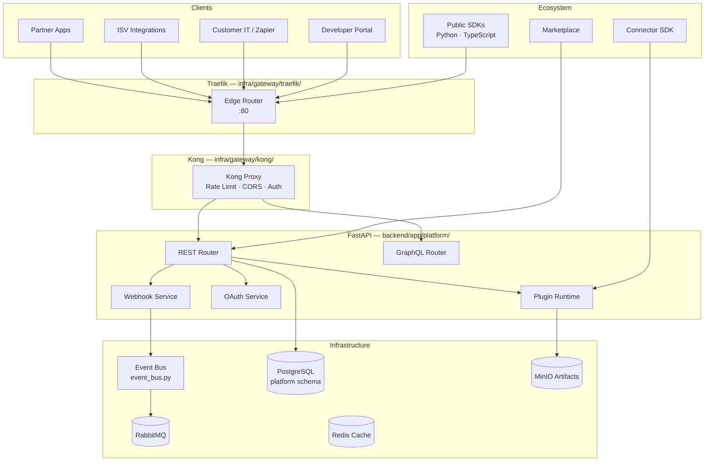

# Phase 10 — Enterprise Integration Platform, API Gateway & Developer Ecosystem

**Version 4.0** | AI Lead Intelligence Platform

Phase 10 transforms the platform from an internal product into an **extensible enterprise integration hub**. It unifies external access through a single API gateway entry point, establishes stable public contracts, and delivers a first-class developer ecosystem for partners, ISVs, and customer IT teams.

| Capability | Purpose |
|------------|---------|
| **API Gateway** | Traefik edge + Kong policy layer — single entry for all `/api` traffic |
| **Public REST API** | Versioned, OpenAPI 3.1 contracts at `/api/v1/*` with deprecation policy |
| **GraphQL** | Optional read-optimized query layer at `/api/v1/graphql` |
| **Webhooks** | Signed outbound event delivery with retry, replay, and subscription management |
| **OAuth 2.0** | Authorization Code + Client Credentials for third-party applications |
| **Plugin Framework** | Extension-first architecture for custom nodes, connectors, and middleware |
| **Developer Portal** | Self-service API keys, OAuth apps, docs, sandbox, and usage analytics |
| **Marketplace** | Curated catalog of connectors, plugins, and integration templates |
| **Event Platform** | Public event catalog, webhook subscriptions, and partner event streams |

See [01-api-gateway-architecture.md](./01-api-gateway-architecture.md) for the full platform model.

## CTO Design Mandates

| Mandate | Implementation |
|---------|----------------|
| **Single entry point** | All external API traffic flows through Traefik → Kong → FastAPI; no direct backend exposure |
| **Stable contracts** | Semantic versioning, 12-month deprecation window, OpenAPI + GraphQL schema registry |
| **Extension-first** | Plugins, connectors, and webhooks before core feature changes; marketplace distribution |
| **Excellent DevEx** | Interactive docs, typed SDKs (Python/TS), sandbox org, CLI, Postman collection, changelog |

## Design Principles

| Principle | Implementation |
|-----------|----------------|
| **Gateway-first** | Kong plugins: rate-limit, CORS, JWT/API-key validation, request-transform, logging |
| **Multi-tenant** | Row-level `organization_id` on all `platform` schema tables |
| **API-first** | REST at `/api/v1/platform/*` + public resource APIs with OpenAPI 3.1 |
| **Event-driven** | Domain events via `backend/infrastructure/messaging/event_bus.py` + RabbitMQ |
| **Auth layered** | JWT (users), API keys (`auth.api_keys`), OAuth 2.0 (third-party apps) |
| **Safe by default** | Scope-based access, webhook signing, plugin sandbox, audit trails |
| **Observable** | Per-tenant API usage, gateway metrics, webhook delivery SLOs |

## Quick Start (Windows / PowerShell)

```powershell
# Start platform stack with gateway overlay
cd C:\path\to\AI-Lead-intelligence-
.\scripts\start-free-stack.ps1
docker compose -f docker-compose.yml -f docker-compose.gateway.yml --profile gateway up -d

# Enable integration platform feature flag
# POST /api/v1/admin/feature-flags  { "key": "integration_platform_v4", "is_enabled": true }

# Access API through gateway (Traefik → Kong → API)
curl http://localhost/api/v1/health

# Create API key (existing auth model)
curl -X POST http://localhost/api/v1/users/me/api-keys `
  -H "Authorization: Bearer $TOKEN" `
  -d '{ "name": "dev-key", "scopes": ["crm:read", "contacts:read"] }'

# List webhook subscriptions (v4)
curl http://localhost/api/v1/platform/webhooks `
  -H "Authorization: Bearer $TOKEN"

# Developer portal (v4)
# http://localhost:3000/developers
```

### Service URLs (Integration-Related)

| Service | URL | Role |
|---------|-----|------|
| API Gateway (Traefik) | http://localhost/api | Single public entry |
| Kong Admin | http://localhost:8080 / http://localhost/kong | Route & plugin management |
| Platform API | http://localhost/api/v1/platform | Webhooks, OAuth, apps, usage |
| GraphQL | http://localhost/api/v1/graphql | Read-optimized queries |
| Developer Portal | http://localhost:3000/developers | Keys, docs, sandbox |
| Marketplace | http://localhost:3000/marketplace | Connectors & plugins |
| RabbitMQ Management | http://localhost:15672 | Event bus inspection |
| MinIO Console | http://localhost:9001 | Plugin artifacts, exports |

## Architecture Overview



## Documentation Index

| # | Topic | Document |
|---|-------|----------|
| 1 | API Gateway Architecture | [01-api-gateway-architecture.md](./01-api-gateway-architecture.md) |
| 2 | REST API Specification | [02-rest-api-specification.md](./02-rest-api-specification.md) |
| 3 | GraphQL Schema Design | [03-graphql-schema-design.md](./03-graphql-schema-design.md) |
| 4 | Webhook Platform Design | [04-webhook-platform-design.md](./04-webhook-platform-design.md) |
| 5 | Plugin Framework Architecture | [05-plugin-framework-architecture.md](./05-plugin-framework-architecture.md) |
| 6 | Connector SDK Specification | [06-connector-sdk-specification.md](./06-connector-sdk-specification.md) |
| 7 | Public SDK Specifications | [07-public-sdk-specifications.md](./07-public-sdk-specifications.md) |
| 8 | OAuth Platform Design | [08-oauth-platform-design.md](./08-oauth-platform-design.md) |
| 9 | Developer Portal Design | [09-developer-portal-design.md](./09-developer-portal-design.md) |
| 10 | Marketplace Architecture | [10-marketplace-architecture.md](./10-marketplace-architecture.md) |
| 11 | Event Platform Design | [11-event-platform-design.md](./11-event-platform-design.md) |
| 12 | API Database Schema | [12-api-database-schema.md](./12-api-database-schema.md) |
| 13 | Security Architecture | [13-security-architecture.md](./13-security-architecture.md) |
| 14 | Observability Strategy | [14-observability-strategy.md](./14-observability-strategy.md) |
| 15 | Testing Strategy | [15-testing-strategy.md](./15-testing-strategy.md) |
| 16 | API Governance Guide | [16-api-governance-guide.md](./16-api-governance-guide.md) |
| 17 | Developer Experience Guide | [17-developer-experience-guide.md](./17-developer-experience-guide.md) |
| 18 | Platform Administration Guide | [18-platform-administration-guide.md](./18-platform-administration-guide.md) |
| 19 | Integration Playbook | [19-integration-playbook.md](./19-integration-playbook.md) |
| 20 | Production Deployment Guide | [20-production-deployment-guide.md](./20-production-deployment-guide.md) |

## Key Repository Paths

| Component | Path |
|-----------|------|
| Platform module (v4) | `backend/app/platform/` |
| Platform router | `backend/app/platform/router.py` |
| Webhook service | `backend/app/platform/webhooks/service.py` |
| OAuth service | `backend/app/platform/oauth/service.py` |
| Plugin runtime | `backend/app/platform/plugins/runtime.py` |
| GraphQL schema | `backend/app/platform/graphql/schema.py` |
| API keys (existing) | `backend/app/users/models.py` → `APIKey` |
| Event bus | `backend/infrastructure/messaging/event_bus.py` |
| Traefik config | `infra/gateway/traefik/traefik.yml`, `dynamic.yml` |
| Kong config | `infra/gateway/kong/kong.yml` |
| Gateway compose overlay | `docker-compose.gateway.yml` |
| DB schema constant | `backend/app/common/db_schemas.py` → `DBSchema.PLATFORM` |
| Permissions | `backend/app/core/permissions.py` → `platform:*`, `integration:*` |
| Public Python SDK | `backend/sdk/ali/` |
| Public TypeScript SDK | `frontend/packages/@ali/sdk/` |
| Connector SDK | `backend/sdk/connectors/` |
| Developer portal UI | `frontend/src/features/developers/` |
| Marketplace UI | `frontend/src/features/marketplace/` |
| Migrations | `backend/migrations/versions/016_phase10_integration_platform.py` |
| Prometheus metrics | `backend/infrastructure/observability/metrics.py` |
| Grafana dashboards | `infra/monitoring/grafana/dashboards/platform-api.json` |

## Relationship to Prior Phases

| Phase | Focus | Phase 10 Extends |
|-------|-------|------------------|
| Phase 3 | Backend architecture, API keys, auth | Public API contracts, gateway hardening |
| Phase 5 | Discovery, connectors, workers | Connector SDK, marketplace distribution |
| Phase 8 | Workflow platform, event bus | Webhook triggers, plugin workflow nodes |
| Phase 9 | Analytics platform | Usage analytics, developer dashboards |
| Phase 11 | Operations, K8s, monitoring | Gateway deployment, API SLOs |

## Prerequisites

- [Docker Desktop](https://www.docker.com/products/docker-desktop/) with PostgreSQL 16+, Redis, RabbitMQ, MinIO
- [Node.js 20 LTS](https://nodejs.org/) for developer portal and marketplace UI
- [Python 3.12+](https://www.python.org/) with `strawberry-graphql`, `authlib` for OAuth
- Kong 3.8+ and Traefik 3.2+ (via `docker-compose.gateway.yml`)
- Admin role for `platform:admin`; Developer role for `platform:write`

## Implementation Phases

| Sprint | Deliverable | Docs |
|--------|-------------|------|
| 10.1 | Gateway hardening + platform schema | 01, 12, 20 |
| 10.2 | Public REST contracts + API governance | 02, 16 |
| 10.3 | Webhook platform + event catalog | 04, 11 |
| 10.4 | OAuth 2.0 + API key scope expansion | 08, 13 |
| 10.5 | GraphQL read layer | 03 |
| 10.6 | Plugin framework + connector SDK | 05, 06 |
| 10.7 | Public SDKs + developer portal | 07, 09, 17 |
| 10.8 | Marketplace + integration playbook | 10, 19 |
| 10.9 | Observability + testing + admin guides | 14, 15, 18 |