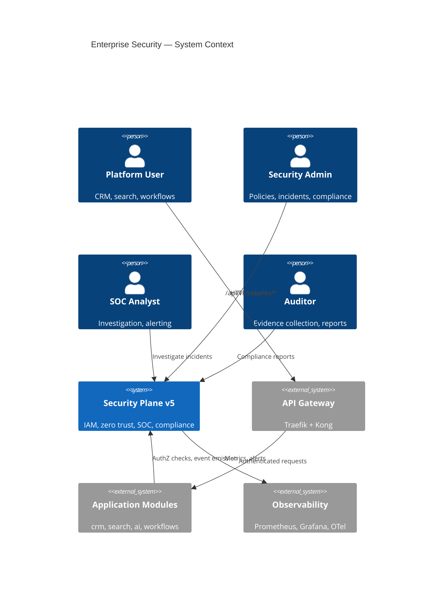
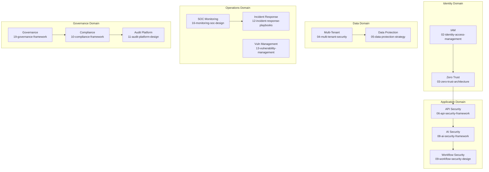
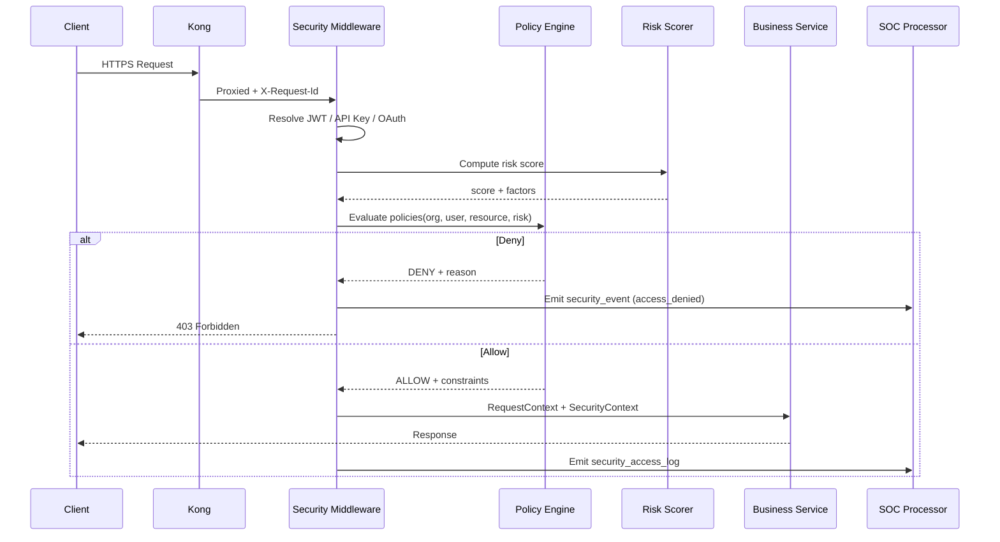
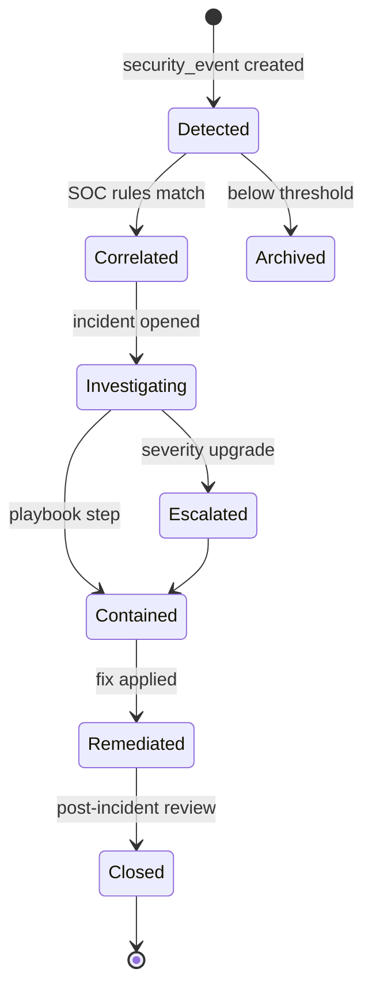

# 01 — Enterprise Security Architecture

**Version 5.0** | Phase 12 | AI Lead Intelligence Platform

---

## Table of Contents

1. [Executive Summary](#1-executive-summary)
2. [System Context](#2-system-context)
3. [Security Domains](#3-security-domains)
4. [Defense-in-Depth Model](#4-defense-in-depth-model)
5. [Security Control Plane](#5-security-control-plane)
6. [Integration with Existing Modules](#6-integration-with-existing-modules)
7. [Threat Landscape](#7-threat-landscape)
8. [Security Event Lifecycle](#8-security-event-lifecycle)
9. [Non-Functional Requirements](#9-non-functional-requirements)
10. [Cross-References](#10-cross-references)

---

## 1. Executive Summary

Phase 12 introduces a **unified enterprise security architecture** that sits alongside the existing application modules. Rather than scattering security logic across `auth/`, `admin/`, and `platform/`, Phase 12 centralizes security operations in `backend/app/security/` with a dedicated PostgreSQL `security` schema (migration `018`).

The architecture delivers:

- **Identity governance** — MFA, device trust, session policies (extends `backend/app/auth/`)
- **Zero trust enforcement** — Continuous risk scoring via `risk_scores` table
- **Policy-driven access** — `policy_definitions` + `policy_assignments` evaluated at request time
- **Compliance automation** — Mapped controls for GDPR, SOC 2, ISO 27001, NIST CSF
- **Security operations** — SOC event pipeline from `security_events` → `security_incidents` → `security_alerts`

All external traffic continues through **Traefik → Kong → FastAPI** as established in Phase 10 ([01-api-gateway-architecture.md](../phase10/01-api-gateway-architecture.md)).

---

## 2. System Context



### Stakeholders

| Stakeholder | Primary Concern |
|-------------|-----------------|
| CISO / Security Lead | Risk posture, compliance readiness, incident SLA |
| Platform Engineering | Minimal latency overhead, clear integration contracts |
| Customer IT | SSO readiness, audit exports, data residency |
| Developers | Predictable security APIs, sandbox-friendly dev mode |
| SOC Analysts | Correlated events, actionable alerts, playbooks |

---

## 3. Security Domains



| Domain | Owner Module | Primary Tables |
|--------|--------------|----------------|
| Identity | `security/iam/` | `mfa_devices`, `trusted_devices`, `authentication_logs` |
| Access Control | `security/policy/` | `policy_definitions`, `policy_assignments`, `authorization_logs` |
| Risk & Trust | `security/zero_trust/` | `risk_scores`, `security_access_logs` |
| Operations | `security/soc/` | `security_events`, `security_incidents`, `security_alerts` |
| Compliance | `security/compliance/` | `compliance_checks`, `consent_records`, `privacy_requests` |
| Secrets | `security/secrets/` | `secrets_metadata` (values in external vault) |

---

## 4. Defense-in-Depth Model

```
┌─────────────────────────────────────────────────────────────────┐
│ Layer 1: Perimeter        Cloudflare / Traefik TLS, DDoS        │
├─────────────────────────────────────────────────────────────────┤
│ Layer 2: Gateway          Kong plugins — auth, rate, IP, size   │
├─────────────────────────────────────────────────────────────────┤
│ Layer 3: Transport        mTLS (service mesh), TLS 1.3 minimum  │
├─────────────────────────────────────────────────────────────────┤
│ Layer 4: Application      JWT validation, RBAC, ABAC, MFA       │
├─────────────────────────────────────────────────────────────────┤
│ Layer 5: Zero Trust       Risk score evaluation per request     │
├─────────────────────────────────────────────────────────────────┤
│ Layer 6: Data             Encryption at rest, field-level tokens  │
├─────────────────────────────────────────────────────────────────┤
│ Layer 7: AI               Prompt guard, output filter, PII scan   │
├─────────────────────────────────────────────────────────────────┤
│ Layer 8: Audit & SOC      Immutable logs, correlation, alerting   │
└─────────────────────────────────────────────────────────────────┘
```

### Layer Responsibilities

| Layer | Component | Phase 12 Addition |
|-------|-----------|-------------------|
| Perimeter | Traefik `infra/gateway/traefik/` | Security headers middleware, HSTS |
| Gateway | Kong `infra/gateway/kong/kong.yml` | `bot-detection`, `ip-restriction`, `request-validator` |
| Application | FastAPI middleware | `SecurityContextMiddleware`, risk gate |
| Data | PostgreSQL | `security` schema, column encryption helpers |
| AI | `backend/app/ai/` | Input/output sanitization pipeline |
| Audit | Dual-write | `audit.audit_logs` + `security.security_events` |

---

## 5. Security Control Plane

The **security control plane** is the set of services that govern access decisions independently of business logic.



### Control Plane Services

| Service | Path | Responsibility |
|---------|------|----------------|
| `IAMService` | `security/iam/service.py` | MFA enrollment, device trust, session revocation |
| `PolicyEngine` | `security/policy/engine.py` | Evaluate `policy_definitions` against context |
| `RiskScorer` | `security/zero_trust/risk_scorer.py` | Compute and persist `risk_scores` |
| `ComplianceService` | `security/compliance/service.py` | Run `compliance_checks`, generate evidence |
| `SOCProcessor` | `security/soc/processor.py` | Ingest events, correlate, create incidents |
| `SecretsService` | `security/secrets/service.py` | Track `secrets_metadata`; integrate vault |

### Feature Flag

All Phase 12 endpoints are gated by `enterprise_security_v5` in `system.feature_flags`. When disabled, the platform falls back to Phase 10 security behavior ([13-security-architecture.md](../phase10/13-security-architecture.md)).

---

## 6. Integration with Existing Modules

### Auth Module (`backend/app/auth/`)

| Existing | Phase 12 Extension |
|----------|-------------------|
| JWT access + refresh tokens | Step-up auth for high-risk actions |
| bcrypt password hashing | Password policy enforcement via policies |
| `RefreshToken` model | Session binding to `trusted_devices` |
| Login flow | Writes to `authentication_logs` on every attempt |

### Admin Audit (`backend/app/admin/models.py`)

`AuditLog` remains the **business audit trail**. Phase 12 dual-writes security-relevant actions:

```python
# backend/app/security/audit/bridge.py

async def record_security_audit(
    ctx: RequestContext,
    action: str,
    entity: str,
    entity_id: uuid.UUID | None = None,
    metadata: dict | None = None,
) -> None:
    """Dual-write to audit.audit_logs and security.security_events."""
    await admin_service.create_audit_log(ctx, entity, action, ...)
    await soc_processor.emit_event(
        event_type=f"audit.{action}",
        organization_id=ctx.organization_id,
        actor_id=ctx.user_id,
        metadata=metadata,
    )
```

### Platform Module (`backend/app/platform/`)

OAuth tokens and API keys inherit organization policies. Gateway plugins validate credentials before requests reach the security middleware.

### Permissions (`backend/app/core/permissions.py`)

New security permissions added to `ROLE_PERMISSIONS`:

```python
SECURITY_PERMISSIONS = frozenset({
    "security:read",           # View events, policies (own org)
    "security:write",          # Manage MFA, trusted devices
    "security:investigate",    # View incidents, run queries
    "security:admin",          # Policy CRUD, org-wide settings
    "security:compliance",     # Run checks, export evidence
})
```

---

## 7. Threat Landscape

### STRIDE Analysis (Platform-Wide)

| Threat | Vector | Phase 12 Mitigation |
|--------|--------|---------------------|
| **Spoofing** | Stolen credentials, session hijack | MFA, device trust, short-lived tokens |
| **Tampering** | API payload modification | HMAC webhooks, request signing, audit hashes |
| **Repudiation** | Denied admin actions | Immutable `security_events`, dual audit |
| **Information Disclosure** | Cross-tenant access, AI prompt leak | Tenant isolation, PII redaction, DLP |
| **Denial of Service** | API flooding, workflow abuse | Kong rate limits, workflow quotas |
| **Elevation of Privilege** | RBAC bypass, policy gap | Policy engine, ABAC, least privilege |

### AI-Specific Threats

| Threat | Mitigation Doc |
|--------|----------------|
| Prompt injection | [08-ai-security-framework.md](./08-ai-security-framework.md) |
| Training data exfiltration | Data classification + output filtering |
| Model output poisoning | Validation gates before CRM persistence |
| PII in LLM context | Tokenization + consent checks |

---

## 8. Security Event Lifecycle



### Event Severity Mapping

| Severity | Examples | Auto-Incident |
|----------|----------|---------------|
| `info` | Successful login, policy evaluation | No |
| `low` | Failed login (1-3 attempts) | No |
| `medium` | Privilege escalation attempt, MFA bypass | Configurable |
| `high` | Cross-tenant access attempt, secret exposure | Yes |
| `critical` | Active breach indicators, mass data export | Yes + page |

Events are published to RabbitMQ topic `security.events` via `event_bus.py` for async SOC processing.

---

## 9. Non-Functional Requirements

| Requirement | Target | Measurement |
|-------------|--------|-------------|
| Policy evaluation latency | p99 < 15ms | `security_policy_eval_duration_seconds` |
| Risk score computation | p99 < 25ms | `security_risk_score_duration_seconds` |
| Security event ingestion | 10,000 events/min | Load test SOC processor |
| Audit log durability | Zero loss on commit | Sync write + async replication |
| MFA enrollment UX | < 60 seconds | User testing |
| Compliance check runtime | Full org scan < 5 min | `compliance_check_duration_seconds` |
| Incident MTTD | < 15 minutes (critical) | SOC dashboard SLA |
| Gateway auth overhead | < 5ms added latency | Kong plugin benchmarks |

---

## 10. Cross-References

| Topic | Document |
|-------|----------|
| IAM design | [02-identity-access-management-design.md](./02-identity-access-management-design.md) |
| Zero trust | [03-zero-trust-architecture.md](./03-zero-trust-architecture.md) |
| Multi-tenant isolation | [04-multi-tenant-security-design.md](./04-multi-tenant-security-design.md) |
| API security | [06-api-security-framework.md](./06-api-security-framework.md) |
| Database schema | [14-security-database-schema.md](./14-security-database-schema.md) |
| API routes | [15-api-specifications.md](./15-api-specifications.md) |
| Phase 10 gateway | [../phase10/01-api-gateway-architecture.md](../phase10/01-api-gateway-architecture.md) |
| Phase 10 security | [../phase10/13-security-architecture.md](../phase10/13-security-architecture.md) |
| Phase 11 ops security | [../phase11/08-security-architecture.md](../phase11/08-security-architecture.md) |
| Production handbook | [20-production-security-handbook.md](./20-production-security-handbook.md) |