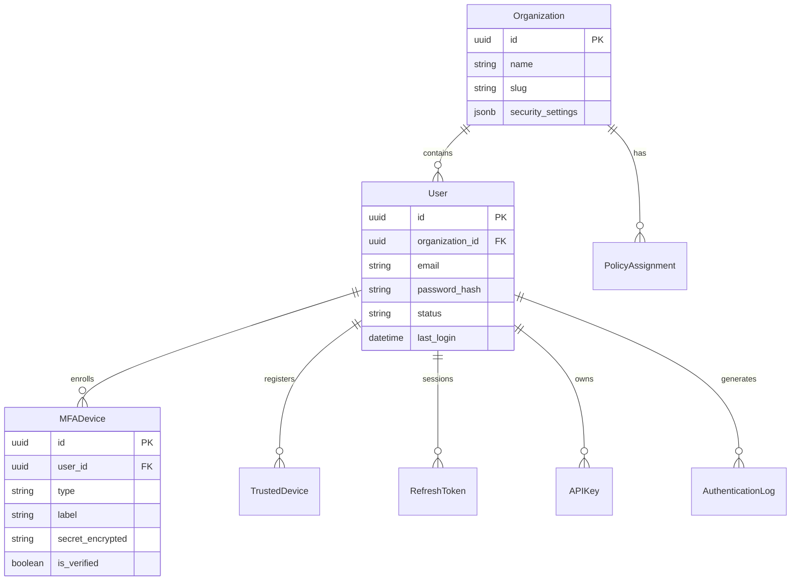
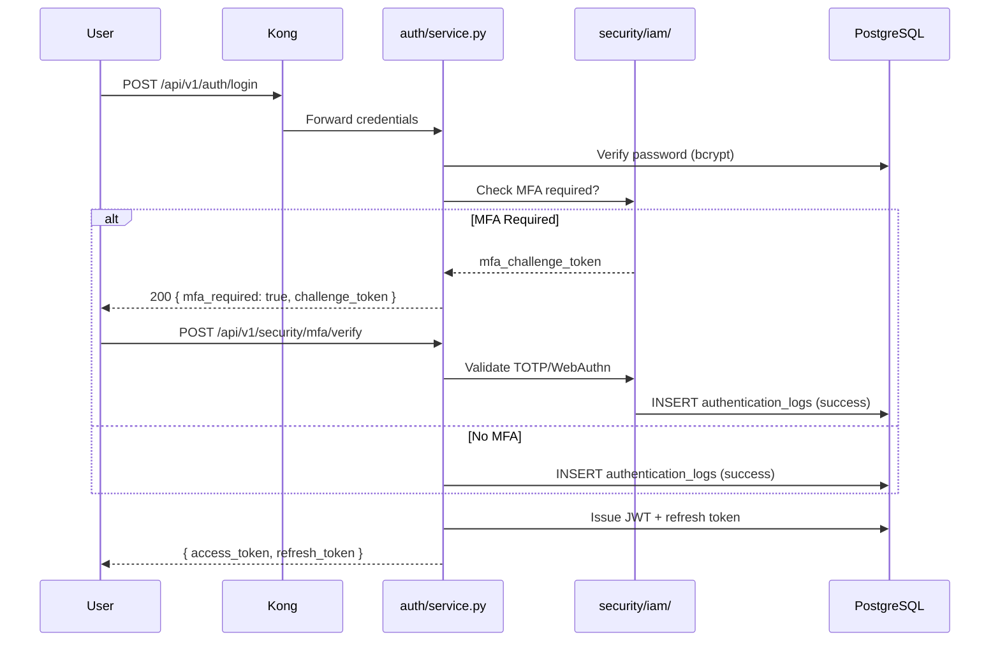
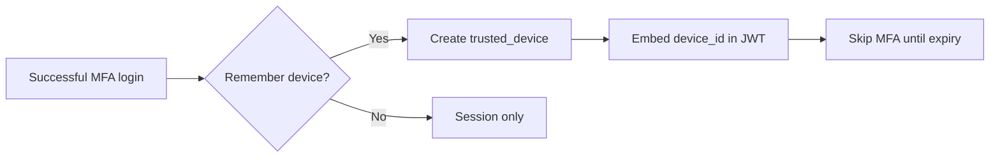

# 02 — Identity & Access Management Design

**Version 5.0** | Phase 12 | AI Lead Intelligence Platform

---

## Table of Contents

1. [Overview](#1-overview)
2. [Identity Model](#2-identity-model)
3. [Authentication Architecture](#3-authentication-architecture)
4. [RBAC & ABAC](#4-rbac--abac)
5. [Multi-Factor Authentication](#5-multi-factor-authentication)
6. [Device Trust](#6-device-trust)
7. [Session Management](#7-session-management)
8. [Service Accounts & API Keys](#8-service-accounts--api-keys)
9. [Authentication Logging](#9-authentication-logging)
10. [Implementation Guide](#10-implementation-guide)

---

## 1. Overview

Phase 12 extends the existing identity foundation in `backend/app/auth/` and `backend/app/users/` with enterprise IAM capabilities: MFA, trusted device registry, step-up authentication, and comprehensive `authentication_logs`.

IAM integrates with the RBAC model in `backend/app/core/permissions.py` and adds security-specific permissions (`security:*`).

**Principle:** Authenticate strongly, authorize minimally, audit completely.

---

## 2. Identity Model



### Identity Types

| Type | Source | Auth Method |
|------|--------|-------------|
| Human user | `auth.users` | Email/password + MFA |
| Service account | `auth.users` (`is_service_account=true`) | API key only |
| OAuth application | `platform.oauth_applications` | Client credentials |
| Partner integration | `auth.api_keys` | Scoped API key |

---

## 3. Authentication Architecture

### Authentication Flow



### Token Strategy

| Token | Lifetime | Storage | Rotation |
|-------|----------|---------|----------|
| Access JWT | 15 minutes (configurable) | Memory only | On refresh |
| Refresh token | 7 days | HttpOnly cookie or secure store | Single-use rotation |
| MFA challenge | 5 minutes | Redis ephemeral | One-time |
| API key | Until revoked | Client secure store | Manual rotation |

Token creation uses `backend/app/common/security.py`:

```python
create_access_token(
    subject=str(user.id),
    organization_id=str(org.id),
    roles=list(user.roles),
    extra_claims={"mfa_verified": mfa_verified, "device_id": device_id},
)
```

---

## 4. RBAC & ABAC

### Role Hierarchy (Existing)

From `backend/app/core/permissions.py`:

```
owner (4) > admin (3) > manager (2) > member (1) > viewer (0)
```

### Phase 12 Security Role Extensions

| Role | Security Permissions | Use Case |
|------|---------------------|----------|
| `viewer` | — | No security admin access |
| `member` | `security:write` (own MFA/devices) | Self-service MFA |
| `manager` | `security:read` | View org security dashboard |
| `admin` | `security:admin`, `security:investigate`, `security:compliance` | Full org security |
| `owner` | `*` | Includes all security permissions |

### ABAC Attributes

`evaluate_abac()` in `permissions.py` is extended with security attributes:

| Attribute | Source | Example Rule |
|-----------|--------|--------------|
| `organization_id` | JWT claim | Must match resource org |
| `risk_score` | `risk_scores` table | Deny if score > 80 |
| `mfa_verified` | JWT claim | Required for `security:admin` actions |
| `device_trusted` | `trusted_devices` | Required for bulk export |
| `ip_allowlist` | `policy_definitions` | Corporate IP only for admin |
| `time_of_day` | Request timestamp | Block admin outside business hours |

### Authorization Logging

Every authorization decision writes to `authorization_logs`:

```python
# backend/app/security/iam/authorization.py

async def log_authorization_decision(
    ctx: RequestContext,
    resource: str,
    action: str,
    decision: str,  # allow | deny
    policy_id: uuid.UUID | None,
    reason: str,
) -> None:
    await repo.insert(AuthorizationLog(
        organization_id=ctx.organization_id,
        user_id=ctx.user_id,
        resource=resource,
        action=action,
        decision=decision,
        policy_id=policy_id,
        reason=reason,
        request_id=ctx.request_id,
    ))
```

---

## 5. Multi-Factor Authentication

### Supported MFA Methods

| Type | Table `mfa_devices.type` | Enrollment |
|------|--------------------------|------------|
| TOTP | `totp` | QR code via `pyotp` |
| WebAuthn | `webauthn` | Security key / passkey |
| Backup codes | `backup` | One-time hashed codes |

### MFA Policy Defaults

| Setting | Default | Policy Override |
|---------|---------|-----------------|
| MFA required for admin | `true` | `policy_definitions` |
| MFA required for all users | `false` | Org security settings |
| Grace period (new users) | 7 days | `security_settings.mfa_grace_days` |
| Remember device | 30 days | Links to `trusted_devices` |

### Enrollment Flow

```http
POST /api/v1/security/mfa/devices
Authorization: Bearer {token}
Content-Type: application/json

{
  "type": "totp",
  "label": "Google Authenticator"
}
```

**Response:**

```json
{
  "success": true,
  "data": {
    "id": "uuid",
    "type": "totp",
    "provisioning_uri": "otpauth://totp/...",
    "secret_qr_base64": "data:image/png;base64,...",
    "is_verified": false
  }
}
```

Verification completes enrollment and sets `is_verified = true`. Secrets stored as `secret_encrypted` using AES-256-GCM with key from `SECRET_KEY` derivation or external KMS.

---

## 6. Device Trust

### Trusted Device Registry

Table: `trusted_devices` (migration 018)

| Field | Purpose |
|-------|---------|
| `device_fingerprint` | SHA-256 of UA + screen + timezone hash |
| `device_name` | User-assigned label |
| `last_seen_at` | Updated on each authenticated request |
| `trust_expires_at` | Auto-revoke after TTL |
| `ip_address` | Last known IP |

### Trust Establishment



### Device Revocation

- User self-service: `DELETE /api/v1/security/devices/{id}`
- Admin bulk revoke: `POST /api/v1/security/devices/revoke-all`
- Auto-revoke on: password change, MFA reset, suspicious activity

---

## 7. Session Management

### Session Binding

Refresh tokens in `auth.refresh_tokens` are extended with:

| Column | Purpose |
|--------|---------|
| `device_id` | FK to `trusted_devices` |
| `ip_address` | Session origin IP |
| `user_agent_hash` | Detect session hijack |

### Session Policies

| Policy | Enforcement |
|--------|-------------|
| Max concurrent sessions | 5 per user (configurable) |
| Idle timeout | 30 minutes (access token expiry handles) |
| Absolute timeout | 24 hours for admin roles |
| Geo anomaly | Risk score bump + step-up MFA |

### Session Revocation API

```http
POST /api/v1/security/sessions/revoke
Authorization: Bearer {token}

{ "session_id": "uuid", "revoke_all": false }
```

Revocation invalidates refresh token hash and emits `security_event` type `session.revoked`.

---

## 8. Service Accounts & API Keys

### API Key Model (Existing)

`auth.api_keys` from `backend/app/users/models.py` — Phase 12 adds:

| Enhancement | Implementation |
|-------------|----------------|
| Scope audit | Log to `authorization_logs` on each use |
| IP binding | Optional `allowed_ips` JSONB on key |
| Expiry enforcement | `expires_at` checked at gateway + app |
| Rotation tracking | `last_rotated_at`, `rotation_policy_days` |

### OAuth Integration (Phase 10)

Third-party apps via `platform.oauth_applications` inherit org policies. Token introspection includes `risk_score` and `policy_version` claims.

### Permission Mapping

| Credential | Permission Resolution |
|------------|----------------------|
| JWT | `resolve_permissions(user.roles)` |
| API Key | Key scopes + org role ceiling |
| OAuth | Granted scopes + app restrictions |

---

## 9. Authentication Logging

Table: `authentication_logs`

| Event | `event_type` | Severity |
|-------|--------------|----------|
| Login success | `login.success` | info |
| Login failure | `login.failure` | low |
| MFA challenge | `mfa.challenge` | info |
| MFA failure | `mfa.failure` | medium |
| Password reset | `password.reset` | medium |
| Account lockout | `account.lockout` | high |
| Token refresh | `token.refresh` | info |

### Log Retention

| Environment | Retention | Storage |
|-------------|-----------|---------|
| Development | 30 days | PostgreSQL |
| Production | 1 year hot, 7 years cold | PG + S3 archive |

Indexes on `(organization_id, created_at)` and `(user_id, event_type)` support SOC queries.

---

## 10. Implementation Guide

### Module Structure

```
backend/app/security/
├── iam/
│   ├── service.py          # MFA, devices, sessions
│   ├── authorization.py    # ABAC + authz logging
│   └── schemas.py
├── middleware/
│   └── security_context.py # JWT claims → SecurityContext
└── router.py               # /api/v1/security/* routes
```

### Middleware Integration

```python
# backend/app/security/middleware/security_context.py

class SecurityContextMiddleware:
    async def __call__(self, request: Request, call_next):
        ctx = await build_request_context(request)
        sec_ctx = await iam_service.build_security_context(ctx, request)
        request.state.security_context = sec_ctx

        if sec_ctx.requires_step_up and not sec_ctx.mfa_verified:
            return JSONResponse(status_code=403, content={
                "success": False,
                "code": "STEP_UP_REQUIRED",
                "message": "MFA verification required for this action",
            })

        response = await call_next(request)
        return response
```

### Cross-References

| Topic | Document |
|-------|----------|
| Zero trust risk scoring | [03-zero-trust-architecture.md](./03-zero-trust-architecture.md) |
| Policy engine | [04-multi-tenant-security-design.md](./04-multi-tenant-security-design.md) |
| API endpoints | [15-api-specifications.md](./15-api-specifications.md) |
| Database tables | [14-security-database-schema.md](./14-security-database-schema.md) |
| Phase 10 OAuth | [../phase10/08-oauth-platform-design.md](../phase10/08-oauth-platform-design.md) |