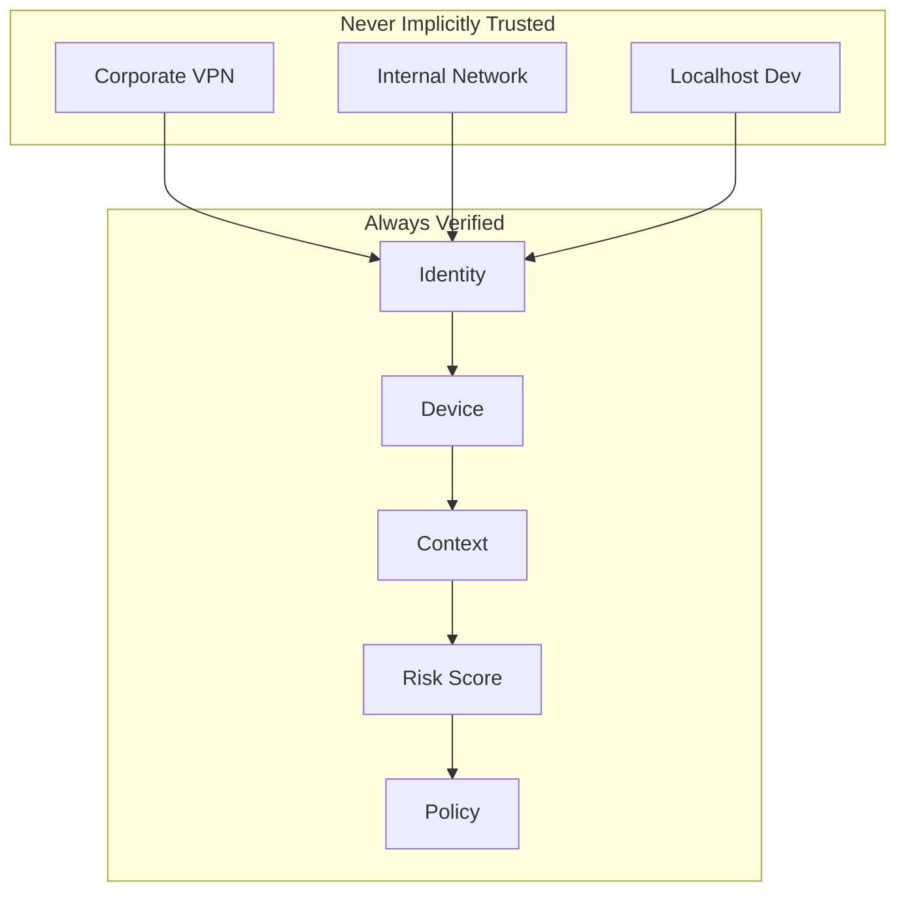
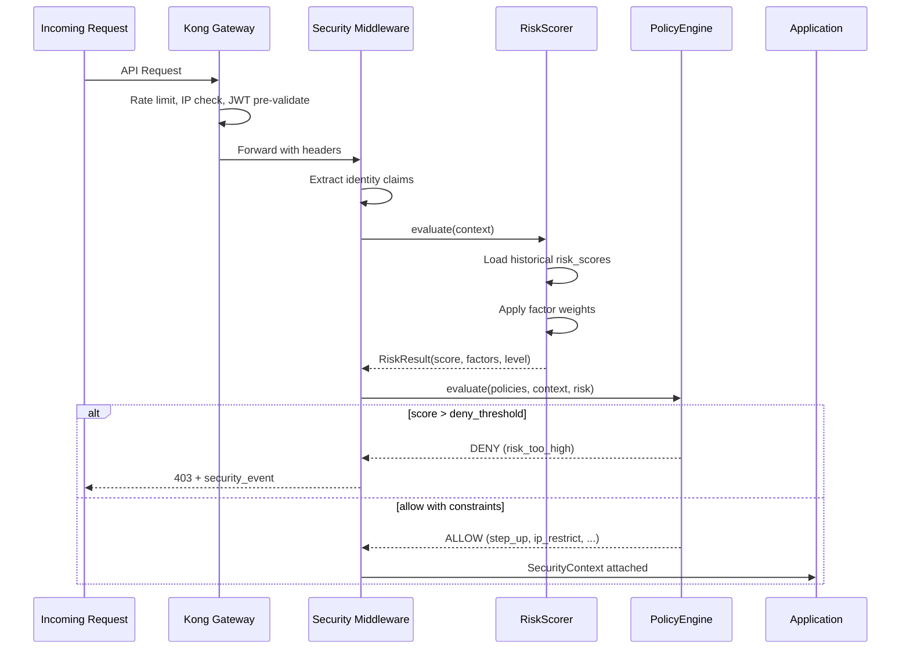
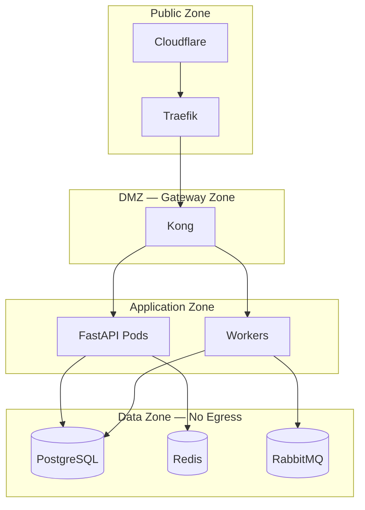

# 03 — Zero Trust Architecture

**Version 5.0** | Phase 12 | AI Lead Intelligence Platform

---

## Table of Contents

1. [Overview](#1-overview)
2. [Zero Trust Principles](#2-zero-trust-principles)
3. [Trust Evaluation Pipeline](#3-trust-evaluation-pipeline)
4. [Risk Scoring Model](#4-risk-scoring-model)
5. [Policy Integration](#5-policy-integration)
6. [Network Segmentation](#6-network-segmentation)
7. [Micro-Segmentation in Kubernetes](#7-micro-segmentation-in-kubernetes)
8. [Continuous Verification](#8-continuous-verification)
9. [Implementation Guide](#9-implementation-guide)
10. [Cross-References](#10-cross-references)

---

## 1. Overview

Phase 12 implements **zero trust** as a continuous verification model: no request is trusted based on network location alone. Every API call, workflow execution, and admin action passes through identity verification, device assessment, behavioral analysis, and policy evaluation.

The zero trust engine lives in `backend/app/security/zero_trust/` and persists scores to `security.risk_scores`.

**Core mantra:** *Never trust, always verify, assume breach.*

---

## 2. Zero Trust Principles

| Principle | Platform Implementation |
|-----------|------------------------|
| Verify explicitly | JWT + MFA + device trust + policy check per request |
| Use least privilege | RBAC from `permissions.py` + dynamic policy constraints |
| Assume breach | Immutable audit, anomaly detection, incident auto-creation |
| Minimize blast radius | Tenant isolation, workflow sandbox, AI output gates |
| Encrypt everything | TLS 1.3, at-rest encryption, field tokenization |



---

## 3. Trust Evaluation Pipeline



### Evaluation Inputs

| Signal | Source | Weight |
|--------|--------|--------|
| Authentication strength | JWT `mfa_verified` claim | 25% |
| Device trust | `trusted_devices` lookup | 20% |
| IP reputation | GeoIP + allowlist match | 15% |
| Behavioral anomaly | Login velocity, off-hours | 20% |
| Resource sensitivity | Endpoint classification | 10% |
| Historical score | Previous `risk_scores` | 10% |

---

## 4. Risk Scoring Model

### Score Range

| Range | Level | Action |
|-------|-------|--------|
| 0–25 | `low` | Full access per RBAC |
| 26–50 | `medium` | Access with enhanced logging |
| 51–75 | `high` | Step-up MFA required |
| 76–100 | `critical` | Deny + create `security_incident` |

### Risk Factors Schema

```json
{
  "score": 42,
  "level": "medium",
  "factors": [
    { "name": "new_device", "weight": 15, "detail": "Unrecognized fingerprint" },
    { "name": "geo_anomaly", "weight": 12, "detail": "Login from new country: DE" },
    { "name": "off_hours", "weight": 5, "detail": "Access at 02:14 UTC" }
  ],
  "computed_at": "2026-06-29T14:30:00Z",
  "expires_at": "2026-06-29T15:30:00Z"
}
```

### Persistence (`risk_scores` table)

```python
# backend/app/security/zero_trust/risk_scorer.py

class RiskScorer:
    async def evaluate(self, ctx: SecurityContext) -> RiskResult:
        factors = await self._collect_factors(ctx)
        score = min(100, sum(f.weight for f in factors))
        level = self._score_to_level(score)

        await self.repo.upsert_risk_score(
            organization_id=ctx.organization_id,
            subject_type="user",
            subject_id=ctx.user_id,
            score=score,
            level=level,
            factors=[f.to_dict() for f in factors],
            expires_at=utcnow() + timedelta(hours=1),
        )
        return RiskResult(score=score, level=level, factors=factors)
```

### Decay Model

Risk scores decay over time if no adverse signals:

| Time Since Event | Decay Rate |
|------------------|------------|
| 0–1 hour | No decay |
| 1–24 hours | -5 points/hour |
| 24+ hours | Reset to baseline (recompute on next request) |

---

## 5. Policy Integration

Zero trust outputs feed the policy engine ([04-multi-tenant-security-design.md](./04-multi-tenant-security-design.md)):

```yaml
# Example policy_definition.rules JSONB
{
  "conditions": [
    { "field": "risk_score", "operator": "lte", "value": 50 },
    { "field": "mfa_verified", "operator": "eq", "value": true }
  ],
  "actions": [
    { "type": "allow", "scope": "resource:contacts:export" }
  ],
  "deny_actions": [
    { "type": "deny", "reason": "risk_score_exceeded" },
    { "type": "require_step_up" }
  ]
}
```

### Sensitivity Classification

| Class | Endpoints | Base Risk Floor |
|-------|-----------|-----------------|
| `public` | `/health`, `/api/docs` | 0 |
| `standard` | CRM read, search | 0 |
| `elevated` | CRM write, workflow execute | 10 |
| `sensitive` | Bulk export, billing | 25 |
| `critical` | `security:admin`, user management | 40 |

---

## 6. Network Segmentation

### Production Network Zones



### Firewall Rules (Minimum)

| Source | Destination | Port | Protocol |
|--------|-------------|------|----------|
| Internet | Traefik | 443 | HTTPS only |
| Traefik | Kong | 8000 | HTTP (internal) |
| Kong | API | 8000 | HTTP (internal) |
| API | PostgreSQL | 5432 | TCP |
| Workers | RabbitMQ | 5672 | AMQP |
| **Deny** | Data Zone | * | Egress to internet |

See [07-infrastructure-security-model.md](./07-infrastructure-security-model.md) for full infrastructure controls.

---

## 7. Micro-Segmentation in Kubernetes

From Phase 11 K8s architecture ([../phase11/02-kubernetes-architecture.md](../phase11/02-kubernetes-architecture.md)):

### NetworkPolicy Example

```yaml
apiVersion: networking.k8s.io/v1
kind: NetworkPolicy
metadata:
  name: api-ingress-only
  namespace: ali-prod
spec:
  podSelector:
    matchLabels:
      app: ali-api
  policyTypes: [Ingress, Egress]
  ingress:
    - from:
        - podSelector:
            matchLabels:
              app: kong
      ports:
        - port: 8000
  egress:
    - to:
        - podSelector:
            matchLabels:
              app: postgres
      ports:
        - port: 5432
    - to:
        - podSelector:
            matchLabels:
              app: redis
      ports:
        - port: 6379
```

### Service Mesh (Optional)

For mTLS between services, Istio or Linkerd sidecars provide:

- Mutual TLS between all pod communication
- SPIFFE identity for service-to-service auth
- Traffic encryption without application changes

---

## 8. Continuous Verification

### Re-Verification Triggers

| Trigger | Re-evaluation |
|---------|---------------|
| Every API request | Full risk score (cached 5 min for low-sensitivity) |
| Privilege escalation | Immediate full evaluation |
| 15 min idle | Require token refresh |
| Sensitive action | Step-up MFA regardless of cache |
| Policy version change | Invalidate all cached scores |

### Security Access Logs

Every evaluated request writes to `security_access_logs`:

| Field | Example |
|-------|---------|
| `risk_score` | 42 |
| `decision` | allow |
| `policy_ids` | `["uuid1", "uuid2"]` |
| `endpoint` | `POST /api/v1/exports` |
| `duration_ms` | 12 |

---

## 9. Implementation Guide

### Configuration

```python
# backend/config.py (security section)

SECURITY_RISK_DENY_THRESHOLD: int = 76
SECURITY_RISK_STEP_UP_THRESHOLD: int = 51
SECURITY_RISK_CACHE_TTL_SECONDS: int = 300
SECURITY_ZERO_TRUST_ENABLED: bool = True
```

### Feature Flag Behavior

When `enterprise_security_v5` is disabled:
- Risk scorer returns `score=0, level=low`
- Policy engine uses RBAC only (Phase 10 behavior)
- `security_access_logs` still written (for migration observability)

### Metrics

```python
# backend/infrastructure/observability/security_metrics.py

security_risk_score_histogram = Histogram(
    "security_risk_score",
    "Computed risk scores",
    ["organization_id", "level"],
)
security_zero_trust_denials = Counter(
    "security_zero_trust_denials_total",
    "Requests denied by zero trust",
    ["reason"],
)
```

---

## 10. Cross-References

| Topic | Document |
|-------|----------|
| IAM & MFA | [02-identity-access-management-design.md](./02-identity-access-management-design.md) |
| Multi-tenant policies | [04-multi-tenant-security-design.md](./04-multi-tenant-security-design.md) |
| API security gates | [06-api-security-framework.md](./06-api-security-framework.md) |
| SOC alerting on high risk | [16-monitoring-soc-design.md](./16-monitoring-soc-design.md) |
| Database schema | [14-security-database-schema.md](./14-security-database-schema.md) |
| Incident playbooks | [12-incident-response-playbooks.md](./12-incident-response-playbooks.md) |