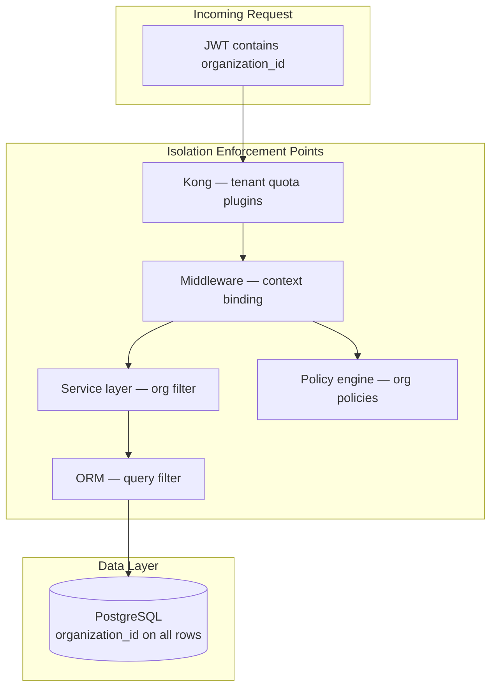
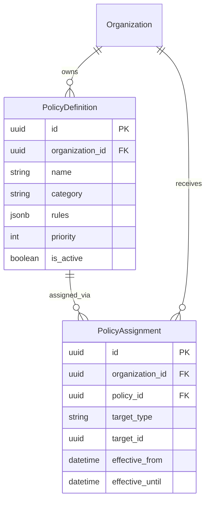
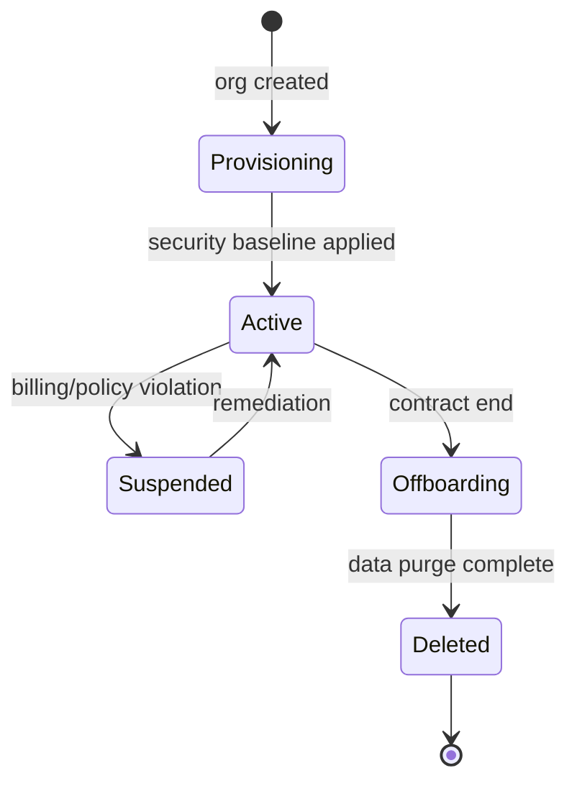

# 04 — Multi-Tenant Security Design

**Version 5.0** | Phase 12 | AI Lead Intelligence Platform

---

## Table of Contents

1. [Overview](#1-overview)
2. [Tenant Isolation Model](#2-tenant-isolation-model)
3. [Organization Security Boundaries](#3-organization-security-boundaries)
4. [Policy Engine](#4-policy-engine)
5. [Cross-Tenant Attack Prevention](#5-cross-tenant-attack-prevention)
6. [Tenant Security Settings](#6-tenant-security-settings)
7. [Data Residency & Segregation](#7-data-residency--segregation)
8. [Tenant Lifecycle Security](#8-tenant-lifecycle-security)
9. [Implementation Guide](#9-implementation-guide)
10. [Cross-References](#10-cross-references)

---

## 1. Overview

Multi-tenant security is the **foundational guarantee** of the AI Lead Intelligence Platform. Every tenant (organization) operates in strict isolation enforced at the database, service, API, and policy layers via `organization_id`.

Phase 12 adds **tenant-scoped security policies** through `policy_definitions` and `policy_assignments`, allowing each organization to configure MFA requirements, IP allowlists, export restrictions, and compliance profiles without affecting other tenants.

---

## 2. Tenant Isolation Model



### Isolation Layers

| Layer | Mechanism | Failure Mode |
|-------|-----------|--------------|
| Authentication | JWT `organization_id` claim | 401 Unauthorized |
| Gateway | Per-org rate limits (Kong) | 429 Too Many Requests |
| Middleware | `RequestContext.organization_id` | 403 Forbidden |
| Service | Explicit `org_id` parameter | `ForbiddenException` |
| Repository | `WHERE organization_id = :org_id` | Empty result (not leak) |
| Policy | Org-scoped `policy_assignments` | Deny by default |

---

## 3. Organization Security Boundaries

### Tenant Data Boundary

All tenant-scoped tables include:

```sql
organization_id UUID NOT NULL REFERENCES core.organizations(id) ON DELETE CASCADE
```

Security schema tables follow the same pattern (migration 018). Platform admin operations that cross tenants require:

1. `security:admin` permission with `is_platform_admin=true` claim
2. Explicit `target_organization_id` parameter
3. Audit log with `cross_tenant=true` metadata
4. `security_event` with severity `high`

### Shared vs Tenant-Scoped Resources

| Resource | Scope | Example |
|----------|-------|---------|
| Users | Tenant | `auth.users.organization_id` |
| CRM data | Tenant | `crm.deals.organization_id` |
| Security policies | Tenant | `security.policy_definitions.organization_id` |
| Compliance frameworks | Platform | Global templates, tenant assignments |
| System settings | Platform | `system.system_settings` (non-tenant) |
| Feature flags | Both | Global or per-org override |

---

## 4. Policy Engine

### Policy Data Model



### Policy Categories

| Category | Examples |
|----------|----------|
| `authentication` | MFA required, password complexity |
| `authorization` | Role ceiling, export restrictions |
| `network` | IP allowlist, geo blocklist |
| `data` | PII handling, retention limits |
| `ai` | Model usage restrictions, prompt filters |
| `compliance` | GDPR consent requirements |

### Evaluation Algorithm

```python
# backend/app/security/policy/engine.py

class PolicyEngine:
    async def evaluate(
        self,
        ctx: SecurityContext,
        resource: str,
        action: str,
    ) -> PolicyDecision:
        policies = await self.repo.get_active_policies(
            organization_id=ctx.organization_id,
            target_type="organization",
            target_id=ctx.organization_id,
        )
        # Also load user/role-specific assignments
        policies += await self.repo.get_assignments_for_subject(
            ctx.organization_id, "user", ctx.user_id
        )

        policies.sort(key=lambda p: p.priority, reverse=True)

        for policy in policies:
            result = self._evaluate_rules(policy.rules, ctx, resource, action)
            if result.is_terminal:
                await self._log_authorization(ctx, policy, result)
                return result

        return PolicyDecision(allow=True, reason="default_allow_rbac")
```

### Deny-Override Precedence

1. Explicit **deny** policies (highest priority) always win
2. Explicit **allow** policies with conditions
3. RBAC permissions from `permissions.py`
4. Default deny for unmapped sensitive resources

---

## 5. Cross-Tenant Attack Prevention

### Attack Vectors & Mitigations

| Attack | Vector | Mitigation |
|--------|--------|------------|
| IDOR | Manipulate `organization_id` in URL/body | Ignore client-supplied org; use JWT only |
| JWT tampering | Modify `organization_id` claim | HMAC signature validation |
| SQL injection | Org filter bypass | Parameterized queries, ORM |
| Cache poisoning | Shared Redis keys | Namespace keys: `org:{id}:*` |
| Search leakage | OpenSearch cross-index | Per-org index aliases |
| Webhook callback | Cross-tenant event delivery | Subscription org validation |

### IDOR Prevention Pattern

```python
# CORRECT — org from context only
async def get_contact(ctx: RequestContext, contact_id: uuid.UUID):
    return await repo.get_contact(
        organization_id=ctx.organization_id,  # from JWT, never from request body
        contact_id=contact_id,
    )

# WRONG — never accept org from client for authorization
async def get_contact_bad(org_id: uuid.UUID, contact_id: uuid.UUID):
    ...
```

### Cross-Tenant Access Detection

Attempts to access resources outside the authenticated org trigger:

1. `security_event` type `cross_tenant.access_attempt`, severity `high`
2. Auto-create `security_incident` if repeated (3+ in 5 minutes)
3. Temporary risk score elevation to `critical`

---

## 6. Tenant Security Settings

Stored in `core.organizations.security_settings` JSONB (new column in migration 018):

```json
{
  "mfa_required": true,
  "mfa_grace_days": 7,
  "ip_allowlist": ["203.0.113.0/24"],
  "session_max_concurrent": 5,
  "export_requires_approval": true,
  "ai_pii_redaction": true,
  "password_min_length": 12,
  "password_require_special": true,
  "data_retention_days": 365,
  "compliance_profile": "gdpr_strict"
}
```

### Settings API

```http
GET  /api/v1/security/settings
PATCH /api/v1/security/settings
```

Requires `security:admin`. Changes emit `audit.audit_logs` and `security_events`.

---

## 7. Data Residency & Segregation

### Current Model (Shared Database)

Single PostgreSQL instance with schema separation and `organization_id` row isolation. Suitable for most SaaS deployments.

### Enterprise Options

| Model | Isolation Level | Use Case |
|-------|-----------------|----------|
| Shared DB + RLS | Row-level | Default SaaS |
| Schema per tenant | Schema-level | Regulated mid-market |
| Database per tenant | Instance-level | Enterprise / government |

### Row-Level Security (Optional Enhancement)

```sql
ALTER TABLE security.security_events ENABLE ROW LEVEL SECURITY;

CREATE POLICY tenant_isolation ON security.security_events
    USING (organization_id = current_setting('app.current_org_id')::uuid);
```

Application sets `app.current_org_id` per connection via middleware.

---

## 8. Tenant Lifecycle Security



### Lifecycle Security Actions

| Stage | Security Actions |
|-------|------------------|
| Provisioning | Default policies, MFA grace period, audit enabled |
| Active | Continuous monitoring, compliance checks |
| Suspended | Revoke all sessions, block API keys, read-only mode |
| Offboarding | Export audit trail, revoke credentials |
| Deleted | Crypto-shred PII, retain anonymized audit per retention policy |

---

## 9. Implementation Guide

### Repository Pattern

```python
# backend/app/security/repository.py

class SecurityRepository:
    async def list_events(
        self,
        organization_id: uuid.UUID,  # REQUIRED — no default
        filters: EventFilters,
    ) -> tuple[list[SecurityEvent], int]:
        q = select(SecurityEvent).where(
            SecurityEvent.organization_id == organization_id
        )
        ...
```

### Testing Tenant Isolation

```python
# tests/security/test_tenant_isolation.py

async def test_cannot_access_other_org_contact(client, org_a_token, org_b_contact_id):
    resp = await client.get(
        f"/api/v1/crm/contacts/{org_b_contact_id}",
        headers={"Authorization": f"Bearer {org_a_token}"},
    )
    assert resp.status_code == 404  # not 403 — no information leak
```

---

## 10. Cross-References

| Topic | Document |
|-------|----------|
| Zero trust | [03-zero-trust-architecture.md](./03-zero-trust-architecture.md) |
| Data protection | [05-data-protection-strategy.md](./05-data-protection-strategy.md) |
| API security | [06-api-security-framework.md](./06-api-security-framework.md) |
| Compliance | [10-compliance-framework.md](./10-compliance-framework.md) |
| Database schema | [14-security-database-schema.md](./14-security-database-schema.md) |
| Phase 10 multi-tenant | [../phase10/13-security-architecture.md](../phase10/13-security-architecture.md) |