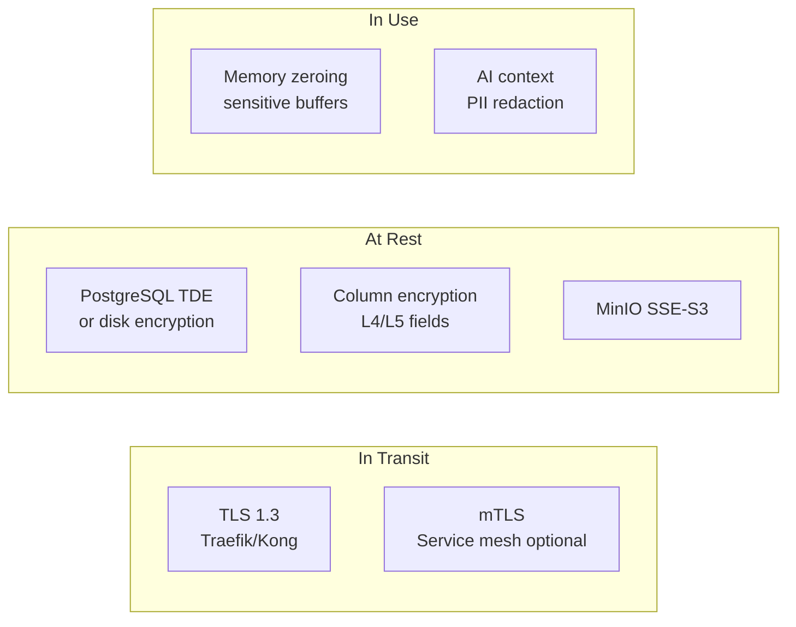
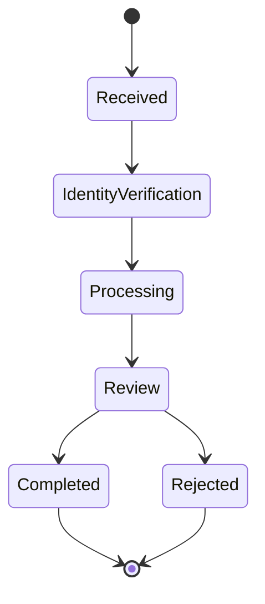

# 05 — Data Protection Strategy

**Version 5.0** | Phase 12 | AI Lead Intelligence Platform

---

## Table of Contents

1. [Overview](#1-overview)
2. [Data Classification](#2-data-classification)
3. [Encryption Strategy](#3-encryption-strategy)
4. [Tokenization & Masking](#4-tokenization--masking)
5. [Data Loss Prevention](#5-data-loss-prevention)
6. [Consent Management](#6-consent-management)
7. [Privacy Requests](#7-privacy-requests)
8. [Retention & Deletion](#8-retention--deletion)
9. [Secrets Management](#9-secrets-management)
10. [Implementation Guide](#10-implementation-guide)

---

## 1. Overview

Phase 12 formalizes **data protection** across the AI Lead Intelligence Platform: classification, encryption, tokenization, DLP, consent tracking, and privacy request fulfillment. Tables `consent_records`, `privacy_requests`, and `secrets_metadata` (migration 018) support compliance automation described in [10-compliance-framework.md](./10-compliance-framework.md).

**Principle:** Protect data at every state — in transit, at rest, in use, and in AI context.

---

## 2. Data Classification

### Classification Levels

| Level | Label | Examples | Handling |
|-------|-------|----------|----------|
| L1 | Public | Marketing content, public API docs | No restrictions |
| L2 | Internal | Org settings, workflow configs | Auth required |
| L3 | Confidential | CRM contacts, deal values | Encryption + audit |
| L4 | Restricted | Passwords, API keys, MFA secrets | Hash/encrypt + strict access |
| L5 | Regulated | PII, financial data, health-adjacent | Consent + DLP + retention |

### Auto-Classification Rules

```python
# backend/app/security/data/classifier.py

FIELD_CLASSIFICATIONS = {
    "email": "L5",
    "phone": "L5",
    "password_hash": "L4",
    "api_key_hash": "L4",
    "deal_value": "L3",
    "company_name": "L3",
    "lead_score": "L2",
}
```

### Classification Tags

Stored in entity `metadata` JSONB:

```json
{ "data_classification": "L5", "pii_fields": ["email", "phone"], "retention_days": 365 }
```

---

## 3. Encryption Strategy



### Encryption Standards

| Layer | Algorithm | Key Management |
|-------|-----------|----------------|
| TLS | TLS 1.3, AES-256-GCM | Auto via Let's Encrypt / Cloudflare |
| Column-level | AES-256-GCM | `DATA_ENCRYPTION_KEY` env / KMS |
| Passwords | bcrypt (cost 12) | Per-password salt |
| API keys | SHA-256 hash | No reversible storage |
| MFA secrets | AES-256-GCM | Per-device DEK wrapped by KEK |
| Webhook secrets | SHA-256 hash | Phase 10 pattern |

### Column Encryption Helper

```python
# backend/app/security/data/encryption.py

from cryptography.fernet import Fernet

class FieldEncryptor:
    def __init__(self, key: bytes):
        self._fernet = Fernet(key)

    def encrypt(self, plaintext: str) -> str:
        return self._fernet.encrypt(plaintext.encode()).decode()

    def decrypt(self, ciphertext: str) -> str:
        return self._fernet.decrypt(ciphertext.encode()).decode()
```

---

## 4. Tokenization & Masking

### Tokenization

Replace sensitive values with reversible tokens for non-production environments:

| Field | Production | Staging/Dev |
|-------|------------|-------------|
| Email | Real value | `tok_email_{hash}@masked.local` |
| Phone | Real value | `+1-555-XXX-XXXX` |
| Name | Real value | `Contact_{id[:8]}` |

### Display Masking

API responses mask L5 fields based on permission:

```python
def mask_email(email: str, ctx: RequestContext) -> str:
    if ctx.has_permission("contacts:read:pii"):
        return email
    local, domain = email.split("@")
    return f"{local[:2]}***@{domain}"
```

### AI Context Redaction

Before sending data to LLM providers (`OPENAI_API_KEY` flows):

1. Scan for PII patterns (email, phone, SSN-like)
2. Replace with `[REDACTED:{type}]` tokens
3. Log redaction count to `security_events`
4. Store mapping for de-tokenization only if user consents

See [08-ai-security-framework.md](./08-ai-security-framework.md).

---

## 5. Data Loss Prevention

### DLP Rules

| Rule | Trigger | Action |
|------|---------|--------|
| Bulk export threshold | > 10,000 records/export | Require `security:admin` approval |
| Cross-border transfer | Export to non-EU destination | Block if `compliance_profile=gdpr_strict` |
| API key scope escalation | Key requests `*:admin` scope | Deny + alert |
| Unencrypted download | Export without TLS | Block at gateway |
| PII in logs | Structured log contains email | Redact + `security_event` |

### Export Gate

```python
# backend/app/security/data/dlp.py

async def check_export_allowed(
    ctx: SecurityContext,
    record_count: int,
    destination: str,
) -> DLPResult:
    settings = await org_service.get_security_settings(ctx.organization_id)

    if record_count > settings.export_threshold:
        if not ctx.has_permission("security:admin"):
            return DLPResult(allowed=False, reason="export_approval_required")

    if settings.compliance_profile == "gdpr_strict":
        if not is_eu_destination(destination):
            return DLPResult(allowed=False, reason="cross_border_blocked")

    return DLPResult(allowed=True)
```

---

## 6. Consent Management

### Consent Records Table

`security.consent_records` tracks granular consent per data subject:

| Field | Purpose |
|-------|---------|
| `subject_type` | `contact`, `user`, `lead` |
| `subject_id` | Entity UUID |
| `purpose` | `marketing`, `analytics`, `ai_scoring`, `third_party_share` |
| `legal_basis` | `consent`, `legitimate_interest`, `contract` |
| `status` | `granted`, `withdrawn`, `expired` |
| `granted_at` / `withdrawn_at` | Timestamps |
| `evidence` | JSONB — form version, IP, user agent |

### Consent Check Before Processing

```python
async def require_consent(org_id: uuid.UUID, subject_id: uuid.UUID, purpose: str):
    consent = await consent_repo.get_active(org_id, subject_id, purpose)
    if not consent:
        raise ConsentRequiredError(purpose)
```

### Consent API

```http
POST /api/v1/security/consent
GET  /api/v1/security/consent?subject_id={uuid}&purpose=ai_scoring
DELETE /api/v1/security/consent/{id}  # withdrawal
```

---

## 7. Privacy Requests

### GDPR Data Subject Rights

Table: `security.privacy_requests`

| Request Type | SLA | Workflow |
|--------------|-----|----------|
| `access` (Art. 15) | 30 days | Compile export package |
| `rectification` (Art. 16) | 30 days | Update records + audit |
| `erasure` (Art. 17) | 30 days | Crypto-shred + anonymize |
| `portability` (Art. 20) | 30 days | Machine-readable export |
| `restriction` (Art. 18) | 30 days | Flag records, block processing |
| `objection` (Art. 21) | 30 days | Stop marketing/AI scoring |



### Privacy Request API

```http
POST /api/v1/security/privacy-requests
{
  "type": "erasure",
  "subject_email": "contact@example.com",
  "details": "Request via support ticket #1234"
}
```

Internal processing uses `security:compliance` permission. All actions logged to `audit.audit_logs`.

---

## 8. Retention & Deletion

### Retention Policies

| Data Category | Default Retention | Configurable Via |
|---------------|-------------------|------------------|
| CRM contacts | Org lifetime + 90 days | `data_retention_days` |
| Security events | 1 year hot, 7 years archive | Platform policy |
| Authentication logs | 1 year | Org security settings |
| Audit logs | 7 years | Compliance requirement |
| AI scoring inputs | 90 days | `ai_retention_days` |

### Secure Deletion

```python
async def crypto_shred_contact(org_id: uuid.UUID, contact_id: uuid.UUID):
    """Overwrite PII fields before soft-delete."""
    await db.execute(
        update(Contact)
        .where(Contact.organization_id == org_id, Contact.id == contact_id)
        .values(
            email=f"deleted_{contact_id}@purged.local",
            phone=None,
            first_name="[DELETED]",
            last_name="[DELETED]",
            deleted_at=utcnow(),
        )
    )
```

---

## 9. Secrets Management

### Secrets Metadata Table

`security.secrets_metadata` tracks secret lifecycle without storing values:

| Field | Purpose |
|-------|---------|
| `name` | `jwt_signing_key`, `data_encryption_key` |
| `version` | Rotation version number |
| `provider` | `env`, `vault`, `aws_kms` |
| `rotated_at` | Last rotation timestamp |
| `expires_at` | Rotation due date |
| `status` | `active`, `rotating`, `retired` |

### Secret Storage Hierarchy

| Environment | Method | Path |
|-------------|--------|------|
| Development | `.env` file | `SECRET_KEY`, `DATA_ENCRYPTION_KEY` |
| Staging | GitHub Secrets + SOPS | Encrypted in repo |
| Production | External vault or K8s Secrets | Never in git |

Values never appear in `security_events`, logs, or API responses.

---

## 10. Implementation Guide

### Module Structure

```
backend/app/security/
├── data/
│   ├── classifier.py
│   ├── encryption.py
│   ├── dlp.py
│   ├── consent.py
│   └── privacy.py
└── secrets/
    └── service.py
```

### Environment Variables

| Variable | Purpose | Required |
|----------|---------|----------|
| `SECRET_KEY` | JWT signing | Yes |
| `DATA_ENCRYPTION_KEY` | Field encryption (Fernet) | Production |
| `PII_REDACTION_ENABLED` | AI context redaction | Default `true` |

### Cross-References

| Topic | Document |
|-------|----------|
| Compliance mapping | [10-compliance-framework.md](./10-compliance-framework.md) |
| AI PII handling | [08-ai-security-framework.md](./08-ai-security-framework.md) |
| Multi-tenant settings | [04-multi-tenant-security-design.md](./04-multi-tenant-security-design.md) |
| Database schema | [14-security-database-schema.md](./14-security-database-schema.md) |
| Infrastructure encryption | [07-infrastructure-security-model.md](./07-infrastructure-security-model.md) |