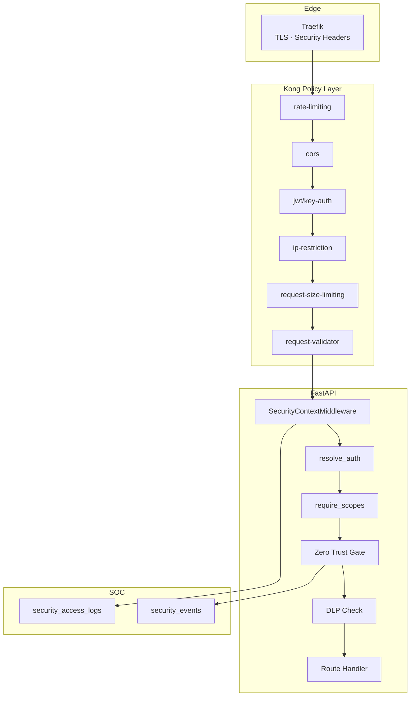

# 06 — API Security Framework

**Version 5.0** | Phase 12 | AI Lead Intelligence Platform

---

## Table of Contents

1. [Overview](#1-overview)
2. [API Security Architecture](#2-api-security-architecture)
3. [Gateway Security Plugins](#3-gateway-security-plugins)
4. [Application Security Middleware](#4-application-security-middleware)
5. [Input Validation & Output Encoding](#5-input-validation--output-encoding)
6. [Rate Limiting & Abuse Prevention](#6-rate-limiting--abuse-prevention)
7. [API Key & OAuth Hardening](#7-api-key--oauth-hardening)
8. [Security Headers](#8-security-headers)
9. [API Threat Detection](#9-api-threat-detection)
10. [Cross-References](#10-cross-references)

---

## 1. Overview

Phase 12 extends the Phase 10 API gateway model ([../phase10/01-api-gateway-architecture.md](../phase10/01-api-gateway-architecture.md)) with a comprehensive **API security framework** covering gateway plugins, application middleware, threat detection, and security event correlation.

All API traffic flows: **Client → Traefik → Kong → FastAPI Security Middleware → Business Logic**.

---

## 2. API Security Architecture



---

## 3. Gateway Security Plugins

### Kong Plugin Configuration

Extend `infra/gateway/kong/kong.yml`:

```yaml
plugins:
  - name: rate-limiting
    config:
      minute: 1000
      hour: 10000
      policy: redis
      fault_tolerant: true

  - name: request-size-limiting
    config:
      allowed_payload_size: 10  # MB

  - name: cors
    config:
      origins: ["https://app.example.com"]
      methods: [GET, POST, PUT, PATCH, DELETE, OPTIONS]
      headers: [Authorization, Content-Type, X-Request-Id]
      credentials: true
      max_age: 3600

  - name: ip-restriction
    config:
      allow: ["203.0.113.0/24"]  # per-route for admin APIs

  - name: bot-detection
    config:
      allow: []
      deny: ["curl", "python-requests"]  # block on sensitive routes only
```

### Route-Specific Security Profiles

| Route Pattern | Profile | Plugins |
|---------------|---------|---------|
| `/api/v1/auth/*` | `auth` | rate-limit (strict), request-size, bot-detection |
| `/api/v1/security/*` | `security` | ip-restriction, jwt, rate-limit |
| `/api/v1/platform/*` | `integration` | key-auth, rate-limit, cors |
| `/api/v1/crm/*` | `business` | jwt/key-auth, rate-limit |
| `/api/v1/exports/*` | `sensitive` | jwt, rate-limit (low), DLP at app |

---

## 4. Application Security Middleware

### Middleware Stack Order

```python
# backend/app/main.py (middleware order)

app.add_middleware(CorrelationIdMiddleware)       # X-Request-Id
app.add_middleware(SecurityHeadersMiddleware)       # Response headers
app.add_middleware(SecurityContextMiddleware)     # Phase 12
app.add_middleware(RateLimitMiddleware)             # App-level backup
```

### SecurityContextMiddleware

```python
# backend/app/security/middleware/security_context.py

async def security_context_middleware(request: Request, call_next):
    start = time.monotonic()
    ctx = await build_request_context(request)

    try:
        sec_ctx = await risk_scorer.evaluate(ctx)
        decision = await policy_engine.evaluate(ctx, request.url.path, request.method)

        if not decision.allow:
            await soc_processor.emit_access_denied(ctx, decision)
            raise ForbiddenException(decision.reason)

        request.state.security_context = sec_ctx
        response = await call_next(request)

    finally:
        duration_ms = int((time.monotonic() - start) * 1000)
        await access_log_repo.record(ctx, request, response.status_code, duration_ms)

    return response
```

### Auth Resolution (Phase 10 + Phase 12)

```python
# Extends backend/app/platform/auth/dependencies.py

async def resolve_auth(request: Request) -> AuthContext:
    auth = await _resolve_credentials(request)

    # Phase 12: validate token not revoked
    if await session_service.is_revoked(auth.session_id):
        raise UnauthorizedError("Session revoked")

    # Phase 12: check API key IP binding
    if auth.method == "api_key":
        await api_key_guard.check_ip_binding(auth, request.client.host)

    return auth
```

---

## 5. Input Validation & Output Encoding

### Validation Layers

| Layer | Tool | Scope |
|-------|------|-------|
| Gateway | Kong `request-validator` | JSON schema per route |
| Application | Pydantic v2 models | Request/response schemas |
| Database | SQLAlchemy types + constraints | Column bounds |
| AI | Prompt sanitizer | LLM inputs |

### Pydantic Security Validators

```python
from pydantic import field_validator
import re

class ContactCreateRequest(BaseModel):
    email: str

    @field_validator("email")
    @classmethod
    def validate_email(cls, v: str) -> str:
        if not re.match(r"^[^@]+@[^@]+\.[^@]+$", v):
            raise ValueError("Invalid email format")
        if len(v) > 254:
            raise ValueError("Email too long")
        return v.lower().strip()
```

### SQL Injection Prevention

- SQLAlchemy ORM exclusively for queries
- No raw SQL with string interpolation
- Parameterized queries for migrations only

### XSS Prevention

- JSON API only (no HTML rendering from user input)
- `Content-Type: application/json` enforced
- CSP headers on frontend (separate concern)

---

## 6. Rate Limiting & Abuse Prevention

### Multi-Tier Rate Limits

| Tier | Scope | Limit | Window |
|------|-------|-------|--------|
| Global | Per IP | 100 req | 1 min |
| Authenticated | Per user | 1000 req | 1 min |
| API Key | Per key | Per plan quota | 1 hour |
| Sensitive | Per user | 10 exports | 1 hour |
| Auth endpoints | Per IP | 20 attempts | 15 min |

### Implementation

```python
# backend/app/platform/rate_limit.py (extended)

SECURITY_RATE_LIMITS = {
    "/api/v1/auth/login": (20, 900),       # 20 per 15 min
    "/api/v1/security/*": (100, 60),
    "/api/v1/exports/*": (10, 3600),
}
```

### Abuse Detection Signals

| Signal | Threshold | Action |
|--------|-----------|--------|
| 401 burst | 50/min per IP | Temporary IP block |
| 403 burst | 20/min per user | Risk score +50 |
| 429 sustained | 5 min continuous | `security_alert` |
| Credential stuffing | 10 failed logins | Account lockout + incident |

---

## 7. API Key & OAuth Hardening

### API Key Security (extends Phase 10)

| Control | Implementation |
|---------|----------------|
| Prefix identification | `ali_live_`, `ali_test_` |
| Hash-only storage | SHA-256 in `auth.api_keys.key_hash` |
| Scope ceiling | Cannot exceed user's role permissions |
| IP binding | Optional `allowed_ips` JSONB |
| Expiry | `expires_at` enforced at gateway + app |
| Usage logging | Each call → `authorization_logs` |

### OAuth Security (extends Phase 10)

| Control | Implementation |
|---------|----------------|
| PKCE required | Authorization Code flow |
| Redirect URI validation | Exact match only |
| Scope minimization | Default scopes per app type |
| Token rotation | Refresh token single-use |
| Client secret hashing | bcrypt for confidential clients |

---

## 8. Security Headers

### Traefik Middleware

```yaml
# infra/gateway/traefik/dynamic.yml
http:
  middlewares:
    security-headers:
      headers:
        stsSeconds: 31536000
        stsIncludeSubdomains: true
        forceSTSHeader: true
        contentTypeNosniff: true
        frameDeny: true
        referrerPolicy: "strict-origin-when-cross-origin"
        permissionsPolicy: "camera=(), microphone=(), geolocation=()"
        customResponseHeaders:
          X-Content-Type-Options: "nosniff"
          X-Frame-Options: "DENY"
          X-XSS-Protection: "0"
          Cache-Control: "no-store"
```

### Response Headers (Security API)

Security endpoints include additional headers:

```
X-Request-Id: {uuid}
X-Correlation-Id: {uuid}
X-RateLimit-Remaining: 950
X-RateLimit-Reset: 1719666000
```

---

## 9. API Threat Detection

### OWASP API Security Top 10 Mapping

| Risk | Mitigation |
|------|------------|
| API1: Broken Object Level Auth | `organization_id` enforcement |
| API2: Broken Authentication | MFA, session management |
| API3: Broken Object Property Auth | Field-level permissions |
| API4: Unrestricted Resource Consumption | Rate limits, quotas |
| API5: Broken Function Level Auth | RBAC + policy engine |
| API6: Unrestricted Sensitive Business Flows | DLP on exports |
| API7: Server Side Request Forgery | URL allowlists in connectors |
| API8: Security Misconfiguration | Compliance checks |
| API9: Improper Inventory Management | OpenAPI registry |
| API10: Unsafe API Consumption | SDK input validation |

### Automated Threat Rules

```python
# backend/app/security/soc/rules.py

THREAT_RULES = [
    {
        "name": "credential_stuffing",
        "condition": "count(auth.login.failure, 5m, ip) > 20",
        "severity": "high",
        "action": "create_incident",
    },
    {
        "name": "privilege_escalation",
        "condition": "event.type == authz.denied AND resource contains admin",
        "severity": "medium",
        "action": "alert",
    },
]
```

---

## 10. Cross-References

| Topic | Document |
|-------|----------|
| Gateway architecture | [../phase10/01-api-gateway-architecture.md](../phase10/01-api-gateway-architecture.md) |
| REST API spec | [../phase10/02-rest-api-specification.md](../phase10/02-rest-api-specification.md) |
| Security API routes | [15-api-specifications.md](./15-api-specifications.md) |
| Zero trust | [03-zero-trust-architecture.md](./03-zero-trust-architecture.md) |
| SOC monitoring | [16-monitoring-soc-design.md](./16-monitoring-soc-design.md) |
| Testing | [17-testing-strategy.md](./17-testing-strategy.md) |