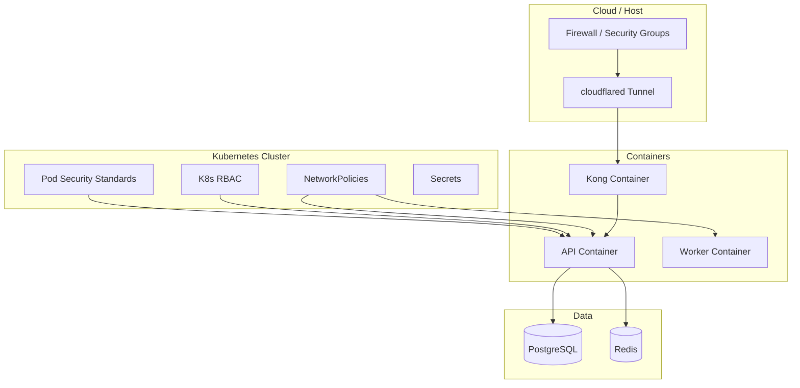
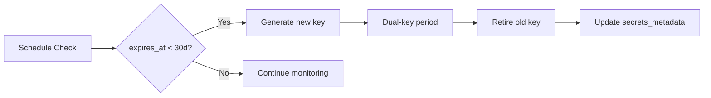

# 07 — Infrastructure Security Model

**Version 5.0** | Phase 12 | AI Lead Intelligence Platform

---

## Table of Contents

1. [Overview](#1-overview)
2. [Infrastructure Security Layers](#2-infrastructure-security-layers)
3. [Container Security](#3-container-security)
4. [Kubernetes Hardening](#4-kubernetes-hardening)
5. [Database Security](#5-database-security)
6. [Network Security](#6-network-security)
7. [Secrets & Key Management](#7-secrets--key-management)
8. [CI/CD Pipeline Security](#8-cicd-pipeline-security)
9. [Infrastructure Compliance](#9-infrastructure-compliance)
10. [Cross-References](#10-cross-references)

---

## 1. Overview

Phase 12 defines the **infrastructure security model** for deploying the AI Lead Intelligence Platform. It extends Phase 11 operations documentation ([../phase11/01-cloud-architecture.md](../phase11/01-cloud-architecture.md), [../phase11/07-networking-design.md](../phase11/07-networking-design.md)) with production-grade hardening requirements.

---

## 2. Infrastructure Security Layers

```
┌────────────────────────────────────────────────────────────┐
│ L1: Physical / Cloud Provider   Provider security controls │
├────────────────────────────────────────────────────────────┤
│ L2: Network                     Firewalls, VPCs, tunnels   │
├────────────────────────────────────────────────────────────┤
│ L3: Compute                     Hardened OS, K8s policies  │
├────────────────────────────────────────────────────────────┤
│ L4: Container                   Non-root, read-only FS     │
├────────────────────────────────────────────────────────────┤
│ L5: Orchestration               RBAC, NetworkPolicy, PSP   │
├────────────────────────────────────────────────────────────┤
│ L6: Application                 FastAPI security middleware│
├────────────────────────────────────────────────────────────┤
│ L7: Data                        Encryption, access control │
└────────────────────────────────────────────────────────────┘
```



---

## 3. Container Security

### Dockerfile Hardening

Per Phase 11 Docker standards ([../phase11/03-docker-standards.md](../phase11/03-docker-standards.md)):

| Requirement | Implementation |
|-------------|----------------|
| Non-root user | `USER appuser` (UID 1000) |
| Read-only root FS | `readOnlyRootFilesystem: true` |
| No privileged mode | `privileged: false` |
| Minimal base image | `python:3.12-slim` |
| No secrets in image | `.dockerignore` excludes `.env` |
| Multi-stage build | Separate build and runtime stages |
| Vulnerability scan | Trivy in CI pipeline |

### Example Security Context

```yaml
# k8s/api-deployment.yaml
securityContext:
  runAsNonRoot: true
  runAsUser: 1000
  readOnlyRootFilesystem: true
  allowPrivilegeEscalation: false
  capabilities:
    drop: ["ALL"]
```

---

## 4. Kubernetes Hardening

### Pod Security Standards

```yaml
apiVersion: v1
kind: Namespace
metadata:
  name: ali-prod
  labels:
    pod-security.kubernetes.io/enforce: restricted
    pod-security.kubernetes.io/audit: restricted
    pod-security.kubernetes.io/warn: restricted
```

### RBAC (Least Privilege)

| Service Account | Permissions | Namespace |
|-----------------|-------------|-----------|
| `ali-api` | ConfigMaps, Secrets (read) | ali-prod |
| `ali-worker` | Same + RabbitMQ access | ali-prod |
| `kong` | Services, Endpoints (read) | gateway |
| `deploy-bot` | Deployments (patch) | ali-prod |

### Resource Limits

```yaml
resources:
  requests:
    cpu: "250m"
    memory: "512Mi"
  limits:
    cpu: "1000m"
    memory: "1Gi"
```

Prevents resource exhaustion attacks.

---

## 5. Database Security

### PostgreSQL Hardening

| Control | Configuration |
|---------|---------------|
| SSL connections | `sslmode=require` in `DATABASE_URL` |
| Least privilege user | `app_user` — no SUPERUSER |
| Schema isolation | Per-domain schemas via `db_schemas.py` |
| Connection pooling | PgBouncer with credential rotation |
| Audit logging | `log_statement = 'ddl'`, `log_connections = on` |
| Backup encryption | GPG-encrypted backups ([../phase11/12-backup-restore.md](../phase11/12-backup-restore.md)) |

### Security Schema Grants

```sql
-- 018_phase12_enterprise_security.py
GRANT USAGE ON SCHEMA security TO app_user;
GRANT SELECT, INSERT, UPDATE ON ALL TABLES IN SCHEMA security TO app_user;
-- No DELETE on security_events (append-only via application policy)
REVOKE DELETE ON security.security_events FROM app_user;
```

### Redis Security

| Control | Dev | Production |
|---------|-----|------------|
| Authentication | Optional | `requirepass` required |
| TLS | No | `stunnel` or Redis 7 TLS |
| Network | Docker network | Internal only |
| Key namespace | `org:{id}:*` | Prevents cross-tenant cache |

---

## 6. Network Security

### Ingress Architecture

| Component | Exposure | Protocol |
|-----------|----------|----------|
| Traefik | Public (443) | HTTPS |
| Kong | Internal only | HTTP |
| FastAPI | Internal only | HTTP |
| PostgreSQL | Internal only | TCP 5432 |
| Redis | Internal only | TCP 6379 |
| RabbitMQ | Internal only | AMQP 5672 |
| Kong Admin | VPN/IP-restricted | HTTP 8001 |

### Cloudflare Tunnel (Free Tier)

From Phase 11 ([../phase11/08-security-architecture.md](../phase11/08-security-architecture.md)):

- No open inbound ports on origin
- Universal SSL at edge
- Bot Fight Mode enabled
- SSL mode: Full (strict)

### NetworkPolicy Summary

See [03-zero-trust-architecture.md](./03-zero-trust-architecture.md) for detailed NetworkPolicy examples.

---

## 7. Secrets & Key Management

### Secret Categories

| Secret | Storage (Prod) | Rotation |
|--------|------------------|----------|
| `SECRET_KEY` | K8s Secret / Vault | 90 days |
| `DATA_ENCRYPTION_KEY` | Vault | 180 days |
| `DATABASE_URL` | K8s Secret | On credential change |
| `OPENAI_API_KEY` | K8s Secret | On compromise |
| Kong certificates | cert-manager | Auto (Let's Encrypt) |

### Rotation Procedure

Tracked in `security.secrets_metadata`:



---

## 8. CI/CD Pipeline Security

From Phase 11 CI/CD ([../phase11/04-cicd-pipeline.md](../phase11/04-cicd-pipeline.md)):

### Security Gates in Pipeline

```yaml
# .github/workflows/security.yml
jobs:
  sast:
    runs-on: ubuntu-latest
    steps:
      - uses: actions/checkout@v4
      - run: pip install bandit
      - run: bandit -r backend/app -ll

  dependency-scan:
    steps:
      - run: pip install pip-audit
      - run: pip-audit -r backend/requirements.txt

  container-scan:
    steps:
      - uses: aquasecurity/trivy-action@master
        with:
          image-ref: ali-api:${{ github.sha }}
          severity: CRITICAL,HIGH
          exit-code: 1

  secret-scan:
    steps:
      - uses: gitleaks/gitleaks-action@v2
```

### Deployment Security

| Control | Implementation |
|---------|----------------|
| Signed commits | Required on `main` |
| Environment protection | GitHub Environments with reviewers |
| Immutable tags | Deploy by digest, not `:latest` |
| Rollback | Automated on health check failure |

---

## 9. Infrastructure Compliance

### Control Mapping

| Framework | Control | Infrastructure Evidence |
|-----------|---------|------------------------|
| SOC 2 CC6.1 | Logical access | K8s RBAC, NetworkPolicy |
| SOC 2 CC6.6 | Boundary protection | Firewall, Cloudflare |
| ISO 27001 A.12.4 | Logging | Centralized logs, audit |
| ISO 27001 A.13.1 | Network security | Segmentation diagram |
| NIST CSF PR.AC | Access control | IAM, MFA, zero trust |
| NIST CSF PR.DS | Data security | Encryption at rest/transit |
| GDPR Art. 32 | Security of processing | Full stack encryption |

Automated checks via `compliance_checks` table — see [10-compliance-framework.md](./10-compliance-framework.md).

---

## 10. Cross-References

| Topic | Document |
|-------|----------|
| Zero trust networking | [03-zero-trust-architecture.md](./03-zero-trust-architecture.md) |
| Data encryption | [05-data-protection-strategy.md](./05-data-protection-strategy.md) |
| Vulnerability management | [13-vulnerability-management-strategy.md](./13-vulnerability-management-strategy.md) |
| Production handbook | [20-production-security-handbook.md](./20-production-security-handbook.md) |
| Phase 11 K8s | [../phase11/02-kubernetes-architecture.md](../phase11/02-kubernetes-architecture.md) |
| Phase 11 networking | [../phase11/07-networking-design.md](../phase11/07-networking-design.md) |