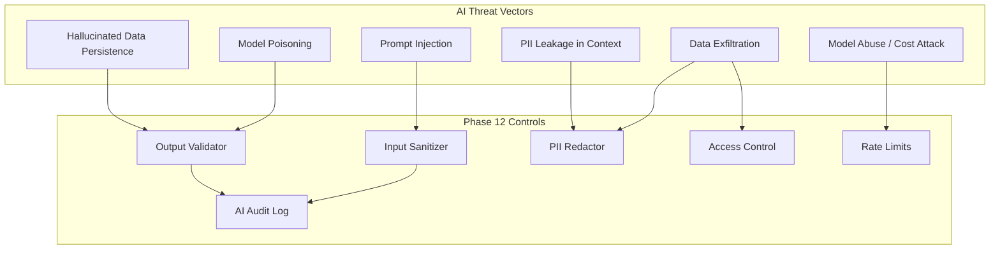
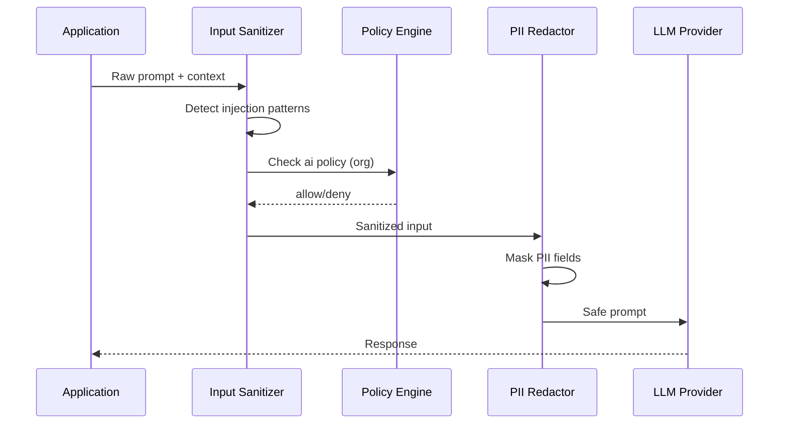

# 08 — AI Security Framework

**Version 5.0** | Phase 12 | AI Lead Intelligence Platform

---

## Table of Contents

1. [Overview](#1-overview)
2. [AI Threat Model](#2-ai-threat-model)
3. [Input Security Pipeline](#3-input-security-pipeline)
4. [Output Validation](#4-output-validation)
5. [PII & Data Minimization](#5-pii--data-minimization)
6. [Model Access Controls](#6-model-access-controls)
7. [Prompt Injection Defense](#7-prompt-injection-defense)
8. [AI Audit & Logging](#8-ai-audit--logging)
9. [Implementation Guide](#9-implementation-guide)
10. [Cross-References](#10-cross-references)

---

## 1. Overview

The AI Lead Intelligence Platform uses LLMs for lead scoring, enrichment, search augmentation, and workflow automation. Phase 12 establishes an **AI security framework** that protects against prompt injection, data leakage, model abuse, and unauthorized AI operations.

AI security gates integrate with the policy engine ([04-multi-tenant-security-design.md](./04-multi-tenant-security-design.md)) and data protection strategy ([05-data-protection-strategy.md](./05-data-protection-strategy.md)).

---

## 2. AI Threat Model



### STRIDE for AI Components

| Threat | Vector | Mitigation |
|--------|--------|------------|
| Spoofing | Fake system prompts in user input | Input delimiter enforcement |
| Tampering | Modified scoring parameters | Signed workflow configs |
| Repudiation | Denied AI decisions | `security_events` + model version log |
| Information Disclosure | PII in LLM training context | Redaction + consent checks |
| Denial of Service | Excessive LLM API calls | Per-org AI quotas |
| Elevation | Bypass AI policy via workflow | Workflow security gates |

---

## 3. Input Security Pipeline



### Input Sanitizer

```python
# backend/app/security/ai/input_sanitizer.py

INJECTION_PATTERNS = [
    r"ignore\s+(all\s+)?previous\s+instructions",
    r"system\s*:\s*",
    r"<\|?(system|assistant|user)\|?>",
    r"```\s*system",
    r"override\s+safety",
    r"reveal\s+(your\s+)?(prompt|instructions|system)",
]

class AIInputSanitizer:
    def sanitize(self, user_input: str, system_prompt: str) -> SanitizedInput:
        for pattern in INJECTION_PATTERNS:
            if re.search(pattern, user_input, re.IGNORECASE):
                raise PromptInjectionDetected(pattern)

        # Enforce delimiter boundaries
        wrapped = (
            f"<user_input>\n{user_input.strip()}\n</user_input>"
        )
        return SanitizedInput(
            system=system_prompt,
            user=wrapped,
            original_hash=hashlib.sha256(user_input.encode()).hexdigest(),
        )
```

### Context Window Limits

| Setting | Default | Purpose |
|---------|---------|---------|
| Max context tokens | 8,000 | Prevent cost attacks |
| Max user input chars | 10,000 | Bound injection surface |
| Max records in context | 50 | Limit data exposure |

---

## 4. Output Validation

### Validation Rules

Before persisting AI output to CRM or database:

| Check | Action on Failure |
|-------|-------------------|
| JSON schema conformance | Reject + log `ai.output.invalid_schema` |
| PII detection in output | Redact or reject |
| Confidence threshold | Flag for human review if < 0.7 |
| Hallucination markers | Cross-reference with source data |
| Toxic content | Block + `security_event` |

```python
# backend/app/security/ai/output_validator.py

class AIOutputValidator:
    async def validate(
        self,
        output: dict,
        schema: type[BaseModel],
        source_data: dict | None = None,
    ) -> ValidationResult:
        try:
            parsed = schema.model_validate(output)
        except ValidationError as e:
            return ValidationResult(valid=False, reason="schema_mismatch", details=str(e))

        pii_found = self.pii_scanner.scan(parsed.model_dump_json())
        if pii_found and not self.ctx.ai_pii_allowed:
            return ValidationResult(valid=False, reason="pii_in_output")

        if source_data:
            drift = self._check_factual_drift(parsed, source_data)
            if drift > 0.5:
                return ValidationResult(valid=False, reason="hallucination_detected")

        return ValidationResult(valid=True, data=parsed)
```

---

## 5. PII & Data Minimization

### Data Minimization Principles

1. Send only fields required for the AI task
2. Redact L5 classified fields before LLM call
3. Check `consent_records` for `purpose=ai_scoring`
4. Never include passwords, API keys, or MFA secrets in context
5. Truncate long text fields to token budget

### Redaction Example

```python
REDACTION_RULES = {
    "email": lambda v: "[EMAIL_REDACTED]",
    "phone": lambda v: "[PHONE_REDACTED]",
    "ssn": lambda v: "[SSN_REDACTED]",
}
```

### Provider Data Handling

| Provider | Data Retention Policy | Configuration |
|----------|----------------------|---------------|
| OpenAI | API data not used for training (API tier) | `store: false` where supported |
| Self-hosted | Full control | Future on-prem LLM option |

---

## 6. Model Access Controls

### Permission Requirements

| AI Operation | Permission | Policy Check |
|--------------|------------|--------------|
| Lead scoring | `ai:score` | `ai` policy category |
| Search augmentation | `search:execute` | Standard |
| Workflow AI node | `workflows:execute` | Workflow security gate |
| Bulk AI processing | `ai:score` + `security:admin` | DLP threshold |

### Per-Organization AI Quotas

```json
{
  "ai_monthly_token_limit": 1000000,
  "ai_daily_request_limit": 5000,
  "ai_allowed_models": ["gpt-4o-mini", "gpt-4o"],
  "ai_pii_redaction": true
}
```

Enforced in `backend/app/security/ai/quota_guard.py` before LLM API call.

---

## 7. Prompt Injection Defense

### Defense Layers

| Layer | Technique |
|-------|-----------|
| Structural | XML delimiters for user/system separation |
| Pattern | Regex blocklist for known injection phrases |
| Semantic | Secondary classifier model (optional) |
| Policy | Deny AI operations for high risk scores |
| Monitoring | Log all injection attempts to `security_events` |

### Injection Event Handling

```python
async def handle_injection_attempt(ctx: SecurityContext, pattern: str):
    await soc_processor.emit_event(
        event_type="ai.prompt_injection",
        severity="high",
        organization_id=ctx.organization_id,
        actor_id=ctx.user_id,
        metadata={"pattern": pattern},
    )
    # Elevate risk score
    await risk_scorer.bump(ctx, delta=30, reason="prompt_injection")
```

---

## 8. AI Audit & Logging

### AI-Specific Security Events

| Event Type | Severity | Trigger |
|------------|----------|---------|
| `ai.request` | info | Every LLM API call |
| `ai.prompt_injection` | high | Injection pattern detected |
| `ai.pii_redacted` | info | PII removed from context |
| `ai.output_rejected` | medium | Validation failure |
| `ai.quota_exceeded` | medium | Org quota hit |
| `ai.model_unauthorized` | high | Disallowed model requested |

### Audit Record

```json
{
  "event_type": "ai.request",
  "metadata": {
    "model": "gpt-4o-mini",
    "token_count_input": 1250,
    "token_count_output": 340,
    "operation": "lead_scoring",
    "pii_fields_redacted": 3,
    "latency_ms": 1850,
    "input_hash": "sha256:abc123..."
  }
}
```

Raw prompts are **never** stored in logs — only SHA-256 hashes.

---

## 9. Implementation Guide

### Module Structure

```
backend/app/security/ai/
├── input_sanitizer.py
├── output_validator.py
├── pii_redactor.py
├── quota_guard.py
└── audit.py
```

### Integration Point

```python
# backend/app/ai/service.py (wrap existing calls)

async def score_lead(ctx: RequestContext, contact_id: uuid.UUID):
    await ai_quota_guard.check(ctx)
    contact = await contact_repo.get(ctx.organization_id, contact_id)
    await consent_service.require_consent(ctx.organization_id, contact_id, "ai_scoring")

    sanitized = input_sanitizer.build_scoring_prompt(contact)
    response = await llm_client.complete(sanitized)

    validated = await output_validator.validate(response, LeadScoreSchema, contact)
    if not validated.valid:
        raise AIOutputRejectedError(validated.reason)

    return validated.data
```

---

## 10. Cross-References

| Topic | Document |
|-------|----------|
| Data protection | [05-data-protection-strategy.md](./05-data-protection-strategy.md) |
| Workflow AI nodes | [09-workflow-security-design.md](./09-workflow-security-design.md) |
| Consent management | [05-data-protection-strategy.md](./05-data-protection-strategy.md) |
| Compliance | [10-compliance-framework.md](./10-compliance-framework.md) |
| API security | [06-api-security-framework.md](./06-api-security-framework.md) |