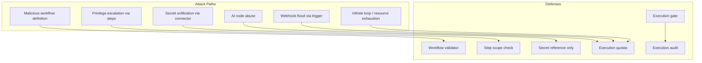
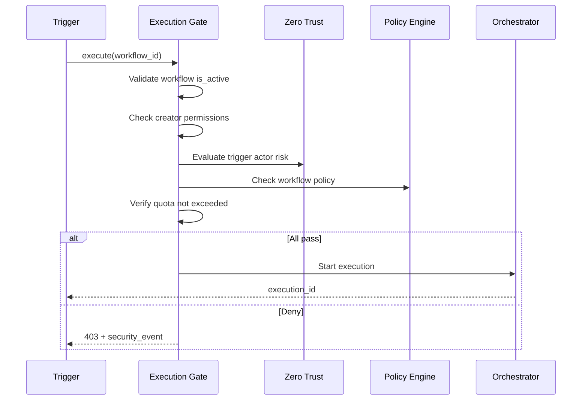

# 09 — Workflow Security Design

**Version 5.0** | Phase 12 | AI Lead Intelligence Platform

---

## Table of Contents

1. [Overview](#1-overview)
2. [Workflow Threat Model](#2-workflow-threat-model)
3. [Execution Security Gates](#3-execution-security-gates)
4. [Step-Level Authorization](#4-step-level-authorization)
5. [Secret Handling in Workflows](#5-secret-handling-in-workflows)
6. [Plugin & Connector Security](#6-plugin--connector-security)
7. [Workflow Quotas & Rate Limits](#7-workflow-quotas--rate-limits)
8. [Workflow Audit Trail](#8-workflow-audit-trail)
9. [Implementation Guide](#9-implementation-guide)
10. [Cross-References](#10-cross-references)

---

## 1. Overview

Phase 12 secures the workflow platform introduced in Phase 8 (`backend/app/workflows/`, `audit.workflows` in `admin/models.py`). Workflows automate CRM actions, AI scoring, connector sync, and webhook dispatch — each representing a **high-privilege execution path** that requires dedicated security controls.

Workflow security integrates with the policy engine, zero trust scorer, and AI security framework.

---

## 2. Workflow Threat Model



### Risk Scenarios

| Scenario | Impact | Likelihood |
|----------|--------|------------|
| Workflow exports all contacts to external URL | Data breach | Medium |
| AI step processes unlimited records | Cost + data exposure | Medium |
| Connector step uses stolen credentials | Lateral movement | Low |
| Trigger loop creates 10K executions | DoS | Medium |
| Modified workflow bypasses approval | Policy violation | Low |

---

## 3. Execution Security Gates

### Pre-Execution Checklist

Before `WorkflowExecution` starts (`audit.workflow_executions`):



### Gate Implementation

```python
# backend/app/security/workflows/execution_gate.py

class WorkflowExecutionGate:
    async def authorize(
        self,
        ctx: SecurityContext,
        workflow: Workflow,
        trigger_data: dict,
    ) -> GateResult:
        if not workflow.is_active:
            return GateResult(allowed=False, reason="workflow_inactive")

        if not ctx.has_permission("workflows:execute"):
            return GateResult(allowed=False, reason="missing_permission")

        risk = await risk_scorer.evaluate(ctx)
        if risk.level == "critical":
            return GateResult(allowed=False, reason="risk_too_high")

        policy = await policy_engine.evaluate(ctx, f"workflow:{workflow.id}", "execute")
        if not policy.allow:
            return GateResult(allowed=False, reason=policy.reason)

        quota = await quota_service.check_workflow_quota(ctx.organization_id)
        if not quota.allowed:
            return GateResult(allowed=False, reason="quota_exceeded")

        return GateResult(allowed=True)
```

---

## 4. Step-Level Authorization

### Step Type Permissions

| Step Type | Required Permission | Additional Check |
|-----------|--------------------|--------------------|
| `crm.update` | `crm:write` | Target record in org |
| `crm.export` | `crm:read` + DLP | Export threshold |
| `ai.score` | `ai:score` | Consent + AI quota |
| `connector.sync` | `connectors:write` | Connector org binding |
| `webhook.send` | `webhooks:manage` | URL allowlist |
| `search.execute` | `search:execute` | Query size limit |
| `plugin.run` | `integration:write` | Plugin sandbox |

### Step Validation at Design Time

```python
# backend/app/security/workflows/validator.py

ALLOWED_STEP_TYPES = {
    "crm.update", "crm.create", "ai.score", "connector.sync",
    "webhook.send", "search.execute", "delay", "condition", "plugin.run",
}

BLOCKED_PATTERNS = [
    {"step": "webhook.send", "url_pattern": r"^(?!https://).*"},  # HTTP only blocked
    {"step": "crm.export", "threshold": 10000},
]

async def validate_workflow_definition(steps: list[dict], ctx: SecurityContext):
    for step in steps:
        if step["type"] not in ALLOWED_STEP_TYPES:
            raise WorkflowValidationError(f"Disallowed step type: {step['type']}")
        await _check_step_permissions(step, ctx)
```

---

## 5. Secret Handling in Workflows

### Secret Reference Pattern

Workflows **never** store secrets in `steps` JSONB. Instead:

```json
{
  "type": "connector.sync",
  "config": {
    "connector_id": "uuid",
    "secret_ref": "secrets_metadata:connector_apollo_key"
  }
}
```

Runtime resolves `secret_ref` via `security/secrets/service.py` at execution time only. Secrets are:

- Never logged in `step_results`
- Masked in `WorkflowExecution` error messages
- Scoped to `organization_id`

---

## 6. Plugin & Connector Security

### Plugin Sandbox (Phase 10)

From [../phase10/05-plugin-framework-architecture.md](../phase10/05-plugin-framework-architecture.md):

| Control | Implementation |
|---------|----------------|
| Manifest scopes | Plugin declares max permissions |
| Runtime isolation | Subprocess with resource limits |
| Network egress | Allowlist only declared endpoints |
| File system | Read-only except `/tmp` |
| Execution timeout | 30 seconds default |

### Connector URL Allowlist

```python
CONNECTOR_ALLOWED_DOMAINS = [
    "api.apollo.io",
    "api.hunter.io",
    "api.clearbit.com",
    # per-connector configuration
]

async def validate_connector_url(url: str, connector_type: str):
    parsed = urlparse(url)
    if parsed.hostname not in get_allowlist(connector_type):
        raise ConnectorSecurityError(f"Domain not allowed: {parsed.hostname}")
```

---

## 7. Workflow Quotas & Rate Limits

### Per-Organization Limits

| Limit | Default | Configurable |
|-------|---------|--------------|
| Executions per hour | 500 | `security_settings` |
| Concurrent executions | 10 | Platform default |
| Max steps per workflow | 50 | Hard limit |
| Max execution duration | 30 min | Hard limit |
| AI steps per execution | 5 | Policy |
| Webhook sends per hour | 100 | Rate limit |

### Circuit Breaker

After 5 consecutive failures on a workflow:

1. Set `is_active = false` (auto-disable)
2. Create `security_alert`
3. Notify workflow owner via notification service

---

## 8. Workflow Audit Trail

### Dual Audit

| Event | `audit.audit_logs` | `security.security_events` |
|-------|-------------------|---------------------------|
| Workflow created | `workflow.create` | `workflow.definition.created` |
| Workflow executed | — | `workflow.execution.started` |
| Step failed | — | `workflow.step.failed` |
| Execution completed | — | `workflow.execution.completed` |
| Auto-disabled | `workflow.disable` | `workflow.circuit_breaker` |

### Execution Correlation

`WorkflowExecution.correlation_id` links to:

- `X-Request-Id` of triggering API call
- `security_access_logs.request_id`
- RabbitMQ message ID for async triggers

---

## 9. Implementation Guide

### Module Structure

```
backend/app/security/workflows/
├── execution_gate.py
├── validator.py
├── quota.py
└── audit.py
```

### Integration with Orchestrator

```python
# backend/app/workflows/orchestration.py (security hook)

async def execute_workflow(ctx: RequestContext, workflow_id: uuid.UUID, trigger_data: dict):
    workflow = await workflow_repo.get(ctx.organization_id, workflow_id)
    gate_result = await execution_gate.authorize(ctx, workflow, trigger_data)
    if not gate_result.allowed:
        await workflow_audit.log_denied(ctx, workflow_id, gate_result.reason)
        raise ForbiddenException(gate_result.reason)

    execution = await orchestrator.start(workflow, trigger_data)
    await workflow_audit.log_started(ctx, execution)
    return execution
```

---

## 10. Cross-References

| Topic | Document |
|-------|----------|
| AI security | [08-ai-security-framework.md](./08-ai-security-framework.md) |
| Plugin framework | [../phase10/05-plugin-framework-architecture.md](../phase10/05-plugin-framework-architecture.md) |
| Data protection / DLP | [05-data-protection-strategy.md](./05-data-protection-strategy.md) |
| Zero trust | [03-zero-trust-architecture.md](./03-zero-trust-architecture.md) |
| Audit platform | [11-audit-platform-design.md](./11-audit-platform-design.md) |