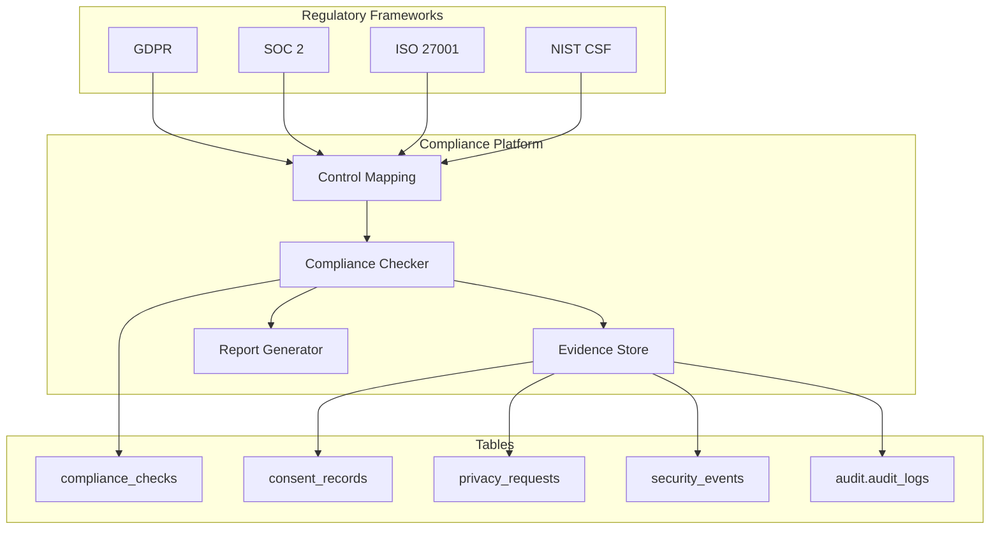

# 10 — Compliance Framework

**Version 5.0** | Phase 12 | AI Lead Intelligence Platform

---

## Table of Contents

1. [Overview](#1-overview)
2. [Compliance Architecture](#2-compliance-architecture)
3. [GDPR Compliance](#3-gdpr-compliance)
4. [SOC 2 Type II](#4-soc-2-type-ii)
5. [ISO 27001](#5-iso-27001)
6. [NIST Cybersecurity Framework](#6-nist-cybersecurity-framework)
7. [Control Mapping Matrix](#7-control-mapping-matrix)
8. [Automated Compliance Checks](#8-automated-compliance-checks)
9. [Evidence Collection](#9-evidence-collection)
10. [Cross-References](#10-cross-references)

---

## 1. Overview

Phase 12 implements a **unified compliance framework** mapping platform controls to GDPR, SOC 2, ISO 27001, and NIST CSF. Automated checks run against the `compliance_checks` table (migration 018), producing evidence for audits and continuous monitoring.

**Goal:** Compliance as code — not a annual checkbox exercise.

---

## 2. Compliance Architecture



### Compliance Service

```python
# backend/app/security/compliance/service.py

class ComplianceService:
    async def run_check(
        self,
        organization_id: uuid.UUID,
        framework: str,
        control_id: str,
    ) -> ComplianceCheckResult:
        checker = self.registry.get(framework, control_id)
        result = await checker.evaluate(organization_id)
        await self.repo.save_check(result)
        return result

    async def run_full_assessment(self, organization_id: uuid.UUID) -> AssessmentReport:
        results = []
        for control in self.registry.all_controls():
            results.append(await self.run_check(organization_id, *control))
        return AssessmentReport(organization_id=organization_id, results=results)
```

---

## 3. GDPR Compliance

### Article Mapping

| Article | Requirement | Platform Control |
|---------|-------------|------------------|
| Art. 5 | Data minimization | AI context redaction, field classification |
| Art. 6 | Lawful basis | `consent_records.legal_basis` |
| Art. 7 | Consent conditions | Consent API with evidence |
| Art. 13-14 | Transparency | Privacy policy + data inventory |
| Art. 15 | Right of access | `privacy_requests` type `access` |
| Art. 16 | Right to rectification | Privacy request workflow |
| Art. 17 | Right to erasure | Crypto-shred procedure |
| Art. 20 | Data portability | JSON/CSV export |
| Art. 25 | Privacy by design | Default PII redaction, MFA |
| Art. 30 | Records of processing | Audit logs + data inventory |
| Art. 32 | Security of processing | Full Phase 12 security stack |
| Art. 33-34 | Breach notification | Incident response playbooks |
| Art. 35 | DPIA | Required for AI scoring at scale |

### GDPR Automated Checks

| Check ID | Description | Pass Criteria |
|----------|-------------|---------------|
| `gdpr.consent.tracking` | Consent records exist for AI processing | All active AI orgs have consent workflow |
| `gdpr.retention.policy` | Retention configured | `data_retention_days` set per org |
| `gdpr.privacy.requests` | Request SLA compliance | No open requests > 30 days |
| `gdpr.encryption` | Data encrypted | TLS + column encryption active |
| `gdpr.access.logging` | Processing logged | `security_access_logs` enabled |

---

## 4. SOC 2 Type II

### Trust Service Criteria Mapping

| Criteria | Category | Platform Controls |
|----------|----------|-------------------|
| CC1.1 | Control environment | Governance framework ([19-governance-framework.md](./19-governance-framework.md)) |
| CC2.1 | Communication | Security policies documented |
| CC3.1 | Risk assessment | Risk scoring, threat model |
| CC5.1 | Control activities | Policy engine, RBAC |
| CC6.1 | Logical access | IAM, MFA, zero trust |
| CC6.2 | Credential management | API key rotation, password policy |
| CC6.3 | Network security | Segmentation, gateway |
| CC6.6 | Boundary protection | Cloudflare, firewall |
| CC6.7 | Data transmission | TLS 1.3 |
| CC6.8 | Malware prevention | Container scanning, Trivy |
| CC7.1 | System monitoring | SOC dashboards |
| CC7.2 | Anomaly detection | Threat rules, risk scoring |
| CC7.3 | Incident response | Playbooks ([12-incident-response-playbooks.md](./12-incident-response-playbooks.md)) |
| CC8.1 | Change management | CI/CD with security gates |
| CC9.1 | Risk mitigation | Vulnerability management |

### SOC 2 Automated Checks

| Check ID | TSC | Pass Criteria |
|----------|-----|---------------|
| `soc2.cc6.1.mfa` | CC6.1 | Admin MFA enrollment > 95% |
| `soc2.cc6.2.key_rotation` | CC6.2 | No API keys older than 365 days |
| `soc2.cc7.1.monitoring` | CC7.1 | Prometheus scraping active |
| `soc2.cc7.3.ir_plan` | CC7.3 | IR playbook documented and tested < 1 year |
| `soc2.cc8.1.cicd` | CC8.1 | All deploys via CI pipeline |

---

## 5. ISO 27001

### Annex A Control Mapping (Selected)

| Control | Title | Implementation |
|---------|-------|----------------|
| A.5.1 | Information security policies | [19-governance-framework.md](./19-governance-framework.md) |
| A.8.2 | Privileged access | Admin role + MFA + step-up |
| A.8.5 | Secure authentication | IAM design ([02](./02-identity-access-management-design.md)) |
| A.8.9 | Configuration management | IaC + compliance checks |
| A.8.15 | Logging | Audit platform ([11](./11-audit-platform-design.md)) |
| A.8.16 | Monitoring | SOC design ([16](./16-monitoring-soc-design.md)) |
| A.8.23 | Web filtering | Kong + Cloudflare |
| A.8.24 | Cryptography | Data protection ([05](./05-data-protection-strategy.md)) |
| A.5.24 | Incident management | IR playbooks ([12](./12-incident-response-playbooks.md)) |
| A.8.8 | Vulnerability management | [13](./13-vulnerability-management-strategy.md) |

---

## 6. NIST Cybersecurity Framework

### Function Mapping

| Function | Category | Platform Capability |
|----------|----------|---------------------|
| **Identify** | Asset Management | Data classification, schema inventory |
| **Identify** | Risk Assessment | `risk_scores`, threat model |
| **Protect** | Access Control | IAM, zero trust, RBAC |
| **Protect** | Data Security | Encryption, DLP, consent |
| **Protect** | Protective Technology | Gateway, WAF, NetworkPolicy |
| **Detect** | Anomalies & Events | `security_events`, SOC rules |
| **Detect** | Continuous Monitoring | Prometheus, Grafana SOC |
| **Respond** | Response Planning | IR playbooks |
| **Respond** | Analysis | Incident investigation API |
| **Recover** | Recovery Planning | DR ([../phase11/13-disaster-recovery.md](../phase11/13-disaster-recovery.md)) |

---

## 7. Control Mapping Matrix

| Platform Control | GDPR | SOC 2 | ISO 27001 | NIST CSF |
|------------------|------|-------|-----------|----------|
| MFA enforcement | Art. 32 | CC6.1 | A.8.5 | PR.AC |
| Tenant isolation | Art. 25 | CC6.1 | A.8.2 | PR.AC |
| Encryption at rest | Art. 32 | CC6.7 | A.8.24 | PR.DS |
| Audit logging | Art. 30 | CC7.1 | A.8.15 | DE.CM |
| Incident response | Art. 33 | CC7.3 | A.5.24 | RS.RP |
| Consent management | Art. 7 | — | A.5.34 | PR.DS |
| Vulnerability scanning | Art. 32 | CC6.8 | A.8.8 | ID.RA |
| AI PII redaction | Art. 25 | CC6.1 | A.8.11 | PR.DS |

---

## 8. Automated Compliance Checks

### `compliance_checks` Table Schema

| Field | Type | Purpose |
|-------|------|---------|
| `framework` | varchar | `gdpr`, `soc2`, `iso27001`, `nist_csf` |
| `control_id` | varchar | e.g., `gdpr.consent.tracking` |
| `status` | varchar | `pass`, `fail`, `warning`, `not_applicable` |
| `evidence` | jsonb | Check output data |
| `remediation` | text | Suggested fix if failed |
| `checked_at` | timestamptz | Last run timestamp |
| `next_check_at` | timestamptz | Scheduled re-check |

### Scheduled Execution

```yaml
# Cron: daily at 02:00 UTC
compliance-check-job:
  schedule: "0 2 * * *"
  command: python -m backend.app.security.compliance.runner --all-orgs
```

### API

```http
POST /api/v1/security/compliance/checks/run
{ "framework": "gdpr", "control_id": "gdpr.consent.tracking" }

GET /api/v1/security/compliance/checks?framework=soc2&status=fail
GET /api/v1/security/compliance/report?framework=gdpr
```

---

## 9. Evidence Collection

### Evidence Types

| Type | Source | Retention |
|------|--------|-----------|
| Configuration snapshots | Compliance check output | 1 year |
| Audit log exports | `audit.audit_logs` | 7 years |
| Security event samples | `security_events` | 1 year |
| Penetration test reports | Manual upload | 3 years |
| Policy documents | Git + governance repo | Current + 3 versions |
| Training records | HR integration | 3 years |

### Evidence Export

```http
GET /api/v1/security/compliance/evidence/{check_id}
```

Returns JSON package with:

- Check metadata
- Pass/fail status
- Supporting data (redacted)
- Timestamp and checker version

---

## 10. Cross-References

| Topic | Document |
|-------|----------|
| Data protection | [05-data-protection-strategy.md](./05-data-protection-strategy.md) |
| Audit platform | [11-audit-platform-design.md](./11-audit-platform-design.md) |
| Incident response | [12-incident-response-playbooks.md](./12-incident-response-playbooks.md) |
| Governance | [19-governance-framework.md](./19-governance-framework.md) |
| Database schema | [14-security-database-schema.md](./14-security-database-schema.md) |
| API routes | [15-api-specifications.md](./15-api-specifications.md) |