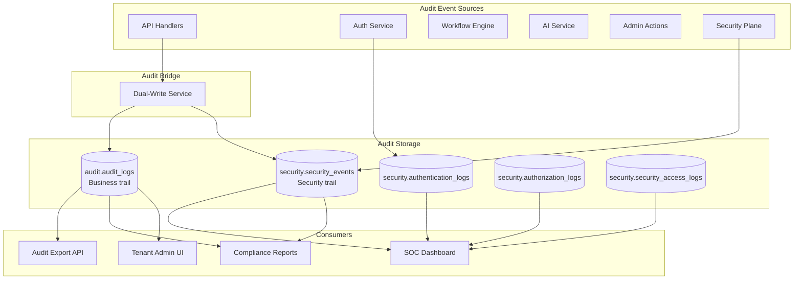

# 11 — Audit Platform Design

**Version 5.0** | Phase 12 | AI Lead Intelligence Platform

---

## Table of Contents

1. [Overview](#1-overview)
2. [Audit Architecture](#2-audit-architecture)
3. [Business Audit Trail](#3-business-audit-trail)
4. [Security Audit Trail](#4-security-audit-trail)
5. [Dual-Write Bridge](#5-dual-write-bridge)
6. [Tamper Evidence](#6-tamper-evidence)
7. [Audit Query & Export](#7-audit-query--export)
8. [Retention & Archival](#8-retention--archival)
9. [Implementation Guide](#9-implementation-guide)
10. [Cross-References](#10-cross-references)

---

## 1. Overview

Phase 12 unifies **business auditing** (existing `AuditLog` in `backend/app/admin/models.py`) with **security auditing** (new `security` schema tables) into a cohesive audit platform. The design supports compliance evidence collection, SOC investigations, and tenant admin transparency.

**Principle:** If it changes state or accesses sensitive data, it must be auditable.

---

## 2. Audit Architecture



---

## 3. Business Audit Trail

### Existing Model (`audit.audit_logs`)

From `backend/app/admin/models.py`:

| Field | Type | Purpose |
|-------|------|---------|
| `organization_id` | UUID | Tenant scope |
| `user_id` | UUID | Actor (nullable for system) |
| `entity` | string | Resource type (`contact`, `deal`, `workflow`) |
| `entity_id` | UUID | Resource identifier |
| `action` | string | `create`, `update`, `delete`, `export` |
| `old_values` | JSONB | Previous state (diff) |
| `new_values` | JSONB | New state (diff) |
| `ip_address` | string | Client IP |
| `user_agent` | string | Client UA |
| `device` | string | Parsed device info |
| `location` | string | GeoIP location |
| `created_at` | timestamptz | Event timestamp |

### Audited Actions (Minimum)

| Domain | Actions |
|--------|---------|
| CRM | `contact.create`, `contact.update`, `contact.delete`, `deal.stage_change` |
| Users | `user.invite`, `user.role_change`, `user.deactivate` |
| Security | `policy.create`, `mfa.enroll`, `device.trust`, `session.revoke` |
| Exports | `export.create`, `export.download` |
| Workflows | `workflow.create`, `workflow.execute`, `workflow.disable` |
| Integrations | `api_key.create`, `api_key.revoke`, `oauth.app.create` |

### Service Integration

```python
# backend/app/admin/service.py (existing, extended)

async def create_audit_log(
    self,
    organization_id: uuid.UUID,
    user_id: uuid.UUID | None,
    entity: str,
    action: str,
    entity_id: uuid.UUID | None = None,
    old_values: dict | None = None,
    new_values: dict | None = None,
    request_meta: RequestMeta | None = None,
) -> AuditLog:
    log = AuditLog(
        organization_id=organization_id,
        user_id=user_id,
        entity=entity,
        entity_id=entity_id,
        action=action,
        old_values=old_values,
        new_values=new_values,
        ip_address=request_meta.ip if request_meta else None,
        user_agent=request_meta.user_agent if request_meta else None,
    )
    self.db.add(log)
    await audit_bridge.maybe_emit_security_event(log)
    return log
```

---

## 4. Security Audit Trail

### Security Event Types

Table: `security.security_events`

| Category | Event Types |
|----------|-------------|
| Authentication | `auth.login.*`, `auth.mfa.*`, `auth.session.*` |
| Authorization | `authz.allowed`, `authz.denied` |
| Access | `access.api`, `access.export`, `access.admin` |
| Threat | `threat.injection`, `threat.brute_force`, `threat.cross_tenant` |
| AI | `ai.request`, `ai.injection`, `ai.output_rejected` |
| Compliance | `compliance.check.failed`, `privacy.request.received` |
| Incident | `incident.created`, `incident.escalated` |

### Event Schema

```json
{
  "id": "uuid",
  "organization_id": "uuid",
  "event_type": "authz.denied",
  "severity": "medium",
  "actor_id": "uuid",
  "actor_type": "user",
  "resource": "security.policies",
  "action": "update",
  "metadata": {
    "policy_id": "uuid",
    "reason": "mfa_not_verified",
    "request_id": "uuid",
    "risk_score": 62
  },
  "created_at": "2026-06-29T14:30:00Z"
}
```

### Specialized Log Tables

| Table | Purpose | Volume |
|-------|---------|--------|
| `authentication_logs` | Login/MFA events | High |
| `authorization_logs` | Policy decisions | High |
| `security_access_logs` | Per-request access with risk score | Very high |

High-volume tables use time-based partitioning (monthly) in production.

---

## 5. Dual-Write Bridge

```python
# backend/app/security/audit/bridge.py

SECURITY_AUDIT_ACTIONS = {
    "user.role_change", "policy.create", "policy.update", "policy.delete",
    "export.create", "api_key.create", "api_key.revoke",
    "mfa.enroll", "mfa.disable", "session.revoke",
    "privacy.request.create", "consent.withdraw",
}

class AuditBridge:
    async def maybe_emit_security_event(self, audit_log: AuditLog) -> None:
        if audit_log.action not in SECURITY_AUDIT_ACTIONS:
            return

        severity = self._action_to_severity(audit_log.action)
        await soc_processor.emit_event(
            event_type=f"audit.{audit_log.action}",
            organization_id=audit_log.organization_id,
            actor_id=audit_log.user_id,
            severity=severity,
            metadata={
                "entity": audit_log.entity,
                "entity_id": str(audit_log.entity_id),
                "audit_log_id": str(audit_log.id),
            },
        )
```

### Write Ordering

1. Business audit log committed in same transaction as state change
2. Security event emitted asynchronously via event bus (at-least-once)
3. Idempotency key: `audit_log_id` prevents duplicate security events

---

## 6. Tamper Evidence

### Append-Only Policy

| Table | DELETE Allowed | UPDATE Allowed |
|-------|---------------|----------------|
| `audit.audit_logs` | No (app policy) | No |
| `security.security_events` | No (DB REVOKE) | No |
| `security.authentication_logs` | No | No |
| `security.authorization_logs` | No | No |

### Hash Chain (Optional Enhancement)

For critical events, compute chained hashes:

```python
def compute_event_hash(event: SecurityEvent, previous_hash: str) -> str:
    payload = f"{previous_hash}|{event.id}|{event.event_type}|{event.created_at.isoformat()}"
    return hashlib.sha256(payload.encode()).hexdigest()
```

Stored in `metadata.chain_hash` for tamper detection during compliance audits.

---

## 7. Audit Query & Export

### Query APIs

```http
# Business audit (existing)
GET /api/v1/admin/audit-logs?entity=contact&action=update&page=1

# Security events (new)
GET /api/v1/security/events?severity=high&event_type=authz.denied

# Authentication logs
GET /api/v1/security/authentication-logs?user_id={uuid}

# Authorization logs
GET /api/v1/security/authorization-logs?decision=deny
```

### Export Format

```http
POST /api/v1/security/audit/export
{
  "start_date": "2026-01-01",
  "end_date": "2026-06-30",
  "include": ["audit_logs", "security_events", "authentication_logs"],
  "format": "json"
}
```

Requires `security:compliance` permission. Large exports async via worker with DLP check.

### Query Performance

| Index | Table | Columns |
|-------|-------|---------|
| `ix_audit_logs_org_created` | `audit_logs` | `(organization_id, created_at DESC)` |
| `ix_sec_events_org_type` | `security_events` | `(organization_id, event_type, created_at DESC)` |
| `ix_auth_logs_user` | `authentication_logs` | `(user_id, created_at DESC)` |

---

## 8. Retention & Archival

| Table | Hot Storage | Archive | Total Retention |
|-------|-------------|---------|-----------------|
| `audit_logs` | 2 years | S3/GCS | 7 years |
| `security_events` | 1 year | S3/GCS | 7 years |
| `authentication_logs` | 1 year | S3/GCS | 3 years |
| `security_access_logs` | 90 days | S3/GCS | 1 year |
| `authorization_logs` | 1 year | S3/GCS | 3 years |

### Archival Job

```python
# Monthly cron: archive records older than hot threshold
async def archive_security_events(cutoff: datetime):
    batch = await repo.get_events_before(cutoff, limit=10000)
    await s3_exporter.upload_parquet(batch, prefix=f"security_events/{cutoff:%Y/%m}/")
    # Records remain in PG until total retention, marked archived_at
```

---

## 9. Implementation Guide

### Module Structure

```
backend/app/security/
├── audit/
│   ├── bridge.py
│   ├── exporter.py
│   └── archiver.py
└── soc/
    ├── processor.py
    └── correlator.py
```

### Decorator for Automatic Auditing

```python
# backend/app/security/audit/decorator.py

def audited(entity: str, action: str):
    def decorator(fn):
        @wraps(fn)
        async def wrapper(ctx: RequestContext, *args, **kwargs):
            old = await capture_state(ctx, entity, kwargs) if action == "update" else None
            result = await fn(ctx, *args, **kwargs)
            new = capture_result(result) if action in ("create", "update") else None
            await admin_service.create_audit_log(
                ctx.organization_id, ctx.user_id, entity, action,
                old_values=old, new_values=new,
            )
            return result
        return wrapper
    return decorator
```

---

## 10. Cross-References

| Topic | Document |
|-------|----------|
| Compliance evidence | [10-compliance-framework.md](./10-compliance-framework.md) |
| SOC monitoring | [16-monitoring-soc-design.md](./16-monitoring-soc-design.md) |
| Database schema | [14-security-database-schema.md](./14-security-database-schema.md) |
| API routes | [15-api-specifications.md](./15-api-specifications.md) |
| Data protection | [05-data-protection-strategy.md](./05-data-protection-strategy.md) |
| Phase 10 audit patterns | [../phase10/13-security-architecture.md](../phase10/13-security-architecture.md) |