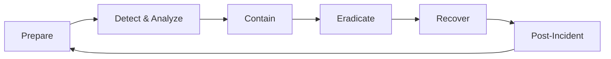
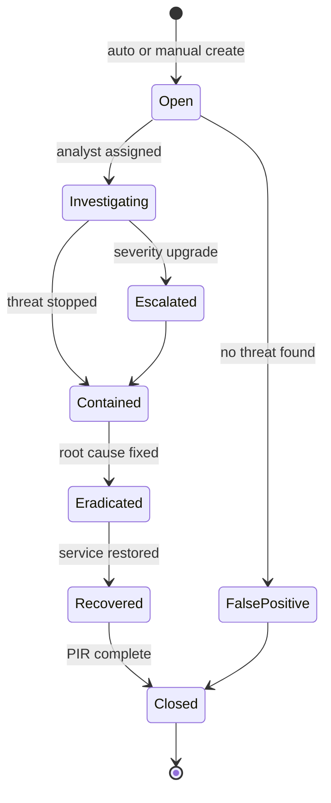

# 12 — Incident Response Playbooks

**Version 5.0** | Phase 12 | AI Lead Intelligence Platform

---

## Table of Contents

1. [Overview](#1-overview)
2. [Incident Response Framework](#2-incident-response-framework)
3. [Severity Classification](#3-severity-classification)
4. [Incident Lifecycle](#4-incident-lifecycle)
5. [Playbook: Credential Compromise](#5-playbook-credential-compromise)
6. [Playbook: Data Breach](#6-playbook-data-breach)
7. [Playbook: Cross-Tenant Access](#7-playbook-cross-tenant-access)
8. [Playbook: DDoS / API Abuse](#8-playbook-ddos--api-abuse)
9. [Playbook: AI Security Incident](#9-playbook-ai-security-incident)
10. [Communication Templates](#10-communication-templates)

---

## 1. Overview

Phase 12 provides **actionable incident response playbooks** for the AI Lead Intelligence Platform. Incidents are tracked in `security.security_incidents` with automated creation from `security_alerts` and SOC correlation rules.

Extends Phase 11 incident response ([../phase11/19-incident-response.md](../phase11/19-incident-response.md)) with security-specific procedures.

---

## 2. Incident Response Framework

### NIST IR Phases



### Roles

| Role | Responsibility | Platform Permission |
|------|----------------|---------------------|
| Incident Commander | Overall coordination | `security:admin` |
| SOC Analyst | Investigation, triage | `security:investigate` |
| Platform Engineer | Technical remediation | `platform:admin` |
| Communications Lead | Customer/regulatory notification | `security:compliance` |
| Legal / DPO | GDPR breach assessment | External |

### IR Contact Matrix

| Severity | Response Time | Notification |
|----------|---------------|--------------|
| P1 Critical | 15 minutes | Page on-call + CISO |
| P2 High | 1 hour | Slack `#security-incidents` |
| P3 Medium | 4 hours | Ticket + daily standup |
| P4 Low | 24 hours | Ticket queue |

---

## 3. Severity Classification

| Severity | Criteria | Examples |
|----------|----------|----------|
| **P1 Critical** | Active breach, mass data exposure, production down | Confirmed data exfiltration, root compromise |
| **P2 High** | Attempted breach, privilege escalation, service degradation | Cross-tenant access attempts, API key leak |
| **P3 Medium** | Policy violation, suspicious activity, isolated failure | Brute force campaign, AI injection attempts |
| **P4 Low** | Informational, single failed auth, config drift | Single failed login, compliance warning |

### Auto-Classification Rules

```python
INCIDENT_AUTO_RULES = [
    {"event": "threat.data_exfiltration", "severity": "P1"},
    {"event": "threat.cross_tenant", "count": 3, "window": "5m", "severity": "P2"},
    {"event": "auth.login.failure", "count": 50, "window": "5m", "severity": "P3"},
    {"event": "ai.prompt_injection", "count": 5, "window": "1h", "severity": "P3"},
]
```

---

## 4. Incident Lifecycle

### `security_incidents` State Machine



### Incident API

```http
POST /api/v1/security/incidents
GET  /api/v1/security/incidents/{id}
PATCH /api/v1/security/incidents/{id}
POST /api/v1/security/incidents/{id}/timeline
POST /api/v1/security/incidents/{id}/close
```

### Timeline Entry

```json
{
  "timestamp": "2026-06-29T15:00:00Z",
  "actor": "soc-analyst@company.com",
  "action": "contained",
  "notes": "Revoked compromised API key, blocked source IP"
}
```

---

## 5. Playbook: Credential Compromise

### Trigger

- `security_alert` type `credential.compromised`
- User report of unauthorized access
- API key found in public repository (gitleaks CI alert)

### Response Steps

| Step | Action | Owner | Time |
|------|--------|-------|------|
| 1 | Confirm compromise scope | SOC Analyst | 15 min |
| 2 | Revoke all sessions for affected user | Platform Eng | 5 min |
| 3 | Revoke API keys / rotate OAuth secrets | Platform Eng | 10 min |
| 4 | Force password reset + MFA re-enrollment | Platform Eng | 10 min |
| 5 | Review `authentication_logs` for anomaly window | SOC Analyst | 30 min |
| 6 | Review `audit_logs` for unauthorized actions | SOC Analyst | 30 min |
| 7 | Create `security_incident` (P2) | SOC Analyst | 5 min |
| 8 | Notify affected org admin | Comms Lead | 1 hour |

### Commands

```powershell
# Revoke all sessions for user
curl -X POST http://localhost/api/v1/security/sessions/revoke-all `
  -H "Authorization: Bearer $ADMIN_TOKEN" `
  -d '{ "user_id": "uuid" }'

# Revoke API key
curl -X DELETE http://localhost/api/v1/users/me/api-keys/{key_id} `
  -H "Authorization: Bearer $ADMIN_TOKEN"
```

### Evidence Collection

- Export `authentication_logs` for 7 days prior
- Export `authorization_logs` for affected user
- Screenshot/export `risk_scores` history

---

## 6. Playbook: Data Breach

### Trigger

- DLP alert on mass export
- Confirmed unauthorized data access
- Third-party notification of leaked data

### Response Steps (GDPR Art. 33/34)

| Step | Action | SLA |
|------|--------|-----|
| 1 | Activate P1 incident | Immediate |
| 2 | Contain: suspend affected accounts, block IPs | 30 min |
| 3 | Assess scope: what data, how many subjects | 4 hours |
| 4 | Preserve evidence: export logs, snapshot DB | 4 hours |
| 5 | Legal/DPO assessment: notify supervisory authority? | 48 hours |
| 6 | Notify affected data subjects if high risk | 72 hours |
| 7 | Eradicate root cause | 24 hours |
| 8 | Post-incident review | 5 business days |

### GDPR Breach Assessment

| Question | If Yes |
|----------|--------|
| Personal data involved? | GDPR applies |
| Risk to rights/freedoms? | Notify authority (72h) |
| High risk to individuals? | Notify data subjects |
| Encryption rendered data unintelligible? | May reduce notification requirement |

---

## 7. Playbook: Cross-Tenant Access

### Trigger

- `security_event` type `threat.cross_tenant` (severity high)
- 3+ cross-tenant attempts in 5 minutes

### Response Steps

| Step | Action |
|------|--------|
| 1 | Auto-elevate risk score to critical for actor |
| 2 | Block actor IP at Kong `ip-restriction` |
| 3 | Revoke actor sessions and API keys |
| 4 | Query `security_access_logs` for successful cross-tenant reads |
| 5 | If data accessed: escalate to P1 data breach playbook |
| 6 | Review code path for IDOR vulnerability |
| 7 | Deploy hotfix if application bug confirmed |

### Investigation Query

```sql
SELECT * FROM security.security_access_logs
WHERE organization_id = :victim_org_id
  AND actor_id = :suspect_user_id
  AND created_at > NOW() - INTERVAL '24 hours'
ORDER BY created_at DESC;
```

---

## 8. Playbook: DDoS / API Abuse

### Trigger

- Sustained 429 responses
- `security_alert` type `abuse.rate_limit`
- Cloudflare DDoS notification

### Response Steps

| Step | Action |
|------|--------|
| 1 | Confirm attack vs legitimate traffic spike |
| 2 | Enable Cloudflare "Under Attack" mode |
| 3 | Tighten Kong rate limits (global + per-route) |
| 4 | Block abusive IPs at Kong `ip-restriction` |
| 5 | Scale API pods if capacity issue (not attack) |
| 6 | Monitor `security_access_logs` for patterns |
| 7 | Gradually restore normal rate limits after 24h clean |

### Rate Limit Emergency Config

```yaml
# Temporary Kong override
plugins:
  - name: rate-limiting
    config:
      minute: 100    # reduced from 1000
      policy: redis
```

---

## 9. Playbook: AI Security Incident

### Trigger

- `security_event` type `ai.prompt_injection` (5+ in 1 hour)
- AI output containing unredacted PII persisted to CRM
- Excessive LLM API costs (quota exceeded by 10x)

### Response Steps

| Step | Action |
|------|--------|
| 1 | Disable AI operations for affected org (feature flag) |
| 2 | Review `security_events` for injection patterns |
| 3 | Identify affected contacts/records |
| 4 | Redact PII from incorrectly persisted data |
| 5 | Review and update injection blocklist |
| 6 | Re-enable AI with enhanced monitoring |
| 7 | Update `policy_definitions` if policy gap found |

### Containment API

```http
PATCH /api/v1/security/settings
{ "ai_operations_suspended": true }
```

---

## 10. Communication Templates

### Internal (Slack `#security-incidents`)

```
🚨 [P{severity}] Security Incident #{id}
Type: {incident_type}
Affected Org: {organization_name}
Status: {status}
IC: {incident_commander}
Summary: {one_line_summary}
Timeline: /api/v1/security/incidents/{id}
```

### Customer Notification (Data Breach)

```
Subject: Security Incident Notification — AI Lead Intelligence Platform

Dear {org_admin_name},

We are writing to inform you of a security incident affecting your
organization's data on the AI Lead Intelligence Platform.

What happened: {brief_description}
When: {incident_window}
What data was involved: {data_categories}
What we are doing: {remediation_steps}
What you can do: {recommended_actions}

Contact: security@example.com

Sincerely,
Security Team
```

### Post-Incident Review Template

| Section | Content |
|---------|---------|
| Incident summary | Timeline, severity, duration |
| Root cause | Technical and process gaps |
| Impact | Data, users, SLA |
| What went well | Effective controls |
| What to improve | Action items with owners |
| Lessons learned | Process/code changes |

---

## Cross-References

| Topic | Document |
|-------|----------|
| SOC monitoring | [16-monitoring-soc-design.md](./16-monitoring-soc-design.md) |
| Compliance (GDPR breach) | [10-compliance-framework.md](./10-compliance-framework.md) |
| Database schema | [14-security-database-schema.md](./14-security-database-schema.md) |
| API routes | [15-api-specifications.md](./15-api-specifications.md) |
| Phase 11 IR | [../phase11/19-incident-response.md](../phase11/19-incident-response.md) |