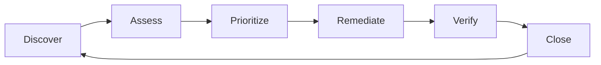

# 13 — Vulnerability Management Strategy

**Version 5.0** | Phase 12 | AI Lead Intelligence Platform

---

## Table of Contents

1. [Overview](#1-overview)
2. [Vulnerability Management Lifecycle](#2-vulnerability-management-lifecycle)
3. [Scanning Sources](#3-scanning-sources)
4. [Severity & Prioritization](#4-severity--prioritization)
5. [Remediation SLAs](#5-remediation-slas)
6. [Vulnerability Reports Table](#6-vulnerability-reports-table)
7. [Dependency Management](#7-dependency-management)
8. [Container & Infrastructure Scanning](#8-container--infrastructure-scanning)
9. [Penetration Testing](#9-penetration-testing)
10. [Cross-References](#10-cross-references)

---

## 1. Overview

Phase 12 establishes a **continuous vulnerability management program** for the AI Lead Intelligence Platform. Findings are tracked in `security.vulnerability_reports` (migration 018) with automated ingestion from CI scanners, container scans, and manual penetration test reports.

Aligns with SOC 2 CC6.8, ISO 27001 A.8.8, and NIST CSF ID.RA.

---

## 2. Vulnerability Management Lifecycle



### Process Stages

| Stage | Activities | Tools |
|-------|------------|-------|
| Discover | SAST, DAST, SCA, container scan, pen test | Bandit, pip-audit, Trivy, OWASP ZAP |
| Assess | CVSS scoring, exploitability analysis | Manual + automated |
| Prioritize | Risk-based ranking | Vulnerability board |
| Remediate | Patch, config fix, compensating control | PRs, hotfix deploy |
| Verify | Re-scan, regression test | CI pipeline |
| Close | Update `vulnerability_reports.status` | Security API |

---

## 3. Scanning Sources

### CI Pipeline Scans (Every PR + Daily)

| Scanner | Target | Threshold |
|---------|--------|-----------|
| `bandit` | Python source (`backend/app/`) | No HIGH findings |
| `pip-audit` | Python dependencies | No known CVEs (CRITICAL/HIGH) |
| `npm audit` | Frontend dependencies | No HIGH |
| `gitleaks` | Git history + diff | Zero secrets |
| `trivy` | Container images | No CRITICAL CVEs |
| `hadolint` | Dockerfiles | No error-level |

### Scheduled Scans

| Scan | Frequency | Scope |
|------|-----------|-------|
| Full dependency audit | Daily | All `requirements*.txt`, `package.json` |
| Container image scan | On build + weekly | All production images |
| Infrastructure config | Weekly | K8s manifests, Terraform |
| DAST (OWASP ZAP) | Monthly | Staging API via gateway |
| SSL/TLS check | Weekly | Production endpoints |

### Scan Integration

```yaml
# .github/workflows/vulnerability-scan.yml
name: Vulnerability Scan
on:
  pull_request:
  schedule:
    - cron: '0 6 * * 1'  # Weekly Monday 06:00 UTC

jobs:
  python-deps:
    steps:
      - run: pip-audit -r backend/requirements.txt --format json > pip-audit.json
      - uses: actions/upload-artifact@v4
        with:
          name: pip-audit-report
          path: pip-audit.json
```

---

## 4. Severity & Prioritization

### CVSS-Based Severity

| Severity | CVSS Range | Priority |
|----------|------------|----------|
| Critical | 9.0–10.0 | P1 — immediate |
| High | 7.0–8.9 | P2 — urgent |
| Medium | 4.0–6.9 | P3 — planned |
| Low | 0.1–3.9 | P4 — backlog |
| Informational | 0.0 | Track only |

### Risk-Adjusted Priority

Final priority considers:

| Factor | Adjustment |
|--------|------------|
| Exploit available in wild | +1 severity level |
| Affects production auth/data | +1 severity level |
| Compensating control in place | -1 severity level |
| Dev-only dependency | -1 severity level |
| AI/LLM prompt surface | +1 severity level |

---

## 5. Remediation SLAs

| Severity | Time to Remediate | Escalation |
|----------|-------------------|------------|
| Critical | 24 hours | CISO notification at 12h |
| High | 7 days | Security lead at 5 days |
| Medium | 30 days | Sprint planning |
| Low | 90 days | Backlog review quarterly |

### Exception Process

Compensating controls allow SLA extension:

1. Document compensating control in `vulnerability_reports.remediation_notes`
2. Set `status = accepted_risk` with `review_date`
3. Require `security:admin` approval
4. Re-review at `review_date`

---

## 6. Vulnerability Reports Table

### Schema (`security.vulnerability_reports`)

| Field | Type | Purpose |
|-------|------|---------|
| `id` | UUID | Primary key |
| `organization_id` | UUID | Null for platform-wide findings |
| `source` | varchar | `pip-audit`, `trivy`, `bandit`, `pentest`, `manual` |
| `title` | varchar | Vulnerability title |
| `description` | text | Full description |
| `cve_id` | varchar | CVE identifier (if applicable) |
| `cvss_score` | decimal | CVSS base score |
| `severity` | varchar | critical, high, medium, low |
| `affected_component` | varchar | Package, image, or file path |
| `affected_version` | varchar | Version range |
| `fixed_version` | varchar | Patched version |
| `status` | varchar | open, in_progress, remediated, accepted_risk, false_positive |
| `assigned_to` | UUID | Remediation owner |
| `discovered_at` | timestamptz | First detection |
| `remediated_at` | timestamptz | Fix deployed |
| `remediation_notes` | text | Fix details or risk acceptance |
| `metadata` | jsonb | Scanner output, links |

### API

```http
GET  /api/v1/security/vulnerabilities?status=open&severity=critical
POST /api/v1/security/vulnerabilities
PATCH /api/v1/security/vulnerabilities/{id}
POST /api/v1/security/vulnerabilities/import  # CI scanner ingest
```

### Auto-Ingest from CI

```python
# backend/app/security/vulnerability/ingest.py

async def ingest_scan_report(source: str, report: dict) -> list[VulnerabilityReport]:
    findings = []
    for item in report["vulnerabilities"]:
        existing = await repo.find_by_cve_and_component(item["cve"], item["package"])
        if existing and existing.status == "remediated":
            continue
        findings.append(VulnerabilityReport(
            source=source,
            cve_id=item.get("cve"),
            severity=map_cvss_to_severity(item["cvss"]),
            affected_component=item["package"],
            affected_version=item["version"],
            fixed_version=item.get("fix_version"),
            status="open",
            metadata=item,
        ))
    await repo.bulk_upsert(findings)
    return findings
```

---

## 7. Dependency Management

### Python Dependencies

| File | Purpose |
|------|---------|
| `backend/requirements.txt` | Core API dependencies |
| `backend/requirements-platform.txt` | Phase 10 integration deps |
| `backend/requirements-security.txt` | Phase 12: `pyotp`, `cryptography` |

### Pinning Policy

- Pin major.minor for production (`fastapi>=0.110,<0.111`)
- Review Dependabot PRs within 48 hours
- No direct git URL dependencies in production

### Frontend Dependencies

- `npm audit` in CI with `--audit-level=high`
- Lock file (`package-lock.json`) committed and enforced

---

## 8. Container & Infrastructure Scanning

### Container Hardening Checklist

| Check | Tool | Pass Criteria |
|-------|------|---------------|
| No CRITICAL CVEs in base image | Trivy | 0 critical |
| Non-root user | Dockerfile review | `USER` directive present |
| No secrets in layers | Trivy secret scanner | 0 findings |
| Minimal attack surface | Image size review | < 500MB for API |

### Infrastructure Config Review

| Config | Check |
|--------|-------|
| K8s manifests | No `privileged: true`, resource limits set |
| Kong config | No wildcard CORS in production |
| Traefik config | HSTS enabled, TLS minimum 1.2 |
| Terraform | No public S3 buckets, security groups restrictive |

---

## 9. Penetration Testing

### Schedule

| Type | Frequency | Scope |
|------|-----------|-------|
| Automated DAST | Monthly | Staging API |
| Manual pen test | Annual | Full platform |
| Red team exercise | Biennial | Production (scoped) |
| Bug bounty | Continuous (optional) | Public API surface |

### Scope Areas

1. API gateway bypass attempts
2. Cross-tenant data access (IDOR)
3. OAuth flow manipulation
4. Webhook signature bypass
5. AI prompt injection
6. Workflow privilege escalation
7. Admin panel access controls

### Report Ingestion

Pen test findings imported via:

```http
POST /api/v1/security/vulnerabilities/import
Content-Type: application/json

{
  "source": "pentest",
  "report_date": "2026-06-15",
  "findings": [
    {
      "title": "IDOR in contact export",
      "severity": "high",
      "description": "...",
      "affected_component": "/api/v1/exports/{id}",
      "remediation": "Enforce organization_id from JWT"
    }
  ]
}
```

---

## 10. Cross-References

| Topic | Document |
|-------|----------|
| Infrastructure security | [07-infrastructure-security-model.md](./07-infrastructure-security-model.md) |
| CI/CD security | [07-infrastructure-security-model.md](./07-infrastructure-security-model.md) |
| Compliance mapping | [10-compliance-framework.md](./10-compliance-framework.md) |
| Testing strategy | [17-testing-strategy.md](./17-testing-strategy.md) |
| Database schema | [14-security-database-schema.md](./14-security-database-schema.md) |
| Incident response | [12-incident-response-playbooks.md](./12-incident-response-playbooks.md) |