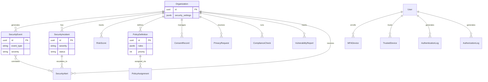

# 14 — Security Database Schema

**Version 5.0** | Phase 12 | AI Lead Intelligence Platform

---

## Table of Contents

1. [Overview](#1-overview)
2. [Schema DDL](#2-schema-ddl)
3. [Security Events & Incidents](#3-security-events--incidents)
4. [Risk & Access Logs](#4-risk--access-logs)
5. [Authentication & Authorization Logs](#5-authentication--authorization-logs)
6. [Identity Security Tables](#6-identity-security-tables)
7. [Policy Tables](#7-policy-tables)
8. [Compliance & Privacy Tables](#8-compliance--privacy-tables)
9. [Vulnerability & Alert Tables](#9-vulnerability--alert-tables)
10. [Migration Script & ERD](#10-migration-script--erd)

---

## 1. Overview

All Phase 12 security tables reside in the PostgreSQL `security` schema, following the multi-schema pattern in `backend/app/common/db_schemas.py`.

**Migration:** `backend/migrations/versions/018_phase12_enterprise_security.py`

**Conventions:**
- `organization_id UUID NOT NULL` on every tenant-scoped table
- `created_at TIMESTAMPTZ NOT NULL DEFAULT NOW()` on all tables
- UUIDs via `gen_random_uuid()`
- Append-only tables: `security_events`, `authentication_logs`, `authorization_logs`
- Secrets stored as hashes/encrypted values only — never plaintext

### Schema Constant Addition

```python
# backend/app/common/db_schemas.py
class DBSchema:
    # ... existing schemas ...
    SECURITY = "security"  # events, incidents, policies, compliance, IAM
```

---

## 2. Schema DDL

```sql
-- 018_phase12_enterprise_security.py

CREATE SCHEMA IF NOT EXISTS security;

GRANT USAGE ON SCHEMA security TO app_user;
GRANT SELECT, INSERT, UPDATE ON ALL TABLES IN SCHEMA security TO app_user;
ALTER DEFAULT PRIVILEGES IN SCHEMA security
    GRANT SELECT, INSERT, UPDATE ON TABLES TO app_user;

-- Append-only: revoke DELETE on immutable tables
REVOKE DELETE ON security.security_events FROM app_user;
REVOKE DELETE ON security.authentication_logs FROM app_user;
REVOKE DELETE ON security.authorization_logs FROM app_user;
```

### Organizations Extension

```sql
ALTER TABLE core.organizations
    ADD COLUMN IF NOT EXISTS security_settings JSONB NOT NULL DEFAULT '{}'::jsonb;
```

---

## 3. Security Events & Incidents

### 3.1 security_events

```sql
CREATE TABLE security.security_events (
    id              UUID PRIMARY KEY DEFAULT gen_random_uuid(),
    organization_id UUID NOT NULL REFERENCES core.organizations(id) ON DELETE CASCADE,
    event_type      VARCHAR(100) NOT NULL,
    severity        VARCHAR(20) NOT NULL DEFAULT 'info',
    actor_id        UUID,
    actor_type      VARCHAR(30) NOT NULL DEFAULT 'user',
    resource        VARCHAR(200),
    action          VARCHAR(100),
    metadata        JSONB NOT NULL DEFAULT '{}',
    request_id      VARCHAR(100),
    correlation_id  VARCHAR(100),
    source_ip       VARCHAR(45),
    created_at      TIMESTAMPTZ NOT NULL DEFAULT NOW()
);

CREATE INDEX ix_sec_events_org_created
    ON security.security_events(organization_id, created_at DESC);
CREATE INDEX ix_sec_events_type
    ON security.security_events(event_type, created_at DESC);
CREATE INDEX ix_sec_events_severity
    ON security.security_events(severity)
    WHERE severity IN ('high', 'critical');
CREATE INDEX ix_sec_events_actor
    ON security.security_events(actor_id, created_at DESC);
CREATE INDEX ix_sec_events_request
    ON security.security_events(request_id)
    WHERE request_id IS NOT NULL;
```

### 3.2 security_incidents

```sql
CREATE TABLE security.security_incidents (
    id              UUID PRIMARY KEY DEFAULT gen_random_uuid(),
    organization_id UUID NOT NULL REFERENCES core.organizations(id) ON DELETE CASCADE,
    title           VARCHAR(500) NOT NULL,
    description     TEXT,
    severity        VARCHAR(10) NOT NULL,  -- P1, P2, P3, P4
    status          VARCHAR(30) NOT NULL DEFAULT 'open',
    incident_type   VARCHAR(100) NOT NULL,
    assigned_to     UUID REFERENCES auth.users(id) ON DELETE SET NULL,
    opened_at       TIMESTAMPTZ NOT NULL DEFAULT NOW(),
    contained_at    TIMESTAMPTZ,
    resolved_at     TIMESTAMPTZ,
    closed_at       TIMESTAMPTZ,
    timeline        JSONB NOT NULL DEFAULT '[]',
    root_cause      TEXT,
    remediation     TEXT,
    metadata        JSONB NOT NULL DEFAULT '{}',
    created_at      TIMESTAMPTZ NOT NULL DEFAULT NOW(),
    updated_at      TIMESTAMPTZ NOT NULL DEFAULT NOW()
);

CREATE INDEX ix_sec_incidents_org_status
    ON security.security_incidents(organization_id, status);
CREATE INDEX ix_sec_incidents_severity
    ON security.security_incidents(severity)
    WHERE status NOT IN ('closed', 'false_positive');
```

---

## 4. Risk & Access Logs

### 4.1 risk_scores

```sql
CREATE TABLE security.risk_scores (
    id              UUID PRIMARY KEY DEFAULT gen_random_uuid(),
    organization_id UUID NOT NULL REFERENCES core.organizations(id) ON DELETE CASCADE,
    subject_type    VARCHAR(30) NOT NULL,  -- user, api_key, device, session
    subject_id      UUID NOT NULL,
    score           INT NOT NULL CHECK (score >= 0 AND score <= 100),
    level           VARCHAR(20) NOT NULL,  -- low, medium, high, critical
    factors         JSONB NOT NULL DEFAULT '[]',
    computed_at     TIMESTAMPTZ NOT NULL DEFAULT NOW(),
    expires_at      TIMESTAMPTZ NOT NULL,
    created_at      TIMESTAMPTZ NOT NULL DEFAULT NOW()
);

CREATE UNIQUE INDEX uq_risk_scores_subject
    ON security.risk_scores(organization_id, subject_type, subject_id);
CREATE INDEX ix_risk_scores_level
    ON security.risk_scores(level)
    WHERE level IN ('high', 'critical');
```

### 4.2 security_access_logs

```sql
CREATE TABLE security.security_access_logs (
    id              UUID PRIMARY KEY DEFAULT gen_random_uuid(),
    organization_id UUID NOT NULL REFERENCES core.organizations(id) ON DELETE CASCADE,
    user_id         UUID,
    auth_method     VARCHAR(30),  -- jwt, api_key, oauth
    endpoint        VARCHAR(500) NOT NULL,
    http_method     VARCHAR(10) NOT NULL,
    status_code     INT NOT NULL,
    risk_score      INT,
    decision        VARCHAR(20) NOT NULL,  -- allow, deny, step_up
    policy_ids      JSONB DEFAULT '[]',
    request_id      VARCHAR(100),
    source_ip       VARCHAR(45),
    user_agent      VARCHAR(500),
    duration_ms     INT,
    created_at      TIMESTAMPTZ NOT NULL DEFAULT NOW()
);

CREATE INDEX ix_access_logs_org_created
    ON security.security_access_logs(organization_id, created_at DESC);
CREATE INDEX ix_access_logs_user
    ON security.security_access_logs(user_id, created_at DESC);
CREATE INDEX ix_access_logs_decision
    ON security.security_access_logs(decision)
    WHERE decision = 'deny';
```

---

## 5. Authentication & Authorization Logs

### 5.1 authentication_logs

```sql
CREATE TABLE security.authentication_logs (
    id              UUID PRIMARY KEY DEFAULT gen_random_uuid(),
    organization_id UUID NOT NULL REFERENCES core.organizations(id) ON DELETE CASCADE,
    user_id         UUID REFERENCES auth.users(id) ON DELETE SET NULL,
    event_type      VARCHAR(50) NOT NULL,
    success         BOOLEAN NOT NULL,
    failure_reason  VARCHAR(200),
    mfa_method      VARCHAR(30),
    device_id       UUID,
    source_ip       VARCHAR(45),
    user_agent      VARCHAR(500),
    geo_location    VARCHAR(200),
    metadata        JSONB NOT NULL DEFAULT '{}',
    created_at      TIMESTAMPTZ NOT NULL DEFAULT NOW()
);

CREATE INDEX ix_auth_logs_org_created
    ON security.authentication_logs(organization_id, created_at DESC);
CREATE INDEX ix_auth_logs_user
    ON security.authentication_logs(user_id, created_at DESC);
CREATE INDEX ix_auth_logs_failures
    ON security.authentication_logs(source_ip, created_at DESC)
    WHERE success = false;
```

### 5.2 authorization_logs

```sql
CREATE TABLE security.authorization_logs (
    id              UUID PRIMARY KEY DEFAULT gen_random_uuid(),
    organization_id UUID NOT NULL REFERENCES core.organizations(id) ON DELETE CASCADE,
    user_id         UUID REFERENCES auth.users(id) ON DELETE SET NULL,
    resource        VARCHAR(200) NOT NULL,
    action          VARCHAR(100) NOT NULL,
    decision        VARCHAR(10) NOT NULL,  -- allow, deny
    policy_id       UUID,
    reason          VARCHAR(500),
    risk_score      INT,
    request_id      VARCHAR(100),
    metadata        JSONB NOT NULL DEFAULT '{}',
    created_at      TIMESTAMPTZ NOT NULL DEFAULT NOW()
);

CREATE INDEX ix_authz_logs_org_created
    ON security.authorization_logs(organization_id, created_at DESC);
CREATE INDEX ix_authz_logs_denies
    ON security.authorization_logs(decision, created_at DESC)
    WHERE decision = 'deny';
```

---

## 6. Identity Security Tables

### 6.1 mfa_devices

```sql
CREATE TABLE security.mfa_devices (
    id              UUID PRIMARY KEY DEFAULT gen_random_uuid(),
    organization_id UUID NOT NULL REFERENCES core.organizations(id) ON DELETE CASCADE,
    user_id         UUID NOT NULL REFERENCES auth.users(id) ON DELETE CASCADE,
    type            VARCHAR(30) NOT NULL,  -- totp, webauthn, backup
    label           VARCHAR(200) NOT NULL,
    secret_encrypted TEXT,  -- AES-256-GCM encrypted; null for webauthn public key ref
    credential_id   VARCHAR(500),  -- WebAuthn credential ID
    is_verified     BOOLEAN NOT NULL DEFAULT false,
    is_primary      BOOLEAN NOT NULL DEFAULT false,
    last_used_at    TIMESTAMPTZ,
    created_at      TIMESTAMPTZ NOT NULL DEFAULT NOW(),
    updated_at      TIMESTAMPTZ NOT NULL DEFAULT NOW()
);

CREATE INDEX ix_mfa_devices_user
    ON security.mfa_devices(user_id)
    WHERE is_verified = true;
```

### 6.2 trusted_devices

```sql
CREATE TABLE security.trusted_devices (
    id                  UUID PRIMARY KEY DEFAULT gen_random_uuid(),
    organization_id     UUID NOT NULL REFERENCES core.organizations(id) ON DELETE CASCADE,
    user_id             UUID NOT NULL REFERENCES auth.users(id) ON DELETE CASCADE,
    device_fingerprint  VARCHAR(64) NOT NULL,
    device_name         VARCHAR(200),
    last_seen_at        TIMESTAMPTZ NOT NULL DEFAULT NOW(),
    trust_expires_at    TIMESTAMPTZ NOT NULL,
    last_ip_address     VARCHAR(45),
    user_agent          VARCHAR(500),
    is_revoked          BOOLEAN NOT NULL DEFAULT false,
    created_at          TIMESTAMPTZ NOT NULL DEFAULT NOW()
);

CREATE UNIQUE INDEX uq_trusted_devices_fingerprint
    ON security.trusted_devices(user_id, device_fingerprint)
    WHERE is_revoked = false;
```

### 6.3 secrets_metadata

```sql
CREATE TABLE security.secrets_metadata (
    id              UUID PRIMARY KEY DEFAULT gen_random_uuid(),
    organization_id UUID,  -- null for platform-level secrets
    name            VARCHAR(200) NOT NULL,
    version         INT NOT NULL DEFAULT 1,
    provider        VARCHAR(50) NOT NULL DEFAULT 'env',
    status          VARCHAR(20) NOT NULL DEFAULT 'active',
    rotated_at      TIMESTAMPTZ,
    expires_at      TIMESTAMPTZ,
    metadata        JSONB NOT NULL DEFAULT '{}',
    created_at      TIMESTAMPTZ NOT NULL DEFAULT NOW(),
    updated_at      TIMESTAMPTZ NOT NULL DEFAULT NOW()
);

CREATE UNIQUE INDEX uq_secrets_name_version
    ON security.secrets_metadata(name, version);
```

---

## 7. Policy Tables

### 7.1 policy_definitions

```sql
CREATE TABLE security.policy_definitions (
    id              UUID PRIMARY KEY DEFAULT gen_random_uuid(),
    organization_id UUID NOT NULL REFERENCES core.organizations(id) ON DELETE CASCADE,
    name            VARCHAR(200) NOT NULL,
    description     TEXT,
    category        VARCHAR(50) NOT NULL,
    rules           JSONB NOT NULL,
    priority        INT NOT NULL DEFAULT 100,
    is_active       BOOLEAN NOT NULL DEFAULT true,
    created_by      UUID REFERENCES auth.users(id) ON DELETE SET NULL,
    created_at      TIMESTAMPTZ NOT NULL DEFAULT NOW(),
    updated_at      TIMESTAMPTZ NOT NULL DEFAULT NOW()
);

CREATE INDEX ix_policies_org_active
    ON security.policy_definitions(organization_id, is_active)
    WHERE is_active = true;
CREATE INDEX ix_policies_category
    ON security.policy_definitions(category);
```

### 7.2 policy_assignments

```sql
CREATE TABLE security.policy_assignments (
    id              UUID PRIMARY KEY DEFAULT gen_random_uuid(),
    organization_id UUID NOT NULL REFERENCES core.organizations(id) ON DELETE CASCADE,
    policy_id       UUID NOT NULL REFERENCES security.policy_definitions(id) ON DELETE CASCADE,
    target_type     VARCHAR(30) NOT NULL,  -- organization, user, role
    target_id       UUID NOT NULL,
    effective_from  TIMESTAMPTZ NOT NULL DEFAULT NOW(),
    effective_until TIMESTAMPTZ,
    created_at      TIMESTAMPTZ NOT NULL DEFAULT NOW()
);

CREATE INDEX ix_policy_assignments_target
    ON security.policy_assignments(organization_id, target_type, target_id);
CREATE INDEX ix_policy_assignments_policy
    ON security.policy_assignments(policy_id);
```

---

## 8. Compliance & Privacy Tables

### 8.1 consent_records

```sql
CREATE TABLE security.consent_records (
    id              UUID PRIMARY KEY DEFAULT gen_random_uuid(),
    organization_id UUID NOT NULL REFERENCES core.organizations(id) ON DELETE CASCADE,
    subject_type    VARCHAR(30) NOT NULL,
    subject_id      UUID NOT NULL,
    purpose         VARCHAR(100) NOT NULL,
    legal_basis     VARCHAR(50) NOT NULL,
    status          VARCHAR(20) NOT NULL DEFAULT 'granted',
    granted_at      TIMESTAMPTZ,
    withdrawn_at    TIMESTAMPTZ,
    expires_at      TIMESTAMPTZ,
    evidence        JSONB NOT NULL DEFAULT '{}',
    created_at      TIMESTAMPTZ NOT NULL DEFAULT NOW(),
    updated_at      TIMESTAMPTZ NOT NULL DEFAULT NOW()
);

CREATE INDEX ix_consent_subject
    ON security.consent_records(organization_id, subject_type, subject_id);
CREATE INDEX ix_consent_purpose
    ON security.consent_records(purpose, status);
```

### 8.2 privacy_requests

```sql
CREATE TABLE security.privacy_requests (
    id              UUID PRIMARY KEY DEFAULT gen_random_uuid(),
    organization_id UUID NOT NULL REFERENCES core.organizations(id) ON DELETE CASCADE,
    request_type    VARCHAR(30) NOT NULL,
    subject_email   VARCHAR(254),
    subject_id      UUID,
    status          VARCHAR(30) NOT NULL DEFAULT 'received',
    details         TEXT,
    assigned_to     UUID REFERENCES auth.users(id) ON DELETE SET NULL,
    due_at          TIMESTAMPTZ NOT NULL,
    completed_at    TIMESTAMPTZ,
    response_notes  TEXT,
    metadata        JSONB NOT NULL DEFAULT '{}',
    created_at      TIMESTAMPTZ NOT NULL DEFAULT NOW(),
    updated_at      TIMESTAMPTZ NOT NULL DEFAULT NOW()
);

CREATE INDEX ix_privacy_org_status
    ON security.privacy_requests(organization_id, status);
CREATE INDEX ix_privacy_due
    ON security.privacy_requests(due_at)
    WHERE status NOT IN ('completed', 'rejected');
```

### 8.3 compliance_checks

```sql
CREATE TABLE security.compliance_checks (
    id              UUID PRIMARY KEY DEFAULT gen_random_uuid(),
    organization_id UUID NOT NULL REFERENCES core.organizations(id) ON DELETE CASCADE,
    framework       VARCHAR(30) NOT NULL,
    control_id      VARCHAR(100) NOT NULL,
    status          VARCHAR(20) NOT NULL,
    evidence        JSONB NOT NULL DEFAULT '{}',
    remediation     TEXT,
    checked_at      TIMESTAMPTZ NOT NULL DEFAULT NOW(),
    next_check_at   TIMESTAMPTZ,
    created_at      TIMESTAMPTZ NOT NULL DEFAULT NOW()
);

CREATE INDEX ix_compliance_org_framework
    ON security.compliance_checks(organization_id, framework);
CREATE UNIQUE INDEX uq_compliance_check
    ON security.compliance_checks(organization_id, framework, control_id, checked_at);
```

---

## 9. Vulnerability & Alert Tables

### 9.1 vulnerability_reports

```sql
CREATE TABLE security.vulnerability_reports (
    id                  UUID PRIMARY KEY DEFAULT gen_random_uuid(),
    organization_id     UUID REFERENCES core.organizations(id) ON DELETE CASCADE,
    source              VARCHAR(50) NOT NULL,
    title               VARCHAR(500) NOT NULL,
    description         TEXT,
    cve_id              VARCHAR(30),
    cvss_score          DECIMAL(3,1),
    severity            VARCHAR(20) NOT NULL,
    affected_component  VARCHAR(500),
    affected_version    VARCHAR(100),
    fixed_version       VARCHAR(100),
    status              VARCHAR(30) NOT NULL DEFAULT 'open',
    assigned_to         UUID REFERENCES auth.users(id) ON DELETE SET NULL,
    discovered_at       TIMESTAMPTZ NOT NULL DEFAULT NOW(),
    remediated_at       TIMESTAMPTZ,
    remediation_notes   TEXT,
    metadata            JSONB NOT NULL DEFAULT '{}',
    created_at          TIMESTAMPTZ NOT NULL DEFAULT NOW(),
    updated_at          TIMESTAMPTZ NOT NULL DEFAULT NOW()
);

CREATE INDEX ix_vuln_status_severity
    ON security.vulnerability_reports(status, severity)
    WHERE status = 'open';
CREATE INDEX ix_vuln_cve
    ON security.vulnerability_reports(cve_id)
    WHERE cve_id IS NOT NULL;
```

### 9.2 security_alerts

```sql
CREATE TABLE security.security_alerts (
    id              UUID PRIMARY KEY DEFAULT gen_random_uuid(),
    organization_id UUID NOT NULL REFERENCES core.organizations(id) ON DELETE CASCADE,
    alert_type      VARCHAR(100) NOT NULL,
    severity        VARCHAR(20) NOT NULL,
    title           VARCHAR(500) NOT NULL,
    description     TEXT,
    status          VARCHAR(30) NOT NULL DEFAULT 'active',
    source_event_ids JSONB DEFAULT '[]',
    incident_id     UUID REFERENCES security.security_incidents(id) ON DELETE SET NULL,
    acknowledged_by UUID REFERENCES auth.users(id) ON DELETE SET NULL,
    acknowledged_at TIMESTAMPTZ,
    resolved_at     TIMESTAMPTZ,
    metadata        JSONB NOT NULL DEFAULT '{}',
    created_at      TIMESTAMPTZ NOT NULL DEFAULT NOW(),
    updated_at      TIMESTAMPTZ NOT NULL DEFAULT NOW()
);

CREATE INDEX ix_alerts_org_status
    ON security.security_alerts(organization_id, status)
    WHERE status = 'active';
CREATE INDEX ix_alerts_severity
    ON security.security_alerts(severity, created_at DESC);
```

---

## 10. Migration Script & ERD

### Alembic Migration Header

```python
# backend/migrations/versions/018_phase12_enterprise_security.py

"""Phase 12 enterprise security schema

Revision ID: 018
Revises: 017
Create Date: 2026-06-29
"""

revision = "018"
down_revision = "017"
```

### Entity Relationship Diagram



### SQLAlchemy Model Registration

```python
# backend/app/security/models.py — register in orm_registry.py

from backend.app.common.db_schemas import DBSchema

class SecurityEvent(BaseModel):
    __tablename__ = "security_events"
    __table_args__ = {"schema": DBSchema.SECURITY}
    ...
```

### Cross-References

| Topic | Document |
|-------|----------|
| API routes | [15-api-specifications.md](./15-api-specifications.md) |
| Audit platform | [11-audit-platform-design.md](./11-audit-platform-design.md) |
| Compliance | [10-compliance-framework.md](./10-compliance-framework.md) |
| Phase 10 schema patterns | [../phase10/12-api-database-schema.md](../phase10/12-api-database-schema.md) |