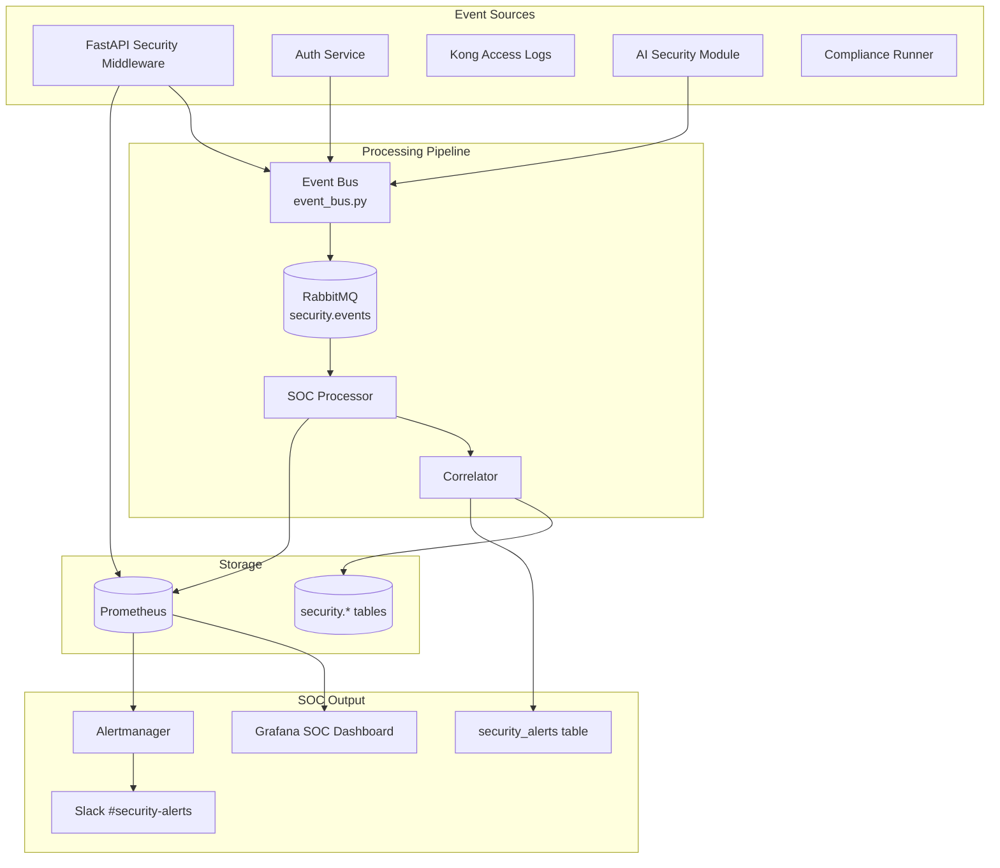
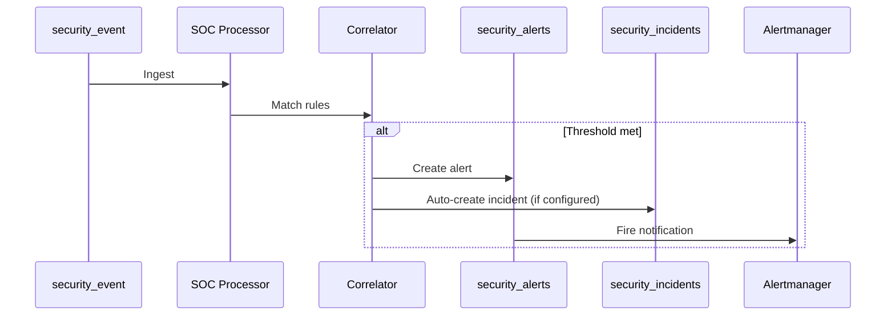

# 16 — Monitoring & SOC Design

**Version 5.0** | Phase 12 | AI Lead Intelligence Platform

---

## Table of Contents

1. [Overview](#1-overview)
2. [SOC Architecture](#2-soc-architecture)
3. [Security Metrics](#3-security-metrics)
4. [Alerting Rules](#4-alerting-rules)
5. [Grafana SOC Dashboard](#5-grafana-soc-dashboard)
6. [Event Correlation](#6-event-correlation)
7. [Log Aggregation](#7-log-aggregation)
8. [On-Call & Escalation](#8-on-call--escalation)
9. [SOC Runbooks](#9-soc-runbooks)
10. [Cross-References](#10-cross-references)

---

## 1. Overview

Phase 12 establishes a **Security Operations Center (SOC)** monitoring layer integrating Prometheus metrics, Grafana dashboards, Alertmanager routing, and the `security_alerts` table. Extends Phase 11 observability ([../phase11/09-observability-architecture.md](../phase11/09-observability-architecture.md), [../phase11/10-monitoring-dashboards.md](../phase11/10-monitoring-dashboards.md)).

---

## 2. SOC Architecture



---

## 3. Security Metrics

### Prometheus Metrics (`security_metrics.py`)

```python
# backend/infrastructure/observability/security_metrics.py

from prometheus_client import Counter, Histogram, Gauge

security_events_total = Counter(
    "security_events_total",
    "Security events by type and severity",
    ["organization_id", "event_type", "severity"],
)

security_auth_failures = Counter(
    "security_auth_failures_total",
    "Authentication failures",
    ["organization_id", "event_type"],
)

security_authz_denials = Counter(
    "security_authz_denials_total",
    "Authorization denials",
    ["organization_id", "resource"],
)

security_risk_score = Histogram(
    "security_risk_score",
    "Computed risk scores",
    ["organization_id", "level"],
    buckets=[10, 25, 50, 75, 90, 100],
)

security_zero_trust_denials = Counter(
    "security_zero_trust_denials_total",
    "Zero trust denials",
    ["reason"],
)

security_active_incidents = Gauge(
    "security_active_incidents",
    "Open security incidents",
    ["severity"],
)

security_mfa_enrollment_rate = Gauge(
    "security_mfa_enrollment_rate",
    "MFA enrollment percentage per org",
    ["organization_id"],
)

security_compliance_check_status = Gauge(
    "security_compliance_check_status",
    "Compliance check pass(1)/fail(0)",
    ["organization_id", "framework", "control_id"],
)
```

### Key SLIs

| SLI | Target | Alert Threshold |
|-----|--------|-----------------|
| Auth failure rate | < 5% of logins | > 20% for 5 min |
| Authz denial rate | < 1% of requests | > 5% for 10 min |
| Risk score p99 | < 50 | > 75 for 15 min |
| Incident MTTD | < 15 min (P1) | Manual review |
| Alert false positive rate | < 10% | Quarterly review |

---

## 4. Alerting Rules

### Prometheus Alert Rules

```yaml
# infra/monitoring/prometheus/rules/security.yml
groups:
  - name: security
    rules:
      - alert: HighAuthFailureRate
        expr: |
          rate(security_auth_failures_total[5m]) > 10
        for: 5m
        labels:
          severity: high
        annotations:
          summary: "High authentication failure rate"

      - alert: BruteForceDetected
        expr: |
          increase(security_auth_failures_total{event_type="login.failure"}[5m]) > 50
        for: 2m
        labels:
          severity: critical
        annotations:
          summary: "Possible brute force attack"

      - alert: CrossTenantAccessAttempt
        expr: |
          increase(security_events_total{event_type="threat.cross_tenant"}[5m]) > 3
        for: 1m
        labels:
          severity: critical

      - alert: ZeroTrustDenialSpike
        expr: |
          rate(security_zero_trust_denials_total[10m]) > 5
        for: 10m
        labels:
          severity: medium

      - alert: ComplianceCheckFailure
        expr: |
          security_compliance_check_status == 0
        for: 1h
        labels:
          severity: medium

      - alert: OpenCriticalIncident
        expr: |
          security_active_incidents{severity="P1"} > 0
        for: 15m
        labels:
          severity: critical
```

### Alertmanager Routing

```yaml
# infra/monitoring/alertmanager/alertmanager.yml
route:
  routes:
    - match:
        severity: critical
      receiver: security-pager
    - match:
        severity: high
      receiver: security-slack
    - match:
        severity: medium
      receiver: security-ticket

receivers:
  - name: security-pager
    # PagerDuty / on-call integration
  - name: security-slack
    slack_configs:
      - channel: '#security-alerts'
  - name: security-ticket
    # GitHub issue / Jira integration
```

---

## 5. Grafana SOC Dashboard

**Dashboard:** `infra/monitoring/grafana/dashboards/security-soc.json`

### Dashboard Panels

| Panel | Type | Data Source |
|-------|------|-------------|
| Active Incidents | Stat | `security_active_incidents` |
| Events by Severity (24h) | Bar chart | `security_events_total` |
| Auth Failures Timeline | Time series | `security_auth_failures_total` |
| Authz Denials by Resource | Table | `security_authz_denials_total` |
| Risk Score Distribution | Heatmap | `security_risk_score` |
| Top Denied Endpoints | Table | `security_access_logs` (PG) |
| MFA Enrollment Rate | Gauge | `security_mfa_enrollment_rate` |
| Compliance Status | Status map | `security_compliance_check_status` |
| Open Vulnerabilities | Stat | `vulnerability_reports` (PG) |
| AI Injection Attempts | Time series | `security_events_total{event_type="ai.prompt_injection"}` |

### Dashboard Access

| Role | Access |
|------|--------|
| SOC Analyst | Full dashboard |
| Org Admin | Tenant-filtered view (future) |
| Platform Admin | Full + platform-wide |

---

## 6. Event Correlation

### Correlation Rules

```python
# backend/app/security/soc/correlator.py

CORRELATION_RULES = [
    {
        "name": "brute_force_campaign",
        "window_minutes": 5,
        "conditions": [
            {"event_type": "auth.login.failure", "min_count": 20, "group_by": "source_ip"},
        ],
        "action": "create_alert",
        "alert_type": "abuse.brute_force",
        "severity": "high",
    },
    {
        "name": "privilege_escalation_attempt",
        "window_minutes": 15,
        "conditions": [
            {"event_type": "authz.denied", "min_count": 5, "group_by": "actor_id",
             "filter": {"resource": "*admin*"}},
        ],
        "action": "create_incident",
        "severity": "P2",
    },
    {
        "name": "ai_abuse_pattern",
        "window_minutes": 60,
        "conditions": [
            {"event_type": "ai.prompt_injection", "min_count": 5, "group_by": "actor_id"},
        ],
        "action": "create_alert",
        "alert_type": "ai.abuse",
        "severity": "high",
    },
]
```

### Correlation Flow



---

## 7. Log Aggregation

### Structured Security Logs

```json
{
  "timestamp": "2026-06-29T14:30:00Z",
  "level": "WARNING",
  "logger": "security.authz",
  "message": "Authorization denied",
  "organization_id": "uuid",
  "user_id": "uuid",
  "resource": "security.policies",
  "action": "update",
  "risk_score": 62,
  "request_id": "uuid",
  "source_ip": "203.0.113.1"
}
```

### Log Shipping (Production)

| Component | Method | Destination |
|-----------|--------|-------------|
| FastAPI | JSON stdout | Loki / ELK |
| Kong | Access log plugin | Loki |
| PostgreSQL | pg_audit (optional) | S3 archive |
| RabbitMQ | Management API | Metrics only |

Follows Phase 11 logging standards ([../phase11/11-logging-standards.md](../phase11/11-logging-standards.md)).

---

## 8. On-Call & Escalation

### Escalation Matrix

| Time | P1 | P2 | P3 |
|------|----|----|-----|
| 0–15 min | SOC Analyst | SOC Analyst | Ticket |
| 15–30 min | + Platform Eng | + Platform Eng | SOC Analyst |
| 30–60 min | + CISO | + Security Lead | — |
| 60+ min | Executive notification | Daily review | Sprint planning |

### On-Call Rotation

- Primary: SOC Analyst (weekly rotation)
- Secondary: Platform Engineer
- Escalation: Security Lead / CISO

---

## 9. SOC Runbooks

| Alert | First Action | Playbook |
|-------|-------------|----------|
| `BruteForceDetected` | Check `authentication_logs` for IP | [12-incident-response-playbooks.md](./12-incident-response-playbooks.md) §8 |
| `CrossTenantAccessAttempt` | Block IP, review access logs | §7 |
| `HighAuthFailureRate` | Distinguish attack vs misconfigured client | §5 |
| `ComplianceCheckFailure` | Run manual check, review evidence | [10-compliance-framework.md](./10-compliance-framework.md) |
| `OpenCriticalIncident` | Verify IC assigned, check timeline | §4 |

---

## 10. Cross-References

| Topic | Document |
|-------|----------|
| Incident response | [12-incident-response-playbooks.md](./12-incident-response-playbooks.md) |
| Audit platform | [11-audit-platform-design.md](./11-audit-platform-design.md) |
| Database schema | [14-security-database-schema.md](./14-security-database-schema.md) |
| Phase 11 observability | [../phase11/09-observability-architecture.md](../phase11/09-observability-architecture.md) |
| Phase 11 dashboards | [../phase11/10-monitoring-dashboards.md](../phase11/10-monitoring-dashboards.md) |