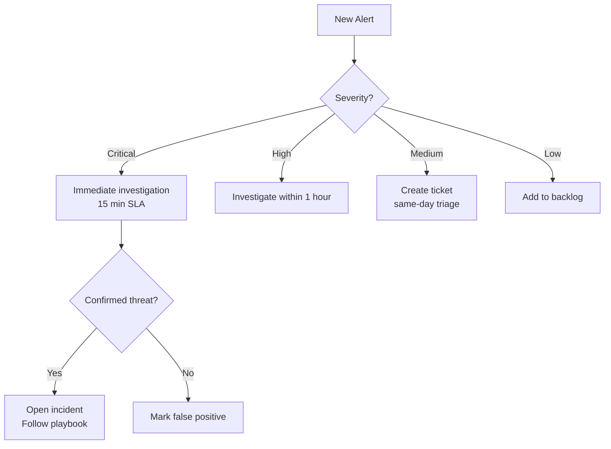
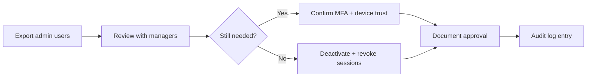

# 18 — Operational Security Guide

**Version 5.0** | Phase 12 | AI Lead Intelligence Platform

---

## Table of Contents

1. [Overview](#1-overview)
2. [Daily Security Operations](#2-daily-security-operations)
3. [Weekly Security Tasks](#3-weekly-security-tasks)
4. [Monthly Security Tasks](#4-monthly-security-tasks)
5. [Key Rotation Procedures](#5-key-rotation-procedures)
6. [Access Review Process](#6-access-review-process)
7. [Security Patch Management](#7-security-patch-management)
8. [Backup Security Verification](#8-backup-security-verification)
9. [Security Configuration Management](#9-security-configuration-management)
10. [Cross-References](#10-cross-references)

---

## 1. Overview

This guide provides **day-to-day operational security procedures** for platform administrators and SOC analysts. Complements Phase 11 operational runbooks ([../phase11/18-operational-runbooks.md](../phase11/18-operational-runbooks.md)) with security-specific tasks.

---

## 2. Daily Security Operations

### Morning Checklist (15 minutes)

| # | Task | Tool / Endpoint |
|---|------|-----------------|
| 1 | Review overnight alerts | Grafana SOC dashboard |
| 2 | Check open P1/P2 incidents | `GET /api/v1/security/incidents?status=open` |
| 3 | Review auth failure spike | Prometheus `security_auth_failures_total` |
| 4 | Verify compliance check failures | `GET /api/v1/security/compliance/checks?status=fail` |
| 5 | Check open critical vulnerabilities | `GET /api/v1/security/vulnerabilities?severity=critical&status=open` |
| 6 | Confirm backup job success | Phase 11 backup monitoring |

### Alert Triage Decision Tree



---

## 3. Weekly Security Tasks

| Task | Owner | Procedure |
|------|-------|-----------|
| Review auth failure trends | SOC Analyst | Grafana → Auth Failures panel, investigate IPs > 100 failures |
| Review authz denials | SOC Analyst | Top denied endpoints table |
| Vulnerability scan review | Platform Eng | Triage new `vulnerability_reports` from CI |
| API key inventory | Security Admin | List keys > 90 days old, notify owners |
| MFA enrollment check | Security Admin | Orgs below 95% admin MFA → notification |
| Kong plugin audit | Platform Eng | Verify rate limits, IP restrictions unchanged |
| Security event volume | SOC Analyst | Compare week-over-week, investigate anomalies |

### Weekly Report Template

```markdown
## Security Weekly Report — Week of {date}

### Incidents
- Open: {count} | Closed: {count} | New: {count}

### Top Alerts
1. {alert_type} — {count} occurrences

### Vulnerabilities
- New: {count} | Remediated: {count} | Overdue: {count}

### Compliance
- Failed checks: {list}

### Action Items
- [ ] {item} — Owner: {name}
```

---

## 4. Monthly Security Tasks

| Task | Owner |
|------|-------|
| Full compliance assessment | Security Admin |
| Access review (admin users) | Security Admin |
| Penetration test (DAST) | Platform Eng |
| Secret rotation check | Platform Eng |
| IR playbook tabletop exercise | SOC + Eng |
| Security metrics review | Security Lead |
| Policy review and cleanup | Security Admin |
| Audit log archival verification | Platform Eng |
| Dependency update batch | Platform Eng |
| Security training completion check | HR + Security |

---

## 5. Key Rotation Procedures

### JWT Signing Key (`SECRET_KEY`)

| Step | Action |
|------|--------|
| 1 | Generate new key: `openssl rand -hex 32` |
| 2 | Add to `secrets_metadata` as new version |
| 3 | Deploy with dual-key validation (old + new) |
| 4 | Wait 24h (max refresh token lifetime) |
| 5 | Remove old key from validation |
| 6 | Update `secrets_metadata.status = retired` |

### Data Encryption Key (`DATA_ENCRYPTION_KEY`)

| Step | Action |
|------|--------|
| 1 | Generate new Fernet key |
| 2 | Background re-encrypt job for `mfa_devices.secret_encrypted` |
| 3 | Verify decryption with new key |
| 4 | Retire old key after re-encryption complete |

### API Key Rotation (Customer Guidance)

Communicate to customers via developer portal:

1. Create new API key with same scopes
2. Update integrations
3. Verify traffic on new key (7 days)
4. Revoke old key

---

## 6. Access Review Process

### Quarterly Admin Access Review



### Review Query

```sql
SELECT u.id, u.email, u.status, u.last_login,
       COUNT(rt.id) AS active_sessions
FROM auth.users u
LEFT JOIN auth.refresh_tokens rt ON rt.user_id = u.id AND rt.revoked_at IS NULL
WHERE u.organization_id = :org_id
  AND u.role IN ('admin', 'owner')
GROUP BY u.id;
```

### API Key Review

```http
GET /api/v1/users/me/api-keys
```

Review: last used date, scopes, IP bindings, expiry.

---

## 7. Security Patch Management

### Patch Priority

| Source | Critical | High | Medium |
|--------|----------|------|--------|
| Python deps (pip-audit) | 24h hotfix | Next sprint | Monthly batch |
| Container base image | 48h rebuild | Weekly | Monthly |
| Kong/Traefik | 48h | Weekly | Monthly |
| PostgreSQL | Maintenance window | Next window | Scheduled |

### Hotfix Deploy Procedure

```powershell
# 1. Create hotfix branch
git checkout -b hotfix/CVE-2026-1234

# 2. Update dependency
# Edit requirements.txt

# 3. Run security tests
pytest tests/security/ -v
pip-audit -r backend/requirements.txt

# 4. Deploy via CI (fast-track approval)
# GitHub Actions → production environment

# 5. Verify + update vulnerability_reports
curl -X PATCH http://localhost/api/v1/security/vulnerabilities/{id} `
  -d '{ "status": "remediated" }'
```

---

## 8. Backup Security Verification

### Monthly Backup Test

| Step | Verification |
|------|-------------|
| 1 | Restore PG backup to isolated instance |
| 2 | Verify `security.*` tables present and row counts match |
| 3 | Verify audit logs readable and intact |
| 4 | Confirm backup encryption (GPG) |
| 5 | Document in compliance evidence |

### Backup Security Controls

- Backups encrypted at rest (GPG or provider encryption)
- Backup access restricted to `deploy-bot` service account
- Backup storage separate from production network
- Retention: 30 daily, 12 monthly, 7 yearly (audit tables)

See [../phase11/12-backup-restore.md](../phase11/12-backup-restore.md).

---

## 9. Security Configuration Management

### Configuration Sources

| Config | Location | Change Process |
|--------|----------|----------------|
| Kong plugins | `infra/gateway/kong/kong.yml` | PR + review + deploy |
| Traefik middleware | `infra/gateway/traefik/dynamic.yml` | PR + review |
| Security settings | `organizations.security_settings` | API + audit |
| Policy definitions | `security.policy_definitions` | API + audit |
| Feature flags | `system.feature_flags` | Admin API |
| Environment secrets | K8s Secrets / Vault | Rotation procedure |

### Configuration Drift Detection

Compliance check `soc2.cc8.1.config` compares:

- Running Kong config vs git `kong.yml`
- Security settings vs documented baseline
- MFA enrollment vs policy requirement

---

## 10. Cross-References

| Topic | Document |
|-------|----------|
| SOC monitoring | [16-monitoring-soc-design.md](./16-monitoring-soc-design.md) |
| Incident response | [12-incident-response-playbooks.md](./12-incident-response-playbooks.md) |
| Vulnerability management | [13-vulnerability-management-strategy.md](./13-vulnerability-management-strategy.md) |
| Key management | [05-data-protection-strategy.md](./05-data-protection-strategy.md) |
| Production handbook | [20-production-security-handbook.md](./20-production-security-handbook.md) |
| Phase 11 runbooks | [../phase11/18-operational-runbooks.md](../phase11/18-operational-runbooks.md) |