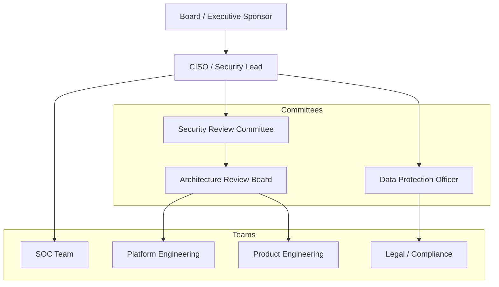
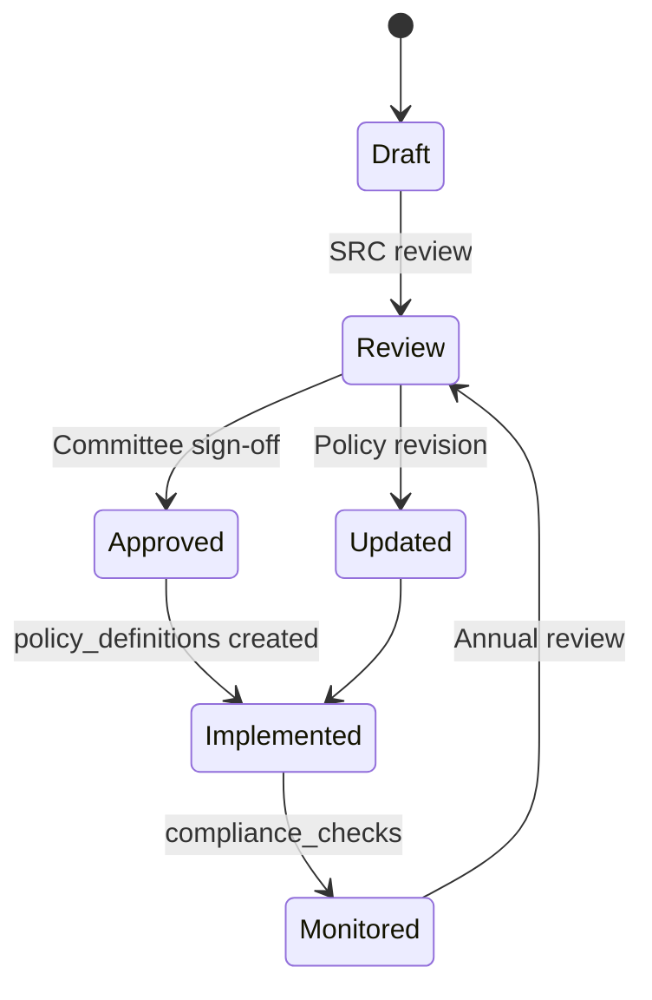

# 19 — Governance Framework

**Version 5.0** | Phase 12 | AI Lead Intelligence Platform

---

## Table of Contents

1. [Overview](#1-overview)
2. [Security Governance Structure](#2-security-governance-structure)
3. [Policies & Standards](#3-policies--standards)
4. [Roles & Responsibilities](#4-roles--responsibilities)
5. [Risk Management](#5-risk-management)
6. [Third-Party Risk Management](#6-third-party-risk-management)
7. [Security Awareness & Training](#7-security-awareness--training)
8. [Audit & Assurance](#8-audit--assurance)
9. [Continuous Improvement](#9-continuous-improvement)
10. [Cross-References](#10-cross-references)

---

## 1. Overview

Phase 12 establishes a **security governance framework** defining organizational structure, policies, risk management, and accountability for the AI Lead Intelligence Platform. Governance ensures security is a business enabler, not solely a technical function.

---

## 2. Security Governance Structure



### Governance Cadence

| Meeting | Frequency | Participants | Purpose |
|---------|-----------|--------------|---------|
| Security Review Committee | Monthly | CISO, Eng leads, Product | Risk review, policy approval |
| Architecture Review Board | Bi-weekly | Platform, Security, Product | Security design review |
| SOC Standup | Daily | SOC analysts, on-call eng | Alert triage |
| Compliance Review | Quarterly | DPO, Legal, CISO | Framework assessment |
| Board Security Brief | Quarterly | CISO, CEO | Executive summary |

---

## 3. Policies & Standards

### Policy Hierarchy

```
Level 1: Security Policy (board-approved)
├── Level 2: Security Standards (mandatory)
│   ├── Authentication Standard
│   ├── Data Classification Standard
│   ├── Encryption Standard
│   └── Incident Response Standard
├── Level 3: Security Procedures (operational)
│   ├── Key Rotation Procedure
│   ├── Access Review Procedure
│   └── Privacy Request Procedure
└── Level 4: Technical Guidelines (implementation)
    ├── Phase 12 Documentation (this set)
    ├── Secure Coding Guidelines
    └── API Security Guidelines
```

### Platform-Enforced Policies

Policies in `security.policy_definitions` enforce technical controls. Organizational policies (Level 1–2) define what those controls must achieve.

| Organizational Policy | Technical Enforcement |
|------------------------|---------------------|
| Password Policy | `security_settings.password_min_length` |
| MFA Policy | `policy_definitions` category `authentication` |
| Data Retention Policy | `security_settings.data_retention_days` |
| Acceptable Use (AI) | AI security framework + quotas |
| Incident Reporting | `security_incidents` workflow |

### Policy Lifecycle



---

## 4. Roles & Responsibilities

### RACI Matrix (Selected Activities)

| Activity | CISO | SOC | Platform Eng | Product Eng | DPO |
|----------|------|-----|-------------|-------------|-----|
| Security architecture | A | C | R | C | I |
| Incident response | A | R | R | I | C |
| Vulnerability remediation | A | C | R | R | I |
| Compliance assessment | A | C | R | I | R |
| Privacy requests | C | I | R | I | A |
| Policy creation | A | C | R | C | C |
| Penetration testing | A | R | C | C | I |
| Security training | A | C | I | I | C |

*R = Responsible, A = Accountable, C = Consulted, I = Informed*

### Platform Role Mapping

| Governance Role | Platform Permission |
|-----------------|---------------------|
| Security Admin | `security:admin` |
| SOC Analyst | `security:investigate` |
| Compliance Officer | `security:compliance` |
| Org Manager | `security:read` |
| All users | `security:write` (own MFA/devices) |

---

## 5. Risk Management

### Risk Register Integration

Platform risks tracked in governance risk register, linked to `risk_scores` and `vulnerability_reports`:

| Risk ID | Description | Likelihood | Impact | Mitigation | Owner |
|---------|-------------|------------|--------|------------|-------|
| R-001 | Cross-tenant data breach | Low | Critical | Tenant isolation, monitoring | Platform Eng |
| R-002 | Credential compromise | Medium | High | MFA, device trust, monitoring | SOC |
| R-003 | AI prompt injection | Medium | Medium | Input sanitizer, output validator | Product Eng |
| R-004 | Supply chain attack | Low | High | pip-audit, Trivy, Dependabot | Platform Eng |
| R-005 | GDPR non-compliance | Low | High | Compliance automation, DPO review | DPO |
| R-006 | Insider threat | Low | High | Audit logs, least privilege, access review | CISO |

### Risk Assessment Process

1. **Identify** — Threat modeling (STRIDE), pen test findings, incident post-mortems
2. **Assess** — Likelihood × Impact matrix
3. **Mitigate** — Technical controls (Phase 12) + process controls
4. **Monitor** — `risk_scores`, SOC dashboards, compliance checks
5. **Review** — Quarterly SRC meeting

---

## 6. Third-Party Risk Management

### Vendor Security Assessment

| Vendor | Data Access | Assessment | Review Frequency |
|--------|-------------|------------|------------------|
| OpenAI | Lead data (redacted) | SOC 2 review, DPA signed | Annual |
| Cloudflare | Traffic metadata | SOC 2, GDPR DPA | Annual |
| Apollo.io | Contact enrichment | API security review | Annual |
| GitHub | Source code | SOC 2, Dependabot | Annual |

### Integration Security Requirements

Third-party integrations (Phase 10 connectors) must:

1. Use TLS 1.2+ for all API calls
2. Store credentials in `secrets_metadata` (not in workflow JSONB)
3. Respect data classification (no L5 data to unassessed vendors)
4. Log all external API calls to `security_events`
5. Pass connector URL allowlist validation

---

## 7. Security Awareness & Training

### Training Program

| Audience | Training | Frequency | Tracking |
|----------|----------|-----------|----------|
| All employees | Security awareness basics | Onboarding + annual | HR system |
| Developers | Secure coding, OWASP API Top 10 | Onboarding + annual | LMS |
| SOC analysts | Platform SOC procedures | Onboarding + quarterly | Internal wiki |
| Admins | IAM, incident response | Onboarding + semi-annual | LMS |
| Executives | Security governance briefing | Annual | Board minutes |

### Developer Security Requirements

- Complete secure coding training before merge access to `backend/app/security/`
- Security review required for PRs touching `auth/`, `security/`, `permissions.py`
- Bandit scan must pass in CI

---

## 8. Audit & Assurance

### Internal Audit Program

| Audit | Frequency | Scope | Evidence Source |
|-------|-----------|-------|-----------------|
| Access control | Quarterly | Admin users, API keys | `authentication_logs`, access review |
| Change management | Monthly | Deployments, config changes | CI logs, git history |
| Data protection | Semi-annual | Encryption, DLP, consent | Compliance checks |
| Incident response | Annual | IR drill results | Incident timelines |
| AI security | Semi-annual | Prompt injection, PII handling | AI security events |

### External Audit Preparation

For SOC 2 / ISO 27001 audits:

1. Export compliance report: `GET /api/v1/security/compliance/report`
2. Provide evidence packages per control
3. Demonstrate SOC dashboard and incident workflow
4. Present vulnerability management metrics
5. Show access review documentation

---

## 9. Continuous Improvement

### Security Maturity Model

| Level | Characteristics | Target |
|-------|-----------------|--------|
| 1 Initial | Ad-hoc, reactive | — |
| 2 Managed | Documented policies, basic monitoring | Year 1 |
| 3 Defined | Automated compliance, SOC operations | Year 2 (Phase 12) |
| 4 Measured | Metrics-driven, quantified risk | Year 3 |
| 5 Optimized | Predictive, continuous adaptation | Year 4+ |

### Improvement Sources

| Source | Action |
|--------|--------|
| Incident post-mortems | Update playbooks, policies, code |
| Pen test findings | Remediate, add compliance checks |
| Compliance failures | Root cause + policy update |
| Industry advisories | CVE triage, threat rule updates |
| Customer feedback | Security feature requests |

### KPIs

| KPI | Target | Measurement |
|-----|--------|-------------|
| MFA enrollment (admins) | > 95% | `security_mfa_enrollment_rate` |
| Mean time to detect (P1) | < 15 min | Incident `opened_at` - first event |
| Mean time to remediate (Critical CVE) | < 24h | `vulnerability_reports` |
| Compliance check pass rate | > 90% | `compliance_checks` |
| Security training completion | 100% | HR tracking |
| Audit finding closure | < 30 days | Governance tracker |

---

## 10. Cross-References

| Topic | Document |
|-------|----------|
| Compliance framework | [10-compliance-framework.md](./10-compliance-framework.md) |
| Incident response | [12-incident-response-playbooks.md](./12-incident-response-playbooks.md) |
| Operational security | [18-operational-security-guide.md](./18-operational-security-guide.md) |
| Production handbook | [20-production-security-handbook.md](./20-production-security-handbook.md) |
| Audit platform | [11-audit-platform-design.md](./11-audit-platform-design.md) |