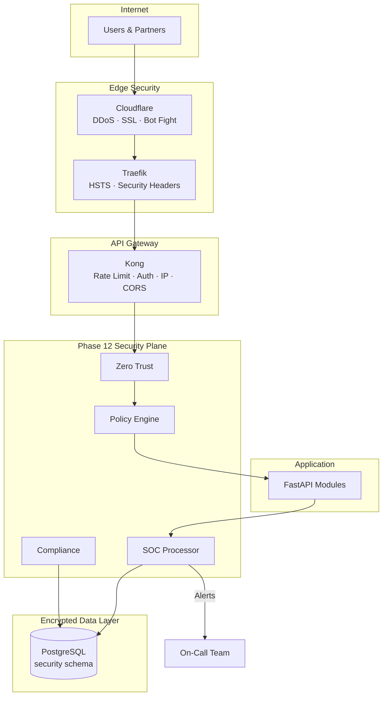

# 20 — Production Security Handbook

**Version 5.0** | Phase 12 | AI Lead Intelligence Platform

---

## Table of Contents

1. [Overview](#1-overview)
2. [Production Security Prerequisites](#2-production-security-prerequisites)
3. [Deployment Security Checklist](#3-deployment-security-checklist)
4. [Gateway Hardening](#4-gateway-hardening)
5. [Application Security Configuration](#5-application-security-configuration)
6. [Database Security Setup](#6-database-security-setup)
7. [SOC Activation](#7-soc-activation)
8. [Post-Deployment Validation](#8-post-deployment-validation)
9. [Production Security Maintenance](#9-production-security-maintenance)
10. [Emergency Procedures](#10-emergency-procedures)

---

## 1. Overview

This handbook is the **definitive production security reference** for deploying and operating Phase 12 on the AI Lead Intelligence Platform. It consolidates requirements from all Phase 12 documents into an actionable production checklist.

Extends Phase 10 production deployment ([../phase10/20-production-deployment-guide.md](../phase10/20-production-deployment-guide.md)) and Phase 11 operations ([../phase11/20-platform-handbook.md](../phase11/20-platform-handbook.md)).

---

## 2. Production Security Prerequisites

### Infrastructure Requirements

| Component | Version | Security Requirement |
|-----------|---------|---------------------|
| PostgreSQL | 16+ | SSL, least-privilege user, encrypted backups |
| Redis | 7.x | `requirepass`, internal network only |
| Kong | 3.8+ | Auth plugins, rate limiting, no admin public exposure |
| Traefik | 3.2+ | TLS 1.3, security headers, HSTS |
| RabbitMQ | 3.13+ | Auth enabled, internal network only |
| Python | 3.12+ | `requirements-security.txt` installed |

### Python Dependencies (v5 additions)

```
# backend/requirements-security.txt
pyotp>=2.9.0
cryptography>=42.0.0
webauthn>=2.0.0
```

### Environment Variables (Production)

| Variable | Required | Notes |
|----------|----------|-------|
| `SECRET_KEY` | Yes | 64-char random hex, rotated every 90 days |
| `DATA_ENCRYPTION_KEY` | Yes | Fernet key for MFA secrets |
| `SECURITY_ZERO_TRUST_ENABLED` | Yes | `true` in production |
| `SECURITY_RISK_DENY_THRESHOLD` | Yes | Default `76` |
| `PII_REDACTION_ENABLED` | Yes | Default `true` |
| `DATABASE_URL` | Yes | `sslmode=require` |
| `REDIS_PASSWORD` | Yes | Strong random password |

### Secrets Must NOT Be

- Committed to git
- Logged in application output
- Included in error responses
- Stored in `security_events` or audit logs

---

## 3. Deployment Security Checklist

### Pre-Deploy

- [ ] All CI security gates passed (bandit, pip-audit, Trivy, gitleaks)
- [ ] No open Critical/High vulnerabilities in `vulnerability_reports`
- [ ] Migration `018_phase12_enterprise_security.py` reviewed
- [ ] Feature flag `enterprise_security_v5` plan documented
- [ ] Rollback procedure tested in staging
- [ ] On-call rotation confirmed
- [ ] Incident response contacts updated

### Deploy

- [ ] Deploy via CI/CD pipeline only (no manual deploys)
- [ ] Run `alembic upgrade head` (migration 018)
- [ ] Enable `enterprise_security_v5` feature flag
- [ ] Verify Kong security plugins active
- [ ] Verify Traefik security headers middleware
- [ ] Deploy SOC Grafana dashboard
- [ ] Deploy Prometheus security alert rules

### Post-Deploy

- [ ] Run post-deployment validation (§8)
- [ ] Run initial compliance assessment
- [ ] Confirm SOC alerts routing to Slack/PagerDuty
- [ ] Notify SOC team of deployment
- [ ] Monitor error rates for 2 hours

---

## 4. Gateway Hardening

### Traefik Production Config

```yaml
# infra/gateway/traefik/dynamic.yml (production)
http:
  middlewares:
    security-headers:
      headers:
        stsSeconds: 31536000
        stsIncludeSubdomains: true
        forceSTSHeader: true
        contentTypeNosniff: true
        frameDeny: true
        referrerPolicy: "strict-origin-when-cross-origin"
        permissionsPolicy: "camera=(), microphone=(), geolocation=()"

  routers:
    api-gateway:
      rule: "PathPrefix(`/api`)"
      middlewares:
        - security-headers
      tls:
        certResolver: letsencrypt
```

### Kong Production Plugins

| Plugin | Production Config |
|--------|-------------------|
| `rate-limiting` | 1000/min per consumer, Redis-backed |
| `request-size-limiting` | 10 MB max |
| `cors` | Explicit origins only (no `*`) |
| `ip-restriction` | On `/api/v1/security/*` admin routes |
| `bot-detection` | On `/api/v1/auth/*` |

### Kong Admin API

- **Never** expose on public internet
- Access via VPN or `kubectl port-forward` only
- Separate admin authentication

---

## 5. Application Security Configuration

### Middleware Activation

```python
# backend/app/main.py — production security stack
app.add_middleware(CorrelationIdMiddleware)
app.add_middleware(SecurityHeadersMiddleware)
app.add_middleware(SecurityContextMiddleware)  # Phase 12

# Register security router
from backend.app.security.router import router as security_router
app.include_router(security_router, prefix="/api/v1")
```

### Default Organization Security Settings

Applied to new organizations on creation:

```json
{
  "mfa_required": false,
  "mfa_grace_days": 7,
  "session_max_concurrent": 5,
  "export_requires_approval": false,
  "ai_pii_redaction": true,
  "password_min_length": 12,
  "data_retention_days": 365,
  "compliance_profile": "standard"
}
```

### Production Policy Baseline

Deploy default policies for all organizations:

| Policy | Category | Priority |
|--------|----------|----------|
| Require MFA for admin roles | authentication | 200 |
| Block risk score > 76 | authorization | 300 |
| Enforce PII redaction in AI | ai | 100 |
| Log all export operations | data | 50 |

```powershell
# Seed default policies (admin script)
python -m backend.app.security.scripts.seed_policies --env production
```

---

## 6. Database Security Setup

### Migration

```powershell
cd backend
alembic upgrade head
# Verify: SELECT schema_name FROM information_schema.schemata WHERE schema_name = 'security';
```

### Verify Table Creation

```sql
SELECT table_name FROM information_schema.tables
WHERE table_schema = 'security'
ORDER BY table_name;

-- Expected 16 tables:
-- authentication_logs, authorization_logs, compliance_checks,
-- consent_records, mfa_devices, policy_assignments, policy_definitions,
-- privacy_requests, risk_scores, secrets_metadata, security_access_logs,
-- security_alerts, security_events, security_incidents,
-- trusted_devices, vulnerability_reports
```

### Production DB Hardening

| Setting | Value |
|---------|-------|
| `sslmode` | `require` |
| Connection pool max | 20 per API pod |
| `log_connections` | `on` |
| `log_disconnections` | `on` |
| Backup encryption | GPG with offline key |

### Append-Only Verification

```sql
-- Verify DELETE revoked on immutable tables
SELECT has_table_privilege('app_user', 'security.security_events', 'DELETE');
-- Expected: false
```

---

## 7. SOC Activation

### Prometheus Setup

```powershell
# Deploy with monitoring overlay
docker compose -f docker-compose.yml -f docker-compose.monitoring.yml --profile monitoring up -d

# Verify security metrics endpoint
curl http://localhost:8000/metrics | Select-String "security_"
```

### Grafana Dashboard Import

```powershell
# Import SOC dashboard
curl -X POST http://localhost:3001/api/dashboards/db `
  -H "Content-Type: application/json" `
  -d (Get-Content infra/monitoring/grafana/dashboards/security-soc.json -Raw)
```

### Alert Routing Test

```powershell
# Trigger test alert
curl -X POST http://localhost/api/v1/security/incidents `
  -H "Authorization: Bearer $ADMIN_TOKEN" `
  -d '{ "title": "SOC Activation Test", "severity": "P4", "incident_type": "test" }'

# Verify: Slack #security-alerts receives notification
# Verify: Grafana shows test incident
```

### Initial Compliance Run

```powershell
curl -X POST http://localhost/api/v1/security/compliance/checks/run `
  -H "Authorization: Bearer $ADMIN_TOKEN" `
  -d '{ "framework": "gdpr" }'

curl http://localhost/api/v1/security/compliance/report?framework=gdpr `
  -H "Authorization: Bearer $ADMIN_TOKEN"
```

---

## 8. Post-Deployment Validation

### Security Smoke Tests

```powershell
$TOKEN = "..."  # Admin JWT

# 1. Health check
curl http://localhost/api/v1/security/health

# 2. Security headers
curl -I http://localhost/api/v1/security/health | Select-String "X-Content-Type-Options"

# 3. MFA enrollment
curl -X POST http://localhost/api/v1/security/mfa/devices `
  -H "Authorization: Bearer $TOKEN" `
  -d '{ "type": "totp", "label": "Production Test" }'

# 4. Policy list
curl http://localhost/api/v1/security/policies `
  -H "Authorization: Bearer $TOKEN"

# 5. Risk score
curl http://localhost/api/v1/security/risk-scores/me `
  -H "Authorization: Bearer $TOKEN"

# 6. Compliance check
curl -X POST http://localhost/api/v1/security/compliance/checks/run `
  -H "Authorization: Bearer $TOKEN" `
  -d '{ "framework": "soc2", "control_id": "soc2.cc6.1.mfa" }'

# 7. Auth failure logging (expect 401 + log entry)
curl -X POST http://localhost/api/v1/auth/login `
  -d '{ "email": "invalid@test.com", "password": "wrong" }'

# 8. Rate limit (auth endpoint)
# Run 25+ failed logins, expect 429

# 9. Tenant isolation
# Access other org resource, expect 404

# 10. Zero trust denial
# Simulate high risk, expect 403
```

### Validation Checklist

| # | Test | Pass Criteria |
|---|------|---------------|
| 1 | Security health | `status: healthy` |
| 2 | Security headers | HSTS, nosniff, frame deny |
| 3 | MFA enrollment | QR code returned |
| 4 | Policy engine | Default policies listed |
| 5 | Risk scoring | Score 0–100 returned |
| 6 | Compliance check | Result with evidence |
| 7 | Auth logging | Entry in `authentication_logs` |
| 8 | Rate limiting | 429 after threshold |
| 9 | Tenant isolation | No cross-org data |
| 10 | Gateway routing | All `/api/v1/security/*` via Kong |

---

## 9. Production Security Maintenance

### Ongoing Schedule

| Frequency | Task | Reference |
|-----------|------|-----------|
| Daily | SOC morning checklist | [18-operational-security-guide.md](./18-operational-security-guide.md) |
| Weekly | Vulnerability triage, access trends | [18](./18-operational-security-guide.md) |
| Monthly | Compliance assessment, DAST scan | [10](./10-compliance-framework.md) |
| Quarterly | Access review, policy review | [19-governance-framework.md](./19-governance-framework.md) |
| Annual | Pen test, IR tabletop, policy refresh | [12](./12-incident-response-playbooks.md) |

### Rollback Procedure

```powershell
# 1. Disable security feature flag
curl -X PATCH http://localhost/api/v1/admin/feature-flags/{id} `
  -d '{ "is_enabled": false }'

# 2. Rollback application deployment
kubectl rollout undo deployment/ali-api

# 3. Rollback migration (if needed — security schema is additive)
alembic downgrade 017

# 4. Verify platform operates with Phase 10 security
curl http://localhost/api/v1/health
```

Migration 018 is **additive** — rollback disables features but does not drop tables.

---

## 10. Emergency Procedures

### Security Kill Switch

Immediately disable security-sensitive operations:

```http
PATCH /api/v1/security/settings
{ "ai_operations_suspended": true, "exports_suspended": true }
```

### Mass Session Revocation

```http
POST /api/v1/security/sessions/revoke-all
{ "organization_id": "uuid" }
```

### IP Block at Gateway

```yaml
# Emergency Kong ip-restriction update
plugins:
  - name: ip-restriction
    config:
      deny: ["198.51.100.42"]
```

### Incident Declaration

```http
POST /api/v1/security/incidents
{
  "title": "EMERGENCY: {description}",
  "severity": "P1",
  "incident_type": "emergency"
}
```

Follow [12-incident-response-playbooks.md](./12-incident-response-playbooks.md).

### Emergency Contacts

| Role | Contact Method |
|------|----------------|
| On-call SOC | PagerDuty / phone |
| Platform Engineering | Slack `#platform-oncall` |
| CISO | Direct phone |
| Legal / DPO | Email (GDPR breach only) |

---

## Production Security Architecture Summary



---

## Cross-References

| Topic | Document |
|-------|----------|
| Enterprise architecture | [01-enterprise-security-architecture.md](./01-enterprise-security-architecture.md) |
| Infrastructure security | [07-infrastructure-security-model.md](./07-infrastructure-security-model.md) |
| SOC design | [16-monitoring-soc-design.md](./16-monitoring-soc-design.md) |
| Operational guide | [18-operational-security-guide.md](./18-operational-security-guide.md) |
| Governance | [19-governance-framework.md](./19-governance-framework.md) |
| Phase 10 deployment | [../phase10/20-production-deployment-guide.md](../phase10/20-production-deployment-guide.md) |
| Phase 11 handbook | [../phase11/20-platform-handbook.md](../phase11/20-platform-handbook.md) |