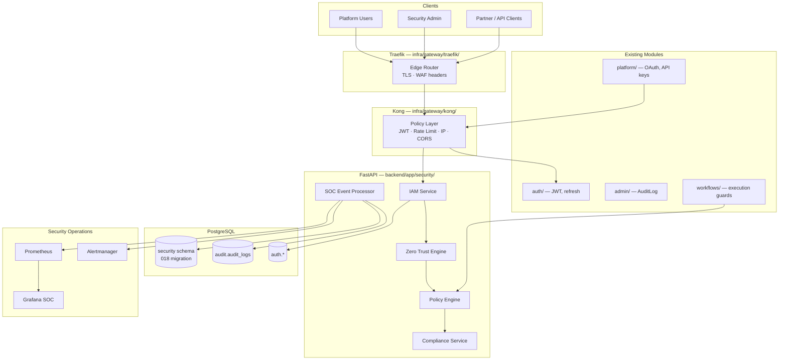

# Phase 12 — Enterprise Security, Compliance & Zero-Trust Platform

**Version 5.0** | AI Lead Intelligence Platform

Phase 12 establishes a **dedicated enterprise security plane** for the AI Lead Intelligence Platform. It unifies identity governance, zero-trust enforcement, multi-tenant isolation, AI-specific controls, compliance automation, and security operations into a single `security` schema and `/api/v1/security/*` API surface — extending Phase 10 gateway integration and Phase 11 operational foundations.

| Capability | Purpose |
|------------|---------|
| **Enterprise Security Architecture** | Defense-in-depth across edge, gateway, app, data, and AI layers |
| **Identity & Access Management** | RBAC + ABAC, MFA, trusted devices, session governance |
| **Zero Trust** | Continuous verification, risk scoring, policy-driven access |
| **Multi-Tenant Security** | Row-level `organization_id` isolation with tenant security policies |
| **Data Protection** | Encryption, tokenization, DLP, consent & privacy request handling |
| **API Security** | Kong/Traefik hardening, scope enforcement, security event correlation |
| **Compliance Automation** | GDPR, SOC 2, ISO 27001, NIST CSF control mapping & evidence |
| **Security Operations** | SOC monitoring, incident response, vulnerability management |

See [01-enterprise-security-architecture.md](./01-enterprise-security-architecture.md) for the full security platform model.

## CTO Design Mandates

| Mandate | Implementation |
|---------|----------------|
| **Security by default** | Deny-by-default policies; explicit grants via `policy_assignments` |
| **Zero trust everywhere** | No implicit trust by network zone; verify identity + device + risk on every request |
| **Tenant isolation is non-negotiable** | `organization_id` enforced at ORM, service, and API layers |
| **Audit everything security-relevant** | Dual-write to `audit.audit_logs` and `security.*` specialized tables |
| **Compliance as code** | `compliance_checks` automated against control frameworks |
| **AI safety gates** | Prompt injection defense, PII redaction, model output validation before persistence |

## Design Principles

| Principle | Implementation |
|-----------|----------------|
| **Layered defense** | Cloudflare/Traefik → Kong → FastAPI middleware → service guards → DB RLS |
| **Multi-tenant** | `organization_id UUID NOT NULL` on all `security` schema tenant tables |
| **API-first security** | REST at `/api/v1/security/*` with OpenAPI 3.1; admin + tenant-scoped routes |
| **Event-driven SOC** | Security events via `event_bus.py` → RabbitMQ → alerting pipeline |
| **Auth layered** | JWT + refresh tokens (`backend/app/auth/`), API keys, OAuth 2.0 (Phase 10) |
| **Observable security** | Prometheus metrics, Grafana SOC dashboards, structured security logs |
| **Immutable audit** | Append-only security logs; tamper-evident hashing for critical events |

## Quick Start (Windows / PowerShell)

```powershell
# Start platform stack with gateway + monitoring
cd C:\path\to\AI-Lead-intelligence-
.\scripts\start-free-stack.ps1 -Monitoring
docker compose -f docker-compose.yml -f docker-compose.gateway.yml --profile gateway up -d

# Run Phase 12 migration
cd backend
alembic upgrade head   # applies 018_phase12_enterprise_security.py

# Enable enterprise security feature flag
# POST /api/v1/admin/feature-flags  { "key": "enterprise_security_v5", "is_enabled": true }

# Security health check (via gateway)
curl http://localhost/api/v1/security/health

# List security events (admin)
curl http://localhost/api/v1/security/events `
  -H "Authorization: Bearer $TOKEN"

# Register MFA device
curl -X POST http://localhost/api/v1/security/mfa/devices `
  -H "Authorization: Bearer $TOKEN" `
  -d '{ "type": "totp", "label": "Authenticator App" }'
```

### Service URLs (Security-Related)

| Service | URL | Role |
|---------|-----|------|
| Security API | http://localhost/api/v1/security | Events, incidents, policies, compliance |
| Kong Gateway | http://localhost/api | Edge auth plugins, rate limits |
| Kong Admin | http://localhost:8080 | Security plugin configuration |
| Grafana SOC | http://localhost:3001/d/security-soc | Security operations dashboard |
| Prometheus | http://localhost:9090 | Security metrics scrape |
| Admin Audit API | http://localhost/api/v1/admin/audit-logs | Legacy audit log queries |

## Architecture Overview



## Documentation Index

| # | Topic | Document |
|---|-------|----------|
| 1 | Enterprise Security Architecture | [01-enterprise-security-architecture.md](./01-enterprise-security-architecture.md) |
| 2 | Identity & Access Management Design | [02-identity-access-management-design.md](./02-identity-access-management-design.md) |
| 3 | Zero Trust Architecture | [03-zero-trust-architecture.md](./03-zero-trust-architecture.md) |
| 4 | Multi-Tenant Security Design | [04-multi-tenant-security-design.md](./04-multi-tenant-security-design.md) |
| 5 | Data Protection Strategy | [05-data-protection-strategy.md](./05-data-protection-strategy.md) |
| 6 | API Security Framework | [06-api-security-framework.md](./06-api-security-framework.md) |
| 7 | Infrastructure Security Model | [07-infrastructure-security-model.md](./07-infrastructure-security-model.md) |
| 8 | AI Security Framework | [08-ai-security-framework.md](./08-ai-security-framework.md) |
| 9 | Workflow Security Design | [09-workflow-security-design.md](./09-workflow-security-design.md) |
| 10 | Compliance Framework | [10-compliance-framework.md](./10-compliance-framework.md) |
| 11 | Audit Platform Design | [11-audit-platform-design.md](./11-audit-platform-design.md) |
| 12 | Incident Response Playbooks | [12-incident-response-playbooks.md](./12-incident-response-playbooks.md) |
| 13 | Vulnerability Management Strategy | [13-vulnerability-management-strategy.md](./13-vulnerability-management-strategy.md) |
| 14 | Security Database Schema | [14-security-database-schema.md](./14-security-database-schema.md) |
| 15 | API Specifications | [15-api-specifications.md](./15-api-specifications.md) |
| 16 | Monitoring & SOC Design | [16-monitoring-soc-design.md](./16-monitoring-soc-design.md) |
| 17 | Testing Strategy | [17-testing-strategy.md](./17-testing-strategy.md) |
| 18 | Operational Security Guide | [18-operational-security-guide.md](./18-operational-security-guide.md) |
| 19 | Governance Framework | [19-governance-framework.md](./19-governance-framework.md) |
| 20 | Production Security Handbook | [20-production-security-handbook.md](./20-production-security-handbook.md) |

## Key Repository Paths

| Component | Path |
|-----------|------|
| Security module (v5) | `backend/app/security/` |
| Security router | `backend/app/security/router.py` |
| Policy engine | `backend/app/security/policy/engine.py` |
| Zero trust scorer | `backend/app/security/zero_trust/risk_scorer.py` |
| Compliance service | `backend/app/security/compliance/service.py` |
| SOC event processor | `backend/app/security/soc/processor.py` |
| Auth module (existing) | `backend/app/auth/service.py` |
| RBAC permissions | `backend/app/core/permissions.py` |
| Audit log model | `backend/app/admin/models.py` → `AuditLog` |
| Platform integration | `backend/app/platform/router.py` |
| Gateway Traefik | `infra/gateway/traefik/traefik.yml`, `dynamic.yml` |
| Gateway Kong | `infra/gateway/kong/kong.yml` |
| DB schema constant | `backend/app/common/db_schemas.py` → `DBSchema.SECURITY` |
| Security permissions | `backend/app/core/permissions.py` → `security:*` |
| Event bus | `backend/infrastructure/messaging/event_bus.py` |
| Migrations | `backend/migrations/versions/018_phase12_enterprise_security.py` |
| SOC Grafana dashboard | `infra/monitoring/grafana/dashboards/security-soc.json` |
| Security metrics | `backend/infrastructure/observability/security_metrics.py` |

## Relationship to Prior Phases

| Phase | Focus | Phase 12 Extends |
|-------|-------|------------------|
| Phase 3 | Backend auth, API keys, RBAC | MFA, device trust, security permissions |
| Phase 8 | Workflow platform | Workflow execution security gates |
| Phase 9 | Analytics | Security analytics, risk dashboards |
| Phase 10 | API gateway, OAuth, webhooks | API security framework, gateway hardening |
| Phase 11 | K8s, monitoring, incident response | SOC design, production security handbook |

## Prerequisites

- [Docker Desktop](https://www.docker.com/products/docker-desktop/) with PostgreSQL 16+, Redis, RabbitMQ
- Kong 3.8+ and Traefik 3.2+ (via `docker-compose.gateway.yml`)
- [Python 3.12+](https://www.python.org/) with `pyotp`, `cryptography` for MFA and encryption
- Admin role with `security:admin`; Security analyst role with `security:read`, `security:investigate`
- Phase 10 gateway overlay deployed for production-like security testing

## Implementation Phases

| Sprint | Deliverable | Docs |
|--------|-------------|------|
| 12.1 | Security schema + core IAM | 02, 14, 15 |
| 12.2 | Zero trust + policy engine | 03, 04 |
| 12.3 | Data protection + API security | 05, 06 |
| 12.4 | AI + workflow security | 08, 09 |
| 12.5 | Compliance automation | 10, 11 |
| 12.6 | SOC + incident response | 12, 16 |
| 12.7 | Vulnerability management | 13, 17 |
| 12.8 | Infrastructure hardening | 07, 18 |
| 12.9 | Governance + production handbook | 19, 20 |