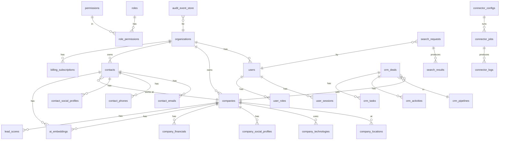

# Phase 2 Enterprise Database Design

## 1. Design Philosophy

The AI Lead Intelligence Platform database is designed around these principles:

- **Multi-tenant isolation**: Every tenant's data is isolated via `organization_id` + Row-Level Security
- **Event sourcing**: All mutations produce immutable events in `audit.event_store`
- **CQRS ready**: Write path uses transactional tables; read path uses materialized views + replicas
- **Partition-first**: High-volume tables (searches, logs, activities) are partitioned by time from day one
- **AI-native**: pgvector embeddings and PostGIS geography columns are first-class citizens
- **GDPR compliance**: PII columns tagged, soft-delete cascade, right-to-erasure supported

## 2. Naming Standards

| Object | Convention | Example |
|--------|------------ |-------|
| Schema | snake_case | `auth`, `core`, `crm` |
| Table | snake_case plural | `companies`, `contact_emails` |
| Column | snake_case | `first_name`, `created_at` |
| Index | `idx_{table}_{columns}` | `idx_companies_name_trgm` |
| FK | `fk_{table}_{ref_table}` | `fk_users_organizations` |
| PK | `pk_{table}` | `pk_companies` |
| Unique | `uq_{table}_{columns}` | `uq_users_email` |
| Check | `ck_{table}_{rule}` | `ck_companies_revenue_positive` |
| Trigger | `trg_{table}_{event}` | `trg_companies_updated_at` |
| Function | `verb_noun` | `set_updated_at()` |
| MV | `mv_{name}` | `mv_top_companies` |
| Sequence | `seq_{table}_{col}` | `seq_invoice_number` |

## 3. Data Type Standards

| Data | Type | Notes |
|------|------|-------|
| Primary Key | `UUID` DEFAULT `uuid_generate_v7()` | Time-ordered v7 |
| Foreign Key | `UUID` NOT NULL/NULL | Matches PK type |
| Text (short) | `VARCHAR(n)` | Max length enforced |
| Text (long) | `TEXT` | Unlimited |
| Email | `citext` | Case-insensitive |
| Money | `NUMERIC(18,2)` | Never FLOAT |
| Count | `INTEGER` / `BIGINT` | Scale accordingly |
| Flag | `BOOLEAN` | NOT NULL DEFAULT FALSE |
| Timestamp | `TIMESTAMPTZ` | Always with TZ |
| JSON | `JSONB` | Binary indexed JSON |
| Search | `TSVECTOR` | Generated/stored |
| Vector | `vector(1536)` | pgvector |
| Geography | `GEOGRAPHY(POINT,4326)` | PostGIS |
| Status | `VARCHAR(50)` | Enum-like strings |
| Version | `INTEGER` DEFAULT 1 | Optimistic locking |

## 4. Table Standard

Every table includes these mandatory columns:

```sql
id              UUID         NOT NULL DEFAULT uuid_generate_v7() PRIMARY KEY,
organization_id UUID         REFERENCES auth.organizations(id) ON DELETE CASCADE,
created_at      TIMESTAMPTZ  NOT NULL DEFAULT NOW(),
updated_at      TIMESTAMPTZ  NOT NULL DEFAULT NOW(),
deleted_at      TIMESTAMPTZ,                         -- soft delete
created_by      UUID         REFERENCES auth.users(id),
updated_by      UUID         REFERENCES auth.users(id),
version         INTEGER      NOT NULL DEFAULT 1,     -- optimistic locking
status          VARCHAR(50)  NOT NULL DEFAULT 'active',
metadata        JSONB        NOT NULL DEFAULT '{}'
```

## 5. Schema Layout

```
auth/          → organizations, users, roles, permissions, sessions, API keys
core/          → companies, contacts, locations, addresses, social profiles
crm/           → deals, pipelines, tasks, activities, notes, meetings
search/        → searches, filters, results, cache, saved searches
ai/            → lead scores, embeddings, models, recommendations
analytics/     → materialized views, dashboards, statistics
connector/     → data connectors, jobs, credentials
audit/         → event store, audit logs, change history
billing/       → subscriptions, credits, payments, invoices
notification/  → alerts, templates, queue
system/        → settings, feature flags, files, templates
enrichment/    → enrichment jobs and results
export/        → exports, imports, mappings
```

## 6. RLS Strategy

All multi-tenant tables enable RLS with a policy:

```sql
ALTER TABLE schema.table ENABLE ROW LEVEL SECURITY;
CREATE POLICY tenant_isolation ON schema.table
    USING (organization_id = current_org_id());
```

Service account bypasses RLS with `SET LOCAL row_security = OFF`.

## 7. Partition Strategy

| Table | Method | Key |
|-------|--------|-----|
| `audit.event_store` | RANGE | `occurred_at` (monthly) |
| `audit.audit_logs` | RANGE | `created_at` (monthly) |
| `search.search_requests` | RANGE | `created_at` (monthly) |
| `search.search_results` | RANGE | `created_at` (monthly) |
| `connector.connector_logs` | RANGE | `created_at` (monthly) |
| `crm.activities` | RANGE | `occurred_at` (monthly) |
| `notification.notification_queue` | RANGE | `created_at` (monthly) |
| `audit.api_logs` | RANGE | `created_at` (monthly) |
| `core.companies` | HASH | `organization_id` (16 buckets) — at 100M+ rows |
| `core.contacts` | HASH | `organization_id` (16 buckets) — at 500M+ rows |

## 8. Index Strategy

| Pattern | Index Type | When |
|---------|-----------|------|
| PK lookup | B-tree (auto) | Always |
| FK join | B-tree | All FKs |
| Text search | GIN (tsvector) | name, description, keywords |
| Fuzzy match | GIN (pg_trgm) | name, email, domain |
| JSONB query | GIN | metadata, settings |
| Geo radius | GiST | geography columns |
| Vector ANN | HNSW | embedding columns |
| Time range | BRIN | append-only time columns |
| Composite | B-tree | (org_id, status), (org_id, created_at DESC) |
| Partial | B-tree | WHERE deleted_at IS NULL |
| Covering | B-tree INCLUDE | Avoid heap fetch |

## 9. Full-Text Search

```sql
-- Generated stored tsvector column pattern:
ALTER TABLE core.companies ADD COLUMN fts TSVECTOR
    GENERATED ALWAYS AS (
        setweight(to_tsvector('english', coalesce(name,'')), 'A') ||
        setweight(to_tsvector('english', coalesce(description,'')), 'B') ||
        setweight(to_tsvector('english', coalesce(industry,'')), 'C')
    ) STORED;

CREATE INDEX idx_companies_fts ON core.companies USING GIN(fts);
```

## 10. Backup Strategy

- **Continuous WAL archiving** to S3/GCS (point-in-time recovery)
- **Daily pg_dump** snapshots retained 30 days
- **Weekly full snapshot** retained 1 year
- **Monthly archive** retained 7 years (compliance)
- **RTO**: 15 minutes (replica promotion), **RPO**: < 1 minute

## 11. ER Diagram (Key Relationships)


