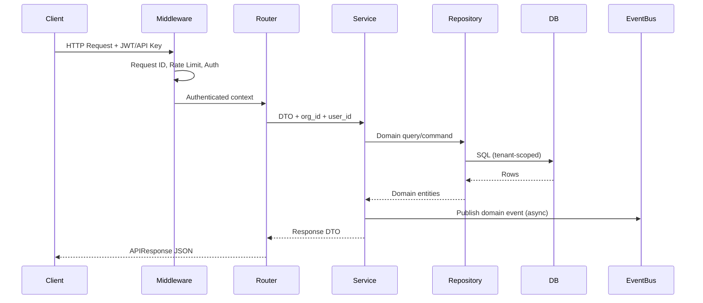
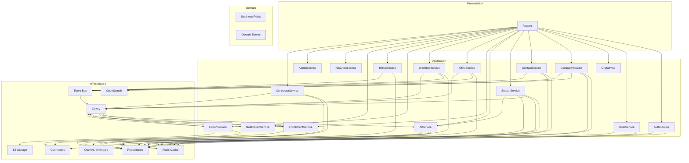
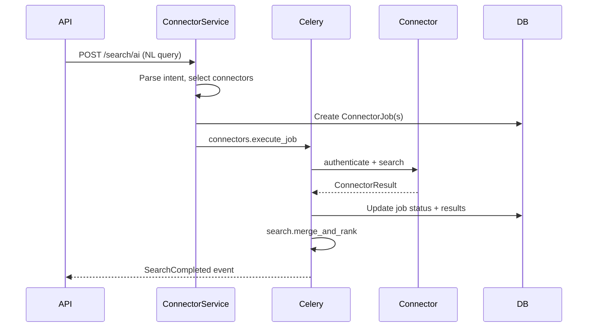

# Phase 3 — Backend Architecture Document

**Version 3.0** | AI Lead Intelligence Platform

---

## Table of Contents

1. [Executive Summary](#1-executive-summary)
2. [Target Folder Structure](#2-target-folder-structure)
3. [Layer Architecture](#3-layer-architecture)
4. [Dependency Diagram](#4-dependency-diagram)
5. [Bounded Contexts & Modules](#5-bounded-contexts--modules)
6. [Service Layer Design](#6-service-layer-design)
7. [Repository Pattern Design](#7-repository-pattern-design)
8. [DTO & Schema Conventions](#8-dto--schema-conventions)
9. [Authentication Design](#9-authentication-design)
10. [Authorization Design](#10-authorization-design)
11. [API Standards](#11-api-standards)
12. [Connector Framework Design](#12-connector-framework-design)
13. [AI Service Design](#13-ai-service-design)
14. [Queue & Worker Design](#14-queue--worker-design)
15. [Event Bus Design](#15-event-bus-design)
16. [Redis Cache Strategy](#16-redis-cache-strategy)
17. [Error Handling Framework](#17-error-handling-framework)
18. [Logging Strategy](#18-logging-strategy)
19. [Monitoring Strategy](#19-monitoring-strategy)
20. [Testing Strategy](#20-testing-strategy)
21. [Security Architecture](#21-security-architecture)
22. [Business Rules Engine](#22-business-rules-engine)
23. [File Storage Design](#23-file-storage-design)
24. [Search Architecture](#24-search-architecture)

---

## 1. Executive Summary

The AI Lead Intelligence Platform is a **multi-tenant B2B SaaS** for lead discovery, enrichment, AI scoring, and CRM integration. Phase 3 formalizes the backend as a **Clean Architecture + DDD** system that is:

- **API-first** — OpenAPI 3.1, versioned REST at `/api/v1`
- **Event-driven** — domain events via Redis-backed Celery + optional outbox
- **AI-native** — NL search, scoring, recommendations, semantic retrieval
- **Production-ready** — observability, rate limits, audit, tenant isolation

### Technology Stack

| Concern | Technology |
|---------|------------|
| Runtime | Python 3.13+ |
| Framework | FastAPI |
| ORM | SQLAlchemy 2.x (async) |
| Validation | Pydantic v2 |
| Auth | JWT + OAuth2 + Refresh Tokens |
| Authorization | RBAC + ABAC |
| Queue | Celery + Celery Beat |
| Broker | Redis (abstracted for RabbitMQ migration) |
| Database | PostgreSQL 16+ |
| Vector | pgvector |
| Search | OpenSearch 2.x |
| Cache | Redis 7 |
| Storage | S3-compatible |
| Real-time | WebSockets |
| Deploy | Docker + Kubernetes |

---

## 2. Target Folder Structure

```text
backend/
│
├── app/                              # Presentation + Application + Domain
│   ├── core/                         # Cross-cutting application kernel (Phase 3)
│   │   ├── config.py                 # Extended settings
│   │   ├── dependencies.py           # DI container, auth deps
│   │   ├── middleware.py             # Request ID, CORS, rate limit, audit
│   │   ├── exceptions.py             # Unified error model + handlers
│   │   ├── security.py               # JWT, OAuth, 2FA, API keys
│   │   ├── permissions.py            # RBAC + ABAC evaluators
│   │   └── pagination.py             # Cursor + offset pagination
│   │
│   ├── auth/                         # Authentication bounded context
│   ├── organizations/                # Tenant management
│   ├── users/                        # Users, roles, permissions, API keys
│   ├── companies/                    # Company intelligence
│   ├── contacts/                     # Contact intelligence
│   ├── search/                       # Search engine + history + saved
│   ├── ai/                           # Scoring, NL search, recommendations
│   ├── connectors/                   # Connector config + job API (moved from integrations)
│   ├── enrichment/                   # Email/phone/tech enrichment
│   ├── crm/                          # Pipelines, deals, tasks, sync
│   ├── exports/                      # Import/export engine
│   ├── analytics/                    # Dashboard metrics
│   ├── workflows/                    # Workflow engine (extracted from admin)
│   ├── notifications/              # Multi-channel notifications
│   ├── billing/                      # Subscriptions + credits
│   ├── admin/                        # Audit, settings, feature flags
│   └── common/                       # Shared kernel (legacy → migrate to core/)
│
├── connectors/                       # Plug-in connector implementations
│   ├── base.py
│   ├── registry.py
│   ├── apollo.py
│   ├── hunter.py
│   ├── clearbit.py
│   └── [future]/                     # salesforce, hubspot, linkedin, etc.
│
├── workers/                          # Celery workers
│   ├── celery_app.py
│   └── tasks/
│       ├── search.py
│       ├── connectors.py
│       ├── enrichment.py
│       ├── scoring.py
│       ├── crm_sync.py
│       ├── exports.py
│       ├── imports.py
│       ├── notifications.py
│       ├── analytics.py
│       └── index.py
│
├── infrastructure/                   # Infrastructure layer (Phase 3)
│   ├── repositories/                 # Data access implementations
│   ├── messaging/                    # Event bus, outbox, subscribers
│   ├── cache/                        # Redis cache adapters
│   ├── storage/                      # S3 file storage
│   ├── search/                       # OpenSearch client + indexers
│   └── observability/                # Logging, metrics, tracing
│
├── migrations/                       # Alembic
├── tests/                            # Unit + integration + API tests
├── scripts/                          # Seed, ops, one-off migrations
└── docs/                             # Architecture + API specs
```

### Module Internal Structure (per bounded context)

Every domain module follows this layout:

```text
app/{module}/
├── __init__.py
├── router.py           # Presentation: HTTP routes only
├── schemas.py          # Application: request/response DTOs (Pydantic v2)
├── service.py          # Application: use cases, orchestration
├── domain.py           # Domain: entities, value objects, business rules
├── repository.py       # Domain: repository interface (Protocol)
├── events.py           # Domain: module-specific event definitions
└── models.py           # Infrastructure: SQLAlchemy ORM (can move to infrastructure/)
```

---

## 3. Layer Architecture

```text
┌─────────────────────────────────────────────────────────────────┐
│                    PRESENTATION LAYER                           │
│  FastAPI Routers │ WebSocket Handlers │ Middleware │ OpenAPI    │
└────────────────────────────┬────────────────────────────────────┘
                             │ DTOs in / out
┌────────────────────────────▼────────────────────────────────────┐
│                    APPLICATION LAYER                            │
│  Services (Use Cases) │ Command/Query Handlers │ Event Handlers │
└────────────────────────────┬────────────────────────────────────┘
                             │ Domain entities, rules
┌────────────────────────────▼────────────────────────────────────┐
│                      DOMAIN LAYER                               │
│  Entities │ Value Objects │ Domain Services │ Repository Ports  │
└────────────────────────────┬────────────────────────────────────┘
                             │ Interfaces only
┌────────────────────────────▼────────────────────────────────────┐
│                  INFRASTRUCTURE LAYER                           │
│  SQLAlchemy Repos │ Redis │ Celery │ S3 │ OpenSearch │ Connectors│
└────────────────────────────┬────────────────────────────────────┘
                             │
┌────────────────────────────▼────────────────────────────────────┐
│                   PERSISTENCE LAYER                             │
│  PostgreSQL 16 │ pgvector │ PostGIS │ Partitioned tables      │
└─────────────────────────────────────────────────────────────────┘

         SHARED KERNEL: common types, UUID, pagination, errors
```

### Dependency Rule

**Dependencies point inward only.**

| Layer | May Depend On |
|-------|---------------|
| Presentation | Application, Shared Kernel |
| Application | Domain, Shared Kernel |
| Domain | Nothing external (pure Python + Protocols) |
| Infrastructure | Domain ports, external SDKs |
| Persistence | Infrastructure (ORM models) |

### Request Lifecycle



---

## 4. Dependency Diagram

### Module Dependency Graph



### External Dependencies

| Service | External System | Failure Mode |
|---------|-----------------|--------------|
| Connectors | Apollo, Hunter, Clearbit, CRM APIs | Circuit breaker, retry, fallback connector |
| AI | OpenAI, Anthropic | Degrade to rule-based scoring |
| Search | OpenSearch | Fallback to PostgreSQL full-text |
| Billing | Stripe | Queue webhook retries |
| Email | SMTP / SendGrid | Dead-letter queue |
| Storage | S3 / MinIO | Retry with exponential backoff |

---

## 5. Bounded Contexts & Modules

| Context | Aggregate Roots | Key Use Cases |
|---------|-----------------|---------------|
| **Auth** | Session, RefreshToken, MagicLink | Login, OAuth, 2FA, password reset, device mgmt |
| **Organizations** | Organization, TenantSettings | Tenant CRUD, plan limits, isolation |
| **Users** | User, Role, Permission, APIKey | RBAC, user lifecycle, API key mgmt |
| **Companies** | Company, CompanyTechnology | CRUD, merge, intelligence, tech detection |
| **Contacts** | Contact, ContactTag | CRUD, merge, verify, CRM sync |
| **Search** | Search, SavedSearch, SearchResult | Keyword, semantic, AI search, history |
| **AI** | LeadScore, Recommendation | Scoring, ranking, NL parsing, summaries |
| **Connectors** | ConnectorConfig, ConnectorJob | Plug-in registry, job orchestration |
| **Enrichment** | EmailVerification, PhoneValidation | Async verify, bulk enrich |
| **CRM** | Pipeline, Deal, Task, Activity | Pipeline mgmt, deal stages, sync |
| **Workflows** | Workflow, WorkflowExecution | Rule-based automation |
| **Exports** | Export, ImportJob | CSV/Excel/PDF generation, imports |
| **Analytics** | (read models) | Dashboard, funnel, velocity metrics |
| **Notifications** | Notification | In-app, email, webhook, WebSocket |
| **Billing** | Subscription, CreditTransaction | Plans, credits, Stripe webhooks |
| **Admin** | AuditLog, FeatureFlag, SystemSetting | Platform ops, audit trail |

---

## 6. Service Layer Design

### Service Contract

Every application service follows this interface pattern:

```python
class CompanyService:
    def __init__(
        self,
        repo: CompanyRepository,
        cache: CachePort,
        event_bus: EventBusPort,
        billing: BillingPort,
    ): ...

    async def create(self, cmd: CreateCompanyCommand, ctx: RequestContext) -> CompanyDTO: ...
    async def update(self, cmd: UpdateCompanyCommand, ctx: RequestContext) -> CompanyDTO: ...
    async def merge(self, cmd: MergeCompaniesCommand, ctx: RequestContext) -> CompanyDTO: ...
```

### RequestContext

Propagated from middleware through every service call:

```python
@dataclass(frozen=True)
class RequestContext:
    request_id: str
    correlation_id: str
    organization_id: UUID
    user_id: UUID
    roles: frozenset[str]
    permissions: frozenset[str]
    ip_address: str | None
    user_agent: str | None
    idempotency_key: str | None
```

### Service Responsibilities

| Responsibility | Layer |
|----------------|-------|
| Input validation (shape) | Pydantic schemas (Presentation) |
| Business rule validation | Domain services |
| Authorization check | Permission middleware + service |
| Credit/subscription check | BillingPort (Application) |
| Persistence | Repository (Infrastructure) |
| Side effects (events, jobs) | EventBus + Celery (Infrastructure) |
| Response mapping | Service → Response DTO |

### Use Case Catalog (by module)

See [module-specifications.md](./module-specifications.md) for per-module use case tables.

### Transaction Boundaries

- **One aggregate per transaction** — avoid cross-aggregate writes in a single DB transaction unless using saga/outbox.
- **Outbox pattern** for events: write event to `event_store` in same transaction as aggregate mutation; worker publishes to Celery.
- **Read operations** use read replicas when available (CQRS-lite for analytics).

---

## 7. Repository Pattern Design

### Port (Domain Interface)

```python
class CompanyRepository(Protocol):
    async def get_by_id(self, id: UUID, org_id: UUID) -> Company | None: ...
    async def get_by_domain(self, domain: str, org_id: UUID) -> Company | None: ...
    async def list(
        self, org_id: UUID, filters: CompanyFilters, page: PageParams
    ) -> Page[Company]: ...
    async def create(self, company: Company) -> Company: ...
    async def update(self, company: Company) -> Company: ...
    async def soft_delete(self, id: UUID, org_id: UUID) -> None: ...
    async def find_duplicates(self, org_id: UUID, signals: DuplicateSignals) -> list[Company]: ...
```

### Adapter (Infrastructure Implementation)

```python
class SQLAlchemyCompanyRepository(CompanyRepository):
    def __init__(self, session: AsyncSession): ...
    # Maps ORM models ↔ Domain entities
    # Always filters: organization_id = :org_id AND deleted_at IS NULL
```

### Repository Rules

1. **Tenant scoping mandatory** — every query includes `organization_id`.
2. **No business logic** in repositories — only persistence.
3. **Domain entities** returned, not ORM models (mapper in repository).
4. **Unit of Work** — `AsyncSession` per request via FastAPI dependency.
5. **Specification pattern** for complex filters:

```python
class CompanyFilters:
    industry: list[str] | None
    country: list[str] | None
    employee_min: int | None
    employee_max: int | None
    technologies: list[str] | None
    lead_score_min: float | None
    query: str | None  # full-text
```

### Repository Inventory

| Repository | Aggregate | Schema |
|------------|-----------|--------|
| `UserRepository` | User | auth |
| `OrganizationRepository` | Organization | core |
| `CompanyRepository` | Company | core |
| `ContactRepository` | Contact | core |
| `SearchRepository` | Search, SavedSearch | search |
| `LeadScoreRepository` | LeadScore | ai |
| `ConnectorJobRepository` | ConnectorJob | connector |
| `DealRepository` | Deal | crm |
| `ExportRepository` | Export | core |
| `AuditLogRepository` | AuditLog | audit |

---

## 8. DTO & Schema Conventions

### Naming

| Type | Pattern | Example |
|------|---------|---------|
| Request | `{Action}{Entity}Request` | `CreateCompanyRequest` |
| Response | `{Entity}Response` | `CompanyResponse` |
| List item | `{Entity}Summary` | `CompanySummary` |
| Command | `{Action}{Entity}Command` | `MergeCompaniesCommand` |
| Filter | `{Entity}Filters` | `ContactFilters` |

### Standard Response Envelope

```json
{
  "success": true,
  "data": { },
  "message": "Company created",
  "meta": {
    "request_id": "req_01HX...",
    "timestamp": "2026-06-28T12:00:00Z"
  },
  "pagination": {
    "page": 1,
    "page_size": 25,
    "total": 142,
    "total_pages": 6
  }
}
```

### Standard Error Envelope

```json
{
  "success": false,
  "error": {
    "code": "INSUFFICIENT_CREDITS",
    "message": "This operation requires 5 credits; you have 2 remaining.",
    "details": [{ "field": "credits", "issue": "below_minimum" }],
    "request_id": "req_01HX..."
  }
}
```

### Pydantic v2 Validators

| Field Type | Validator |
|------------|-----------|
| Email | `EmailStr` + disposable domain blocklist |
| Domain | Custom `DomainStr` (RFC 1123, no protocol) |
| Phone | `phonenumbers` library, E.164 output |
| URL | `HttpUrl`, strip tracking params |
| UUID | `UUID4` / `UUID7` |
| Country | ISO 3166-1 alpha-2 |
| Currency | ISO 4217 |
| Language | ISO 639-1 |

---

## 9. Authentication Design

### Supported Methods

| Method | Flow | Endpoints |
|--------|------|-----------|
| Email + Password | OAuth2 password grant | `POST /auth/login` |
| Registration | Email verify optional | `POST /auth/register` |
| Google OAuth | Authorization code | `GET /auth/oauth/google`, `POST /auth/oauth/google/callback` |
| Microsoft OAuth | Authorization code | `GET /auth/oauth/microsoft`, `POST /auth/oauth/microsoft/callback` |
| Refresh Token | Rotating refresh | `POST /auth/refresh` |
| Magic Link | Email token | `POST /auth/magic-link`, `POST /auth/magic-link/verify` |
| 2FA (TOTP) | RFC 6238 | `POST /auth/2fa/setup`, `POST /auth/2fa/verify` |
| API Keys | Header `X-API-Key` | Managed via `/users/api-keys` |

### Token Strategy

| Token | Algorithm | TTL | Storage |
|-------|-----------|-----|---------|
| Access Token | HS256 (dev) / RS256 (prod) | 60 min | Client only |
| Refresh Token | Opaque random | 30 days | DB (SHA-256 hash), rotated on use |
| Magic Link | Opaque random | 15 min | Redis |
| API Key | `ali_` prefix + random | No expiry (revocable) | DB (SHA-256 hash) |

### Session & Device Management

```text
user_sessions
├── id (UUID)
├── user_id
├── device_fingerprint
├── ip_address
├── user_agent
├── last_active_at
├── is_revoked
└── created_at
```

Endpoints:
- `GET /auth/sessions` — list active sessions
- `DELETE /auth/sessions/{id}` — revoke session
- `DELETE /auth/sessions` — revoke all except current

### Account Lockout

- 5 failed attempts → 15-minute lockout
- 10 failed attempts → require email unlock
- Tracked in Redis: `auth:lockout:{user_id}`

### Password Reset

1. `POST /auth/password/forgot` → email with reset token
2. `POST /auth/password/reset` → validate token + set new password
3. Invalidate all refresh tokens on reset

---

## 10. Authorization Design

### RBAC Model

```text
User ──M:N──> Role ──M:N──> Permission
                │
                └── hierarchy: admin > manager > member > viewer
```

### Permission Format

`{resource}:{action}`

Examples:
- `companies:read`, `companies:write`, `companies:delete`, `companies:merge`
- `contacts:verify`, `exports:create`, `admin:audit`
- `*` — superadmin wildcard

### ABAC Policies

Attribute-based rules evaluated after RBAC:

```python
@dataclass
class Policy:
    resource: str
    action: str
    condition: str  # e.g. "resource.owner_id == user.id"
```

| Policy | Rule |
|--------|------|
| Resource ownership | Users can edit own-created contacts unless `contacts:write:all` |
| Plan limits | Export row count capped by `organization.plan` |
| Tenant isolation | `organization_id` must match on all resources |
| Credit gate | Mutating enrichment requires `credits >= cost` |

### Permission Middleware

```python
def require_permission(*permissions: str):
    async def checker(ctx: RequestContext = Depends(get_request_context)):
        if not ctx.has_any_permission(permissions):
            raise ForbiddenError(...)
        return ctx
    return checker
```

### Role Hierarchy

| Role | Inherits | Typical Permissions |
|------|----------|---------------------|
| `owner` | admin | All + billing + org delete |
| `admin` | manager | All module write + user mgmt |
| `manager` | member | CRM write, export, search |
| `member` | viewer | CRUD own records, search |
| `viewer` | — | Read-only all modules |

---

## 11. API Standards

| Standard | Implementation |
|----------|----------------|
| Versioning | `/api/v1` prefix; breaking changes → `/api/v2` |
| Format | JSON (`application/json`) |
| Pagination | `?page=1&page_size=25` or cursor `?cursor=xxx&limit=25` |
| Sorting | `?sort=-created_at,name` |
| Filtering | Query params + `?filter[industry]=saas` |
| Search | `?q=keyword` |
| Idempotency | `Idempotency-Key` header on POST/PUT |
| Rate limiting | `X-RateLimit-*` response headers |
| Request tracing | `X-Request-ID`, `X-Correlation-ID` |

Full endpoint catalog: [api-specification.md](./api-specification.md)

---

## 12. Connector Framework Design

### BaseConnector Interface (Phase 3 Extended)

```python
class BaseConnector(ABC):
    name: str
    connector_type: ConnectorType  # search | directory | api | crm | email | tech | geo | import

    def authenticate(self) -> bool: ...
    def health_check(self) -> HealthStatus: ...
    def search(self, query: str, filters: dict) -> ConnectorResult: ...
    def lookup(self, id: str, type: str) -> ConnectorResult: ...
    def enrich(self, data: dict) -> ConnectorResult: ...
    def normalize(self, raw: dict) -> CanonicalRecord: ...
    def validate(self, record: dict) -> ValidationResult: ...
    def map_response(self, raw: Any) -> list[dict]: ...
    def rate_limit(self) -> RateLimitInfo: ...
    def retry(self, fn, max_retries=3) -> Any: ...
```

### Connector Types

| Type | Examples | Capabilities |
|------|----------|--------------|
| Search Engines | Apollo, ZoomInfo | search, lookup |
| Business Directories | Clearbit | enrich, autocomplete |
| Official APIs | Hunter | verify, search |
| CRM Connectors | Salesforce, HubSpot | sync, lookup |
| Email Verification | Hunter, ZeroBounce | verify |
| Technology Detection | BuiltWith, Wappalyzer | enrich |
| Geolocation | Google Maps | enrich |
| File Imports | CSV/Excel | import |

### Plug-and-Play Registration

```python
@ConnectorRegistry.register
class ApolloConnector(BaseConnector):
    name = "apollo"
    connector_type = ConnectorType.SEARCH
```

### Job Orchestration



### Per-Org Credentials

- Stored encrypted in `connector_configs.credentials` (AES-256-GCM, key from KMS)
- Workers resolve credentials via `ConnectorService.get_config(org_id, connector_name)`
- Global fallback keys in environment for dev only

---

## 13. AI Service Design

### AI Subsystems

```text
AI Engine
├── NL Parser          # Intent + entity extraction from natural language
├── Query Builder      # NL → structured filters + connector selection
├── Semantic Search    # pgvector embeddings + OpenSearch kNN
├── Lead Scorer        # Rule engine + LLM scoring
├── Ranker             # Multi-signal prospect ranking
├── Duplicate Detector # Fuzzy match on domain/email/name
├── Classifier         # Industry, company size, seniority
├── Recommendation     # Next-best-action, similar companies
└── Summarizer         # Company/contact narrative summaries
```

### AI Search Pipeline

1. **Parse** — `NLParser.parse(query)` → `{intent, entities, filters}`
2. **Plan** — `QueryPlanner.plan()` → connector list + search strategy
3. **Execute** — parallel connector jobs via Celery group
4. **Merge** — deduplicate by domain/email, normalize to canonical schema
5. **Rank** — composite score: relevance + data quality + lead score
6. **Explain** — LLM generates human-readable explanation of results
7. **Cache** — Redis key `search:ai:{hash(query+filters)}` TTL 5 min

### Lead Scoring Model

| Signal | Weight | Source |
|--------|--------|--------|
| Company size fit | 15% | Company data |
| Industry match | 20% | ICP config |
| Technology stack | 15% | Tech detection |
| Contact seniority | 20% | Contact data |
| Email verified | 10% | Enrichment |
| Engagement history | 20% | CRM activities |

Scoring modes:
- **Rule-based** (default, no API key required)
- **LLM-enhanced** (Anthropic/OpenAI when keys configured)
- **Hybrid** (rules + LLM explanation)

### Embedding Strategy

- Model: `text-embedding-3-small` (1536 dims) or local `all-MiniLM-L6-v2`
- Stored in `companies.embedding` / `contacts.embedding` (pgvector)
- Indexed: `ivfflat` with `lists=100`
- Refresh: on create/update via `index.update_embeddings` worker

---

## 14. Queue & Worker Design

### Broker Abstraction

```python
class MessageBroker(Protocol):
    async def publish(self, queue: str, message: dict) -> None: ...
    async def subscribe(self, queue: str, handler: Callable) -> None: ...
```

Phase 3: Redis via Celery. Interface allows RabbitMQ swap without domain changes.

### Task Inventory

| Queue | Task | Priority | Max Retries |
|-------|------|----------|-------------|
| `search` | `search.execute` | high | 3 |
| `search` | `search.ai_pipeline` | high | 2 |
| `connectors` | `connectors.execute_job` | high | 5 |
| `connectors` | `connectors.health_check_all` | low | 1 |
| `enrichment` | `enrichment.verify_email` | medium | 3 |
| `enrichment` | `enrichment.verify_phone` | medium | 3 |
| `enrichment` | `enrichment.detect_technology` | low | 2 |
| `scoring` | `scoring.score_entity` | medium | 3 |
| `scoring` | `scoring.score_stale_leads` | low | 1 |
| `crm` | `crm.sync_to_external` | medium | 5 |
| `crm` | `crm.pull_from_external` | medium | 5 |
| `exports` | `exports.generate` | low | 3 |
| `imports` | `imports.process` | low | 3 |
| `notifications` | `notifications.send` | high | 5 |
| `analytics` | `analytics.refresh_views` | low | 1 |
| `index` | `index.update_opensearch` | medium | 3 |
| `index` | `index.update_embeddings` | low | 2 |
| `workflows` | `workflows.execute` | medium | 3 |

### Celery Beat Schedule

| Schedule | Task |
|----------|------|
| Every 6h | `connectors.health_check_all` |
| Daily 02:00 UTC | `scoring.score_stale_leads` |
| Daily 03:00 UTC | `exports.cleanup_expired` |
| Daily 04:00 UTC | `analytics.refresh_views` |
| Every 15m | `notifications.process_queue` |

### Worker Configuration

```python
# celery_app.py
task_serializer = "json"
task_acks_late = True
worker_prefetch_multiplier = 1
task_default_retry_delay = 60  # seconds
task_time_limit = 300
task_soft_time_limit = 270
```

---

## 15. Event Bus Design

### Domain Events

```python
class DomainEvent(str, Enum):
    COMPANY_CREATED = "company.created"
    COMPANY_UPDATED = "company.updated"
    COMPANY_MERGED = "company.merged"
    CONTACT_CREATED = "contact.created"
    CONTACT_UPDATED = "contact.updated"
    CONTACT_MERGED = "contact.merged"
    SEARCH_COMPLETED = "search.completed"
    CONNECTOR_FINISHED = "connector.finished"
    LEAD_SCORED = "lead.scored"
    EXPORT_COMPLETED = "export.completed"
    IMPORT_COMPLETED = "import.completed"
    NOTIFICATION_SENT = "notification.sent"
    WORKFLOW_EXECUTED = "workflow.executed"
    SUBSCRIPTION_UPDATED = "subscription.updated"
    EMAIL_VERIFIED = "email.verified"
```

### Event Payload Schema

```python
@dataclass
class EventEnvelope:
    event_id: UUID
    event_type: DomainEvent
    aggregate_type: str
    aggregate_id: UUID
    organization_id: UUID
    actor_id: UUID | None
    payload: dict
    metadata: dict  # request_id, correlation_id, timestamp
    version: int = 1
```

### Outbox Pattern

```text
1. Service mutates aggregate in DB transaction
2. Service inserts EventEnvelope into event_store table (same transaction)
3. Outbox poller (Celery beat, every 5s) reads unpublished events
4. Poller publishes to Celery queue
5. Subscribers process event, mark published_at
```

### Event Subscribers

| Event | Subscribers |
|-------|-------------|
| `company.created` | ScoringWorker, IndexWorker, AnalyticsWorker |
| `contact.created` | ScoringWorker, EnrichmentWorker, IndexWorker |
| `search.completed` | AnalyticsWorker, NotificationWorker |
| `lead.scored` | NotificationWorker, CRMWorker |
| `connector.finished` | SearchMergeWorker, AnalyticsWorker |
| `export.completed` | NotificationWorker |
| `workflow.executed` | AuditWorker, NotificationWorker |

---

## 16. Redis Cache Strategy

### Key Namespace

`{env}:{org_id}:{domain}:{key}`

Example: `prod:01HX...:company:domain:acme.com`

### Cache Catalog

| Key Pattern | TTL | Invalidation |
|-------------|-----|--------------|
| `company:{id}` | 1h | On update/delete |
| `contact:{id}` | 1h | On update/delete |
| `company:domain:{domain}` | 1h | On create/update |
| `search:results:{hash}` | 5m | TTL only |
| `search:ai:{hash}` | 5m | TTL only |
| `ref:industries` | 24h | Manual refresh |
| `ref:technologies` | 24h | Manual refresh |
| `ref:countries` | 24h | Manual refresh |
| `permissions:{user_id}` | 15m | On role change |
| `feature_flags:{org_id}` | 1h | On flag change |
| `dashboard:{org_id}` | 10m | On analytics refresh |
| `auth:lockout:{user_id}` | 15m | TTL only |
| `auth:magic:{token}` | 15m | On verify |
| `ratelimit:{key}` | 1m | TTL only |

### Cache-Aside Pattern

```python
async def get_company(self, id: UUID, org_id: UUID) -> Company:
    cached = await self.cache.get(f"company:{id}")
    if cached:
        return Company.from_dict(cached)
    company = await self.repo.get_by_id(id, org_id)
    if company:
        await self.cache.set(f"company:{id}", company.to_dict(), ttl=3600)
    return company
```

### Stampede Protection

Use Redis `SET NX` lock during cache miss rebuild:

```python
lock_key = f"lock:company:{id}"
if await cache.set(lock_key, "1", nx=True, ex=30):
    # rebuild cache
    await cache.delete(lock_key)
```

---

## 17. Error Handling Framework

### Error Code Registry

| HTTP | Code | When |
|------|------|------|
| 400 | `VALIDATION_ERROR` | Pydantic / business validation |
| 401 | `UNAUTHORIZED` | Missing/invalid token |
| 401 | `TOKEN_EXPIRED` | JWT expired |
| 403 | `FORBIDDEN` | RBAC/ABAC denial |
| 404 | `NOT_FOUND` | Resource not found (tenant-scoped) |
| 409 | `CONFLICT` | Duplicate, merge conflict |
| 402 | `INSUFFICIENT_CREDITS` | Credit balance too low |
| 422 | `UNPROCESSABLE` | Semantic validation failure |
| 429 | `RATE_LIMITED` | Too many requests |
| 500 | `INTERNAL_ERROR` | Unhandled exception |
| 503 | `SERVICE_UNAVAILABLE` | Connector/dependency down |

### Exception Handler Registration

```python
@app.exception_handler(AppException)
async def app_exception_handler(request, exc):
    return JSONResponse(
        status_code=exc.status_code,
        content=ErrorResponse(
            success=False,
            error=ErrorDetail(
                code=exc.code,
                message=exc.message,
                details=exc.details,
                request_id=request.state.request_id,
            ),
        ).model_dump(),
    )
```

### Validation Error Format

```json
{
  "success": false,
  "error": {
    "code": "VALIDATION_ERROR",
    "message": "Request validation failed",
    "details": [
      { "field": "body.email", "issue": "invalid_email", "message": "Invalid email format" }
    ]
  }
}
```

---

## 18. Logging Strategy

### Structured JSON Logging

```python
logger.info(
    "company.created",
    extra={
        "event": "company.created",
        "organization_id": str(org_id),
        "company_id": str(company.id),
        "user_id": str(user_id),
        "request_id": request_id,
        "duration_ms": 42,
    },
)
```

### Log Levels by Environment

| Environment | Default Level | SQL Echo |
|-------------|---------------|----------|
| development | DEBUG | false |
| staging | INFO | false |
| production | WARNING | false |

### What to Log

| Event | Level | Fields |
|-------|-------|--------|
| HTTP request/response | INFO | method, path, status, duration_ms |
| Auth events | INFO | user_id, action, ip |
| Business mutations | INFO | event, aggregate_id, org_id |
| Connector calls | DEBUG | connector, latency_ms, credits |
| Errors | ERROR | exception, stack, request_id |
| Security events | WARN | failed_auth, lockout, permission_denied |

### PII Policy

- **Never log**: passwords, tokens, API keys, full credit card numbers
- **Mask**: emails (show first 3 chars), phone (last 4 digits)

---

## 19. Monitoring Strategy

### Health Endpoints

| Endpoint | Purpose | Checks |
|----------|---------|--------|
| `GET /health/live` | Liveness | Process alive |
| `GET /health/ready` | Readiness | DB, Redis, OpenSearch |
| `GET /health` | Detailed | All dependencies + version |

### Prometheus Metrics

| Metric | Type | Labels |
|--------|------|--------|
| `http_requests_total` | Counter | method, path, status |
| `http_request_duration_seconds` | Histogram | method, path |
| `db_query_duration_seconds` | Histogram | operation |
| `cache_hits_total` | Counter | cache_key_prefix |
| `cache_misses_total` | Counter | cache_key_prefix |
| `celery_tasks_total` | Counter | task_name, status |
| `connector_requests_total` | Counter | connector, status |
| `credits_consumed_total` | Counter | org_id, operation |
| `active_websocket_connections` | Gauge | — |

### OpenTelemetry Tracing

- Auto-instrument: FastAPI, SQLAlchemy, httpx, Celery
- Propagate: `traceparent` header (W3C Trace Context)
- Export: OTLP → Jaeger / Grafana Tempo

### Alerting Rules

| Alert | Condition | Severity |
|-------|-----------|----------|
| API error rate | 5xx > 1% for 5m | critical |
| API latency | p99 > 2s for 5m | warning |
| DB connection pool | available < 2 | critical |
| Celery queue depth | > 1000 for 10m | warning |
| Connector failure rate | > 10% for 15m | warning |
| Credit anomaly | spike > 3σ | info |

### Audit Logs

All mutating API calls captured by audit middleware:

```python
AuditLog(
    organization_id, user_id, action, resource_type, resource_id,
    changes=diff_before_after, ip_address, request_id, timestamp
)
```

---

## 20. Testing Strategy

### Test Pyramid

```text
        ╱  E2E (5%)  ╲         Playwright + API flows
       ╱ Integration (25%) ╲    DB + Redis + Celery (testcontainers)
      ╱   API Tests (30%)   ╲   httpx AsyncClient against FastAPI
     ╱    Unit Tests (40%)    ╲  Services, domain rules, connectors
```

### Directory Structure

```text
tests/
├── unit/
│   ├── test_company_service.py
│   ├── test_scoring_engine.py
│   └── test_nl_parser.py
├── api/
│   ├── test_auth_api.py
│   ├── test_companies_api.py
│   └── conftest.py          # fixtures, test client
├── integration/
│   ├── test_lead_flow.py
│   ├── test_search_pipeline.py
│   └── test_connector_jobs.py
├── workers/
│   ├── test_enrichment_tasks.py
│   └── test_export_tasks.py
├── fixtures/
│   ├── companies.json
│   ├── contacts.json
│   └── factories.py         # factory_boy
└── conftest.py              # testcontainers: postgres, redis
```

### Mock Connector Strategy

```python
@ConnectorRegistry.register
class MockConnector(BaseConnector):
    name = "mock"
    # Returns deterministic fixtures for tests
```

- Unit tests: mock connector injected via DI
- Integration tests: `MockConnector` + `MockEmailVerifier`
- Contract tests: VCR.py cassettes against real APIs (CI nightly only)

### Load Testing Plan

| Scenario | Tool | Target |
|----------|------|--------|
| API read throughput | k6 | 500 RPS, p99 < 300ms |
| Search pipeline | k6 | 50 concurrent AI searches |
| Bulk import | k6 | 10K row CSV import |
| WebSocket connections | k6 | 1000 concurrent WS |

### Security Testing Plan

| Test | Tool | Frequency |
|------|------|-----------|
| OWASP ZAP scan | ZAP | Weekly |
| Dependency audit | `pip-audit` | Every PR |
| SAST | `bandit` | Every PR |
| JWT tampering | Custom pytest | Every PR |
| Tenant isolation | Custom pytest | Every PR |
| Rate limit bypass | k6 | Monthly |

---

## 21. Security Architecture

| Control | Implementation |
|---------|----------------|
| Authentication | JWT RS256 (prod), refresh rotation |
| Authorization | RBAC + ABAC middleware |
| Tenant isolation | `organization_id` on all queries + audit |
| Encryption at rest | PostgreSQL TDE / volume encryption |
| Encryption in transit | TLS 1.3 everywhere |
| Secrets | Environment variables + K8s secrets / Vault |
| Input validation | Pydantic v2 + parameterized SQL |
| CSRF | SameSite cookies + CSRF token for cookie auth |
| CORS | Whitelist origins per environment |
| Rate limiting | Redis sliding window per IP/user/org |
| XSS | JSON API only; no HTML rendering |
| OWASP ASVS | Level 2 target |

---

## 22. Business Rules Engine

| Rule | Module | Logic |
|------|--------|-------|
| Duplicate detection | Companies | Match on normalized domain (exact) or name+fuzzy(0.85) |
| Duplicate detection | Contacts | Match on email (exact) or name+company+fuzzy |
| Company merge | Companies | Survivor retains highest score; merge technologies (union) |
| Contact merge | Contacts | Survivor retains verified email; merge tags (union) |
| Lead scoring | AI | Weighted signal composite (see §13) |
| Credit consumption | Billing | Deduct on enrichment, search, export; check before operation |
| Subscription limits | Billing | `PLAN_FEATURES` enforced in service layer |
| Export limits | Exports | Max rows per plan; max 3 concurrent exports |
| Connector limits | Connectors | Max concurrent jobs per org per plan |
| API limits | Core | Rate limit per API key tier |
| Workflow execution | Workflows | Trigger → condition → action; max 10 steps |

---

## 23. File Storage Design

### S3 Bucket Layout

```text
{bucket}/
├── {org_id}/
│   ├── imports/{job_id}/original.{csv|xlsx|json}
│   ├── exports/{export_id}/export.{csv|xlsx|pdf}
│   ├── attachments/{entity_type}/{entity_id}/{filename}
│   └── logos/{company_id}/logo.{png|svg}
```

### Supported Formats

| Direction | Formats | Max Size |
|-----------|---------|----------|
| Import | CSV, XLSX, JSON | 50 MB |
| Export | CSV, XLSX, PDF | 200 MB |
| Attachments | PDF, PNG, JPG, DOCX | 10 MB |
| Logos | PNG, SVG, JPG | 2 MB |

### Upload Flow

1. `POST /exports` or `POST /imports` → create job record
2. `POST /files/upload-url` → presigned S3 PUT URL (15 min TTL)
3. Client uploads directly to S3
4. `POST /imports/{id}/confirm` → trigger `imports.process` worker

---

## 24. Search Architecture

### Search Modes

| Mode | Engine | Use Case |
|------|--------|----------|
| Keyword | PostgreSQL `pg_trgm` + OpenSearch | Quick filter search |
| Full-text | OpenSearch `multi_match` | Description, notes |
| Fuzzy | OpenSearch `fuzziness: AUTO` | Typo-tolerant |
| Semantic | pgvector cosine similarity | "companies like X" |
| Geographic | PostGIS `ST_DWithin` | Radius search |
| Technology | JSONB `@>` containment | Tech stack filter |
| AI Search | NL Parser + multi-connector | Natural language queries |

### Index Schema (OpenSearch)

```json
{
  "companies": {
    "name": "text",
    "domain": "keyword",
    "industry": "keyword",
    "description": "text",
    "technologies": "keyword",
    "country": "keyword",
    "employee_count": "integer",
    "lead_score": "float",
    "location": "geo_point"
  }
}
```

### Autocomplete & Suggestions

- `GET /search/suggest?q=acm` → company name/domain prefix match
- `GET /search/filters` → available filter values (cached 24h)
- Powered by OpenSearch completion suggester + Redis cache

---

*End of Phase 3 Backend Architecture Document*