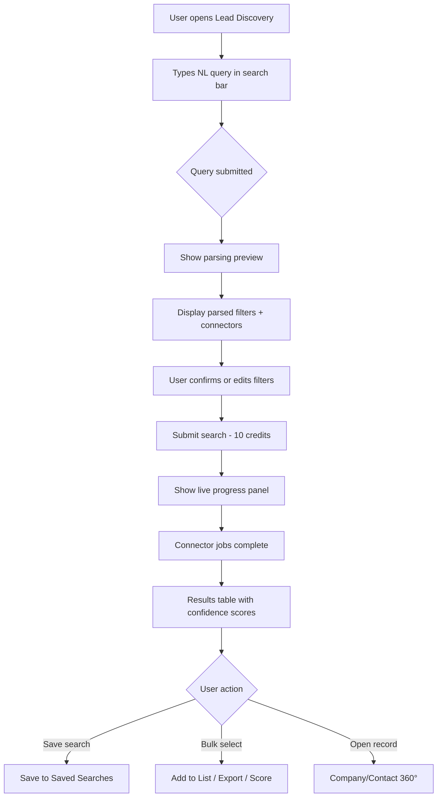
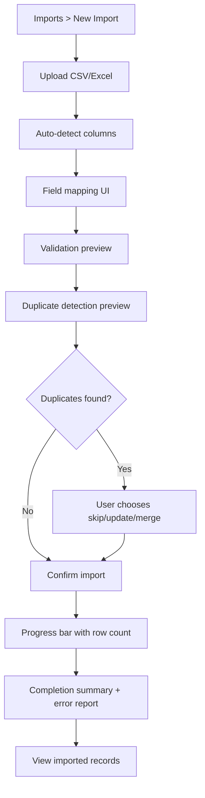
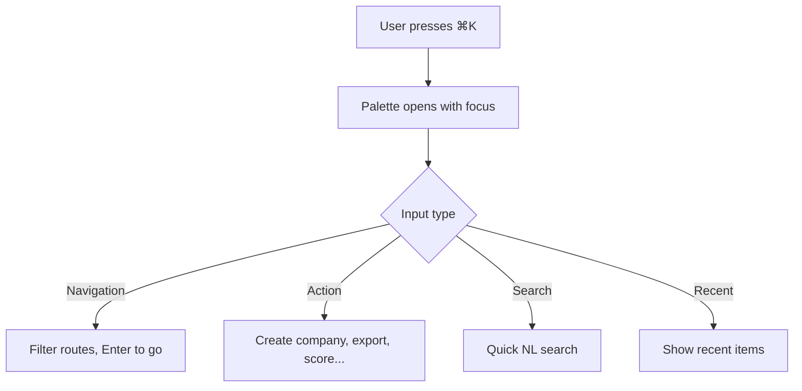
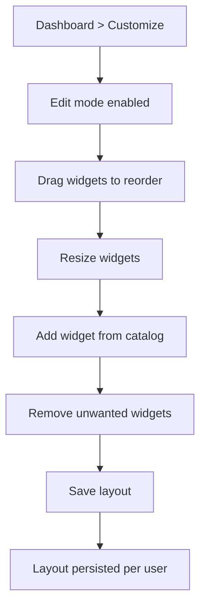

# Phase 4 — Frontend Architecture Document

**Version 1.0** | AI Lead Intelligence Platform

---

## Table of Contents

1. [Information Architecture](#1-information-architecture)
2. [Navigation Map](#2-navigation-map)
3. [User Flows](#3-user-flows)
4. [Application Shell](#4-application-shell)
5. [Module Architecture](#5-module-architecture)
6. [Global Search](#6-global-search)
7. [Command Palette](#7-command-palette)
8. [Data Table System](#8-data-table-system)
9. [360° Entity Views](#9-360-entity-views)
10. [AI Assistant](#10-ai-assistant)

---

## 1. Information Architecture

### Hierarchy

```text
AI Lead Intelligence Platform
│
├── 🏠 Home (Dashboard)
│   ├── Executive Overview
│   ├── Custom Widgets
│   └── Activity Feed
│
├── 🔍 Discover
│   ├── Lead Discovery (AI Search)
│   ├── Saved Searches
│   ├── Lists
│   └── Segments
│
├── 📇 Records
│   ├── Companies
│   │   ├── List View
│   │   ├── Company 360°
│   │   └── Merge / Import
│   └── Contacts
│       ├── List View
│       ├── Contact 360°
│       └── Merge / Import
│
├── 🤖 Intelligence
│   ├── AI Assistant
│   ├── Lead Scoring
│   └── Recommendations
│
├── 💼 CRM
│   ├── Pipeline (Kanban)
│   ├── Deals
│   ├── Tasks
│   ├── Activities
│   └── Calendar
│
├── 📊 Analytics
│   ├── Overview
│   ├── Reports
│   └── Connector Performance
│
├── 🔄 Data Ops
│   ├── Imports
│   └── Exports
│
├── ⚙️ Settings
│   ├── Organization
│   ├── Users & Permissions
│   ├── Integrations
│   ├── Billing
│   ├── API Keys
│   └── Profile & Preferences
│
├── 🛡️ Administration (admin only)
│   ├── Audit Logs
│   ├── Feature Flags
│   ├── System Health
│   └── Connector Config
│
└── 📚 Help
    ├── Documentation
    ├── Keyboard Shortcuts
    └── Developer Portal
```

### Content Types

| Type | Examples | Primary View |
|------|----------|--------------|
| Entity | Company, Contact, Deal | 360° detail page |
| Collection | List, Segment, Pipeline | Data table / Kanban |
| Action | Search, Import, Export | Wizard / modal flow |
| Insight | Score, Recommendation, Summary | Card / panel |
| Configuration | Role, Connector, Widget | Settings form |
| Temporal | Activity, Timeline, Task | Chronological feed |

### User Personas

| Persona | Primary Tasks | Key Screens |
|---------|---------------|-------------|
| **Sales Rep** | Find leads, score, outreach | Lead Discovery, Contact 360°, AI Assistant |
| **Sales Manager** | Pipeline, team performance | CRM Kanban, Analytics, Dashboard |
| **RevOps** | Data quality, imports, segments | Imports, Companies, Lists, Admin |
| **Admin** | Users, billing, connectors | Settings, Administration |
| **Executive** | KPIs, trends | Dashboard, Analytics Reports |

---

## 2. Navigation Map

### Primary Navigation (Left Sidebar)

```text
┌─────────────────────────────┐
│  [Logo] AI Lead Intel       │
│  [Org Switcher ▾]           │
├─────────────────────────────┤
│  🏠 Dashboard               │
│                             │
│  DISCOVER                   │
│  🔍 Lead Discovery          │
│  📌 Saved Searches          │
│  📋 Lists                   │
│  🎯 Segments                │
│                             │
│  RECORDS                    │
│  🏢 Companies               │
│  👤 Contacts                │
│                             │
│  INTELLIGENCE               │
│  ✨ AI Assistant            │
│  📈 Lead Scoring            │
│                             │
│  CRM                        │
│  📊 Pipeline                │
│  ✅ Tasks                   │
│  📅 Activities              │
│                             │
│  ANALYTICS                  │
│  📉 Reports                 │
│                             │
│  DATA OPS                   │
│  ⬆️ Imports                 │
│  ⬇️ Exports                 │
├─────────────────────────────┤
│  🔔 Notifications           │
│  ⚙️ Settings                │
│  🛡️ Admin (if permitted)    │
│  ❓ Help                    │
├─────────────────────────────┤
│  [Avatar] Jane Doe          │
│  Credits: 3,766 remaining   │
└─────────────────────────────┘
```

### Sidebar Behavior

| State | Width | Trigger |
|-------|-------|---------|
| Expanded | 256px | Default desktop |
| Collapsed | 64px (icons only) | Toggle button / `⌘B` |
| Hidden | 0px | Mobile overlay |

### Top Bar

```text
┌──────────────────────────────────────────────────────────────────────────┐
│ [☰]  Breadcrumbs: Discover > Lead Discovery                                │
│                                                                          │
│  ┌────────────────────────────────────────────────────┐  [⌘K] [🔔] [👤] │
│  │ 🔍 Ask anything… "Find logistics companies in Dubai" │                  │
│  └────────────────────────────────────────────────────┘                    │
└──────────────────────────────────────────────────────────────────────────┘
```

### Route Map

| Route | Screen | Auth | Layout |
|-------|--------|------|--------|
| `/login` | Login | Public | Auth |
| `/register` | Register | Public | Auth |
| `/dashboard` | Executive Dashboard | Protected | App |
| `/discover` | Lead Discovery | Protected | App |
| `/discover/saved` | Saved Searches | Protected | App |
| `/discover/lists` | Lists | Protected | App |
| `/discover/segments` | Segments | Protected | App |
| `/companies` | Company List | Protected | App |
| `/companies/[id]` | Company 360° | Protected | App |
| `/companies/[id]/edit` | Edit Company | Protected | App |
| `/contacts` | Contact List | Protected | App |
| `/contacts/[id]` | Contact 360° | Protected | App |
| `/ai` | AI Assistant | Protected | App |
| `/ai/scoring` | Lead Scoring | Protected | App |
| `/crm` | Pipeline Kanban | Protected | App |
| `/crm/deals/[id]` | Deal Detail | Protected | App |
| `/crm/tasks` | Tasks | Protected | App |
| `/crm/activities` | Activities | Protected | App |
| `/crm/calendar` | Calendar | Protected | App |
| `/analytics` | Analytics Hub | Protected | App |
| `/analytics/[report]` | Report Detail | Protected | App |
| `/imports` | Import Hub | Protected | App |
| `/imports/[id]` | Import Progress | Protected | App |
| `/exports` | Export Hub | Protected | App |
| `/exports/new` | Export Wizard | Protected | App |
| `/notifications` | Notification Center | Protected | App |
| `/settings/*` | Settings (nested) | Protected | Settings |
| `/admin/*` | Administration | Admin | Admin |
| `/developer` | Developer Portal | Protected | Developer |

---

## 3. User Flows

### Flow 1: AI Lead Discovery



### Flow 2: Company 360° Investigation

```mermaid
flowchart TD
    A[Open company from list or search] --> B[360° page loads]
    B --> C[Header: name, domain, score, actions]
    C --> D[Tabs: Overview | Contacts | Tech | Timeline | Files]
    D --> E[AI Summary panel on right]
    E --> F{Actions}
    F -->|Enrich| G[Trigger enrichment - 3 credits]
    F -->|Score| H[AI scoring - 1 credit]
    F -->|CRM Sync| I[Push to Salesforce/HubSpot]
    F -->|Add note| J[Inline note composer]
```

### Flow 3: CSV Import



### Flow 4: Command Palette Action



### Flow 5: Dashboard Customization



---

## 4. Application Shell

### Shell Component Tree

```text
<AppShell>
  <Sidebar collapsed={sidebarCollapsed}>
    <Logo />
    <OrgSwitcher />
    <NavSection title="Discover">...</NavSection>
    <NavSection title="Records">...</NavSection>
    <NavSection title="Intelligence">...</NavSection>
    <NavSection title="CRM">...</NavSection>
    <CreditBalance />
    <UserMenu />
  </Sidebar>

  <MainArea>
    <TopBar>
      <SidebarToggle />
      <Breadcrumbs />
      <GlobalSearch />      {/* AI-first */}
      <CommandPaletteTrigger />
      <NotificationBell />
      <UserAvatar />
    </TopBar>

    <PageContent>
      {children}
    </PageContent>

    <Footer />  {/* optional: version, links */}
  </MainArea>

  <CommandPalette />        {/* portal, global */}
  <Toaster />               {/* sonner */}
  <AIAssistantDrawer />     {/* optional slide-over */}
</AppShell>
```

### Shell Dimensions

| Element | Height | Z-Index |
|---------|--------|---------|
| Top bar | 56px (`h-14`) | 40 |
| Sidebar | 100vh | 30 |
| Command palette | auto, max 480px | 50 |
| Modal overlay | 100vh | 50 |
| Toast | auto | 60 |

### Breadcrumb Rules

- Always show current module + page
- Entity pages: `Records > Companies > Acme Inc`
- Max 4 levels; truncate middle with `...`
- Each segment is clickable except the last

### Quick Actions (Contextual FAB / Header)

| Context | Actions |
|---------|---------|
| Company List | + New Company, Import, Export |
| Contact List | + New Contact, Import, Bulk Verify |
| Lead Discovery | Save Search, Export Results |
| CRM Pipeline | + New Deal, + New Task |
| Dashboard | Customize, Add Widget |

---

## 5. Module Architecture

Each feature module follows:

```text
src/features/{module}/
├── components/       # Module-specific UI
├── hooks/            # TanStack Query hooks
├── stores/           # Zustand slice (if needed)
├── schemas/          # Zod validation
├── types/            # TypeScript interfaces
├── utils/            # Helpers
└── index.ts          # Public exports
```

### Feature Modules

| Module | Key Components | Data Hooks |
|--------|----------------|------------|
| `dashboard` | `DashboardGrid`, `WidgetCatalog`, `KpiCard` | `useDashboard`, `useWidgetLayout` |
| `discover` | `AISearchBar`, `FilterBuilder`, `SearchProgress` | `useAISearch`, `useSavedSearches` |
| `companies` | `CompanyTable`, `Company360`, `TechStack` | `useCompanies`, `useCompany` |
| `contacts` | `ContactTable`, `Contact360`, `VerificationBadge` | `useContacts`, `useContact` |
| `ai` | `AIChat`, `ScoreGauge`, `RecommendationCard` | `useAIChat`, `useScores` |
| `crm` | `KanbanBoard`, `DealCard`, `TaskList` | `usePipeline`, `useDeals` |
| `imports` | `ImportWizard`, `FieldMapper`, `DuplicatePreview` | `useImport` |
| `exports` | `ExportWizard`, `ColumnPicker` | `useExport` |
| `analytics` | `ChartWidget`, `ReportBuilder` | `useAnalytics` |
| `admin` | `AuditLogTable`, `FeatureFlagToggle` | `useAdmin` |
| `settings` | `SettingsNav`, `OrgForm`, `BillingPanel` | `useSettings` |

---

## 6. Global Search

### Search Modes

| Mode | Trigger | Backend |
|------|---------|---------|
| Quick keyword | Type + Enter in top bar | `GET /companies?q=` |
| AI natural language | Type NL query + `⌘Enter` | `POST /search/ai` |
| Command palette | `⌘K` → type query | Same as AI |
| Semantic | "Find companies like Acme" | `GET /ai/search/companies` |

### Search UI States

```text
┌─────────────────────────────────────────────────────────────┐
│ 🔍  Find logistics companies in Dubai with verified emails  │
├─────────────────────────────────────────────────────────────┤
│  ✨ AI Interpretation                                       │
│  Industry: logistics · Country: AE · City: Dubai            │
│  Filter: email_verified = true · Entity: companies          │
│  Connectors: apollo, clearbit                               │
├─────────────────────────────────────────────────────────────┤
│  RECENT                                                     │
│  ○ SaaS companies in California (2h ago)                    │
│  ○ VP Engineering fintech NYC (yesterday)                   │
├─────────────────────────────────────────────────────────────┤
│  SAVED                                                      │
│  ★ West Coast SaaS                                          │
│  ★ Enterprise fintech                                       │
├─────────────────────────────────────────────────────────────┤
│  SUGGESTIONS                                                │
│  acme.com · Acme Inc · Acme Corporation                     │
└─────────────────────────────────────────────────────────────┘
```

### Autocomplete Debounce

- Keyword suggestions: 200ms debounce
- AI parsing preview: 500ms debounce (after 10+ chars)
- Recent/saved: instant (local cache)

### Voice Search Ready

- Microphone icon in search bar (disabled until Web Speech API integrated)
- Placeholder architecture: `useVoiceSearch()` hook stub

---

## 7. Command Palette

### Implementation

- Library: `cmdk` (shadcn Command component)
- Shortcut: `⌘K` / `Ctrl+K`
- Secondary: `⌘Shift+P` for actions only

### Command Groups

| Group | Examples |
|-------|----------|
| Navigation | Go to Dashboard, Go to Companies... |
| Actions | Create Company, New Search, Export Contacts |
| Recent | Last 10 visited entities |
| Search | Quick AI search |
| Settings | Toggle dark mode, Open keyboard shortcuts |

### Keyboard Navigation

| Key | Action |
|-----|--------|
| `↑↓` | Navigate items |
| `Enter` | Execute selected |
| `Esc` | Close palette |
| `Tab` | Switch groups |

---

## 8. Data Table System

### Architecture

```text
<DataTable>
  <DataTableToolbar>
    <GlobalFilter />
    <ColumnVisibility />
    <SavedViewsDropdown />
    <BulkActions />       {/* visible when rows selected */}
  </DataTableToolbar>

  <VirtualizedTable>      {/* @tanstack/react-virtual */}
    <DraggableHeaders />  {/* column reorder */}
    <ResizableColumns />
    <SortableHeaders />
    <RowSelection />
    <InlineEditCells />   {/* optional per column */}
  </VirtualizedTable>

  <DataTablePagination /> {/* or infinite scroll sentinel */}
</DataTable>
```

### Column Configuration (persisted per user)

```typescript
interface SavedView {
  id: string
  name: string
  entityType: 'company' | 'contact'
  columns: ColumnConfig[]
  filters: FilterState
  sort: SortState
  isDefault: boolean
}

interface ColumnConfig {
  id: string
  visible: boolean
  width: number
  pinned: 'left' | 'right' | null
  order: number
}
```

### Bulk Actions

| Entity | Actions |
|--------|---------|
| Companies | Export, Score, Add to List, Delete, Enrich |
| Contacts | Export, Verify Email, Score, Add to List, Delete |
| Search Results | Save to List, Export, Score, Open 360° |

### Performance Targets

| Metric | Target |
|--------|--------|
| Initial render (10K rows) | < 100ms |
| Scroll FPS | 60fps |
| Filter apply | < 200ms |
| Column resize | No layout thrash |

---

## 9. 360° Entity Views

### Company 360° Layout

```text
┌─────────────────────────────────────────────────────────────────────────┐
│ HEADER                                                                  │
│ [Logo] Acme Inc · acme.com · SaaS · San Francisco, US                   │
│ Lead Score: 82 ████████░░  [Enrich] [Score] [Sync] [•••]               │
├──────────────────────────────────────────────┬──────────────────────────┤
│ TABS: Overview | Contacts | Tech | Timeline  │  AI SUMMARY              │
│              | Files | Relationships        │  "Acme Inc is a mid-     │
├──────────────────────────────────────────────┤   market SaaS company..." │
│                                              │                          │
│  TAB CONTENT                                 │  RECOMMENDATIONS         │
│  (varies by tab)                             │  • Reach out to VP Eng   │
│                                              │  • Similar: TechCo Inc   │
│                                              │                          │
│                                              │  CRM SYNC STATUS         │
│                                              │  ✓ Synced to Salesforce  │
└──────────────────────────────────────────────┴──────────────────────────┘
```

### Contact 360° Layout

```text
HEADER: John Smith · VP Engineering · Acme Inc
        john@acme.com ✓ · +1 415-555-1234 · Score: 91

TABS: Overview | Activity | Notes | Tasks | Lists

RIGHT PANEL:
- AI Insights
- Verification Status (email ✓, phone ?)
- Relationship Map (company, deals, colleagues)
- Recent Activity
```

### Tab Specifications

| Tab | Company Content | Contact Content |
|-----|-----------------|-----------------|
| Overview | Description, firmographics, social links | Bio, designation, seniority |
| Contacts | Linked contacts table | — |
| Tech | Technology stack badges | — |
| Timeline | Event stream | Communication timeline |
| Files | Attachments, logos | Attachments |
| Relationships | Parent/subsidiary, partners | Colleagues at company |
| Activity | CRM activities | Emails, calls, meetings |
| Notes | Team notes with @mentions | Personal notes |
| Tasks | Open tasks | Assigned tasks |

---

## 10. AI Assistant

### Layout Options

| Mode | Description |
|------|-------------|
| Full page (`/ai`) | Split: chat left, context panel right |
| Drawer | Slide-over from any page with entity context |
| Inline | Embedded in 360° right panel |

### Chat Interface

```text
┌─────────────────────────────────────────┐
│  AI Assistant                    [—][×] │
├─────────────────────────────────────────┤
│  🤖 How can I help you find leads?      │
│                                         │
│  👤 Find VP of Engineering at fintech    │
│     companies in NYC using AWS           │
│                                         │
│  🤖 I found 23 contacts matching your    │
│     criteria. Here are the top 5:        │
│     [Result cards with scores]           │
│                                         │
│  Suggested follow-ups:                   │
│  • "Score these contacts"                │
│  • "Draft outreach email for #1"         │
├─────────────────────────────────────────┤
│  [📎] [🎤]  Type a message...    [Send] │
└─────────────────────────────────────────┘
```

### Context Memory

- Pinned conversations stored in Zustand + localStorage
- Entity context auto-attached when opened from 360° page
- Conversation history synced to backend (future: `POST /ai/conversations`)

### AI Actions (slash commands)

| Command | Action |
|---------|--------|
| `/search` | Run lead discovery |
| `/score` | Score selected entities |
| `/summarize` | Generate company/contact summary |
| `/draft` | Email draft suggestion |
| `/similar` | Find similar companies |

---

*End of Phase 4 Frontend Architecture Document*