# Connector Framework Design

**Version 2.0** | AI Lead Intelligence Platform — Phase 5

---

## Table of Contents

1. [Overview](#1-overview)
2. [Design Principles](#2-design-principles)
3. [Capability Model](#3-capability-model)
4. [Connector Categories](#4-connector-categories)
5. [Data Source Classification](#5-data-source-classification)
6. [Registry Design](#6-registry-design)
7. [Provider Selection Engine](#7-provider-selection-engine)
8. [Fallback Engine](#8-fallback-engine)
9. [Rate Limiting Overview](#9-rate-limiting-overview)
10. [Connector Lifecycle](#10-connector-lifecycle)
11. [Provider Catalog](#11-provider-catalog)
12. [Configuration Model](#12-configuration-model)
13. [Health & Circuit Breaking](#13-health--circuit-breaking)
14. [Versioning & Compatibility](#14-versioning--compatibility)
15. [Security Requirements](#15-security-requirements)
16. [Implementation Roadmap](#16-implementation-roadmap)

---

## 1. Overview

The Connector Framework is the **plugin architecture** that decouples the Discovery Platform from any single data provider. Business logic in the orchestrator, query engine, and enrichment pipelines operates exclusively on **capabilities** and **canonical DTOs** — never on Apollo-specific JSON or Clearbit response shapes.

### 1.1 Problem Statement

B2B lead intelligence requires data from dozens of sources: company databases, email verifiers, tech detectors, CRM systems, and government registries. Without a framework:

- Provider swaps require rewriting orchestration code
- Rate limits and failures cascade into user-facing errors
- Data quality varies unpredictably across sources
- Compliance cannot be enforced uniformly

### 1.2 Solution

A **capability-based connector framework** with:

- Declarative capability manifests (`ConnectorCapability`)
- Category-based provider taxonomy (`ConnectorCategory`)
- Central registry (`backend/connectors/registry.py`)
- SDK contract (`backend/connectors/sdk/base.py`)
- Selection, fallback, and rate-limit subsystems

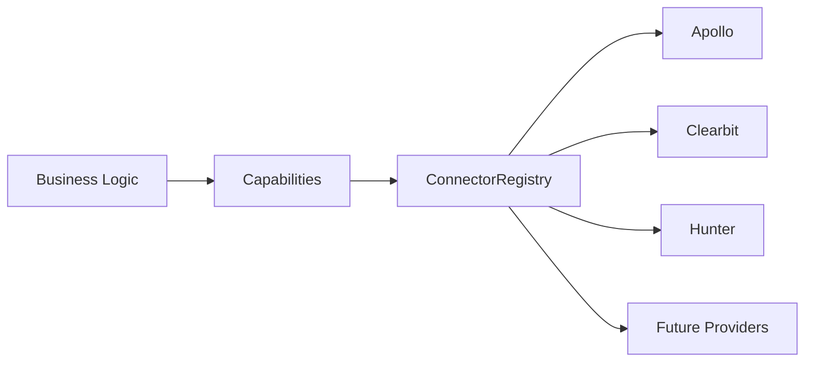

---

## 2. Design Principles

| Principle | Rationale | Enforcement |
|-----------|-----------|-------------|
| **Capability, not provider** | Orchestrator requests `SEARCH` + `VERIFY_EMAIL`, not "call Hunter" | `ConnectorCapability` enum |
| **Canonical output** | All providers return `NormalizedCompanyDTO` / `NormalizedContactDTO` | SDK `normalize()` + `validate()` |
| **Authorized sources only** | Legal and ethical compliance | `DataSourceType` + onboarding gate |
| **Fail gracefully** | One provider down ≠ entire search fails | Fallback Engine + partial results |
| **Tenant-scoped credentials** | Multi-tenant SaaS isolation | Per-org `connector_configs` |
| **Observable by default** | Debug provider issues in production | Structured logs per connector call |
| **Replaceable providers** | Competitive pricing, vendor risk | Registry hot-swap without deploy |

---

## 3. Capability Model

### 3.1 Capability Enum

Defined in `backend/app/discovery/capabilities.py`:

```python
class ConnectorCapability(str, Enum):
    SEARCH = "search"
    LOOKUP = "lookup"
    FETCH_DETAILS = "fetch_details"
    ENRICH = "enrich"
    VERIFY_EMAIL = "verify_email"
    VERIFY_PHONE = "verify_phone"
    DETECT_TECH = "detect_tech"
    GEOCODE = "geocode"
    CRM_SYNC = "crm_sync"
    IMPORT = "import"
    WEBHOOK = "webhook"
```

### 3.2 Capability Definitions

| Capability | Description | Input | Output |
|------------|-------------|-------|--------|
| `SEARCH` | Discover entities matching query/filters | `ConnectorSearchRequest` | `ConnectorSearchResult` (0–N records) |
| `LOOKUP` | Resolve single entity by identifier | `identifier` + `identifier_type` | Single `ConnectorRecordDTO` |
| `FETCH_DETAILS` | Deep fetch by provider external ID | `external_id` + `entity_type` | Full entity DTO |
| `ENRICH` | Augment partial record with additional fields | Partial DTO or dict | Enriched DTO |
| `VERIFY_EMAIL` | Validate email deliverability | Email address | Verification result |
| `VERIFY_PHONE` | Validate phone number | E.164 phone | Verification result |
| `DETECT_TECH` | Identify technology stack from domain | Domain URL | `Technology[]` |
| `GEOCODE` | Resolve address to coordinates | Address string | `NormalizedAddressDTO` |
| `CRM_SYNC` | Bidirectional CRM data exchange | CRM record ID | Sync result |
| `IMPORT` | Ingest user-provided file data | File reference | Parsed records |
| `WEBHOOK` | Receive inbound provider events | Webhook payload | Processed event |

### 3.3 Capability Matrix (Required vs Optional)

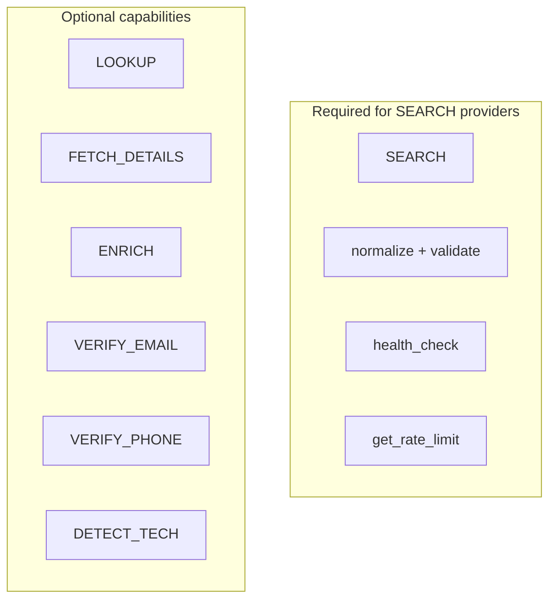

### 3.4 Capability Composition Patterns

| Use Case | Required Capabilities | Typical Providers |
|----------|----------------------|-------------------|
| Company discovery | `SEARCH`, `LOOKUP` | Apollo, Clearbit, Crunchbase |
| Contact discovery | `SEARCH`, `VERIFY_EMAIL` | Apollo, Hunter |
| Domain enrichment | `LOOKUP`, `ENRICH`, `DETECT_TECH` | Clearbit, BuiltWith |
| Email verification | `VERIFY_EMAIL` | Hunter, ZeroBounce |
| CRM import | `CRM_SYNC`, `IMPORT` | Salesforce, HubSpot |
| Scheduled registry check | `LOOKUP`, `FETCH_DETAILS` | Companies House |

### 3.5 Legacy v1 Flags

Phase 1 `BaseConnector` uses boolean flags (`supports_search`, `supports_lookup`, `supports_enrich`). The v2 SDK uses `capabilities: frozenset[ConnectorCapability]`. Migration mapping:

| v1 Flag | v2 Capability |
|---------|---------------|
| `supports_search` | `SEARCH` |
| `supports_lookup` | `LOOKUP` |
| `supports_enrich` | `ENRICH` |
| — | `FETCH_DETAILS` (new) |
| — | `VERIFY_EMAIL` (new) |

---

## 4. Connector Categories

### 4.1 Category Enum

```python
class ConnectorCategory(str, Enum):
    SEARCH_PROVIDER = "search_provider"
    BUSINESS_DIRECTORY = "business_directory"
    COMPANY_REGISTRY = "company_registry"
    GOVERNMENT_DATA = "government_data"
    ENRICHMENT = "enrichment"
    VERIFICATION = "verification"
    TECH_DETECTION = "tech_detection"
    CRM = "crm"
    IMPORT = "import"
    WEBHOOK = "webhook"
    NEWS = "news"
    GEOLOCATION = "geolocation"
    AI = "ai"
```

### 4.2 Category Reference

| Category | Purpose | Typical Capabilities | Data Source Types | Examples |
|----------|---------|---------------------|-------------------|----------|
| **SEARCH_PROVIDER** | Primary B2B people/company search | `SEARCH`, `LOOKUP`, `ENRICH` | `official_api`, `licensed_provider` | Apollo, ZoomInfo |
| **BUSINESS_DIRECTORY** | Business listings and directories | `SEARCH`, `LOOKUP` | `licensed_provider`, `public_registry` | Yelp Business, D&B |
| **COMPANY_REGISTRY** | Official company registration data | `LOOKUP`, `FETCH_DETAILS` | `public_registry`, `government_open_data` | Companies House UK, SEC EDGAR |
| **GOVERNMENT_DATA** | Government open datasets | `SEARCH`, `LOOKUP` | `government_open_data` | data.gov, EU Open Data |
| **ENRICHMENT** | Firmographic/demographic augmentation | `ENRICH`, `LOOKUP`, `FETCH_DETAILS` | `official_api`, `licensed_provider` | Clearbit, FullContact |
| **VERIFICATION** | Email/phone/domain validation | `VERIFY_EMAIL`, `VERIFY_PHONE` | `official_api` | Hunter, ZeroBounce, Twilio Lookup |
| **TECH_DETECTION** | Website technology identification | `DETECT_TECH`, `LOOKUP` | `official_api`, `licensed_provider` | BuiltWith, Wappalyzer API |
| **CRM** | Customer relationship management sync | `CRM_SYNC`, `SEARCH`, `IMPORT` | `user_authorized` | Salesforce, HubSpot, Pipedrive |
| **IMPORT** | User file ingestion (no external API) | `IMPORT` | `user_import` | CSV, Excel upload |
| **WEBHOOK** | Inbound event receivers | `WEBHOOK` | `user_authorized` | Salesforce outbound messages |
| **NEWS** | Company news and signals | `SEARCH`, `LOOKUP` | `official_api`, `licensed_provider` | NewsAPI, Crunchbase News |
| **GEOLOCATION** | Address geocoding and geo enrichment | `GEOCODE`, `ENRICH` | `official_api` | Google Geocoding, Mapbox |
| **AI** | LLM-powered inference and parsing | `SEARCH`, `ENRICH` | `search_index` | Internal NL parser, embedding service |

### 4.3 Category → Capability Defaults

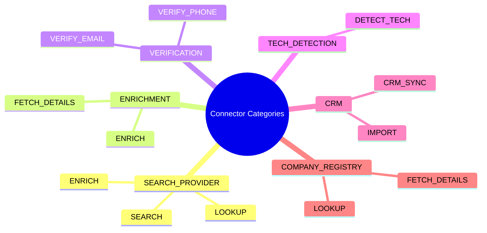

### 4.4 Multi-Category Providers

Some providers span categories. Registration uses **primary category** + **secondary categories**:

```python
@ConnectorRegistry.register
class ApolloConnector(ConnectorSDKBase):
    name = "apollo"
    category = ConnectorCategory.SEARCH_PROVIDER
    secondary_categories = frozenset({
        ConnectorCategory.ENRICHMENT,
    })
    capabilities = frozenset({
        ConnectorCapability.SEARCH,
        ConnectorCapability.LOOKUP,
        ConnectorCapability.ENRICH,
        ConnectorCapability.FETCH_DETAILS,
    })
    source_type = DataSourceType.OFFICIAL_API
```

---

## 5. Data Source Classification

### 5.1 DataSourceType Enum

Every connector declares how it obtains data. The platform **rejects** connectors without a valid `source_type`.

| Type | Legal Basis | Scraping Allowed? |
|------|-------------|-------------------|
| `official_api` | Provider API agreement | No — API only |
| `licensed_provider` | Commercial license | No — licensed endpoints only |
| `public_registry` | Public record access | No — registry API/feed only |
| `government_open_data` | Open data license | No — published datasets only |
| `user_authorized` | User OAuth consent | No — authorized API scopes only |
| `user_import` | User data upload | No external fetch |
| `search_index` | Platform-owned index | Internal data only |

### 5.2 Compliance Gate

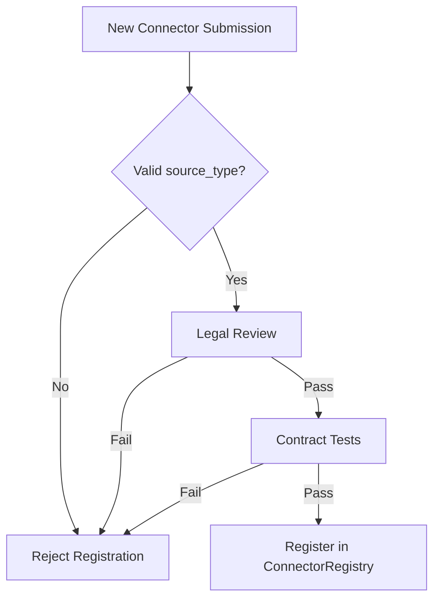

---

## 6. Registry Design

### 6.1 Current Implementation

`backend/connectors/registry.py` provides:

```python
class ConnectorRegistry:
    _registry: dict[str, Type[BaseConnector]] = {}

    @classmethod
    def register(cls, connector_class) -> Type: ...  # Decorator

    @classmethod
    def get(cls, name: str, config: dict | None = None) -> BaseConnector | None: ...

    @classmethod
    def list_available(cls) -> list[dict]: ...

    @classmethod
    def all(cls) -> dict[str, BaseConnector]: ...
```

### 6.2 Enhanced Registry (v2 Target)

```python
@dataclass(frozen=True)
class ConnectorMetadata:
    name: str
    display_name: str
    version: str
    sdk_version: str
    category: ConnectorCategory
    source_type: DataSourceType
    capabilities: frozenset[ConnectorCapability]
    entity_types: frozenset[str]          # company, contact
    identifier_types: frozenset[str]      # domain, email, linkedin_url
    rate_limit_class: str                 # standard, burst, daily_quota
    credit_cost_search: int
    credit_cost_lookup: int
    requires_oauth: bool
    config_schema: dict                   # JSON Schema for tenant config UI
    health_endpoint: str | None
    documentation_url: str | None
    deprecated: bool = False
    replacement: str | None = None


class ConnectorRegistry:
    _registry: dict[str, Type[ConnectorSDKBase]] = {}
    _metadata: dict[str, ConnectorMetadata] = {}

    @classmethod
    def register(cls, connector_class, metadata: ConnectorMetadata | None = None): ...

    @classmethod
    def get(cls, name: str, config: dict) -> ConnectorSDKBase: ...

    @classmethod
    def list_by_capability(cls, capability: ConnectorCapability) -> list[ConnectorMetadata]: ...

    @classmethod
    def list_by_category(cls, category: ConnectorCategory) -> list[ConnectorMetadata]: ...

    @classmethod
    def resolve_for_request(
        cls,
        capabilities: list[ConnectorCapability],
        entity_type: str,
        org_config: OrgConnectorConfig,
    ) -> list[str]: ...
```

### 6.3 Registration Flow

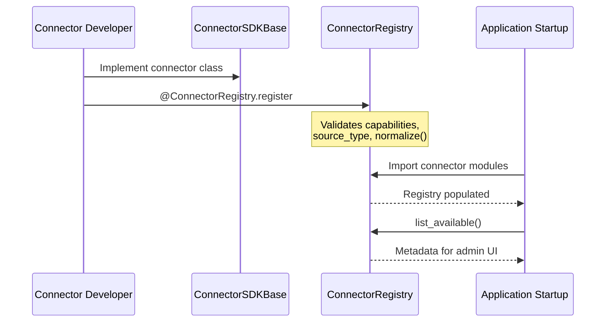

### 6.4 Module Discovery

Connectors are discovered at application startup:

```python
# backend/connectors/__init__.py
def load_connectors():
    import backend.connectors.apollo      # triggers @register
    import backend.connectors.clearbit
    import backend.connectors.hunter
    # Dynamic: importlib for providers/ subdirectory
```

### 6.5 Instance vs Class Registry

| Pattern | Use Case |
|---------|----------|
| **Class registry** (current) | Stateless connectors; config injected at `get()` |
| **Instance pool** (future) | Connection pooling for OAuth CRM connectors |
| **Per-tenant cache** | Cached authenticated instances keyed by `org_id:connector_name` |

---

## 7. Provider Selection Engine

### 7.1 Selection Inputs

| Input | Source |
|-------|--------|
| Required capabilities | Query plan / `DiscoveryRequest` |
| Entity type | `company`, `contact`, `both` |
| Tenant enabled connectors | `connector_configs` WHERE `is_active = true` |
| Provider health | Redis `connector:health:{name}` |
| Credit balance | `billing.credit_balance` |
| User preference | Explicit `connectors` list in request |
| Feature flags | `feature_flags` per org |

### 7.2 Selection Algorithm

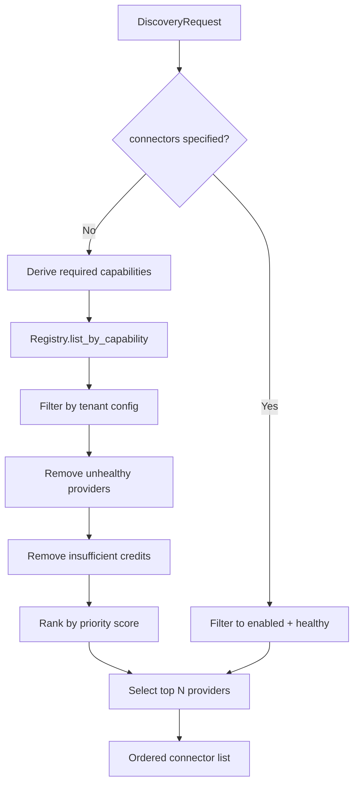

### 7.3 Priority Scoring

```python
def score_provider(metadata: ConnectorMetadata, ctx: SelectionContext) -> float:
    score = 0.0
    score += metadata.trust_score * 0.30          # Historical accuracy
    score += ctx.health_score * 0.25              # Current health
    score += metadata.coverage_score(ctx) * 0.20  # Geo/industry coverage
    score += (1.0 - metadata.latency_p95 / 5000) * 0.15
    score += ctx.user_preference_boost * 0.10     # Org default provider
    return score
```

### 7.4 Selection Policies

| Policy | Behavior |
|--------|----------|
| `parallel_all` | Execute all selected providers concurrently (default) |
| `primary_only` | Single highest-ranked provider |
| `primary_with_fallback` | Primary first; fallback on failure/empty |
| `cost_optimized` | Cheapest provider meeting capability requirements |
| `coverage_optimized` | Maximize geographic/industry coverage |

### 7.5 Tenant Override Example

```json
{
  "organization_id": "uuid",
  "discovery_policy": "primary_with_fallback",
  "default_connectors": ["apollo", "clearbit"],
  "fallback_connectors": ["hunter"],
  "max_parallel_connectors": 3,
  "disabled_connectors": ["zoominfo"]
}
```

---

## 8. Fallback Engine

### 8.1 Fallback Triggers

| Trigger | Action |
|---------|--------|
| Connector health `healthy: false` | Skip; try next in fallback chain |
| HTTP 429 rate limited | Queue retry OR switch to fallback |
| HTTP 402 credits exhausted | Switch to fallback; notify admin |
| Empty result set | Try fallback if `coverage_optimized` policy |
| Timeout (> 10s per connector) | Cancel; record partial; try fallback |
| Authentication failure | Disable connector for org; alert |

### 8.2 Fallback Chain Configuration

```json
{
  "capability": "SEARCH",
  "entity_type": "company",
  "chain": [
    {"connector": "apollo", "priority": 1, "timeout_ms": 8000},
    {"connector": "clearbit", "priority": 2, "timeout_ms": 5000},
    {"connector": "internal_index", "priority": 3, "timeout_ms": 2000}
  ]
}
```

### 8.3 Fallback Sequence

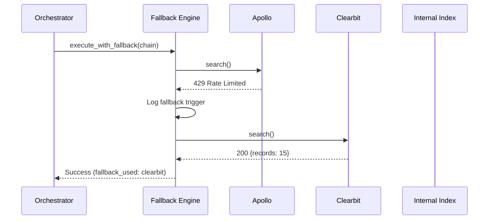

### 8.4 Partial Result Handling

When all providers in chain fail:

- Return `status: partial` with available data from any successful earlier stage
- Include `errors[]` per connector in response
- Do **not** fabricate data from unauthorized sources

---

## 9. Rate Limiting Overview

### 9.1 Rate Limit Layers

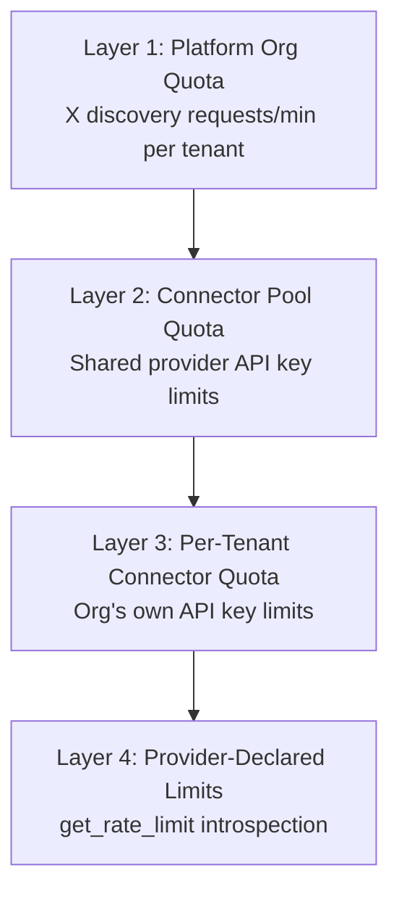

### 9.2 Rate Limit Sources

| Source | Implementation | Storage |
|--------|----------------|---------|
| Platform-wide | API middleware (Phase 3) | Redis sliding window |
| Per-connector (shared key) | `RateLimitManager` | Redis `ratelimit:connector:{name}:global` |
| Per-tenant connector key | `RateLimitManager` | Redis `ratelimit:connector:{name}:org:{org_id}` |
| Provider response headers | Parsed in connector; cached | `RateLimitDTO` |

### 9.3 RateLimitDTO Contract

From `backend/connectors/sdk/dto.py`:

```python
@dataclass
class RateLimitDTO:
    requests_remaining: int
    requests_limit: int
    reset_at: datetime | None = None
    burst_remaining: int | None = None
```

### 9.4 Throttle Strategies

| Strategy | When Applied |
|----------|--------------|
| **Token bucket** | Burst-tolerant APIs (Apollo 50/min) |
| **Sliding window** | Platform org quotas |
| **Daily quota** | Credit-based providers |
| **Exponential backoff** | 429 responses (tenacity in `apollo.py`) |
| **Queue deferral** | Celery `countdown` when all tokens exhausted |

### 9.5 Rate Limit Decision Flow

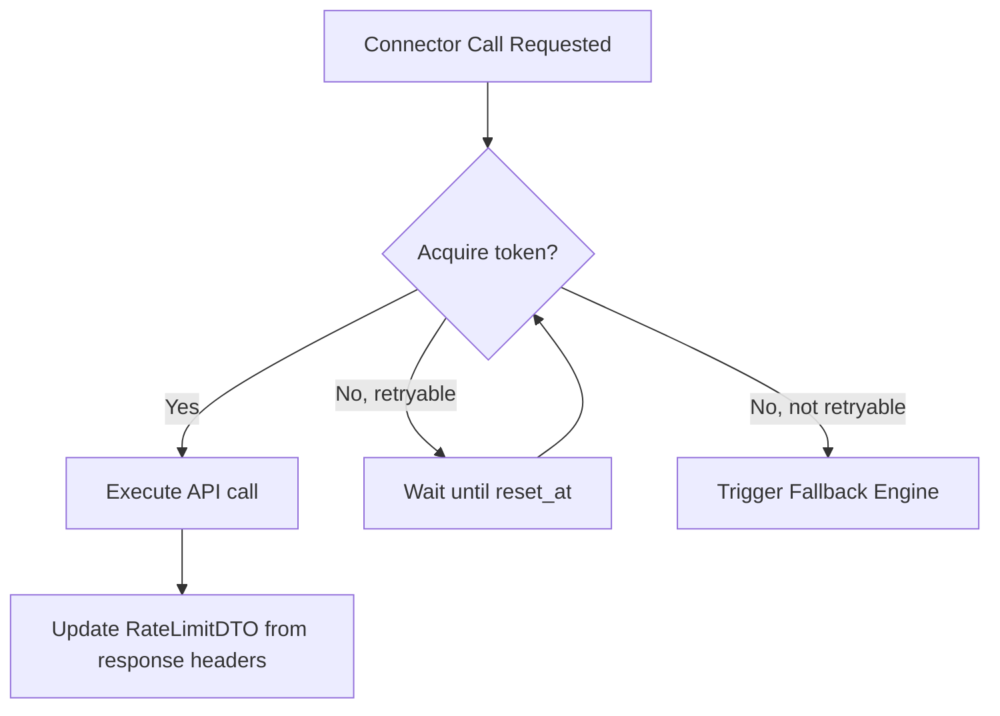

### 9.6 Credit Accounting

| Operation | Default Credits | Configurable Per Org |
|-----------|-----------------|---------------------|
| Search (per result) | 1 | Yes |
| Lookup | 1 | Yes |
| Enrich | 2 | Yes |
| Verify email | 1 | Yes |
| Detect tech | 1 | Yes |

Credits deducted **after** successful response, recorded in `discovery_jobs.credits_used` and `credit_transactions`.

---

## 10. Connector Lifecycle

### 10.1 State Machine

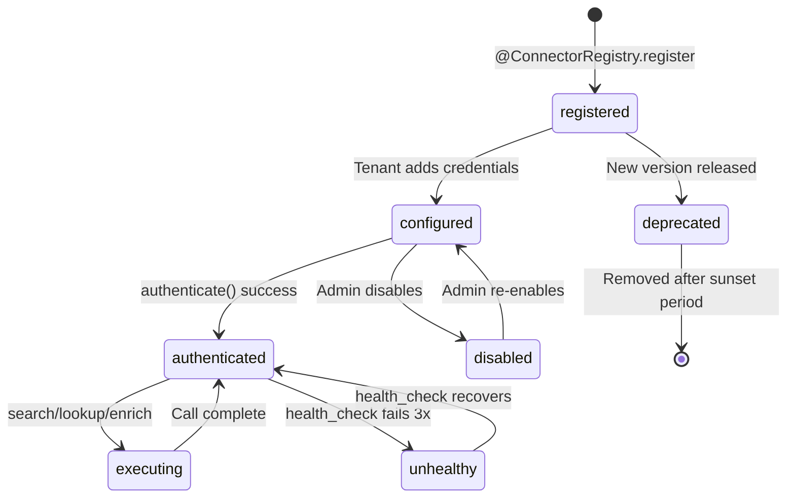

### 10.2 Lifecycle Hooks

| Hook | Trigger | Action |
|------|---------|--------|
| `on_register` | Application startup | Validate metadata, publish to admin catalog |
| `on_configure` | Tenant saves config | Encrypt credentials, test connection |
| `on_authenticate` | First call per instance | OAuth token refresh if needed |
| `on_disconnect` | Instance eviction / shutdown | Revoke tokens, close connections |
| `on_health_fail` | 3 consecutive failures | Circuit breaker open, fallback activated |

---

## 11. Provider Catalog

### 11.1 Implemented (Phase 5 Sprint 1)

| Provider | Category | Capabilities | Source Type | Path |
|----------|----------|--------------|-------------|------|
| **Apollo** | SEARCH_PROVIDER | SEARCH, LOOKUP, ENRICH | `official_api` | `backend/connectors/apollo.py` |
| **Clearbit** | ENRICHMENT | LOOKUP, ENRICH | `official_api` | `backend/connectors/clearbit.py` |
| **Hunter** | VERIFICATION | SEARCH, LOOKUP, VERIFY_EMAIL | `official_api` | `backend/connectors/hunter.py` |
| **Email Verifier (Mock)** | VERIFICATION | LOOKUP, ENRICH | `official_api` | `backend/connectors/registry.py` |

### 11.2 Planned (Phase 5 Roadmap)

| Provider | Category | Capabilities | Source Type |
|----------|----------|--------------|-------------|
| Salesforce | CRM | CRM_SYNC, SEARCH, IMPORT | `user_authorized` |
| HubSpot | CRM | CRM_SYNC, SEARCH | `user_authorized` |
| BuiltWith | TECH_DETECTION | DETECT_TECH | `official_api` |
| Companies House | COMPANY_REGISTRY | LOOKUP, FETCH_DETAILS | `public_registry` |
| ZeroBounce | VERIFICATION | VERIFY_EMAIL | `official_api` |
| Internal Index | SEARCH_PROVIDER | SEARCH | `search_index` |

---

## 12. Configuration Model

### 12.1 Tenant Connector Config

Stored in `connector_configs` (Phase 2):

```json
{
  "id": "uuid",
  "organization_id": "uuid",
  "connector_name": "apollo",
  "is_active": true,
  "credentials": {
    "api_key": "encrypted:..."
  },
  "settings": {
    "default_entity_type": "company",
    "max_results_per_call": 25,
    "timeout_ms": 8000
  },
  "created_at": "2026-01-15T00:00:00Z"
}
```

### 12.2 Config Schema per Connector

Each connector exposes `config_schema` for admin UI validation:

```json
{
  "type": "object",
  "required": ["api_key"],
  "properties": {
    "api_key": {
      "type": "string",
      "format": "password",
      "description": "Apollo API key from Settings > Integrations"
    }
  }
}
```

### 12.3 Test Connection

`POST /api/v1/connectors/configs/{config_id}/test` executes:

1. Instantiate connector with decrypted credentials
2. `authenticate()` → must return `true`
3. `health_check()` → must return `healthy: true`
4. Return `{ "success": true, "latency_ms": 120 }`

---

## 13. Health & Circuit Breaking

### 13.1 Health Check Contract

```python
@dataclass
class ConnectorHealthDTO:
    healthy: bool
    latency_ms: int
    message: str = ""
    last_success_at: datetime | None = None
    error_rate_1h: float = 0.0
```

### 13.2 Circuit Breaker States

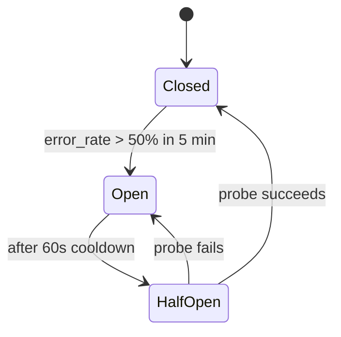

### 13.3 Health Probe Worker

Celery Beat task `connector.health_probe` every 5 minutes:

1. For each registered connector with active tenant configs
2. Execute `health_check()`
3. Update Redis `connector:health:{name}`
4. Emit `connector.health.changed` event if status flips

---

## 14. Versioning & Compatibility

### 14.1 SDK Versions

| SDK Version | Interface | Status |
|-------------|-----------|--------|
| v1.0 | `BaseConnector` (`backend/connectors/base.py`) | Legacy — supported via adapter |
| v2.0 | `ConnectorSDKBase` (`backend/connectors/sdk/base.py`) | Current |

### 14.2 Connector Version Semantics

- **MAJOR**: Breaking SDK interface change
- **MINOR**: New capability or identifier type
- **PATCH**: Bug fix, mapping improvement

### 14.3 Negotiation

```python
connector.sdk_version  # "2.0"
orchestrator.min_sdk_version  # "2.0"
# v1 connectors adapted automatically via sdk/adapter.py
```

---

## 15. Security Requirements

| Requirement | Implementation |
|-------------|----------------|
| Credential encryption | AES-256-GCM at rest |
| No credentials in logs | Redact in structured logging middleware |
| OAuth scope minimization | Request only required CRM scopes |
| TLS 1.2+ for all outbound | httpx default |
| Response PII minimization | Store only fields needed for canonical model |
| Audit on config changes | `audit_logs` entry on config CRUD |
| IP allowlisting (optional) | Enterprise tier outbound proxy |

---

## 16. Implementation Roadmap

| Sprint | Deliverable |
|--------|-------------|
| 1 | Enhanced `ConnectorRegistry` with metadata + `list_by_capability` |
| 2 | Provider Selection Engine + Fallback Engine |
| 3 | Rate Limit Manager (Redis token bucket) |
| 4 | v1→v2 adapter for Apollo, Clearbit, Hunter |
| 5 | Health probe worker + circuit breaker |
| 6 | Salesforce/HubSpot OAuth connectors |
| 7 | Companies House public registry connector |
| 8 | Deprecate v1 `BaseConnector` interface |

---

## Related Documents

- [Connector SDK Specification](./connector-sdk-specification.md)
- [Discovery Orchestrator](./discovery-orchestrator.md)
- [Discovery Platform Architecture](./discovery-platform-architecture.md)
- [Security Architecture](./security-architecture.md) *(planned)*