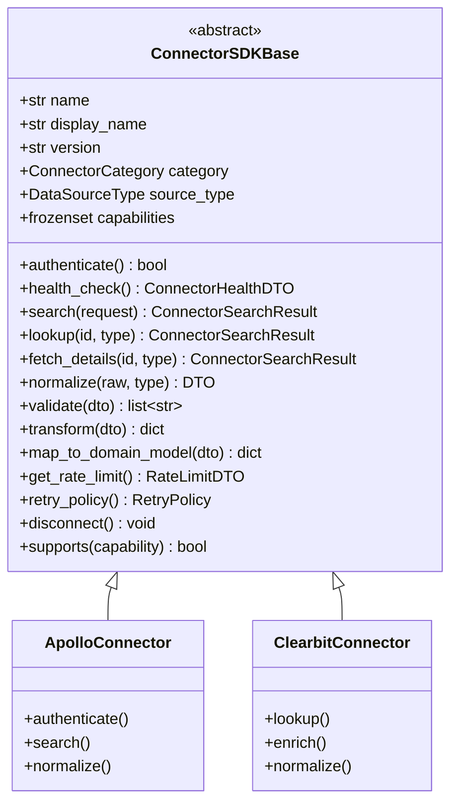
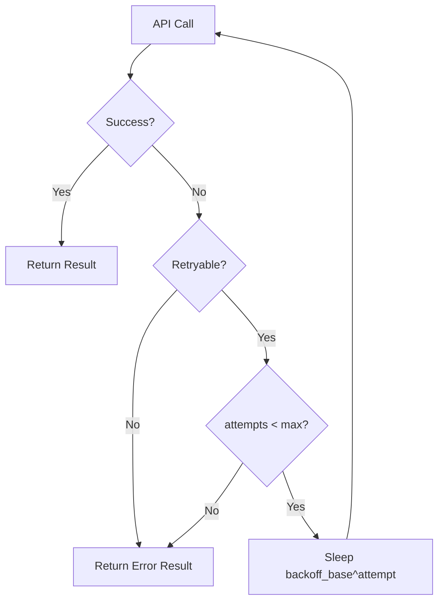

# Connector SDK Specification

**Version 2.0** | AI Lead Intelligence Platform — Phase 5

---

## Table of Contents

1. [Overview](#1-overview)
2. [SDK Interface](#2-sdk-interface)
3. [Class Contract](#3-class-contract)
4. [Method Specifications](#4-method-specifications)
5. [DTO Contracts](#5-dto-contracts)
6. [Error Handling](#6-error-handling)
7. [Retry Policy](#7-retry-policy)
8. [Versioning](#8-versioning)
9. [v1 Migration Adapter](#9-v1-migration-adapter)
10. [Implementation Checklist](#10-implementation-checklist)
11. [Reference Implementation](#11-reference-implementation)

---

## 1. Overview

The Connector SDK (`backend/connectors/sdk/`) defines the **mandatory contract** every data provider must implement. The Discovery Orchestrator, enrichment pipelines, and worker tasks depend exclusively on this interface — never on provider-specific code.

### 1.1 Package Structure

```text
backend/connectors/sdk/
├── __init__.py          # Public exports
├── base.py              # ConnectorSDKBase ABC
├── dto.py               # Request/response DTOs
├── errors.py            # Exception hierarchy (planned)
├── adapter.py           # v1 BaseConnector → v2 bridge (planned)
└── versioning.py        # SDK version constants (planned)
```

### 1.2 Design Goals

| Goal | Mechanism |
|------|-----------|
| Provider swap without orchestrator changes | Stable interface + canonical DTOs |
| Testability | Mock connector implementing same ABC |
| Compliance enforcement | `source_type` class attribute required |
| Gradual migration | Adapter wraps v1 `BaseConnector` |

---

## 2. SDK Interface

### 2.1 Interface Summary

Every connector **must** implement these methods:

| Method | Required | Returns |
|--------|----------|---------|
| `authenticate()` | Yes | `bool` |
| `health_check()` | Yes | `ConnectorHealthDTO` |
| `search(request)` | If `SEARCH` capability | `ConnectorSearchResult` |
| `lookup(identifier, identifier_type)` | If `LOOKUP` capability | `ConnectorSearchResult` |
| `fetch_details(external_id, entity_type)` | If `FETCH_DETAILS` capability | `ConnectorSearchResult` |
| `normalize(raw, entity_type)` | Yes | `NormalizedCompanyDTO \| NormalizedContactDTO` |
| `validate(dto)` | Yes | `list[str]` (empty = valid) |
| `transform(dto)` | Yes | `dict[str, Any]` |
| `map_to_domain_model(dto)` | Yes | `dict[str, Any]` |
| `get_rate_limit()` | Yes | `RateLimitDTO` |
| `retry_policy()` | Yes (default provided) | `RetryPolicy` |
| `disconnect()` | Yes (default provided) | `None` |

### 2.2 Interface Diagram



---

## 3. Class Contract

### 3.1 Base Class Definition

Source: `backend/connectors/sdk/base.py`

```python
class ConnectorSDKBase(ABC):
    name: str = ""
    display_name: str = ""
    version: str = "2.0"
    category: ConnectorCategory = ConnectorCategory.ENRICHMENT
    source_type: DataSourceType = DataSourceType.LICENSED_PROVIDER
    capabilities: frozenset[ConnectorCapability] = frozenset()

    def __init__(self, config: dict[str, Any]):
        self.config = config
        self._authenticated = False
```

### 3.2 Required Class Attributes

| Attribute | Type | Description | Example |
|-----------|------|-------------|---------|
| `name` | `str` | Unique registry key (snake_case) | `"apollo"` |
| `display_name` | `str` | Human-readable label | `"Apollo.io"` |
| `version` | `str` | Connector semver | `"2.0.1"` |
| `category` | `ConnectorCategory` | Primary category | `SEARCH_PROVIDER` |
| `source_type` | `DataSourceType` | Legal data origin | `OFFICIAL_API` |
| `capabilities` | `frozenset[ConnectorCapability]` | Supported operations | `{SEARCH, LOOKUP, ENRICH}` |

### 3.3 Optional Class Attributes

| Attribute | Type | Default | Description |
|-----------|------|---------|-------------|
| `secondary_categories` | `frozenset[ConnectorCategory]` | `frozenset()` | Additional categories |
| `supported_entity_types` | `frozenset[str]` | `{"company", "contact"}` | Entity types handled |
| `supported_identifier_types` | `frozenset[str]` | `{"domain", "email"}` | Lookup identifier types |
| `documentation_url` | `str` | `""` | Provider API docs link |
| `config_schema` | `dict` | `{}` | JSON Schema for tenant config |

### 3.4 Registration

```python
from backend.connectors.registry import ConnectorRegistry
from backend.connectors.sdk.base import ConnectorSDKBase

@ConnectorRegistry.register
class MyProviderConnector(ConnectorSDKBase):
    name = "my_provider"
    display_name = "My Provider"
    version = "2.0.0"
    category = ConnectorCategory.ENRICHMENT
    source_type = DataSourceType.OFFICIAL_API
    capabilities = frozenset({
        ConnectorCapability.LOOKUP,
        ConnectorCapability.ENRICH,
    })
```

---

## 4. Method Specifications

### 4.1 `authenticate() -> bool`

Establishes credentials with the provider API.

**Behavior:**
- Called lazily via `_ensure_authenticated()` before any data operation
- Must be idempotent — safe to call multiple times
- Sets `self._authenticated = True` on success
- Returns `False` on invalid credentials (does not raise)
- Raises `ConnectorAuthError` only on unexpected infrastructure failure

**Implementation pattern:**

```python
def authenticate(self) -> bool:
    if not self.config.get("api_key"):
        return False
    try:
        response = self._client.get("/auth/verify")
        self._authenticated = response.status_code == 200
        return self._authenticated
    except httpx.RequestError:
        return False
```

**OAuth connectors:**

```python
def authenticate(self) -> bool:
    token = self._token_store.get_refresh_token(self.config["org_id"])
    if token.is_expired():
        token = self._oauth.refresh(token)
    self._access_token = token.access_token
    self._authenticated = True
    return True
```

---

### 4.2 `health_check() -> ConnectorHealthDTO`

Probes provider availability without consuming significant credits.

**Behavior:**
- Must complete within **5 seconds** (enforced by orchestrator timeout)
- Should use lightweight endpoint (e.g., `/health`, `/credits`, `HEAD` request)
- Must not return PII in `message`
- Called by Celery Beat `connector.health_probe` every 5 minutes

**Return contract:**

```python
@dataclass
class ConnectorHealthDTO:
    healthy: bool           # True if provider is reachable and credentialed
    latency_ms: int         # Round-trip time
    message: str = ""       # Human-readable status (no secrets)
    last_success_at: datetime | None = None
    error_rate_1h: float = 0.0  # Populated by platform, not connector
```

**Example:**

```python
def health_check(self) -> ConnectorHealthDTO:
    start = time.perf_counter()
    try:
        self._ensure_authenticated()
        resp = self._client.get("/v1/auth/health", timeout=5.0)
        latency = int((time.perf_counter() - start) * 1000)
        return ConnectorHealthDTO(
            healthy=resp.status_code == 200,
            latency_ms=latency,
            message="OK" if resp.status_code == 200 else f"HTTP {resp.status_code}",
        )
    except Exception as e:
        return ConnectorHealthDTO(
            healthy=False,
            latency_ms=int((time.perf_counter() - start) * 1000),
            message=type(e).__name__,
        )
```

---

### 4.3 `search(request: ConnectorSearchRequest) -> ConnectorSearchResult`

Discovers entities matching query and filters.

**Preconditions:**
- `SEARCH` in `capabilities`
- `_ensure_authenticated()` called
- Rate limit acquired by orchestrator (connector may still receive 429)

**Request contract:**

```python
@dataclass
class ConnectorSearchRequest:
    query: str | None = None
    entity_type: Literal["company", "contact", "both"] = "both"
    filters: dict[str, Any] = field(default_factory=dict)
    page: int = 1
    page_size: int = 25
    org_id: UUID | None = None
```

**Standard filter keys** (orchestrator normalizes to these):

| Filter Key | Type | Description |
|------------|------|-------------|
| `industry` | `str \| list[str]` | Industry names or codes |
| `country_code` | `str` | ISO 3166-1 alpha-2 |
| `employee_count_min` | `int` | Minimum employees |
| `employee_count_max` | `int` | Maximum employees |
| `revenue_min` | `int` | Minimum annual revenue USD |
| `technologies` | `list[str]` | Tech stack filter |
| `title` | `str` | Contact job title |
| `seniority` | `list[str]` | C-suite, VP, Director, etc. |
| `geo_radius_km` | `float` | Radius search (with `geo_lat`, `geo_lon`) |
| `geo_lat` | `float` | Center latitude |
| `geo_lon` | `float` | Center longitude |
| `domain` | `str` | Company domain filter |
| `founded_year_min` | `int` | Company age filter |

**Response contract:**

```python
@dataclass
class ConnectorSearchResult:
    success: bool
    records: list[ConnectorRecordDTO] = field(default_factory=list)
    total: int = 0                    # Provider-reported total (may exceed page)
    errors: list[str] = field(default_factory=list)
    credits_used: int = 0
    source: str = ""                  # Connector name
    latency_ms: int = 0
    raw_response: dict[str, Any] = field(default_factory=dict)
```

**Post-processing requirement:** Each record in `records` must have populated `company` or `contact` DTO via `normalize()` — not raw provider JSON.

---

### 4.4 `lookup(identifier: str, identifier_type: str = "domain") -> ConnectorSearchResult`

Resolves a single entity by unique identifier.

**Supported identifier types:**

| Type | Entity | Example |
|------|--------|---------|
| `domain` | Company | `acme.com` |
| `email` | Contact | `jane@acme.com` |
| `linkedin_url` | Contact/Company | `https://linkedin.com/in/jane` |
| `external_id` | Either | Provider-specific ID |
| `company_name` | Company | `Acme Corporation` |
| `phone` | Contact | `+14155551234` |

**Behavior:**
- Returns 0 or 1 record in `records` (never multiple for lookup)
- `total` is 0 or 1
- `success: false` with errors on not-found is acceptable; empty records preferred over error for 404

---

### 4.5 `fetch_details(external_id: str, entity_type: str = "company") -> ConnectorSearchResult`

Retrieves full entity profile by provider-native ID.

**Difference from lookup:**

| Method | Input | Use Case |
|--------|-------|----------|
| `lookup` | Business identifier (domain, email) | User-facing resolve |
| `fetch_details` | Provider `external_id` | Deep enrichment after search match |

**Behavior:**
- Returns richest available field set from provider
- Used in enrichment pipeline stage 2
- May consume more credits than lookup

---

### 4.6 `normalize(raw: dict, entity_type: str = "company") -> NormalizedCompanyDTO | NormalizedContactDTO`

Maps provider-specific JSON to canonical DTO.

**Rules:**
1. **Never** pass through raw provider fields without mapping
2. Populate `source` with `self.name`
3. Populate `source_type` with `self.source_type.value`
4. Build `provenance` list for each mapped field
5. Store original response in `raw` for audit (optional, configurable retention)
6. Apply standard transformations:
   - Domains: lowercase, strip protocol/www
   - Phones: E.164 format
   - Countries: ISO 3166-1 alpha-2
   - Employee counts: integer (not ranges in `employee_count`; use `employee_band` for ranges)

**Example mapping (Apollo company):**

```python
def normalize(self, raw: dict, entity_type: str = "company") -> NormalizedCompanyDTO:
    now = datetime.utcnow()
    provenance = []
    fields = {}

    if name := raw.get("name"):
        fields["name"] = name
        provenance.append(FieldProvenance("name", self.name, self.source_type.value, now))

    if domain := raw.get("primary_domain"):
        fields["domain"] = domain.lower().strip()
        provenance.append(FieldProvenance("domain", self.name, self.source_type.value, now, 0.95))

    return NormalizedCompanyDTO(
        external_id=str(raw.get("id", "")),
        source=self.name,
        source_type=self.source_type.value,
        provenance=provenance,
        raw=raw,
        **fields,
    )
```

---

### 4.7 `validate(dto) -> list[str]`

Validates normalized DTO before persistence.

**Returns:** List of validation error messages. Empty list = valid.

**Standard validation rules:**

| Entity | Rule | Error Message |
|--------|------|---------------|
| Company | `name` or `domain` required | `"company requires name or domain"` |
| Company | `domain` must match RFC pattern | `"invalid domain format"` |
| Company | `employee_count >= 0` | `"employee_count must be non-negative"` |
| Contact | `email` or (`first_name` + `last_name`) required | `"contact requires email or full name"` |
| Contact | `email` must be valid format | `"invalid email format"` |
| Both | `confidence` in provenance entries ∈ [0, 1] | `"provenance confidence out of range"` |

```python
def validate(self, dto: NormalizedCompanyDTO | NormalizedContactDTO) -> list[str]:
    errors = []
    if isinstance(dto, NormalizedCompanyDTO):
        if not dto.name and not dto.domain:
            errors.append("company requires name or domain")
        if dto.domain and not DOMAIN_REGEX.match(dto.domain):
            errors.append(f"invalid domain format: {dto.domain}")
    elif isinstance(dto, NormalizedContactDTO):
        if not dto.email and not (dto.first_name and dto.last_name):
            errors.append("contact requires email or full name")
    return errors
```

---

### 4.8 `transform(dto) -> dict[str, Any]`

Applies display-layer transformations without DB schema coupling.

**Purpose:** Format for API responses, exports, and UI rendering.

**Typical transformations:**
- Format revenue as human-readable band
- Mask partial email for preview mode
- Flatten nested addresses to single primary
- Convert employee count to band string

```python
def transform(self, dto: NormalizedCompanyDTO) -> dict[str, Any]:
    return {
        "name": dto.name,
        "domain": dto.domain,
        "industry": dto.industry,
        "employee_display": dto.employee_band or str(dto.employee_count),
        "revenue_display": format_revenue(dto.annual_revenue),
        "location": dto.addresses[0].city if dto.addresses else None,
        "source": dto.source,
    }
```

---

### 4.9 `map_to_domain_model(dto) -> dict[str, Any]`

Maps DTO to platform **domain entity** field names for PostgreSQL persistence.

**Purpose:** Bridge between connector DTO and SQLAlchemy `Company`/`Contact` models.

**Field mapping example:**

| DTO Field | Domain Model Field |
|-----------|-------------------|
| `NormalizedCompanyDTO.domain` | `companies.domain` |
| `NormalizedCompanyDTO.employee_count` | `companies.employee_count` |
| `NormalizedContactDTO.title` | `contacts.job_title` |
| `NormalizedContactDTO.company_domain` | Used for company FK resolution |

```python
def map_to_domain_model(self, dto: NormalizedCompanyDTO) -> dict[str, Any]:
    return {
        "name": dto.name,
        "legal_name": dto.legal_name,
        "domain": dto.domain,
        "website": dto.website,
        "industry": dto.industry,
        "employee_count": dto.employee_count,
        "annual_revenue": dto.annual_revenue,
        "description": dto.description,
        "phone": dto.phone,
        "linkedin_url": dto.linkedin_url,
        "founded_year": dto.founded_year,
        "metadata": {
            "source": dto.source,
            "external_id": dto.external_id,
            "employee_band": dto.employee_band,
        },
    }
```

---

### 4.10 `get_rate_limit() -> RateLimitDTO`

Returns current rate limit / quota status.

```python
@dataclass
class RateLimitDTO:
    requests_remaining: int
    requests_limit: int
    reset_at: datetime | None = None
    burst_remaining: int | None = None
```

**Sources of truth (priority order):**
1. Provider response headers (`X-RateLimit-Remaining`, `Retry-After`)
2. Cached value from last API call
3. Static limits from connector config (fallback)

```python
def get_rate_limit(self) -> RateLimitDTO:
    return RateLimitDTO(
        requests_remaining=self._requests_remaining or self.REQUESTS_PER_MINUTE,
        requests_limit=self.REQUESTS_PER_MINUTE,
        reset_at=self._reset_at,
    )
```

---

### 4.11 `retry_policy() -> RetryPolicy`

Defines retry behavior for transient failures.

```python
@dataclass(frozen=True)
class RetryPolicy:
    max_attempts: int = 3
    backoff_base: float = 2.0
    max_backoff_seconds: float = 60.0
    retryable_status_codes: tuple[int, ...] = (429, 500, 502, 503, 504)
```

**Default implementation** (provided in base class):

```python
def retry_policy(self) -> RetryPolicy:
    return RetryPolicy()
```

**Override example (Apollo-style):**

```python
def retry_policy(self) -> RetryPolicy:
    return RetryPolicy(
        max_attempts=4,
        backoff_base=2.0,
        max_backoff_seconds=60.0,
        retryable_status_codes=(429, 500, 502, 503, 504),
    )
```

**Non-retryable errors (fail immediately):**
- 401 Unauthorized
- 402 Payment Required / credits exhausted
- 403 Forbidden
- 422 Validation Error
- `ConnectorAuthError`
- `ConnectorValidationError`

---

### 4.12 `disconnect() -> None`

Releases resources and invalidates session.

```python
def disconnect(self) -> None:
    self._authenticated = False
    if hasattr(self, "_client") and self._client:
        self._client.close()
```

Called on:
- Instance pool eviction
- OAuth token revocation
- Worker shutdown

---

### 4.13 Helper Methods (provided)

```python
def supports(self, capability: ConnectorCapability) -> bool:
    return capability in self.capabilities

def _ensure_authenticated(self) -> None:
    if not self._authenticated:
        self._authenticated = self.authenticate()
    if not self._authenticated:
        raise ConnectorAuthError(f"Connector '{self.name}' failed to authenticate")
```

---

## 5. DTO Contracts

Full canonical model definitions are in [standard-dto-models.md](./standard-dto-models.md). SDK-level DTOs from `backend/connectors/sdk/dto.py`:

### 5.1 Request DTOs

| DTO | Fields |
|-----|--------|
| `ConnectorSearchRequest` | `query`, `entity_type`, `filters`, `page`, `page_size`, `org_id` |

### 5.2 Response DTOs

| DTO | Fields |
|-----|--------|
| `ConnectorSearchResult` | `success`, `records`, `total`, `errors`, `credits_used`, `source`, `latency_ms`, `raw_response` |
| `ConnectorRecordDTO` | `entity_type`, `external_id`, `company`, `contact`, `match_confidence` |
| `ConnectorHealthDTO` | `healthy`, `latency_ms`, `message`, `last_success_at`, `error_rate_1h` |
| `RateLimitDTO` | `requests_remaining`, `requests_limit`, `reset_at`, `burst_remaining` |

### 5.3 Normalized Entity DTOs

| DTO | Key Fields |
|-----|------------|
| `NormalizedCompanyDTO` | `name`, `domain`, `industry`, `employee_count`, `technologies`, `addresses`, `provenance` |
| `NormalizedContactDTO` | `first_name`, `last_name`, `email`, `title`, `company_domain`, `provenance` |
| `NormalizedAddressDTO` | `line1`, `city`, `state`, `country_code`, `latitude`, `longitude` |
| `FieldProvenance` | `field_name`, `source`, `source_type`, `retrieved_at`, `confidence` |

---

## 6. Error Handling

### 6.1 Exception Hierarchy

```python
class ConnectorError(Exception):
    """Base connector exception."""
    connector_name: str
    retryable: bool = False

class ConnectorAuthError(ConnectorError):
    retryable = False

class ConnectorRateLimitError(ConnectorError):
    retryable = True
    reset_at: datetime | None = None

class ConnectorCreditsExhaustedError(ConnectorError):
    retryable = False

class ConnectorValidationError(ConnectorError):
    retryable = False

class ConnectorNotFoundError(ConnectorError):
    retryable = False

class ConnectorTimeoutError(ConnectorError):
    retryable = True

class ConnectorProviderError(ConnectorError):
    retryable = True
    status_code: int | None = None
```

### 6.2 Error → Result Mapping

Connectors should **catch internal exceptions** and return structured `ConnectorSearchResult` rather than raising to the orchestrator (except auth failures on first call):

```python
def search(self, request: ConnectorSearchRequest) -> ConnectorSearchResult:
    try:
        self._ensure_authenticated()
        raw = self._api_search(request)
        records = [self._to_record(item) for item in raw["organizations"]]
        return ConnectorSearchResult(
            success=True,
            records=records,
            total=raw.get("pagination", {}).get("total", len(records)),
            source=self.name,
            credits_used=len(records),
        )
    except ConnectorRateLimitError as e:
        return ConnectorSearchResult(
            success=False,
            errors=[f"rate_limited: reset_at={e.reset_at}"],
            source=self.name,
        )
    except ConnectorCreditsExhaustedError:
        return ConnectorSearchResult(
            success=False,
            errors=["credits_exhausted"],
            source=self.name,
        )
    except Exception as e:
        return ConnectorSearchResult(
            success=False,
            errors=[str(e)],
            source=self.name,
        )
```

### 6.3 Error Codes

| Code | HTTP Analog | Orchestrator Action |
|------|-------------|---------------------|
| `auth_failed` | 401 | Disable connector for org; alert |
| `rate_limited` | 429 | Retry with backoff or fallback |
| `credits_exhausted` | 402 | Fallback; billing notification |
| `not_found` | 404 | Continue (empty result) |
| `validation_error` | 422 | Log; skip record |
| `provider_error` | 5xx | Retry then fallback |
| `timeout` | — | Cancel; fallback |

---

## 7. Retry Policy

### 7.1 Orchestrator Retry vs Connector Retry

| Layer | Responsibility |
|-------|----------------|
| **Connector internal** | `tenacity` / manual retry for single HTTP call (Apollo pattern) |
| **Retry Manager** | Cross-connector retry with `retry_policy()` config |
| **Fallback Engine** | Switch provider after exhausting retries |

### 7.2 Retry Flow



### 7.3 Backoff Calculation

```python
def compute_backoff(attempt: int, policy: RetryPolicy) -> float:
    delay = policy.backoff_base ** attempt
    return min(delay, policy.max_backoff_seconds)
```

---

## 8. Versioning

### 8.1 SDK Version Constant

```python
# backend/connectors/sdk/versioning.py
SDK_VERSION = "2.0"
MIN_SUPPORTED_SDK_VERSION = "2.0"
```

### 8.2 Connector Version Requirements

| Connector `version` | SDK Required | Notes |
|-------------------|--------------|-------|
| `1.x` | v1 `BaseConnector` | Use adapter |
| `2.x` | v2 `ConnectorSDKBase` | Native |

### 8.3 Breaking Change Policy

SDK MAJOR bumps require:
- 90-day deprecation notice
- Adapter layer maintained for previous MAJOR
- Contract test suite update
- Migration guide in `connector-developer-guide.md`

### 8.4 Capability Versioning

New capabilities added as enum extensions — never rename existing values:

```python
# Adding in v2.1 — backward compatible
class ConnectorCapability(str, Enum):
    ...
    RESOLVE_DOMAIN = "resolve_domain"  # new in 2.1
```

---

## 9. v1 Migration Adapter

### 9.1 Adapter Purpose

Bridges Phase 1 `BaseConnector` to v2 `ConnectorSDKBase` without rewriting existing providers.

```python
# backend/connectors/sdk/adapter.py
class LegacyConnectorAdapter(ConnectorSDKBase):
    def __init__(self, legacy: BaseConnector):
        self._legacy = legacy
        self.config = legacy.config
        # Map v1 flags to v2 capabilities
        caps = set()
        if legacy.supports_search:
            caps.add(ConnectorCapability.SEARCH)
        if legacy.supports_lookup:
            caps.add(ConnectorCapability.LOOKUP)
        if legacy.supports_enrich:
            caps.add(ConnectorCapability.ENRICH)
        self.capabilities = frozenset(caps)

    def search(self, request: ConnectorSearchRequest) -> ConnectorSearchResult:
        result = self._legacy.search(request.query or "", request.filters)
        return self._adapt_result(result)
```

### 9.2 Orchestrator Bridge

Current implementation in `backend/app/discovery/orchestrator.py`:

```python
def _adapt_legacy_result(self, result: Any, source: str) -> ConnectorSearchResult:
    if isinstance(result, ConnectorSearchResult):
        return result
    # Bridge v1 ConnectorResult → v2 ConnectorSearchResult
    ...
```

---

## 10. Implementation Checklist

### 10.1 New Connector Checklist

- [ ] Class extends `ConnectorSDKBase`
- [ ] `name` is unique in registry
- [ ] `source_type` is valid and legally reviewed
- [ ] `capabilities` accurately declared
- [ ] `authenticate()` handles missing credentials gracefully
- [ ] `health_check()` completes in < 5s
- [ ] `search()` / `lookup()` return normalized DTOs in records
- [ ] `normalize()` maps all available fields with provenance
- [ ] `validate()` catches malformed data before platform exposure
- [ ] `map_to_domain_model()` aligns with SQLAlchemy models
- [ ] `get_rate_limit()` reflects actual provider quotas
- [ ] Errors return `ConnectorSearchResult(success=False)` not unhandled exceptions
- [ ] No scraping — official API endpoints only
- [ ] Unit tests with recorded API fixtures (VCR)
- [ ] Contract tests pass against `tests/connectors/contract/`
- [ ] Registered via `@ConnectorRegistry.register`

### 10.2 Contract Test Requirements

```python
@pytest.mark.contract
class TestApolloConnectorContract:
    def test_implements_all_required_methods(self): ...
    def test_search_returns_normalized_dtos(self): ...
    def test_validate_rejects_empty_company(self): ...
    def test_health_check_latency_under_5s(self): ...
    def test_rate_limit_returns_valid_dto(self): ...
```

---

## 11. Reference Implementation

### 11.1 Minimal Connector Skeleton

```python
@ConnectorRegistry.register
class ExampleConnector(ConnectorSDKBase):
    name = "example"
    display_name = "Example Provider"
    version = "2.0.0"
    category = ConnectorCategory.ENRICHMENT
    source_type = DataSourceType.OFFICIAL_API
    capabilities = frozenset({ConnectorCapability.LOOKUP})

    BASE_URL = "https://api.example.com/v1"

    def authenticate(self) -> bool:
        self._api_key = self.config.get("api_key", "")
        self._authenticated = bool(self._api_key)
        return self._authenticated

    def health_check(self) -> ConnectorHealthDTO:
        start = time.perf_counter()
        healthy = self._authenticated
        return ConnectorHealthDTO(
            healthy=healthy,
            latency_ms=int((time.perf_counter() - start) * 1000),
        )

    def search(self, request: ConnectorSearchRequest) -> ConnectorSearchResult:
        raise NotImplementedError("SEARCH not supported")

    def lookup(self, identifier: str, identifier_type: str = "domain") -> ConnectorSearchResult:
        self._ensure_authenticated()
        raw = self._http_get(f"/companies/{identifier}")
        dto = self.normalize(raw, "company")
        errors = self.validate(dto)
        if errors:
            return ConnectorSearchResult(success=False, errors=errors, source=self.name)
        return ConnectorSearchResult(
            success=True,
            records=[ConnectorRecordDTO(entity_type="company", external_id=dto.external_id, company=dto, match_confidence=0.9)],
            total=1,
            source=self.name,
            credits_used=1,
        )

    def fetch_details(self, external_id: str, entity_type: str = "company") -> ConnectorSearchResult:
        return self.lookup(external_id, "external_id")

    def normalize(self, raw: dict, entity_type: str = "company") -> NormalizedCompanyDTO:
        return NormalizedCompanyDTO(name=raw.get("name", ""), domain=raw.get("domain"), source=self.name, source_type=self.source_type.value, raw=raw)

    def validate(self, dto) -> list[str]:
        if isinstance(dto, NormalizedCompanyDTO) and not dto.name and not dto.domain:
            return ["company requires name or domain"]
        return []

    def transform(self, dto) -> dict:
        return {"name": dto.name, "domain": dto.domain}

    def map_to_domain_model(self, dto) -> dict:
        return {"name": dto.name, "domain": dto.domain}

    def get_rate_limit(self) -> RateLimitDTO:
        return RateLimitDTO(requests_remaining=100, requests_limit=100)
```

---

## Related Documents

- [Connector Framework](./connector-framework.md)
- [Standard DTO Models](./standard-dto-models.md)
- [Discovery Orchestrator](./discovery-orchestrator.md)
- [Connector Developer Guide](./connector-developer-guide.md) *(planned)*