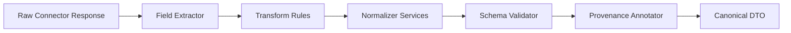
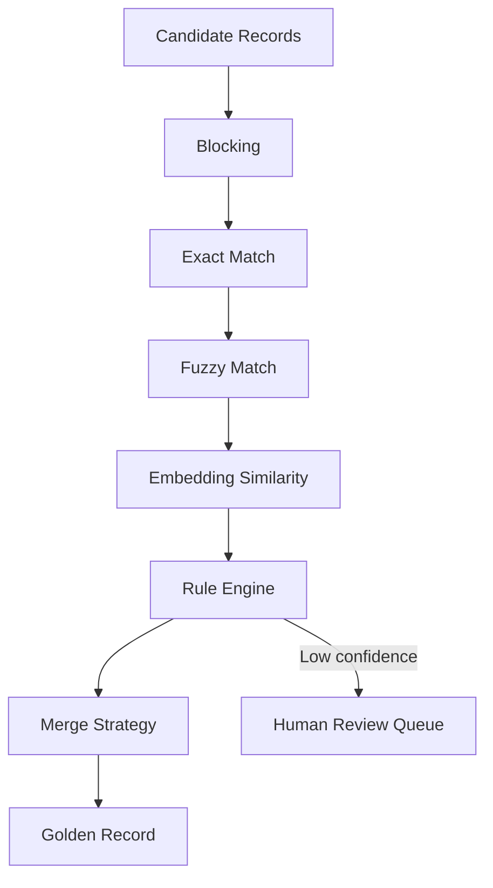
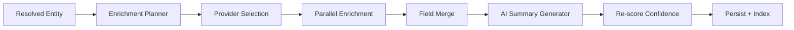

# Data Pipelines — Normalization, Entity Resolution, Confidence & Enrichment

**Version 2.0** | AI Lead Intelligence Platform — Phase 5

---

## Table of Contents

1. [Normalization Pipeline](#1-normalization-pipeline)
2. [Entity Resolution Engine](#2-entity-resolution-engine)
3. [Confidence Engine](#3-confidence-engine)
4. [Enrichment Pipeline](#4-enrichment-pipeline)
5. [Pipeline Orchestration](#5-pipeline-orchestration)
6. [Implementation Roadmap](#6-implementation-roadmap)

---

## 1. Normalization Pipeline

### 1.1 Purpose

The Normalization Pipeline transforms heterogeneous connector responses into **canonical DTOs** (`NormalizedCompanyDTO`, `NormalizedContactDTO`, `NormalizedAddressDTO`) defined in `backend/connectors/sdk/dto.py`. Every downstream system — entity resolution, confidence scoring, OpenSearch indexing, CRM sync — operates on these normalized shapes.

### 1.2 Architecture



### 1.3 Normalizer Services

| Service | Input | Output | Library / Standard |
|---------|-------|--------|-------------------|
| `CompanyNameNormalizer` | Raw name string | Canonical display name + legal name | Unicode NFKC, suffix stripping (Inc., Ltd., GmbH) |
| `DomainNormalizer` | URL or domain | Lowercase apex domain, punycode | `tldextract`, IDNA |
| `AddressNormalizer` | Unstructured address | `NormalizedAddressDTO` | libpostal / Google Geocoding API |
| `PhoneNormalizer` | Raw phone | E.164 format | `phonenumbers` (libphonenumber) |
| `EmailNormalizer` | Raw email | Lowercase, trimmed, domain extracted | RFC 5322 validation |
| `UrlNormalizer` | Raw URL | Canonical HTTPS URL, trailing slash policy | `urllib.parse` |
| `IndustryNormalizer` | Free-text industry | NAICS/SIC/LinkedIn taxonomy code | Taxonomy lookup table + embedding match |
| `TechnologyNormalizer` | Tech name variants | Canonical tech slug | BuiltWith/Wappalyzer taxonomy |
| `JobTitleNormalizer` | Raw title | Standardized title + seniority + department | Title taxonomy + NLP classifier |
| `CurrencyNormalizer` | Amount + currency | ISO 4217 amount in minor units | `babel` |
| `DateNormalizer` | Various date formats | ISO 8601 UTC datetime | `dateutil` |
| `CountryNormalizer` | Country name/code | ISO 3166-1 alpha-2 | `pycountry` |
| `LanguageNormalizer` | Language hint | ISO 639-1 | `langdetect` + allowlist |

### 1.4 Normalization Rules

```python
# Conceptual pipeline stage — backend/app/discovery/pipelines/normalization.py

class NormalizationPipeline:
    def process(self, records: list[ConnectorRecordDTO], source: str) -> list[ConnectorRecordDTO]:
        for record in records:
            if record.company:
                record.company = self._normalize_company(record.company)
            if record.contact:
                record.contact = self._normalize_contact(record.contact)
        return records

    def _normalize_company(self, dto: NormalizedCompanyDTO) -> NormalizedCompanyDTO:
        dto.name = CompanyNameNormalizer.normalize(dto.name)
        dto.domain = DomainNormalizer.normalize(dto.domain)
        dto.website = UrlNormalizer.normalize(dto.website)
        dto.phone = PhoneNormalizer.normalize(dto.phone, default_region="US")
        dto.industry = IndustryNormalizer.normalize(dto.industry)
        dto.technologies = [TechnologyNormalizer.normalize(t) for t in dto.technologies]
        dto.addresses = [AddressNormalizer.normalize(a) for a in dto.addresses]
        dto.employee_band = EmployeeBandNormalizer.from_count(dto.employee_count)
        dto.revenue_band = RevenueBandNormalizer.from_amount(dto.annual_revenue)
        return dto
```

### 1.5 Quality Signals

Each normalized field emits a `normalization_quality` score (0.0–1.0):

| Signal | Score Impact |
|--------|--------------|
| Input was structured (API field) | +0.3 |
| Passed validation (phone, email, domain) | +0.3 |
| Taxonomy match (industry, tech, title) | +0.2 |
| Geocoding success (address) | +0.2 |
| Fallback/heuristic used | −0.2 |

### 1.6 Failure Handling

- **Soft failures:** Field left as-is with `normalization_quality=0.0`; record proceeds with warning in provenance
- **Hard failures:** Missing required fields (`name` for company, `email` or `first_name` for contact) → record quarantined to `discovery_quarantine` table
- **Audit:** Every transformation logged with `before`/`after` in structured logs (PII-redacted)

---

## 2. Entity Resolution Engine

### 2.1 Purpose

Merge duplicate records from multiple connectors and internal database into a **single golden record** per real-world entity (company or contact).

### 2.2 Resolution Stages



### 2.3 Matching Strategies

| Strategy | Key Fields | Threshold | Use Case |
|----------|-----------|-----------|----------|
| **Exact** | `domain`, `email`, `linkedin_url` | 1.0 | Primary company/contact dedup |
| **Domain** | Normalized apex domain | 0.95 | Company resolution across sources |
| **Email** | Normalized email | 0.98 | Contact resolution |
| **Phone** | E.164 phone | 0.90 | Contact fallback |
| **Website** | Canonical URL | 0.92 | Company fallback |
| **Address** | Geocoded lat/lng + postal | 0.85 | Location-based company match |
| **Fuzzy** | Company name + country | 0.80 (Levenshtein + Jaro-Winkler) | Name variants |
| **Embedding** | Name + description vector | 0.82 (cosine) | Semantic similarity |
| **Rule-based** | Custom tenant rules | Configurable | Enterprise overrides |

### 2.4 Blocking Keys

Reduce O(n²) comparisons:

```text
Company blocks:
  - domain:{apex_domain}
  - name_country:{normalized_name}:{country_code}
  - phone:{e164_prefix_7}

Contact blocks:
  - email:{normalized_email}
  - name_company:{first_last}:{company_domain}
  - linkedin:{linkedin_id}
```

### 2.5 Merge Rules

Configurable per tenant (`entity_resolution_rules` table):

```yaml
company:
  name: highest_source_trust
  employee_count: max_value
  description: longest_non_empty
  technologies: union_deduped
  addresses: merge_by_geohash
  provenance: append_all

contact:
  email: verified_first
  title: most_recent
  phone: verified_first
```

### 2.6 AI-Assisted Resolution

For pairs with similarity 0.65–0.85 (ambiguous zone):

1. Build context prompt: both records + field provenance
2. LLM classifies: `same_entity | different_entity | uncertain`
3. `uncertain` → Human Review Queue
4. Model output stored for active learning

### 2.7 Human Review Queue

| Field | Description |
|-------|-------------|
| `review_id` | UUID |
| `entity_type` | company \| contact |
| `candidate_a`, `candidate_b` | Serialized DTOs |
| `match_score` | Computed similarity |
| `ai_recommendation` | same \| different \| uncertain |
| `status` | pending \| merged \| rejected |
| `reviewed_by` | User ID |
| `sla_hours` | Default 48h |

### 2.8 Output

```python
@dataclass
class ResolvedEntity:
    golden_id: UUID          # Internal canonical ID
    entity_type: str
    merged_from: list[UUID]  # Source record IDs
    data: NormalizedCompanyDTO | NormalizedContactDTO
    resolution_confidence: float
    merge_explanation: dict
```

---

## 3. Confidence Engine

### 3.1 Purpose

Produce an **explainable confidence score** (0.0–1.0) for every discovery hit and persisted entity. Scores drive ranking, lead qualification, and user trust.

### 3.2 Score Components

| Component | Weight | Description |
|-----------|--------|-------------|
| `source_trust` | 0.25 | Provider tier + data source type |
| `field_completeness` | 0.15 | % of expected fields populated |
| `cross_source_validation` | 0.20 | Agreement across N providers |
| `recency` | 0.10 | Age of data (exponential decay) |
| `verification_status` | 0.15 | Email/phone verification results |
| `normalization_quality` | 0.05 | Average field normalization scores |
| `duplicate_resolution` | 0.10 | Entity resolution confidence |

```text
overall = Σ (weight_i × component_i)
```

### 3.3 Source Trust Tiers

| Tier | Source Types | Base Score |
|------|-------------|------------|
| T1 | `official_api`, `public_registry`, `government_open_data` | 0.95 |
| T2 | `licensed_provider` (Apollo, Clearbit) | 0.85 |
| T3 | `user_authorized` (CRM OAuth) | 0.80 |
| T4 | `user_import`, `search_index` | 0.60 |

Provider-specific modifiers: `-0.10` if circuit breaker open; `+0.05` if health check latency < 200ms.

### 3.4 Cross-Source Validation

```python
def cross_source_score(field: str, values: list[tuple[str, Any, float]]) -> float:
    """values = [(source, normalized_value, source_trust), ...]"""
    if len(values) < 2:
        return 0.5  # single source — neutral
    unique = set(v[1] for v in values if v[1])
    if len(unique) == 1:
        return 1.0  # unanimous agreement
    # Partial agreement weighted by source trust
    ...
```

### 3.5 Recency Decay

```text
recency_score = exp(-λ × age_days)
λ = 0.01  # half-life ≈ 69 days
```

Verified contacts use λ = 0.005 (slower decay).

### 3.6 Explanation Model

Every score includes human-readable factors (maps to `ConfidenceExplanation` in `schemas.py`):

```json
{
  "overall": 0.87,
  "source_trust": 0.85,
  "field_completeness": 0.78,
  "cross_source_validation": 0.92,
  "recency": 0.95,
  "verification_status": 0.90,
  "normalization_quality": 0.88,
  "duplicate_resolution": 1.0,
  "factors": [
    {"field": "domain", "score": 1.0, "reason": "Exact match across Apollo + Clearbit"},
    {"field": "email", "score": 0.9, "reason": "Hunter verified deliverable"},
    {"field": "employee_count", "score": 0.6, "reason": "Single source only (Apollo)"}
  ]
}
```

### 3.7 Lead Qualification Thresholds

| Band | Score Range | Action |
|------|-------------|--------|
| Hot | ≥ 0.85 | Auto-promote to CRM pipeline |
| Warm | 0.65–0.84 | Queue for review |
| Cold | 0.40–0.64 | Display with warning badge |
| Unqualified | < 0.40 | Hide by default; available in "low confidence" filter |

---

## 4. Enrichment Pipeline

### 4.1 Purpose

Augment normalized, resolved entities with additional intelligence from enrichment-capable connectors (`ENRICH`, `DETECT_TECH`, `VERIFY_EMAIL`, `VERIFY_PHONE`, `GEOCODE`).

### 4.2 Pipeline Flow



### 4.3 Enrichment Planner

Determines which fields to enrich based on:

- User request flags (`enrich=true`, `verify_contacts=true`)
- Field gaps (missing `industry`, `technologies`, `email_verified`)
- Tenant connector availability and credits
- Rate limit headroom

```python
ENRICHMENT_PLAN = {
    "company": [
        ("industry", ["clearbit", "apollo"], ConnectorCapability.ENRICH),
        ("technologies", ["builtwith", "clearbit"], ConnectorCapability.DETECT_TECH),
        ("employee_count", ["clearbit", "apollo"], ConnectorCapability.ENRICH),
        ("description", ["clearbit"], ConnectorCapability.ENRICH),
        ("addresses", ["google_geocoding"], ConnectorCapability.GEOCODE),
    ],
    "contact": [
        ("email_verified", ["hunter"], ConnectorCapability.VERIFY_EMAIL),
        ("phone_verified", ["twilio_lookup"], ConnectorCapability.VERIFY_PHONE),
        ("title", ["apollo"], ConnectorCapability.ENRICH),
        ("linkedin_url", ["apollo"], ConnectorCapability.LOOKUP),
    ],
}
```

### 4.4 Enrichable Fields

| Entity | Fields |
|--------|--------|
| **Company** | Profile, summary, industry, tech stack, categories, employee count, revenue band, locations, timezone, language |
| **Contact** | Professional profile, title, department, seniority, email, phone, LinkedIn, company association |

### 4.5 AI Enrichment Layer

After connector enrichment, an AI pass generates:

- **Company summary** — 2–3 sentence business description from aggregated fields
- **Industry classification** — NAICS code when connectors disagree
- **Lead fit narrative** — Optional, based on tenant ICP rules

AI outputs are tagged `source_type: ai_generated` with lower `source_trust` (0.50) unless validated against connector data.

### 4.6 Incremental Refresh

| Trigger | Scope |
|---------|-------|
| Scheduled (daily/weekly) | Stale records where `last_enriched_at` > TTL |
| On-demand | Single entity from 360° page |
| Discovery job | New hits only |
| Webhook | CRM or provider push events |

TTL defaults: company profile 30 days, contact title 14 days, verification 7 days.

### 4.7 Credit Accounting

Each enrichment call reports `credits_used` to billing service. Pipeline stops when tenant credits exhausted; partial results returned with `status: partial`.

---

## 5. Pipeline Orchestration

### 5.1 Stage Ordering

```text
Connector Results
  → NormalizationPipeline.process()
  → EntityResolutionEngine.resolve()
  → ConfidenceEngine.calculate()
  → EnrichmentPipeline.enrich()        [if request.enrich]
  → ConfidenceEngine.recalculate()    [post-enrichment]
  → PersistenceLayer.save()
  → SearchIndexer.index()
```

### 5.2 Idempotency

- Pipeline runs keyed by `job_id` + `record_hash`
- Re-runs skip completed stages via Redis stage markers
- Entity resolution uses optimistic locking on `golden_id`

### 5.3 Error Isolation

| Stage Failure | Behavior |
|---------------|----------|
| Normalization (single record) | Quarantine record; continue batch |
| Entity resolution | Treat as singleton; flag `resolution_confidence=0.5` |
| Confidence | Default `overall=0.5` with explanation "scoring unavailable" |
| Enrichment (single provider) | Fallback to next provider; partial enrichment |
| Enrichment (all providers) | Return pre-enrichment entity with warning |

---

## 6. Implementation Roadmap

| Sprint | Deliverable |
|--------|-------------|
| 3 | `NormalizationPipeline` + unit tests per normalizer |
| 3 | Blocking + exact/fuzzy matchers |
| 4 | Embedding matcher + human review queue API |
| 4 | `ConfidenceEngine` with explanation JSON |
| 4 | `EnrichmentPlanner` + parallel enrichment executor |
| 5 | Wire pipelines into `DiscoveryOrchestrator` |
| 6 | Incremental refresh scheduler + credit guards |

### Target File Layout

```text
backend/app/discovery/
├── pipelines/
│   ├── normalization.py
│   ├── entity_resolution.py
│   ├── confidence.py
│   └── enrichment.py
├── normalizers/
│   ├── company_name.py
│   ├── domain.py
│   ├── phone.py
│   └── ...
└── matchers/
    ├── exact.py
    ├── fuzzy.py
    └── embedding.py
```