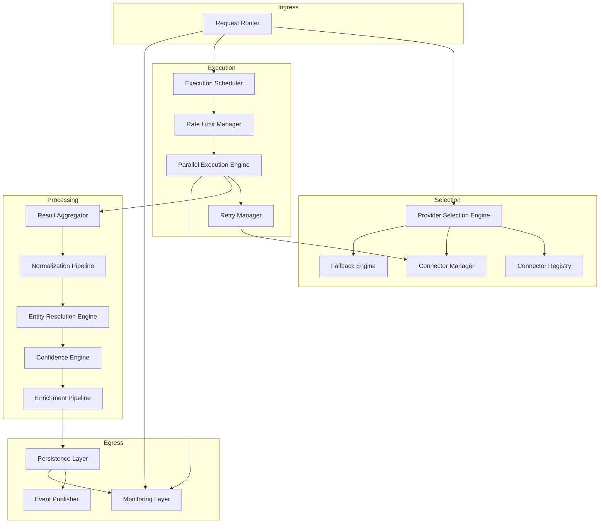
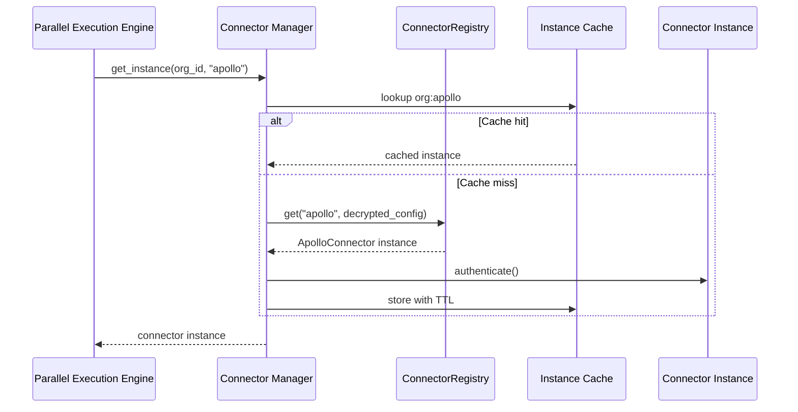
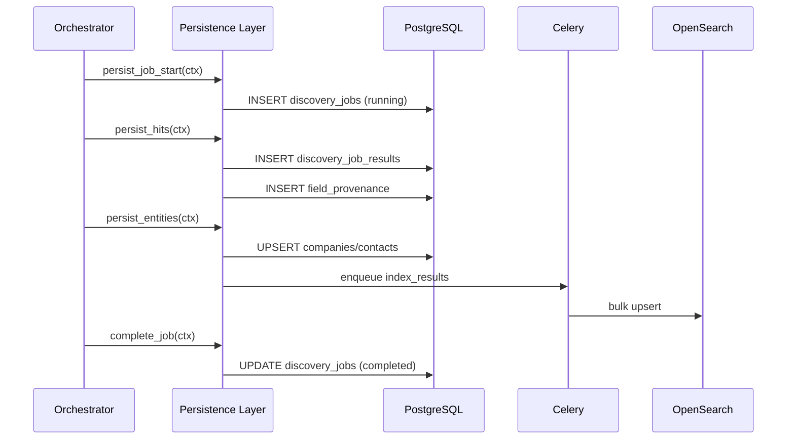
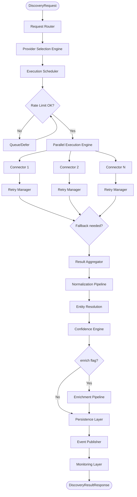
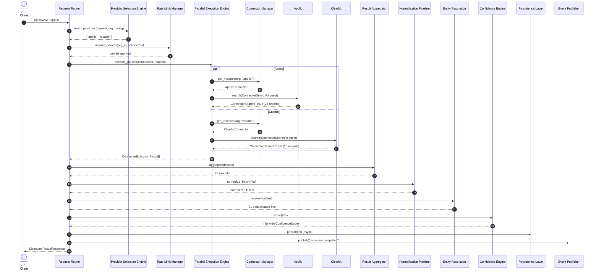
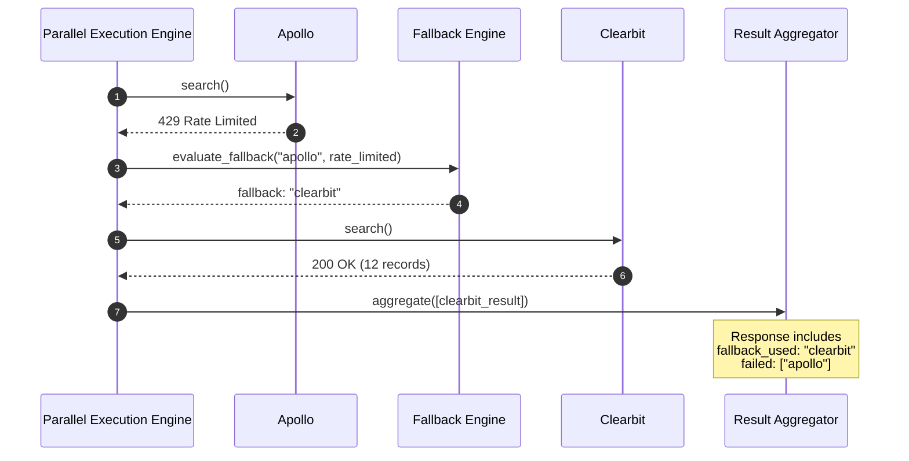
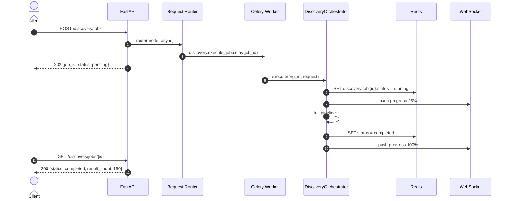
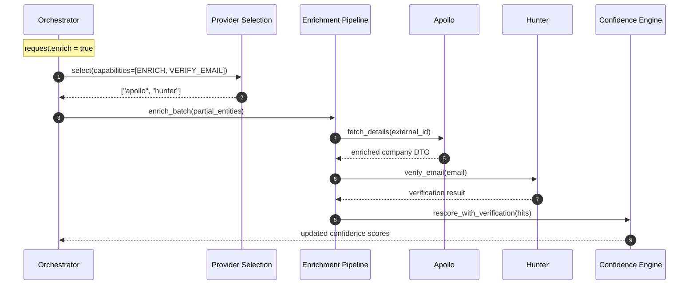
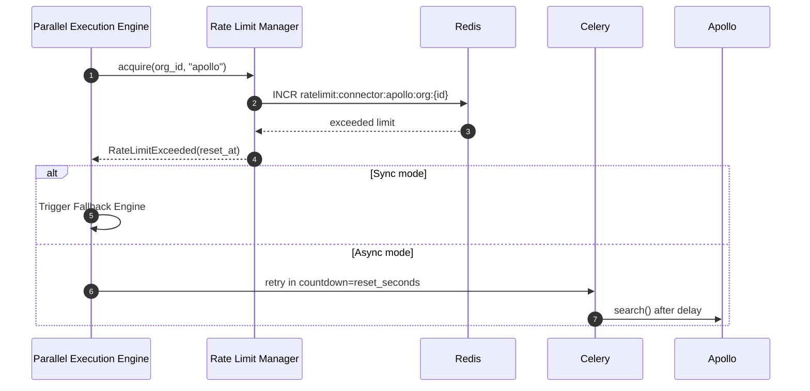

# Discovery Orchestrator Design

**Version 2.0** | AI Lead Intelligence Platform — Phase 5

---

## Table of Contents

1. [Overview](#1-overview)
2. [Orchestrator Components](#2-orchestrator-components)
3. [Component Specifications](#3-component-specifications)
4. [Pipeline Execution Flow](#4-pipeline-execution-flow)
5. [Sequence Diagrams](#5-sequence-diagrams)
6. [Context & State Model](#6-context--state-model)
7. [Sync vs Async Execution](#7-sync-vs-async-execution)
8. [Error Handling Strategy](#8-error-handling-strategy)
9. [Configuration](#9-configuration)
10. [Current Implementation](#10-current-implementation)
11. [Production Target Architecture](#11-production-target-architecture)

---

## 1. Overview

The **Discovery Orchestrator** (`backend/app/discovery/orchestrator.py`) is the central coordination engine for all discovery operations. It composes twelve subsystems into a single governed pipeline that retrieves, normalizes, resolves, scores, and persists lead intelligence from authorized external providers.

### 1.1 Responsibilities

| Responsibility | Owner Component |
|----------------|-----------------|
| Route incoming discovery requests | Request Router |
| Resolve which providers to call | Provider Selection Engine |
| Manage connector instances | Connector Manager |
| Schedule and throttle execution | Execution Scheduler + Rate Limit Manager |
| Execute provider calls in parallel | Parallel Execution Engine |
| Handle transient failures | Retry Manager + Fallback Engine |
| Merge multi-source results | Result Aggregator |
| Write to databases and indexes | Persistence Layer |
| Notify downstream systems | Event Publisher |
| Track pipeline health | Monitoring Layer |

### 1.2 Non-Responsibilities

- Query parsing (delegated to Query Engine)
- Long-term entity storage schema (delegated to domain services)
- Billing calculations (delegated to billing service — orchestrator reports `credits_used`)
- UI rendering (Phase 4 frontend)

---

## 2. Orchestrator Components

### 2.1 Component Map



### 2.2 Component Registry

| # | Component | Module Path (target) | Status |
|---|-----------|---------------------|--------|
| 1 | Request Router | `discovery/router_internal.py` | Planned |
| 2 | Connector Registry | `backend/connectors/registry.py` | **Implemented** |
| 3 | Connector Manager | `discovery/execution/connector_manager.py` | Planned |
| 4 | Execution Scheduler | `discovery/execution/scheduler.py` | Planned |
| 5 | Parallel Execution Engine | `discovery/execution/parallel.py` | **Partial** (in orchestrator) |
| 6 | Retry Manager | `discovery/execution/retry_manager.py` | Planned |
| 7 | Rate Limit Manager | `discovery/execution/rate_limit_manager.py` | Planned |
| 8 | Provider Selection Engine | `discovery/selection/engine.py` | **Partial** (in orchestrator) |
| 9 | Fallback Engine | `discovery/selection/fallback.py` | Planned |
| 10 | Result Aggregator | `discovery/aggregation/result_aggregator.py` | **Partial** (in orchestrator) |
| 11 | Persistence Layer | `discovery/persistence/layer.py` | Planned |
| 12 | Event Publisher | `infrastructure/messaging/publisher.py` | Planned |
| 13 | Monitoring Layer | `infrastructure/observability/discovery_metrics.py` | Planned |

---

## 3. Component Specifications

### 3.1 Request Router

**Purpose:** Accept `DiscoveryRequest`, validate, enrich with tenant context, and dispatch to appropriate execution mode.

**Inputs:**
- `DiscoveryRequest` (from `backend/app/discovery/schemas.py`)
- `org_id: UUID` (from JWT — never from request body)
- `user_id: UUID`
- `execution_mode: sync | async`

**Outputs:**
- `OrchestratorContext` initialized with `job_id`
- Celery task ID (async mode)

**Routing rules:**

| Condition | Route |
|-----------|-------|
| `page_size <= 25` AND no `schedule_id` AND estimated providers ≤ 2 | Sync execution |
| `page_size > 25` OR explicit `async: true` | Async Celery job |
| `schedule_id` present | Scheduled search workflow |
| `enrich: true` with existing entity IDs | Enrichment sub-pipeline |

```python
class RequestRouter:
    def route(
        self,
        org_id: UUID,
        user_id: UUID,
        request: DiscoveryRequest,
        mode: Literal["sync", "async"] = "sync",
    ) -> OrchestratorContext | str:  # context or celery_task_id
        ...
```

---

### 3.2 Connector Registry

**Purpose:** Runtime catalog of available connector classes. See [connector-framework.md](./connector-framework.md).

**Current path:** `backend/connectors/registry.py`

**Orchestrator usage:**
```python
connector_names = request.connectors or self._select_connectors(request)
connector = self._registry.get(name, tenant_config)
```

---

### 3.3 Connector Manager

**Purpose:** Lifecycle management of connector instances — instantiation, authentication, caching, eviction.

**Responsibilities:**
- Load tenant-specific config from `connector_configs`
- Decrypt credentials via KMS
- Cache authenticated instances: `org_id:connector_name → instance`
- Enforce instance TTL (default 15 minutes)
- Call `disconnect()` on eviction



---

### 3.4 Execution Scheduler

**Purpose:** Order and time connector executions based on policy, dependencies, and resource constraints.

**Scheduling modes:**

| Mode | Behavior |
|------|----------|
| `parallel` | All connectors execute concurrently (default) |
| `sequential` | One at a time (cost-optimized policy) |
| `waterfall` | Primary first; fallback only if empty/failed |
| `staged` | Search providers first, then enrichment providers on results |

**Priority queue factors:**
1. User-specified connector order
2. Provider selection score
3. Rate limit token availability
4. Historical latency (fastest first for sync mode)

---

### 3.5 Parallel Execution Engine

**Purpose:** Execute multiple connector calls concurrently with timeout and cancellation.

**Current implementation:** `DiscoveryOrchestrator._execute_parallel()` using `asyncio.gather()`.

```python
async def _execute_parallel(
    self,
    org_id: UUID,
    request: DiscoveryRequest,
    connector_names: list[str],
) -> list[ConnectorExecutionResult]:
    tasks = [self._execute_connector(name, org_id, request) for name in connector_names]
    return list(await asyncio.gather(*tasks, return_exceptions=False))
```

**Production enhancements:**
- Per-connector timeout (configurable, default 10s)
- `asyncio.wait` with `FIRST_COMPLETED` for waterfall mode
- Semaphore limiting max concurrent connectors (default 5)
- `asyncio.to_thread()` for sync connector SDK calls (current)

---

### 3.6 Retry Manager

**Purpose:** Apply connector-specific `retry_policy()` on transient failures.

```python
class RetryManager:
    async def execute_with_retry(
        self,
        connector: ConnectorSDKBase,
        operation: Callable,
        *args,
        **kwargs,
    ) -> ConnectorSearchResult:
        policy = connector.retry_policy()
        for attempt in range(policy.max_attempts):
            try:
                return await operation(*args, **kwargs)
            except ConnectorRateLimitError as e:
                if attempt == policy.max_attempts - 1:
                    raise
                await asyncio.sleep(compute_backoff(attempt, policy))
            except ConnectorProviderError as e:
                if e.status_code not in policy.retryable_status_codes:
                    raise
                await asyncio.sleep(compute_backoff(attempt, policy))
        raise ConnectorProviderError("max retries exceeded")
```

**Interaction with Fallback Engine:** Retry Manager exhausts retries on **one** connector; Fallback Engine switches to **next** connector in chain.

---

### 3.7 Rate Limit Manager

**Purpose:** Enforce platform, tenant, and provider rate limits before executing connector calls.

**Pre-execution check:**
```python
class RateLimitManager:
    async def acquire(
        self,
        org_id: UUID,
        connector_name: str,
        cost: int = 1,
    ) -> RateLimitPermit:
        # 1. Check org-level discovery RPM
        # 2. Check connector global pool
        # 3. Check per-tenant connector quota
        # 4. Return permit or raise RateLimitExceeded
```

**Post-execution update:**
- Parse provider response headers
- Update Redis counters
- Refresh `RateLimitDTO` cache

---

### 3.8 Provider Selection Engine

**Purpose:** Determine optimal connector set for a given `DiscoveryRequest`.

**Current implementation:** `DiscoveryOrchestrator._select_connectors()` — selects up to 3 search-capable connectors.

**Production algorithm:** See [connector-framework.md §7](./connector-framework.md#7-provider-selection-engine).

**Inputs:**
- `DiscoveryRequest.entity_type`
- `DiscoveryRequest.filters` (derive required capabilities)
- `DiscoveryRequest.connectors` (explicit override)
- Tenant `connector_configs`
- Provider health cache

**Output:** Ordered `list[str]` of connector names

---

### 3.9 Fallback Engine

**Purpose:** Switch to alternate providers when primary fails, returns empty, or is rate-limited.

**Trigger conditions:**
- `ConnectorExecutionResult.success == False`
- `ConnectorSearchResult.records` is empty AND policy is `coverage_optimized`
- Rate limit permit denied
- Circuit breaker open

```python
class FallbackEngine:
    def next_provider(
        self,
        chain: list[FallbackStep],
        failed: str,
        reason: FallbackReason,
    ) -> str | None:
        ...
```

**Important:** Fallback chain only includes **authorized** registered connectors — never unauthorized scraping sources.

---

### 3.10 Result Aggregator

**Purpose:** Merge `ConnectorExecutionResult[]` into unified `DiscoveryResultHit[]`.

**Current implementation:** `DiscoveryOrchestrator._aggregate()` — simple concatenation with basic confidence passthrough.

**Production responsibilities:**
1. Concatenate all successful connector records
2. Tag each hit with source connector name
3. Deduplicate obvious duplicates (same domain/email)
4. Pass to Entity Resolution Engine for deep merge
5. Track per-connector contribution stats

```python
@dataclass
class AggregationStats:
    total_raw_hits: int
    duplicates_removed: int
    sources: dict[str, int]  # connector → hit count
    failed_connectors: list[str]
```

---

### 3.11 Persistence Layer

**Purpose:** Write discovery results to PostgreSQL and OpenSearch.

**Write operations:**

| Operation | Table/Index | Timing |
|-----------|-------------|--------|
| Create job | `discovery_jobs` | Pipeline start |
| Update job status | `discovery_jobs` | Each stage transition |
| Insert hits | `discovery_job_results` | Post-aggregation |
| Insert provenance | `field_provenance` | Post-normalization |
| Upsert entities | `companies`, `contacts` | Post-entity-resolution |
| Index documents | OpenSearch `companies_v1` | Async Celery task |
| Deduct credits | `credit_transactions` | Job completion |



---

### 3.12 Event Publisher

**Purpose:** Emit domain events for downstream processing.

**Events:**

| Event | Payload | Subscribers |
|-------|---------|-------------|
| `discovery.started` | `job_id`, `org_id`, `query` | Monitoring |
| `discovery.connector.completed` | `job_id`, `connector`, `records`, `latency_ms` | Analytics |
| `discovery.completed` | `job_id`, `total`, `credits_used` | Notifications, Search cache |
| `discovery.failed` | `job_id`, `error` | Notifications, Alerting |
| `discovery.partial` | `job_id`, `failed_connectors` | UI WebSocket |
| `connector.finished` | (Phase 1 event) | Analytics |

```python
await event_publisher.publish("discovery.completed", {
    "job_id": str(ctx.job_id),
    "organization_id": str(ctx.org_id),
    "result_count": len(ctx.merged_hits),
    "credits_used": ctx.total_credits,
    "connectors": [r.connector_name for r in ctx.connector_results],
})
```

---

### 3.13 Monitoring Layer

**Purpose:** Instrument every pipeline stage for observability.

**Per-stage metrics:**
- `discovery_stage_duration_seconds{stage, connector}`
- `discovery_connector_success_total{connector}`
- `discovery_connector_errors_total{connector, error_code}`

**Per-job tracing:**
- OpenTelemetry span per stage
- `job_id` and `org_id` as span attributes
- Connector calls as child spans

**Alerting rules:**
- Error rate > 10% for any connector over 15 min → PagerDuty
- p95 pipeline latency > 10s → Slack warning
- Credit exhaustion for org → email to admin

---

## 4. Pipeline Execution Flow

### 4.1 Full Pipeline



### 4.2 Stage Timing Budget (Sync Mode)

| Stage | Budget | Cumulative |
|-------|--------|------------|
| Request Router + Selection | 50ms | 50ms |
| Rate Limit Check | 20ms | 70ms |
| Parallel Retrieve (2 connectors) | 2000ms | 2070ms |
| Aggregate + Normalize | 200ms | 2270ms |
| Entity Resolution | 300ms | 2570ms |
| Confidence Score | 100ms | 2670ms |
| Persist (async, non-blocking) | 0ms | 2670ms |
| **Total target** | | **< 3000ms** |

---

## 5. Sequence Diagrams

### 5.1 Happy Path: Multi-Connector Search



### 5.2 Failure Path: Primary Fails, Fallback Succeeds



### 5.3 Async Job Lifecycle



### 5.4 Enrichment Sub-Pipeline



### 5.5 Rate Limit Deferral



---

## 6. Context & State Model

### 6.1 OrchestratorContext

Current definition in `backend/app/discovery/orchestrator.py`:

```python
@dataclass
class OrchestratorContext:
    job_id: uuid.UUID
    org_id: uuid.UUID
    request: DiscoveryRequest
    connector_results: list[ConnectorExecutionResult] = field(default_factory=list)
    merged_hits: list[DiscoveryResultHit] = field(default_factory=list)
```

### 6.2 Production Context (extended)

```python
@dataclass
class OrchestratorContext:
    job_id: UUID
    org_id: UUID
    user_id: UUID
    request: DiscoveryRequest
    query_plan: QueryPlan | None = None
    selected_connectors: list[str] = field(default_factory=list)
    connector_results: list[ConnectorExecutionResult] = field(default_factory=list)
    normalized_entities: list[NormalizedEntity] = field(default_factory=list)
    merged_hits: list[DiscoveryResultHit] = field(default_factory=list)
    total_credits: int = 0
    stage_timings: dict[str, int] = field(default_factory=dict)
    errors: list[PipelineError] = field(default_factory=list)
    fallback_used: dict[str, str] = field(default_factory=dict)
    status: JobStatus = JobStatus.RUNNING
    started_at: datetime = field(default_factory=datetime.utcnow)
```

### 6.3 ConnectorExecutionResult

```python
@dataclass
class ConnectorExecutionResult:
    connector_name: str
    success: bool
    result: ConnectorSearchResult | None = None
    error: str | None = None
    latency_ms: int = 0
    retries: int = 0
    fallback_triggered: bool = False
    credits_used: int = 0
```

---

## 7. Sync vs Async Execution

| Aspect | Sync | Async |
|--------|------|-------|
| Entry | `orchestrator.execute()` direct | Celery `discovery.execute_job` |
| Timeout | 3s total | 5 min total |
| Max connectors | 2–3 | 5 |
| Max results | 50 | 10,000 |
| Progress updates | None | Redis + WebSocket |
| Persistence | Non-blocking enqueue | Full await |
| Partial results | Returned inline | Streamed via Redis |
| Use case | UI search preview | Large discovery, scheduled |

---

## 8. Error Handling Strategy

### 8.1 Error Classification

| Class | Pipeline Behavior | User Experience |
|-------|-------------------|-----------------|
| **Fatal** | Abort job, `status: failed` | Error message, no results |
| **Connector** | Continue with other connectors | Partial results + warning |
| **Record** | Skip invalid record, log | Reduced result count |
| **Infrastructure** | Retry via Celery | Job stays `running` |

### 8.2 Partial Success Response

```json
{
  "job_id": "uuid",
  "status": "partial",
  "total": 18,
  "hits": [...],
  "connectors": [
    {"name": "apollo", "success": false, "error": "rate_limited", "latency_ms": 1200},
    {"name": "clearbit", "success": true, "latency_ms": 890}
  ],
  "warnings": ["Primary provider apollo unavailable; results from clearbit only"]
}
```

### 8.3 Never Fabricate Data

On total provider failure, the orchestrator returns empty results — it does **not** fall back to unauthorized scraping or cached stale personal data.

---

## 9. Configuration

### 9.1 Orchestrator Settings

```python
# backend/app/core/config.py (extended)
class DiscoverySettings:
    sync_timeout_seconds: int = 3
    async_timeout_seconds: int = 300
    max_parallel_connectors: int = 5
    max_sync_connectors: int = 3
    connector_timeout_seconds: int = 10
    default_selection_policy: str = "parallel_all"
    enable_fallback: bool = True
    enable_enrichment: bool = True
    persist_raw_responses: bool = False
    raw_response_retention_days: int = 30
```

### 9.2 Per-Tenant Overrides

Stored in `organizations.settings.discovery`:

```json
{
  "discovery": {
    "max_parallel_connectors": 2,
    "selection_policy": "primary_with_fallback",
    "default_connectors": ["apollo"],
    "disabled_connectors": [],
    "verify_contacts_default": true
  }
}
```

---

## 10. Current Implementation

### 10.1 MVP Status

The current `DiscoveryOrchestrator` implements:

| Feature | Status |
|---------|--------|
| Provider selection (basic) | ✅ Top 3 search connectors |
| Parallel execution | ✅ `asyncio.gather` |
| Legacy result adapter | ✅ v1 → v2 bridge |
| Result aggregation (basic) | ✅ Concatenation |
| Normalization pipeline | ⬜ Delegated to future service |
| Entity resolution | ⬜ Not yet integrated |
| Confidence engine | ⬜ Basic passthrough |
| Enrichment | ⬜ Not yet integrated |
| Persistence | ⬜ Not yet integrated |
| Event publishing | ⬜ Not yet integrated |
| Rate limiting | ⬜ Not yet integrated |
| Retry manager | ⬜ Not yet integrated |
| Fallback engine | ⬜ Not yet integrated |

### 10.2 MVP Execute Method

```python
async def execute(self, org_id: uuid.UUID, request: DiscoveryRequest) -> DiscoveryResultResponse:
    job_id = uuid.uuid4()
    ctx = OrchestratorContext(job_id=job_id, org_id=org_id, request=request)
    started = time.perf_counter()

    connector_names = request.connectors or self._select_connectors(request)
    ctx.connector_results = await self._execute_parallel(org_id, request, connector_names)
    ctx.merged_hits = self._aggregate(ctx.connector_results)

    took_ms = int((time.perf_counter() - started) * 1000)
    return DiscoveryResultResponse(
        job_id=job_id,
        total=len(ctx.merged_hits),
        hits=ctx.merged_hits,
        took_ms=took_ms,
        connectors=[...],
    )
```

---

## 11. Production Target Architecture

### 11.1 Decomposed Orchestrator

```python
class DiscoveryOrchestrator:
    def __init__(
        self,
        router: RequestRouter,
        selector: ProviderSelectionEngine,
        scheduler: ExecutionScheduler,
        executor: ParallelExecutionEngine,
        aggregator: ResultAggregator,
        normalizer: NormalizationPipeline,
        resolver: EntityResolutionEngine,
        confidence: ConfidenceEngine,
        enrichment: EnrichmentPipeline,
        persistence: PersistenceLayer,
        events: EventPublisher,
        monitoring: MonitoringLayer,
    ):
        ...

    async def execute(self, org_id: UUID, request: DiscoveryRequest) -> DiscoveryResultResponse:
        ctx = self._router.create_context(org_id, request)
        with self._monitoring.trace(ctx):
            ctx.selected_connectors = self._selector.select(ctx)
            ctx.connector_results = await self._executor.run(ctx)
            ctx.merged_hits = self._aggregator.aggregate(ctx)
            ctx.merged_hits = self._normalizer.process(ctx)
            ctx.merged_hits = self._resolver.resolve(ctx)
            ctx.merged_hits = self._confidence.score(ctx)
            if ctx.request.enrich:
                ctx.merged_hits = await self._enrichment.enrich(ctx)
            await self._persistence.persist(ctx)
            await self._events.publish_completed(ctx)
        return self._build_response(ctx)
```

### 11.2 Sprint Integration Plan

| Sprint | Components Integrated |
|--------|----------------------|
| 2 | Retry Manager, Rate Limit Manager, Fallback Engine |
| 3 | Normalization Pipeline, Entity Resolution |
| 4 | Confidence Engine, Enrichment Pipeline |
| 5 | Persistence Layer, Event Publisher, Celery async |
| 6 | Monitoring Layer, WebSocket progress |

---

## Related Documents

- [Discovery Platform Architecture](./discovery-platform-architecture.md)
- [Connector Framework](./connector-framework.md)
- [Connector SDK Specification](./connector-sdk-specification.md)
- [Standard DTO Models](./standard-dto-models.md)
- [Query Engine](./query-engine.md)
- [Data Pipelines](./data-pipelines.md) *(planned)*