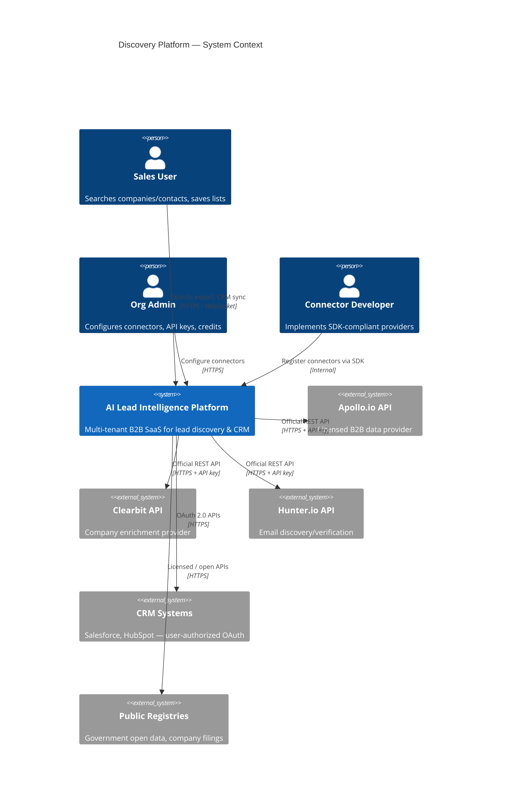
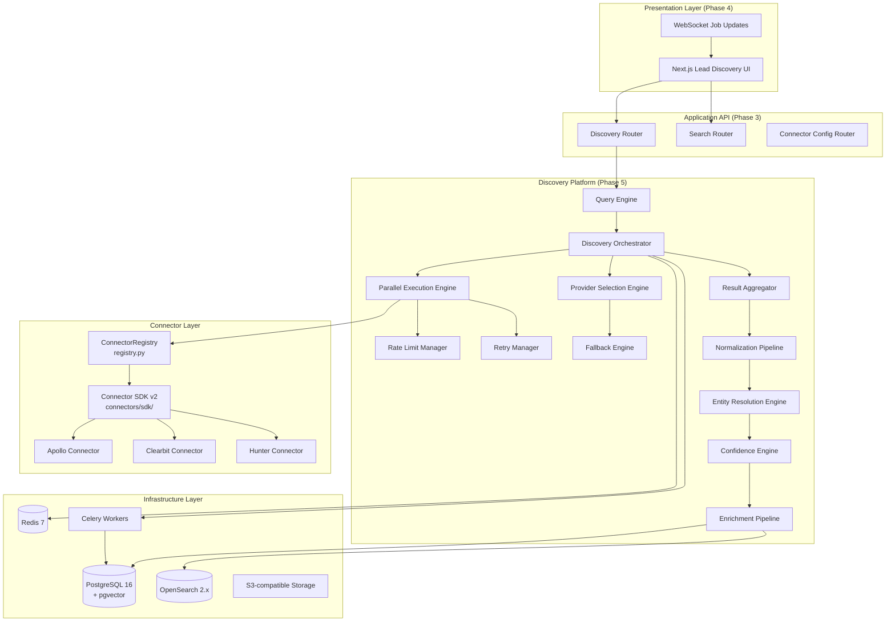
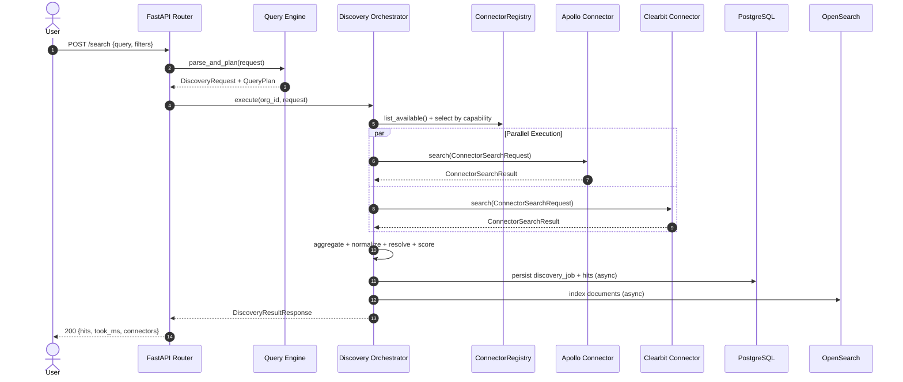
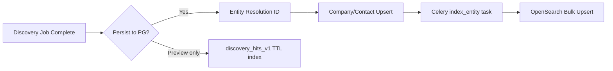
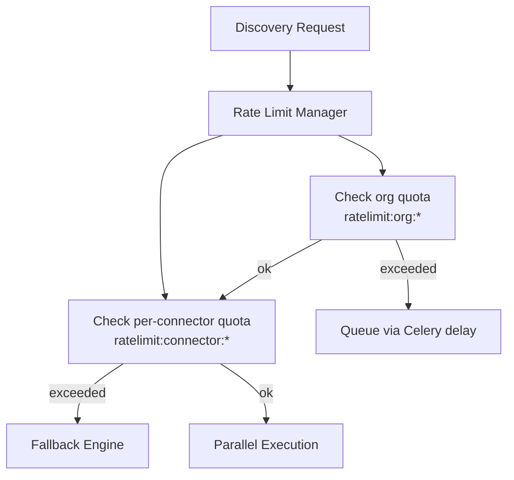
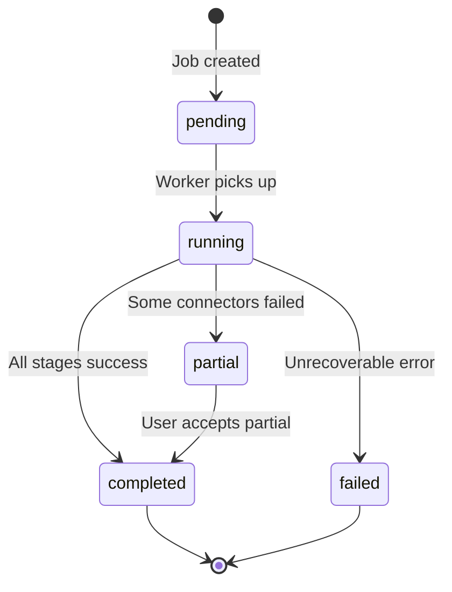
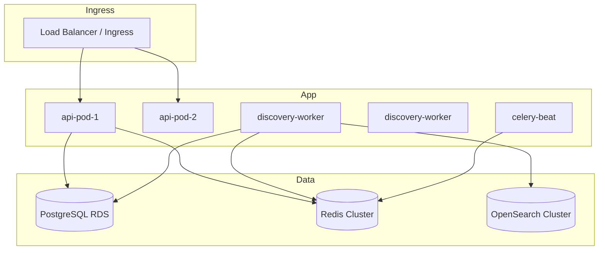

# Discovery Platform Architecture

**Version 2.0** | AI Lead Intelligence Platform — Phase 5

---

## Table of Contents

1. [Executive Summary](#1-executive-summary)
2. [System Context](#2-system-context)
3. [Architecture Goals & Non-Goals](#3-architecture-goals--non-goals)
4. [Component Architecture](#4-component-architecture)
5. [Discovery Workflow](#5-discovery-workflow)
6. [Technology Stack](#6-technology-stack)
7. [Folder Structure](#7-folder-structure)
8. [Integration: PostgreSQL](#8-integration-postgresql)
9. [Integration: OpenSearch](#9-integration-opensearch)
10. [Integration: Redis](#10-integration-redis)
11. [Integration: Celery Workers](#11-integration-celery-workers)
12. [Security & Tenant Isolation](#12-security--tenant-isolation)
13. [Compliance & Data Ethics](#13-compliance--data-ethics)
14. [Observability](#14-observability)
15. [Deployment Topology](#15-deployment-topology)
16. [Phase Alignment](#16-phase-alignment)

---

## 1. Executive Summary

The **Discovery Platform** is the provider-agnostic intelligence layer of the AI Lead Intelligence SaaS. It orchestrates authorized external data sources (connectors), normalizes heterogeneous responses into a canonical domain model, resolves duplicate entities, scores confidence, and persists results for search, CRM, and AI scoring.

**Core principle:** Discovery is a **pipeline**, not a single API call. Every user search, saved search, scheduled job, or enrichment request flows through the same governed stages with auditability, rate limiting, and tenant isolation.

This document is the **master architecture** for Phase 5. It extends Phase 1 (`BaseConnector`, event catalog), Phase 2 (multi-schema DB, provenance), Phase 3 (Clean Architecture, worker contracts), and Phase 4 (Lead Discovery UI bindings).

---

## 2. System Context

### 2.1 C4 Context Diagram



### 2.2 Boundary Definition

| Inside Platform | Outside Platform |
|-----------------|------------------|
| Query parsing, orchestration, normalization | Provider-specific API schemas |
| Canonical DTOs, entity resolution, confidence | Unauthorized web scraping |
| Tenant connector configs (encrypted) | Login-gated social scraping |
| Job scheduling, credit accounting | Personal data without lawful basis |
| OpenSearch indexing, cache management | ToS-prohibited data harvesting |

---

## 3. Architecture Goals & Non-Goals

### 3.1 Goals

| Goal | Implementation |
|------|----------------|
| **Provider agnosticism** | `ConnectorSDKBase` + `ConnectorRegistry`; swap providers without orchestrator changes |
| **Capability-based design** | Connectors declare `ConnectorCapability` set, not business workflows |
| **Canonical data model** | All sources map to `Company`, `Contact`, `Address`, `Technology`, `DiscoveryResult` |
| **Parallel multi-source retrieval** | `DiscoveryOrchestrator` executes connectors concurrently via `asyncio` |
| **Field-level provenance** | Every field records source, type, timestamp, confidence |
| **Tenant isolation** | `organization_id` on all discovery jobs, configs, and persisted entities |
| **Compliance by design** | `DataSourceType` enum; forbidden source types blocked at registry |
| **Replaceable infrastructure** | Redis broker abstracted; OpenSearch index versioning |
| **Observable pipelines** | Structured logs, metrics per stage, distributed tracing |

### 3.2 Non-Goals (Phase 5 MVP)

- Real-time streaming ingestion from arbitrary websites
- Browser automation or headless scraping of third-party UIs
- Building a proprietary global company database from scraped pages
- Replacing licensed providers with unlicensed alternatives
- Cross-tenant data sharing or global entity pool without consent

---

## 4. Component Architecture

### 4.1 High-Level Component Diagram



### 4.2 Component Responsibilities

| Component | Path | Responsibility |
|-----------|------|----------------|
| **Query Engine** | `backend/app/discovery/query/` | NL parsing, filter normalization, saved/scheduled search binding |
| **Discovery Orchestrator** | `backend/app/discovery/orchestrator.py` | End-to-end pipeline coordination |
| **Capability Definitions** | `backend/app/discovery/capabilities.py` | `ConnectorCapability`, `ConnectorCategory`, `DataSourceType` |
| **Discovery Schemas** | `backend/app/discovery/schemas.py` | `DiscoveryRequest`, `DiscoveryResultResponse`, job DTOs |
| **Connector Registry** | `backend/connectors/registry.py` | Runtime registration, instantiation, metadata listing |
| **Connector SDK** | `backend/connectors/sdk/` | v2 interface, DTOs, retry policy |
| **Legacy Connectors** | `backend/connectors/{apollo,clearbit,hunter}.py` | v1 `BaseConnector` — bridged to v2 via adapter |
| **Discovery Workers** | `backend/workers/tasks/discovery.py` | Async job execution, scheduled searches |
| **Search Indexer** | `backend/infrastructure/search/` | OpenSearch document upsert |
| **Event Publisher** | `backend/infrastructure/messaging/` | `discovery.completed`, `connector.finished` events |

---

## 5. Discovery Workflow

### 5.1 End-to-End Pipeline

Every discovery request — synchronous preview or async job — executes these stages:


| Stage | Input | Output | Sync/Async |
|-------|-------|--------|------------|
| Parse Query | Raw NL or structured filters | `DiscoveryRequest` + `QueryPlan` | Sync |
| Select Providers | Capabilities + tenant config | Ordered connector list | Sync |
| Rate Limit Check | Org quotas + provider limits | Permit or queue | Sync |
| Parallel Retrieve | `ConnectorSearchRequest` per provider | `ConnectorSearchResult[]` | Async |
| Normalize | Raw provider records | `NormalizedCompanyDTO` / `NormalizedContactDTO` | Sync |
| Entity Resolve | Multi-source hits | Deduplicated `DiscoveryResultHit[]` | Sync |
| Enrich | Partial records + enrich flag | Augmented DTOs | Async (optional) |
| Score Confidence | Resolved entities | `ConfidenceScore` per hit | Sync |
| Persist + Index | Final hits | DB rows + OpenSearch docs | Async |
| Publish Events | Job completion | Celery tasks, WebSocket push | Async |

### 5.2 Request Types

| Type | Entry Point | Execution Mode | Use Case |
|------|-------------|----------------|----------|
| **Interactive Search** | `POST /api/v1/search` | Sync (≤3s) or async job | UI search bar |
| **Discovery Job** | `POST /api/v1/discovery/jobs` | Async Celery | Large result sets |
| **Lookup** | `POST /api/v1/discovery/lookup` | Sync | Single domain/email resolve |
| **Enrichment** | `POST /api/v1/enrichment/contacts/{id}` | Async | Augment existing CRM record |
| **Scheduled Search** | Celery Beat | Async | Saved search cron |
| **Import** | `POST /api/v1/imports` | Async | User-uploaded CSV (no external fetch) |

### 5.3 Sequence: Interactive Company Search



---

## 6. Technology Stack

| Layer | Technology | Version | Role in Discovery |
|-------|------------|---------|-------------------|
| API Runtime | Python | 3.13+ | Orchestrator, connectors |
| Web Framework | FastAPI | 0.110+ | REST + WebSocket endpoints |
| Validation | Pydantic | v2 | Request/response schemas |
| ORM | SQLAlchemy | 2.x async | Job persistence, entity storage |
| Primary DB | PostgreSQL | 16+ | Jobs, provenance, entities |
| Vector | pgvector | latest | Semantic company embeddings |
| Search Index | OpenSearch | 2.x | Full-text + geo + tech filters |
| Cache / Broker | Redis | 7 | Rate limits, job state, cache |
| Task Queue | Celery | 5.x | Async discovery, scheduled searches |
| HTTP Client | httpx | latest | Connector API calls |
| Retry | tenacity | latest | Provider-level backoff (Apollo) |
| Tracing | OpenTelemetry | latest | Distributed pipeline traces |
| Object Storage | S3-compatible | — | Raw response archives (optional) |

---

## 7. Folder Structure

### 7.1 Phase 5 Additions

```text
backend/
├── app/
│   └── discovery/                          # Discovery bounded context
│       ├── __init__.py
│       ├── orchestrator.py                 # DiscoveryOrchestrator (MVP)
│       ├── capabilities.py                 # Capability/category enums
│       ├── schemas.py                      # DiscoveryRequest, DiscoveryResult*
│       ├── router.py                       # POST /discovery/jobs, /lookup
│       ├── service.py                      # Job lifecycle, credit accounting
│       ├── query/                          # Query Engine module
│       │   ├── __init__.py
│       │   ├── parser.py                   # NL → structured filters
│       │   ├── planner.py                  # QueryPlan generation
│       │   ├── autocomplete.py           # Suggest industries, tech, geo
│       │   └── scheduler.py              # Saved/scheduled search binding
│       ├── selection/                      # Provider Selection Engine
│       │   ├── engine.py
│       │   ├── fallback.py
│       │   └── policies.py
│       ├── execution/                      # Parallel Execution Engine
│       │   ├── parallel.py
│       │   ├── retry_manager.py
│       │   └── rate_limit_manager.py
│       ├── aggregation/
│       │   └── result_aggregator.py
│       ├── normalization/                  # See data-pipelines.md
│       ├── resolution/                     # Entity resolution
│       ├── confidence/                     # Confidence engine
│       └── enrichment/                     # Enrichment pipeline
│
├── connectors/
│   ├── base.py                             # v1 BaseConnector (legacy)
│   ├── registry.py                         # ConnectorRegistry
│   ├── apollo.py                           # Apollo.io
│   ├── clearbit.py                         # Clearbit
│   ├── hunter.py                           # Hunter.io
│   ├── sdk/                                # v2 SDK
│   │   ├── __init__.py
│   │   ├── base.py                         # ConnectorSDKBase
│   │   ├── dto.py                          # Normalized DTOs
│   │   ├── errors.py                       # ConnectorError hierarchy
│   │   ├── adapter.py                      # v1 → v2 bridge
│   │   └── versioning.py                   # SDK version negotiation
│   └── providers/                          # Future provider packages
│       ├── salesforce/
│       ├── hubspot/
│       └── companies_house/
│
├── infrastructure/
│   ├── search/
│   │   ├── opensearch_client.py
│   │   ├── indexers/
│   │   │   ├── company_indexer.py
│   │   │   └── discovery_hit_indexer.py
│   │   └── mappings/
│   │       └── discovery_v1.json
│   ├── cache/
│   │   └── discovery_cache.py
│   └── repositories/
│       ├── discovery_job_repository.py
│       └── provenance_repository.py
│
└── workers/
    └── tasks/
        ├── discovery.py                    # execute_discovery_job
        ├── scheduled_search.py             # Celery Beat cron
        └── index.py                        # OpenSearch reindex
```

### 7.2 Documentation Map

```text
docs/phase5/
├── README.md                               # Phase 5 index
├── discovery-platform-architecture.md      # This document
├── connector-framework.md
├── connector-sdk-specification.md
├── discovery-orchestrator.md
├── standard-dto-models.md
├── query-engine.md
├── data-pipelines.md                       # Normalization, resolution, confidence
├── events-and-workers.md
├── api-specification.md
└── security-architecture.md
```

---

## 8. Integration: PostgreSQL

### 8.1 Discovery Tables (extends Phase 2)

| Table | Purpose |
|-------|---------|
| `discovery_jobs` | Job lifecycle: status, query, connectors, credits, timing |
| `discovery_job_results` | Individual hits linked to job |
| `field_provenance` | Per-field source attribution |
| `connector_configs` | Encrypted tenant API keys (existing) |
| `connector_jobs` | Per-connector execution log (existing) |
| `connector_logs` | Request/response metadata (no PII in logs) |
| `saved_searches` | User saved queries + schedule cron |
| `companies` / `contacts` | Canonical persisted entities |

### 8.2 `discovery_jobs` Schema (proposed)

```sql
CREATE TABLE discovery_jobs (
    id              UUID PRIMARY KEY DEFAULT gen_random_uuid(),
    organization_id UUID NOT NULL REFERENCES organizations(id),
    user_id         UUID NOT NULL REFERENCES users(id),
    status          VARCHAR(20) NOT NULL DEFAULT 'pending',
    query           TEXT,
    entity_type     VARCHAR(20) NOT NULL DEFAULT 'both',
    filters         JSONB NOT NULL DEFAULT '{}',
    connectors_used TEXT[] NOT NULL DEFAULT '{}',
    result_count    INTEGER,
    credits_used    INTEGER NOT NULL DEFAULT 0,
    error_message   TEXT,
    schedule_id     UUID REFERENCES saved_searches(id),
    started_at      TIMESTAMPTZ,
    completed_at    TIMESTAMPTZ,
    created_at      TIMESTAMPTZ NOT NULL DEFAULT NOW(),
    deleted_at      TIMESTAMPTZ
);

CREATE INDEX idx_discovery_jobs_org_status
    ON discovery_jobs (organization_id, status, created_at DESC);
```

### 8.3 Write Path

1. **Job created** — `pending` status, filters stored as JSONB
2. **Running** — `started_at` set; connector names recorded
3. **Results inserted** — `discovery_job_results` with `confidence`, `entity_type`, `data` JSONB
4. **Provenance** — `field_provenance` rows per non-null field
5. **Completed** — `result_count`, `credits_used`, `completed_at`
6. **Entity upsert** — matching companies/contacts updated via entity resolution ID

### 8.4 Read Path

- Job status polling: `GET /discovery/jobs/{id}`
- Historical searches: paginated by `organization_id`
- Provenance audit: join `field_provenance` on entity ID
- Credit billing: aggregate `credits_used` per org per period

---

## 9. Integration: OpenSearch

### 9.1 Index Strategy

| Index | Document Type | Source |
|-------|---------------|--------|
| `companies_v1` | Canonical company | Post-resolution persist |
| `contacts_v1` | Canonical contact | Post-resolution persist |
| `discovery_hits_v1` | Ephemeral search results | Job completion (TTL optional) |

### 9.2 Indexed Fields (companies_v1)

```json
{
  "id": "uuid",
  "organization_id": "uuid",
  "name": "text + keyword",
  "domain": "keyword",
  "industry": "keyword",
  "employee_count": "integer",
  "employee_band": "keyword",
  "annual_revenue": "long",
  "country_code": "keyword",
  "location": "geo_point",
  "technologies": "keyword[]",
  "description": "text",
  "confidence": "float",
  "embedding": "knn_vector",
  "updated_at": "date"
}
```

### 9.3 Indexing Flow



### 9.4 Query Routing

| Query Type | Primary Engine | Fallback |
|------------|----------------|----------|
| Structured filters (industry, size) | OpenSearch | PostgreSQL |
| Full-text company name | OpenSearch `multi_match` | pg_trgm |
| Geo radius | OpenSearch `geo_distance` | PostGIS (Phase 2) |
| Tech stack | OpenSearch `terms` on `technologies` | JSONB query |
| Semantic / NL | pgvector embedding + OpenSearch hybrid | Connector search |

---

## 10. Integration: Redis

### 10.1 Redis Key Namespaces

| Key Pattern | TTL | Purpose |
|-------------|-----|---------|
| `discovery:job:{job_id}:status` | 24h | Job progress for WebSocket |
| `discovery:job:{job_id}:partial` | 1h | Streaming partial results |
| `ratelimit:connector:{name}:org:{org_id}` | sliding window | Per-tenant provider throttle |
| `ratelimit:org:{org_id}:discovery` | 1 min | Org-level discovery RPM |
| `cache:search:{hash}` | 5 min | Popular search result cache (Phase 1) |
| `connector:health:{name}` | 5 min | Health check cache |
| `autocomplete:{type}:{prefix}` | 1h | Industry/tech/geo suggestions |

### 10.2 Rate Limiting Architecture



### 10.3 Cache Invalidation

| Event | Invalidation |
|-------|--------------|
| `company.updated` | `cache:search:*` matching domain |
| `connector.config.updated` | `connector:health:{name}` |
| `discovery.completed` | Optional: warm `cache:search:{hash}` |

---

## 11. Integration: Celery Workers

### 11.1 Task Catalog

| Task | Module | Queue | Trigger |
|------|--------|-------|---------|
| `discovery.execute_job` | `workers/tasks/discovery.py` | `discovery` | `POST /discovery/jobs` |
| `discovery.scheduled_search` | `workers/tasks/scheduled_search.py` | `discovery` | Celery Beat cron |
| `discovery.index_results` | `workers/tasks/index.py` | `indexing` | Post-persist |
| `discovery.enrich_batch` | `workers/tasks/enrichment.py` | `enrichment` | Enrich flag |
| `connector.health_probe` | `workers/tasks/connectors.py` | `maintenance` | Beat every 5 min |

### 11.2 Worker Topology

```text
┌─────────────────────────────────────────────────────────────┐
│  Celery Beat                                                │
│  ├── scheduled_search (every minute, due jobs)              │
│  └── connector.health_probe (every 5 min)                   │
├─────────────────────────────────────────────────────────────┤
│  discovery worker pool (concurrency=4)                      │
│  ├── execute_job                                            │
│  └── scheduled_search                                       │
├─────────────────────────────────────────────────────────────┤
│  indexing worker pool (concurrency=2)                       │
│  └── index_results                                          │
└─────────────────────────────────────────────────────────────┘
```

### 11.3 Job State Machine



### 11.4 docker-compose Alignment

The existing `docker-compose.yml` provides:

- `api` — FastAPI with discovery router
- `worker` — `celery -A backend.workers.celery_app worker`
- `beat` — scheduled search dispatcher
- `db` — PostgreSQL 16 + pgvector
- `redis` — broker (db 1), result backend (db 2), cache (db 0)

OpenSearch is added in production `docker-compose.prod.yml` (see Phase 3 deployment docs).

---

## 12. Security & Tenant Isolation

### 12.1 Connector Credential Storage

| Field | Storage | Access |
|-------|---------|--------|
| API keys | AES-256-GCM encrypted in `connector_configs.credentials` | Decrypted only in worker memory |
| OAuth tokens | Encrypted + refresh rotation | Per-user or per-org |
| Webhook secrets | HMAC-validated inbound only | Never logged |

### 12.2 Authorization

| Permission | Scope |
|------------|-------|
| `discovery:search` | Execute sync search |
| `discovery:jobs:read` | View job status/results |
| `discovery:jobs:write` | Create async jobs |
| `connectors:read` | List available connectors |
| `connectors:write` | Configure tenant credentials |

### 12.3 Data Isolation Rules

1. Every `DiscoveryRequest` carries `org_id` from JWT — never from request body
2. Connector configs filtered by `organization_id`
3. Discovery results scoped to tenant; no cross-tenant entity merge
4. Raw provider responses archived with `org_id` prefix in S3 (optional, 30-day retention)

---

## 13. Compliance & Data Ethics

### 13.1 Authorized Data Sources Only

All connectors **must** declare `source_type` per `DataSourceType` enum (`backend/app/discovery/capabilities.py`):

| Source Type | Description | Example |
|-------------|-------------|---------|
| `official_api` | Provider-documented REST/GraphQL API | Apollo, Clearbit, Hunter |
| `licensed_provider` | Commercial data license | ZoomInfo (future) |
| `public_registry` | Publicly accessible government registry | Companies House UK |
| `government_open_data` | Open government datasets | SEC EDGAR |
| `user_authorized` | OAuth consent from end user | Salesforce, HubSpot |
| `user_import` | User-uploaded file | CSV import |
| `search_index` | Platform's own indexed data | OpenSearch internal |

### 13.2 Explicitly Forbidden

| Practice | Policy |
|----------|--------|
| Scraping login-gated websites | **Blocked** — not registrable in `ConnectorRegistry` |
| Violating provider ToS | **Blocked** — legal review required for new providers |
| Harvesting personal emails without lawful basis | **Blocked** — GDPR/CCPA compliance |
| Circumventing rate limits or CAPTCHAs | **Blocked** — use official APIs |
| Storing raw PII in application logs | **Blocked** — structured metadata only |
| Cross-tenant data leakage | **Blocked** — row-level isolation |

### 13.3 Audit Trail Requirements

Every discovery hit must be traceable:

```json
{
  "field": "email",
  "value_hash": "sha256:...",
  "source": "hunter",
  "source_type": "official_api",
  "license": "hunter_pro",
  "retrieved_at": "2026-06-28T10:15:00Z",
  "connector_version": "2.0.1",
  "lawful_basis": "legitimate_interest_b2b"
}
```

### 13.4 Connector Onboarding Gate

New connectors require:

1. Legal review of provider ToS
2. `source_type` declaration
3. Capability manifest
4. Contract test suite pass
5. Security review (credential handling, data retention)
6. Admin approval before tenant enablement

---

## 14. Observability

### 14.1 Metrics (Prometheus)

| Metric | Labels | Description |
|--------|--------|-------------|
| `discovery_jobs_total` | `status`, `org_id` | Job count by outcome |
| `discovery_stage_duration_seconds` | `stage`, `connector` | Per-pipeline-stage latency |
| `connector_requests_total` | `connector`, `capability`, `status` | Provider call volume |
| `connector_credits_used_total` | `connector`, `org_id` | Credit consumption |
| `discovery_hits_total` | `entity_type`, `source` | Result volume |
| `rate_limit_denied_total` | `connector`, `org_id` | Throttle events |

### 14.2 Structured Log Fields

```json
{
  "event": "discovery.stage.complete",
  "job_id": "uuid",
  "org_id": "uuid",
  "stage": "parallel_retrieve",
  "connector": "apollo",
  "latency_ms": 342,
  "records": 25,
  "credits_used": 25,
  "request_id": "uuid"
}
```

### 14.3 Distributed Tracing

Span hierarchy:

```text
discovery.execute
├── query.parse
├── provider.select
├── connector.execute [apollo]
│   ├── connector.authenticate
│   └── connector.search
├── connector.execute [clearbit]
├── normalize.batch
├── entity.resolve
├── confidence.score
└── persist.index
```

---

## 15. Deployment Topology

### 15.1 Kubernetes (Production)



### 15.2 Scaling Guidelines

| Component | Scale Trigger | Action |
|-----------|---------------|--------|
| API pods | p95 latency > 500ms | HPA on CPU + request rate |
| Discovery workers | Queue depth > 100 | Add worker replicas |
| OpenSearch | Query latency > 200ms | Add data nodes |
| Redis | Memory > 70% | Scale cluster / eviction policy |

### 15.3 SLO Targets

| SLO | Target |
|-----|--------|
| Sync search p95 latency | < 3 seconds (2 connectors) |
| Async job start latency | < 5 seconds |
| Job completion p95 | < 60 seconds (100 results) |
| Connector health check freshness | < 5 minutes |
| Discovery availability | 99.9% |

---

## 16. Phase Alignment

| Prior Phase | Contribution | Phase 5 Extension |
|-------------|--------------|-------------------|
| **Phase 1** | `BaseConnector`, `ConnectorRegistry`, event catalog | SDK v2, capability model, discovery events |
| **Phase 2** | Multi-schema DB, `connector_configs`, spatial indexes | `discovery_jobs`, `field_provenance` tables |
| **Phase 3** | Clean Architecture, Celery workers, OpenSearch client | Discovery bounded context, worker tasks |
| **Phase 4** | Search UI, NL intent parsing (`parse-search-intent.ts`) | API bindings, WebSocket job progress |

### 16.1 Migration Path: v1 → v2 Connectors

1. Existing connectors (`apollo.py`, `clearbit.py`, `hunter.py`) remain on `BaseConnector`
2. `DiscoveryOrchestrator._adapt_legacy_result()` bridges v1 → v2 DTOs
3. New providers implement `ConnectorSDKBase` directly
4. `connectors/sdk/adapter.py` wraps v1 classes as v2-compatible
5. Deprecation of v1 targeted for Phase 5 Sprint 8

---

## Related Documents

- [Connector Framework](./connector-framework.md)
- [Connector SDK Specification](./connector-sdk-specification.md)
- [Discovery Orchestrator](./discovery-orchestrator.md)
- [Standard DTO Models](./standard-dto-models.md)
- [Query Engine](./query-engine.md)
- [Phase 3 Backend Architecture](../phase3/backend-architecture.md)
- [Phase 2 Database Design](../phase2/database-design.md)