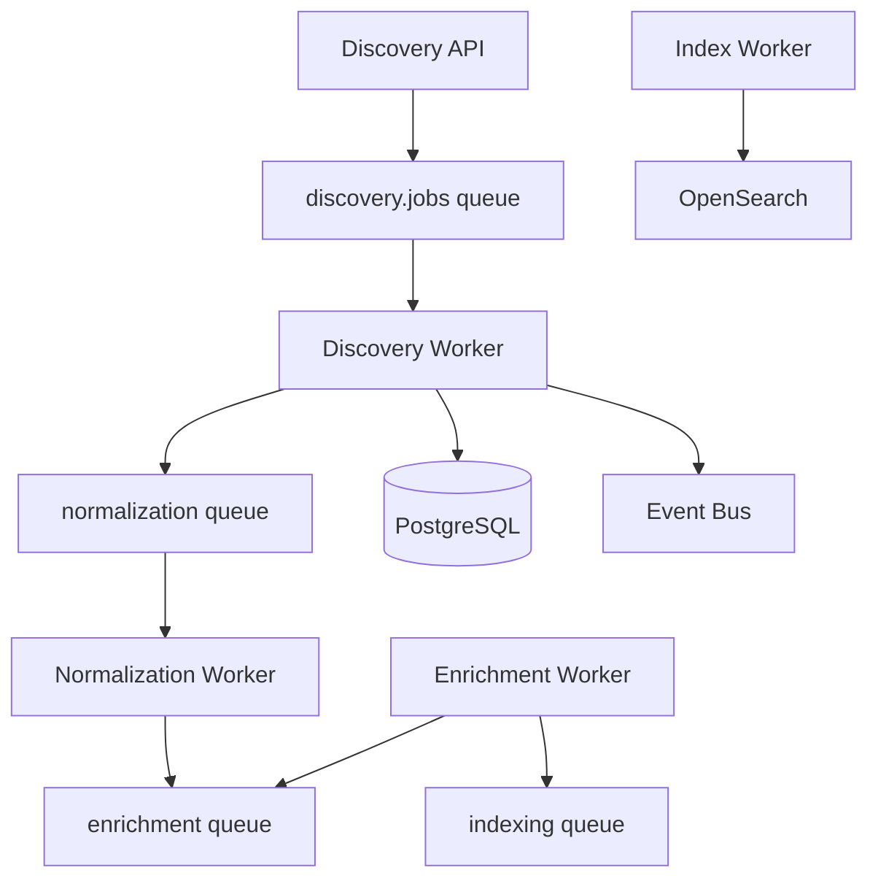
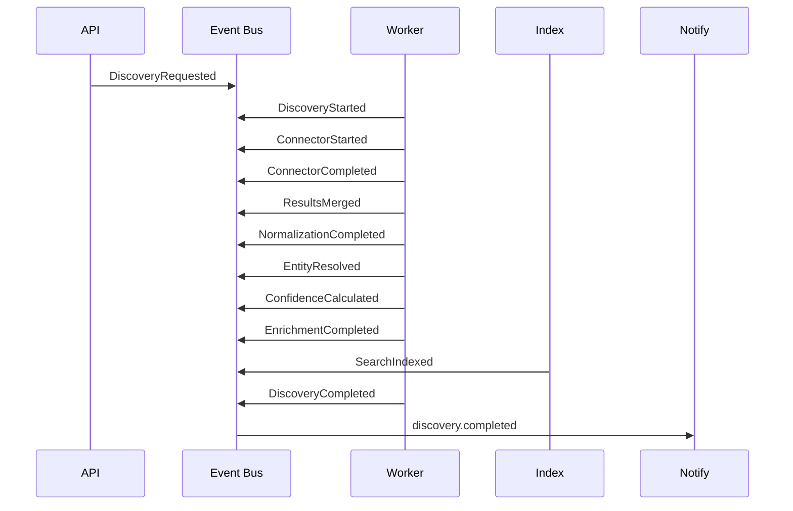

# Events & Background Workers

**Version 2.0** | AI Lead Intelligence Platform — Phase 5

---

## Table of Contents

1. [Background Workers](#1-background-workers)
2. [Event Model](#2-event-model)
3. [Queue Topology](#3-queue-topology)
4. [Worker Specifications](#4-worker-specifications)
5. [Scheduling](#5-scheduling)
6. [Failure Handling](#6-failure-handling)
7. [Implementation](#7-implementation)

---

## 1. Background Workers

### 1.1 Architecture

Discovery workloads are **asynchronous by default**. Interactive search returns a `job_id` immediately; workers execute the full pipeline and notify via WebSocket or polling.



### 1.2 Worker Catalog

| Worker | Queue | Celery Task | Priority |
|--------|-------|-------------|----------|
| Discovery Job | `discovery.jobs` | `discovery.run_job` | High |
| Normalization | `discovery.normalize` | `discovery.normalize_batch` | High |
| Enrichment | `discovery.enrich` | `discovery.enrich_entities` | Medium |
| Verification | `discovery.verify` | `discovery.verify_contacts` | Medium |
| Index Update | `discovery.index` | `discovery.index_results` | Medium |
| Scheduled Search | `discovery.scheduled` | `discovery.run_scheduled` | Low |
| Retry | `discovery.retry` | `discovery.retry_failed` | Medium |
| Dead Letter | `discovery.dlq` | `discovery.process_dlq` | Low |
| Analytics Refresh | `analytics.refresh` | `analytics.refresh_discovery` | Low |
| Notifications | `notifications` | `notifications.send_discovery_complete` | Low |

### 1.3 Worker Infrastructure

| Component | Technology |
|-----------|------------|
| Broker | Redis 7+ |
| Result backend | Redis |
| Scheduler | Celery Beat |
| Concurrency | Prefork (CPU-bound) + gevent pool (I/O-bound connectors) |
| Config | `backend/workers/celery_app.py` |

### 1.4 Discovery Job Worker Flow

```text
1. Load job from discovery_jobs table
2. Emit DiscoveryStarted
3. Invoke DiscoveryOrchestrator.execute()
4. For each stage:
   a. Emit stage event
   b. Delegate to pipeline service or sub-task
   c. Persist intermediate state (job_stages JSONB)
5. Emit DiscoveryCompleted or DiscoveryFailed
6. Enqueue index + notification tasks
```

### 1.5 Scaling

| Worker Type | Scaling Signal |
|-------------|----------------|
| Discovery | `discovery.jobs` queue depth > 100 |
| Normalization | p95 stage latency > 5s |
| Enrichment | Provider rate limit headroom < 20% |
| Index | OpenSearch bulk queue lag > 30s |

HPA rules in Kubernetes; min 2 replicas per worker type in production.

---

## 2. Event Model

### 2.1 Event Bus

Events publish to Redis Streams (primary) with optional Kafka bridge for analytics.

```
Stream: discovery.events
Consumer groups: indexing, analytics, notifications, audit
```

### 2.2 Event Catalog

| Event | Payload Keys | Emitted By |
|-------|-------------|------------|
| `DiscoveryRequested` | `job_id`, `org_id`, `user_id`, `query`, `entity_type`, `connectors` | API (Request Router) |
| `DiscoveryStarted` | `job_id`, `org_id`, `started_at` | Discovery Worker |
| `ConnectorStarted` | `job_id`, `connector`, `capability` | Parallel Execution Engine |
| `ConnectorCompleted` | `job_id`, `connector`, `records`, `credits_used`, `latency_ms` | Parallel Execution Engine |
| `ConnectorFailed` | `job_id`, `connector`, `error`, `retry_count` | Retry Manager |
| `ResultsMerged` | `job_id`, `hit_count`, `sources` | Result Aggregator |
| `NormalizationCompleted` | `job_id`, `records_in`, `records_out`, `quarantined` | Normalization Pipeline |
| `EntityResolved` | `job_id`, `entities_merged`, `review_queued` | Entity Resolution Engine |
| `ConfidenceCalculated` | `job_id`, `avg_confidence`, `distribution` | Confidence Engine |
| `EnrichmentCompleted` | `job_id`, `fields_enriched`, `credits_used` | Enrichment Pipeline |
| `SearchIndexed` | `job_id`, `indexed_count`, `index_name` | Index Worker |
| `DiscoveryCompleted` | `job_id`, `total`, `took_ms`, `status` | Discovery Worker |
| `DiscoveryFailed` | `job_id`, `error`, `failed_stage` | Discovery Worker |

### 2.3 Event Envelope

```json
{
  "event_id": "uuid",
  "event_type": "DiscoveryCompleted",
  "version": "2.0",
  "timestamp": "2026-06-28T12:00:00Z",
  "tenant_id": "org-uuid",
  "correlation_id": "job-uuid",
  "causation_id": "parent-event-uuid",
  "actor": {
    "type": "system",
    "id": "discovery-worker-1"
  },
  "payload": { },
  "metadata": {
    "trace_id": "otel-trace-id",
    "span_id": "otel-span-id"
  }
}
```

### 2.4 Event Flow Diagram



### 2.5 Subscribers

| Consumer Group | Events | Action |
|----------------|--------|--------|
| `notifications` | `DiscoveryCompleted`, `DiscoveryFailed` | WebSocket push, email digest |
| `analytics` | All discovery events | Funnel metrics, connector usage |
| `audit` | All events | Immutable audit log (S3 + DB) |
| `billing` | `ConnectorCompleted`, `EnrichmentCompleted` | Credit deduction |
| `crm-sync` | `DiscoveryCompleted` | Optional auto-push to CRM |

### 2.6 Idempotency & Ordering

- `event_id` UUID — consumers dedupe via Redis SET with 24h TTL
- Per-`job_id` ordering guaranteed within a partition
- `correlation_id` = `job_id` for distributed tracing

---

## 3. Queue Topology

### 3.1 Redis Queue Configuration

```python
CELERY_TASK_ROUTES = {
    "discovery.run_job": {"queue": "discovery.jobs"},
    "discovery.normalize_batch": {"queue": "discovery.normalize"},
    "discovery.enrich_entities": {"queue": "discovery.enrich"},
    "discovery.verify_contacts": {"queue": "discovery.verify"},
    "discovery.index_results": {"queue": "discovery.index"},
    "discovery.run_scheduled": {"queue": "discovery.scheduled"},
    "discovery.retry_failed": {"queue": "discovery.retry"},
}
```

### 3.2 Priority Queues

| Priority | Queue Suffix | Use Case |
|----------|-------------|----------|
| 0 (highest) | `.priority` | Interactive user searches |
| 5 | (default) | Background enrichment |
| 9 (lowest) | `.bulk` | Scheduled scans, analytics refresh |

### 3.3 Dead Letter Queue

Failed tasks after `max_retries` route to `discovery.dlq`:

```text
dlq_entry:
  - original_task
  - failure_reason
  - stack_trace
  - retry_count
  - job_id
  - created_at
```

Ops runbook: inspect DLQ daily; replay or discard after root-cause fix.

---

## 4. Worker Specifications

### 4.1 `discovery.run_job`

```python
@shared_task(bind=True, max_retries=3, name="discovery.run_job")
def run_discovery_job(self, job_id: str, org_id: str):
    """Execute full discovery pipeline for a job."""
```

| Property | Value |
|----------|-------|
| Timeout | 300s (soft), 360s (hard) |
| Retries | 3 with exponential backoff |
| Idempotency key | `job_id` |

### 4.2 `discovery.normalize_batch`

Processes a batch of raw connector records. Input: `job_id`, `connector`, `records[]`.

### 4.3 `discovery.enrich_entities`

Parallel enrichment with rate limit awareness. Chunks of 10 entities per provider call.

### 4.4 `discovery.verify_contacts`

Delegates to Hunter/Twilio connectors. Updates `verification_status` on contacts.

### 4.5 `discovery.index_results`

Bulk index to OpenSearch using `_bulk` API. Index alias: `leads-{org_id}`.

### 4.6 `discovery.run_scheduled`

Celery Beat triggers saved searches from `saved_searches` where `schedule_cron` matches.

### 4.7 `discovery.retry_failed`

Re-executes failed connector calls for a job. Respects `RetryPolicy` from SDK.

---

## 5. Scheduling

### 5.1 Celery Beat Schedule

```python
beat_schedule = {
    "run-scheduled-searches": {
        "task": "discovery.run_scheduled",
        "schedule": crontab(minute="*/15"),
    },
    "refresh-stale-entities": {
        "task": "discovery.enrich_entities",
        "schedule": crontab(hour=4, minute=0),
        "kwargs": {"mode": "incremental"},
    },
    "check-connector-health": {
        "task": "discovery.check_connector_health",
        "schedule": crontab(minute=0, hour="*/6"),
    },
    "process-dlq": {
        "task": "discovery.process_dlq",
        "schedule": crontab(hour=6, minute=0),
    },
}
```

### 5.2 Saved Search Scheduler

User-defined cron expressions stored in `saved_searches.schedule_cron`. Scheduler:

1. Query due searches
2. Create `discovery_job` per search
3. Enqueue `discovery.run_job`
4. Update `last_run_at`

---

## 6. Failure Handling

### 6.1 Retry Policy

| Error Type | Retry | Backoff |
|------------|-------|---------|
| Rate limit (429) | Yes | Provider `Retry-After` or exponential |
| Timeout | Yes | 2^n × 30s |
| Auth failure (401/403) | No | Alert + circuit breaker |
| Validation (422) | No | Log + skip record |
| Credits exhausted (402) | No | Notify tenant admin |

### 6.2 Circuit Breaker Integration

After 5 consecutive connector failures → circuit open for 5 minutes. Provider Selection Engine excludes open circuits.

### 6.3 Partial Completion

Jobs with some connector failures return `status: partial`:

```json
{
  "status": "partial",
  "connectors": [
    {"name": "apollo", "success": true},
    {"name": "clearbit", "success": false, "error": "rate_limited"}
  ]
}
```

---

## 7. Implementation

### 7.1 Current State

| Component | Status |
|-----------|--------|
| Celery app | `backend/workers/celery_app.py` — enrichment, export, scoring |
| Discovery tasks | `backend/workers/tasks/discovery.py` — skeleton |
| Event publisher | Planned — `backend/infrastructure/messaging/` |
| Job persistence | Planned — `discovery_jobs` table |

### 7.2 Database Schema (Planned)

```sql
CREATE TABLE discovery_jobs (
    id UUID PRIMARY KEY,
    organization_id UUID NOT NULL REFERENCES organizations(id),
    user_id UUID REFERENCES users(id),
    status VARCHAR(20) NOT NULL DEFAULT 'pending',
    query TEXT,
    entity_type VARCHAR(20),
    connectors_used JSONB DEFAULT '[]',
    filters JSONB DEFAULT '{}',
    result_count INT,
    credits_used INT DEFAULT 0,
    stages JSONB DEFAULT '{}',
    error_message TEXT,
    started_at TIMESTAMPTZ,
    completed_at TIMESTAMPTZ,
    created_at TIMESTAMPTZ DEFAULT NOW()
);

CREATE INDEX idx_discovery_jobs_org_status ON discovery_jobs(organization_id, status);
```

### 7.3 Next Steps

1. Add `discovery_jobs` migration
2. Implement `EventPublisher` with Redis Streams
3. Wire `DiscoveryOrchestrator` into `discovery.run_job`
4. Add WebSocket notification on `DiscoveryCompleted`
5. Dashboard widgets for job status (Phase 4 frontend binding)