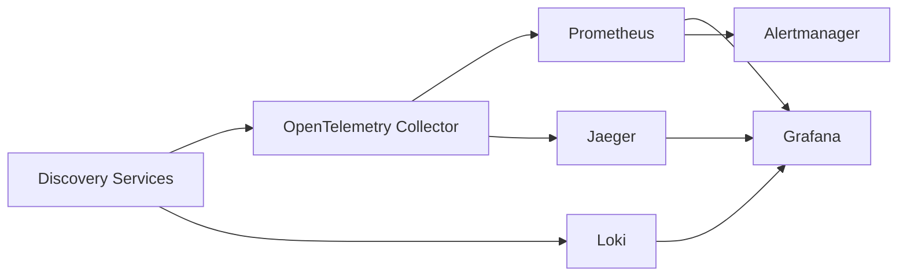

# Monitoring & Observability — Discovery Platform

**Version 2.0** | AI Lead Intelligence Platform — Phase 5

---

## Table of Contents

1. [Observability Stack](#1-observability-stack)
2. [Metrics](#2-metrics)
3. [Distributed Tracing](#3-distributed-tracing)
4. [Structured Logging](#4-structured-logging)
5. [Provider Health](#5-provider-health)
6. [Connector Dashboard](#6-connector-dashboard)
7. [Alerting](#7-alerting)
8. [Health Checks](#8-health-checks)
9. [SLOs & SLIs](#9-slos--slis)

---

## 1. Observability Stack

| Pillar | Technology | Purpose |
|--------|------------|---------|
| Metrics | Prometheus + Grafana | Counters, histograms, gauges |
| Tracing | OpenTelemetry → Jaeger/Tempo | End-to-end request tracing |
| Logging | structlog → Loki/ELK | Searchable JSON logs |
| Dashboards | Grafana | Ops + tenant admin views |
| Alerting | Alertmanager + PagerDuty | On-call escalation |



---

## 2. Metrics

### 2.1 Discovery Metrics

| Metric | Type | Labels | Description |
|--------|------|--------|-------------|
| `discovery_requests_total` | Counter | `org_id`, `entity_type`, `async` | API discovery requests |
| `discovery_jobs_total` | Counter | `status`, `org_id` | Jobs by terminal status |
| `discovery_job_duration_seconds` | Histogram | `org_id`, `entity_type` | End-to-end job latency |
| `discovery_results_total` | Counter | `org_id`, `entity_type` | Result hits returned |
| `discovery_pipeline_stage_duration_seconds` | Histogram | `stage`, `org_id` | Per-stage latency |

### 2.2 Connector Metrics

| Metric | Type | Labels |
|--------|------|--------|
| `connector_requests_total` | Counter | `connector`, `capability`, `status` |
| `connector_latency_seconds` | Histogram | `connector`, `capability` |
| `connector_credits_used_total` | Counter | `connector`, `org_id` |
| `connector_rate_limit_denied_total` | Counter | `connector`, `org_id` |
| `connector_circuit_state` | Gauge | `connector` | 0=closed, 1=open, 2=half-open |
| `connector_health_status` | Gauge | `connector` | 1=healthy, 0=unhealthy |

### 2.3 Worker Metrics

| Metric | Type | Labels |
|--------|------|--------|
| `celery_queue_depth` | Gauge | `queue` |
| `celery_task_duration_seconds` | Histogram | `task_name` |
| `celery_task_retries_total` | Counter | `task_name` |
| `dlq_entries_total` | Counter | `task_name` |

### 2.4 Pipeline Metrics

| Metric | Type | Labels |
|--------|------|--------|
| `normalization_records_total` | Counter | `status` (ok, quarantined) |
| `entity_resolution_merges_total` | Counter | `entity_type` |
| `entity_resolution_review_queued_total` | Counter | `entity_type` |
| `confidence_score_distribution` | Histogram | `entity_type` |
| `enrichment_fields_enriched_total` | Counter | `field`, `connector` |
| `opensearch_bulk_index_duration_seconds` | Histogram | `index` |

---

## 3. Distributed Tracing

### 3.1 Trace Context

Every discovery request creates a root span:

```text
discovery.execute (root)
├── query.parse
├── provider.select
├── connector.execute [apollo]
│   ├── connector.authenticate
│   └── connector.search
├── connector.execute [clearbit]
├── pipeline.normalize
├── pipeline.entity_resolve
├── pipeline.confidence
├── pipeline.enrich
├── persistence.save
└── search.index
```

### 3.2 Propagation

- W3C `traceparent` header on API ingress
- `correlation_id` = `job_id` in all spans and logs
- Celery tasks inject trace context via task headers

### 3.3 Sampling

| Environment | Sample Rate |
|-------------|-------------|
| Production | 10% head-based + 100% on errors |
| Staging | 50% |
| Development | 100% |

---

## 4. Structured Logging

### 4.1 Log Format

```json
{
  "timestamp": "2026-06-28T12:00:00.123Z",
  "level": "INFO",
  "logger": "discovery.orchestrator",
  "message": "Connector execution completed",
  "correlation_id": "job-uuid",
  "trace_id": "abc123",
  "span_id": "def456",
  "org_id": "org-uuid",
  "connector": "apollo",
  "latency_ms": 1200,
  "records": 25,
  "credits_used": 3
}
```

### 4.2 Log Levels by Component

| Component | Default Level |
|-----------|---------------|
| Orchestrator | INFO |
| Connector SDK | INFO (DEBUG in staging) |
| Rate Limiter | WARN on deny |
| Entity Resolution | INFO |
| Workers | INFO |

### 4.3 Sensitive Data

Never log: API keys, OAuth tokens, full email/phone. Use redaction middleware.

---

## 5. Provider Health

### 5.1 Health Check Schedule

- Automated: every 6 hours via Celery Beat
- On-demand: `POST /discovery/connectors/health/check`
- Pre-execution: quick check if circuit was recently open

### 5.2 Health States

| State | Criteria |
|-------|----------|
| Healthy | `health_check()` returns `healthy=true`, latency < 5s |
| Degraded | Healthy but latency > 2s or credits < 10% |
| Unhealthy | Auth failure, timeout, or 3 consecutive errors |
| Circuit Open | 5 failures in 5 min window |

### 5.3 Health Storage

```text
connector_health_snapshots:
  connector_name, org_id, healthy, latency_ms, credits_remaining,
  circuit_state, checked_at
```

---

## 6. Connector Dashboard

### 6.1 Ops Dashboard (Grafana)

Panels:

- Discovery jobs/hour by status
- Connector success rate (24h rolling)
- p50/p95 connector latency
- Rate limit denials by provider
- Queue depths
- DLQ size
- Credits consumed by org (top 10)

### 6.2 Tenant Admin Dashboard (In-App)

Exposed via `/api/v1/discovery/connectors/{name}/metrics`:

- Requests today
- Success rate
- Avg latency
- Credits used
- Last health check

---

## 7. Alerting

### 7.1 Alert Rules

| Alert | Condition | Severity |
|-------|-----------|----------|
| `DiscoveryJobFailureRateHigh` | > 10% failed jobs in 15 min | P2 |
| `ConnectorCircuitOpen` | circuit_state=1 for > 5 min | P2 |
| `ConnectorLatencyHigh` | p95 > 10s for 10 min | P3 |
| `DLQGrowing` | dlq_entries > 50 | P2 |
| `CeleryQueueBacklog` | queue_depth > 500 for 10 min | P2 |
| `DiscoveryAPILatencyHigh` | p95 > 30s | P3 |
| `AllConnectorsUnhealthy` | all connectors unhealthy | P1 |
| `CreditsExhausted` | org credits = 0 (enterprise) | P3 |

### 7.2 Notification Channels

- P1/P2 → PagerDuty
- P3 → Slack `#discovery-alerts`
- Tenant-specific → email to org admin

---

## 8. Health Checks

### 8.1 Liveness

`GET /health` — process alive (existing endpoint).

### 8.2 Readiness

`GET /health/ready`:

```json
{
  "status": "ready",
  "checks": {
    "postgresql": "ok",
    "redis": "ok",
    "opensearch": "ok",
    "celery": "ok"
  }
}
```

### 8.3 Deep Health

`GET /health/deep` (admin only):

- Sample connector health check
- OpenSearch cluster status
- Celery worker ping

---

## 9. SLOs & SLIs

| SLI | SLO Target | Measurement Window |
|-----|------------|-------------------|
| Discovery API availability | 99.9% | 30 days |
| Sync discovery p95 latency | < 5s (≤25 results) | 7 days |
| Async job completion p95 | < 60s | 7 days |
| Connector success rate | > 97% | 7 days |
| Index freshness | < 30s after job complete | 7 days |

### Error Budget Policy

When SLO burn rate exceeds 2x:

1. Freeze non-critical connector additions
2. Enable aggressive circuit breaking
3. Post-incident review within 48h