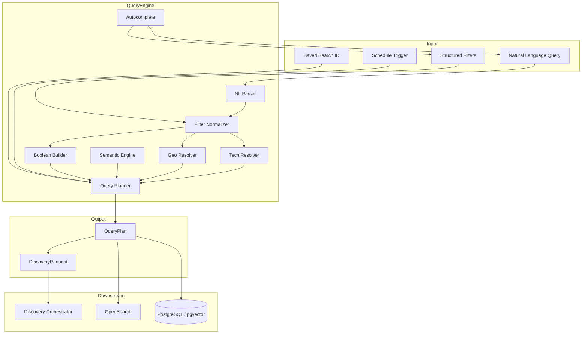
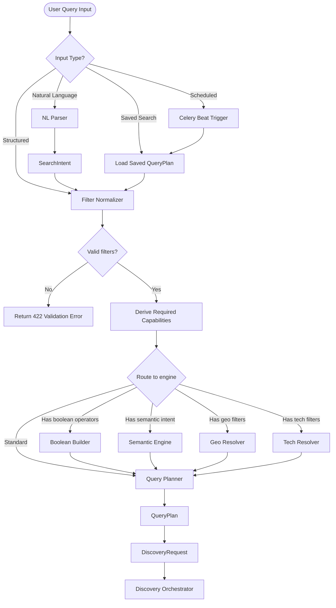
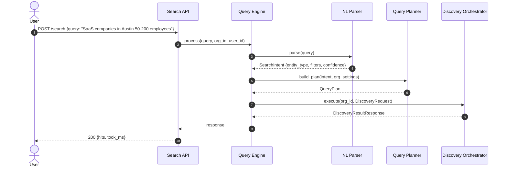
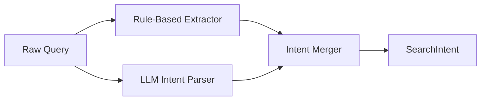
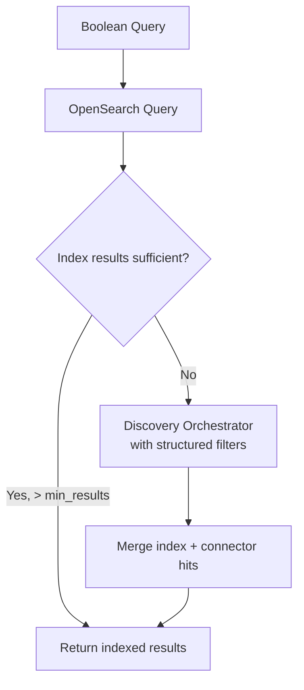
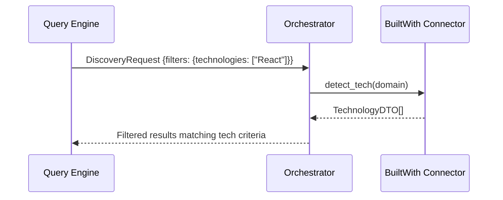
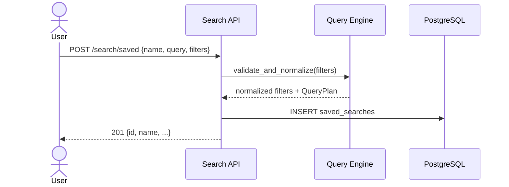
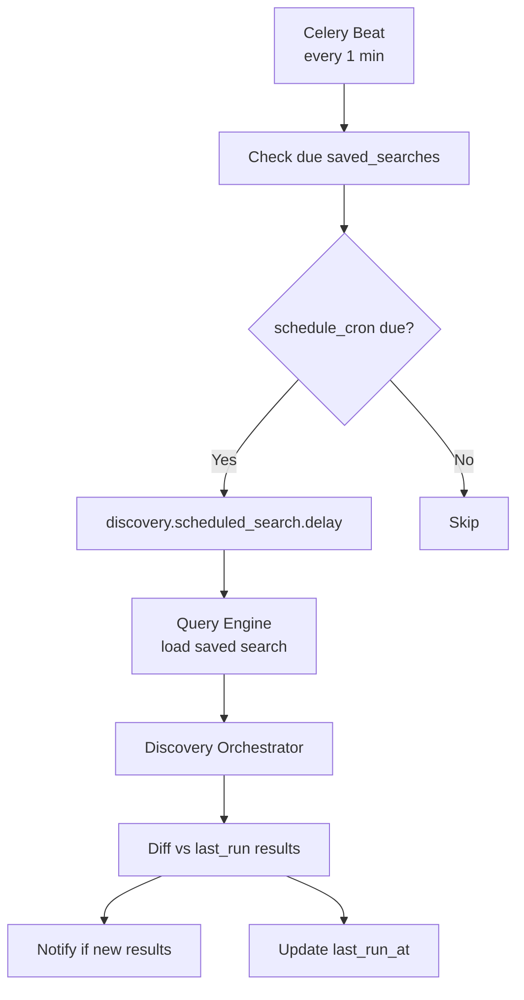
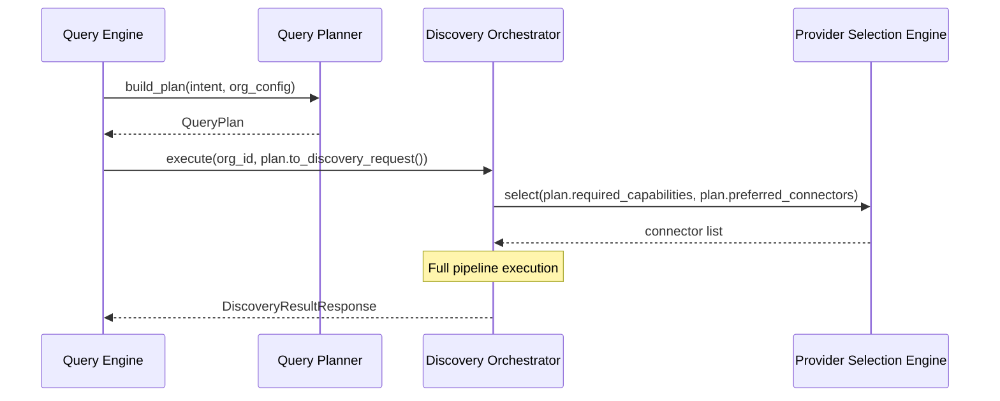
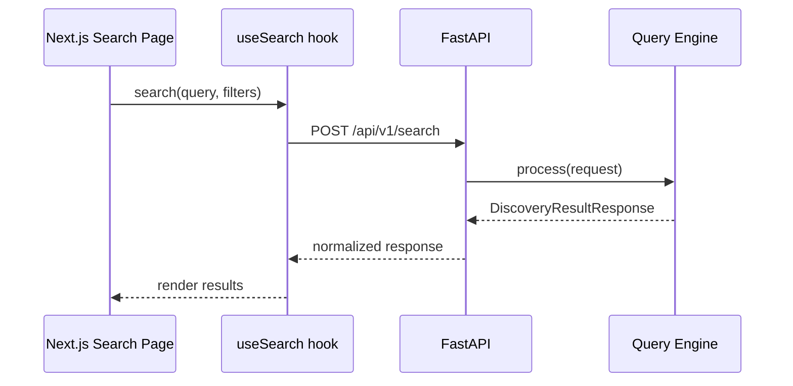

# Query Engine Design

**Version 2.0** | AI Lead Intelligence Platform — Phase 5

---

## Table of Contents

1. [Overview](#1-overview)
2. [Architecture](#2-architecture)
3. [Query Processing Pipeline](#3-query-processing-pipeline)
4. [Natural Language Parsing](#4-natural-language-parsing)
5. [Structured Search](#5-structured-search)
6. [Boolean Search](#6-boolean-search)
7. [Semantic Search](#7-semantic-search)
8. [Geographic Search](#8-geographic-search)
9. [Technology Search](#9-technology-search)
10. [Saved Searches](#10-saved-searches)
11. [Scheduled Searches](#11-scheduled-searches)
12. [Autocomplete](#12-autocomplete)
13. [QueryPlan Model](#13-queryplan-model)
14. [Integration with Orchestrator](#14-integration-with-orchestrator)
15. [Frontend Alignment](#15-frontend-alignment)
16. [Performance & Caching](#16-performance--caching)

---

## 1. Overview

The **Query Engine** transforms user input — whether natural language, structured filters, or saved search templates — into a normalized `QueryPlan` that the Discovery Orchestrator can execute. It is the **intelligence layer between the UI and the discovery pipeline**.

### 1.1 Responsibilities

| Responsibility | Component |
|----------------|-----------|
| Parse natural language queries | NL Parser |
| Validate and normalize filters | Filter Normalizer |
| Build boolean expressions | Boolean Query Builder |
| Generate embedding queries | Semantic Query Engine |
| Resolve geographic intent | Geo Query Resolver |
| Match technology filters | Tech Query Resolver |
| Manage saved/scheduled searches | Search Scheduler |
| Provide typeahead suggestions | Autocomplete Service |

### 1.2 Non-Responsibilities

- Executing connector API calls (Discovery Orchestrator)
- Entity resolution or confidence scoring (Data Pipelines)
- Rendering search UI (Phase 4 frontend)

### 1.3 Module Path

```text
backend/app/discovery/query/
├── __init__.py
├── parser.py           # NL → structured intent
├── planner.py          # Intent → QueryPlan
├── filters.py          # Filter normalization + validation
├── boolean.py          # Boolean expression builder
├── semantic.py         # Embedding + vector search
├── geo.py              # Geographic query resolution
├── tech.py             # Technology taxonomy matching
├── autocomplete.py     # Typeahead suggestions
└── scheduler.py        # Saved/scheduled search binding
```

---

## 2. Architecture

### 2.1 Component Diagram



### 2.2 Query Types

| Type | Input Example | Primary Engine | Connector Fallback |
|------|---------------|----------------|-------------------|
| **Natural Language** | "SaaS companies in Austin with 50-200 employees" | NL Parser → structured | Apollo, Clearbit |
| **Structured** | `{industry: "SaaS", country_code: "US"}` | Filter Normalizer | Apollo, Clearbit |
| **Boolean** | `industry:SaaS AND (city:Austin OR city:Dallas)` | Boolean Builder → OpenSearch | Connectors if index miss |
| **Semantic** | "companies similar to Stripe" | pgvector embedding | Internal index |
| **Geo** | `{geo_lat: 30.27, geo_lon: -97.74, geo_radius_km: 50}` | OpenSearch `geo_distance` | Connector geo filters |
| **Tech** | `{technologies: ["React", "AWS"]}` | OpenSearch `terms` + tech taxonomy | BuiltWith connector |
| **Saved** | `saved_search_id: uuid` | Load stored QueryPlan | Per saved config |
| **Scheduled** | Celery Beat cron | Load + execute saved search | Per saved config |

---

## 3. Query Processing Pipeline

### 3.1 Processing Flow



### 3.2 Sequence: NL Query to Discovery



---

## 4. Natural Language Parsing

### 4.1 NL Parser Architecture

The NL Parser converts free-text queries into structured `SearchIntent` objects. It uses a **hybrid approach**:

1. **Rule-based extraction** — fast, deterministic patterns for common filters
2. **LLM intent classification** — Anthropic/OpenAI for complex queries (Phase 3 AI service)
3. **Entity recognition** — spaCy/custom NER for company names, locations, titles



### 4.2 SearchIntent Model

```python
@dataclass
class SearchIntent:
    raw_query: str
    entity_type: Literal["company", "contact", "both"] = "both"
    filters: dict[str, Any] = field(default_factory=dict)
    query_text: str | None = None          # Remaining free-text for full-text search
    semantic_query: str | None = None      # For embedding search
    parse_confidence: float = 0.0
    parse_method: Literal["rules", "llm", "hybrid"] = "rules"
    extracted_entities: list[ExtractedEntity] = field(default_factory=list)
```

### 4.3 Rule-Based Patterns

| Pattern | Extracted Filter | Example |
|---------|-----------------|---------|
| `in {city}` | `city` | "companies in Austin" |
| `in {country}` | `country_code` | "companies in Germany" |
| `{N}-{M} employees` | `employee_count_min`, `employee_count_max` | "50-200 employees" |
| `{N}+ employees` | `employee_count_min` | "500+ employees" |
| `using {tech}` | `technologies` | "using React" |
| `{title} at` | `title` | "CTO at" |
| `SaaS` / `fintech` / etc. | `industry` | "SaaS companies" |
| `revenue > ${N}M` | `revenue_min` | "revenue over $10M" |
| `founded after {year}` | `founded_year_min` | "founded after 2015" |
| `near {city}` | `geo` (resolved later) | "near San Francisco" |

### 4.4 LLM Parser Prompt (structured output)

```python
SYSTEM_PROMPT = """
You are a B2B lead search intent parser. Extract structured filters from the user query.
Return JSON matching the SearchIntent schema. Only extract explicitly stated or strongly implied filters.
Do not fabricate filters. Entity types: company, contact, both.
"""

# Example LLM output
{
  "entity_type": "company",
  "filters": {
    "industry": "Computer Software",
    "city": "Austin",
    "state": "TX",
    "country_code": "US",
    "employee_count_min": 50,
    "employee_count_max": 200
  },
  "query_text": null,
  "parse_confidence": 0.92
}
```

### 4.5 Frontend Alignment

Phase 4 frontend already implements client-side NL parsing at `frontend/src/lib/parse-search-intent.ts`. The backend NL Parser provides:

- Authoritative server-side parsing (security, consistency)
- Access to org-specific taxonomies and reference data
- Higher accuracy via LLM for complex queries
- Fallback when client parser confidence is low


### 4.6 Parse Confidence Thresholds

| Confidence | Action |
|------------|--------|
| ≥ 0.85 | Execute directly |
| 0.60–0.84 | Execute with `explanation.parse_warnings` |
| < 0.60 | Return suggested filters for user confirmation |

---

## 5. Structured Search

### 5.1 Standard Filter Schema

All filters — regardless of input type — normalize to this schema before orchestrator execution:

```python
STANDARD_FILTERS = {
    # Company filters
    "industry": str | list[str],
    "sub_industry": str | list[str],
    "country_code": str,
    "state": str,
    "city": str,
    "employee_count_min": int,
    "employee_count_max": int,
    "revenue_min": int,
    "revenue_max": int,
    "founded_year_min": int,
    "founded_year_max": int,
    "technologies": list[str],
    "domain": str,
    "company_name": str,

    # Contact filters
    "title": str,
    "titles": list[str],
    "seniority": list[str],
    "department": str,
    "email_domain": str,
    "has_email": bool,
    "has_phone": bool,
    "has_linkedin": bool,

    # Geo filters
    "geo_lat": float,
    "geo_lon": float,
    "geo_radius_km": float,
    "geo_bounding_box": dict,

    # Meta filters
    "confidence_min": float,
    "source": list[str],
    "updated_within_days": int,
}
```

### 5.2 Filter Normalizer

```python
class FilterNormalizer:
    def normalize(self, raw_filters: dict, org_id: UUID) -> dict:
        normalized = {}
        if industry := raw_filters.get("industry"):
            normalized["industry"] = self._resolve_industry(industry)
        if employees := raw_filters.get("employees"):
            normalized.update(self._parse_employee_range(employees))
        if country := raw_filters.get("country"):
            normalized["country_code"] = self._resolve_country_code(country)
        if tech := raw_filters.get("technologies"):
            normalized["technologies"] = self._resolve_technologies(tech)
        return normalized
```

### 5.3 Taxonomy Resolution

| Raw Input | Resolved Value | Source |
|-----------|---------------|--------|
| `"SaaS"` | `"Computer Software"` | `industries` reference table |
| `"US"` / `"United States"` | `"US"` | ISO 3166-1 |
| `"SF"` / `"San Francisco"` | `city: "San Francisco", state: "CA"` | Geo reference |
| `"React.js"` | `"React"` | `technologies` taxonomy |
| `"C-suite"` | `seniority: ["c_suite", "founder"]` | Seniority mapping |

### 5.4 JSON Example — Structured Request

```json
{
  "entity_type": "company",
  "filters": {
    "industry": ["Computer Software", "Information Technology"],
    "country_code": "US",
    "state": "TX",
    "employee_count_min": 50,
    "employee_count_max": 200,
    "technologies": ["React", "AWS"],
    "confidence_min": 0.7
  },
  "connectors": ["apollo", "clearbit"],
  "enrich": true
}
```

---

## 6. Boolean Search

### 6.1 Boolean Syntax

Power users can compose boolean queries in the search bar or advanced filter UI:

```text
industry:"Computer Software" AND country_code:US AND (city:Austin OR city:Dallas) NOT employee_count_max:10
```

### 6.2 Supported Operators

| Operator | Syntax | OpenSearch Mapping |
|----------|--------|-------------------|
| AND | `A AND B` | `bool.must` |
| OR | `A OR B` | `bool.should` |
| NOT | `NOT A` | `bool.must_not` |
| Grouping | `(A OR B)` | Nested `bool` |
| Exact phrase | `"exact phrase"` | `match_phrase` |
| Field prefix | `field:value` | `term` or `match` |
| Range | `field:>100` | `range` |
| Wildcard | `name:Acme*` | `wildcard` (limited) |

### 6.3 Boolean Query Builder

```python
class BooleanQueryBuilder:
    def parse(self, expression: str) -> OpenSearchQuery:
        tokens = self._tokenize(expression)
        ast = self._build_ast(tokens)
        return self._ast_to_opensearch(ast)

    def _ast_to_opensearch(self, node: ASTNode) -> dict:
        if node.operator == "AND":
            return {"bool": {"must": [self._ast_to_opensearch(c) for c in node.children]}}
        if node.operator == "OR":
            return {"bool": {"should": [self._ast_to_opensearch(c) for c in node.children], "minimum_should_match": 1}}
        if node.operator == "NOT":
            return {"bool": {"must_not": [self._ast_to_opensearch(node.children[0])]}}
        return self._field_query(node)
```

### 6.4 OpenSearch Output Example

```json
{
  "bool": {
    "must": [
      {"term": {"industry.keyword": "Computer Software"}},
      {"term": {"country_code": "US"}},
      {
        "bool": {
          "should": [
            {"term": {"city.keyword": "Austin"}},
            {"term": {"city.keyword": "Dallas"}}
          ],
          "minimum_should_match": 1
        }
      }
    ],
    "must_not": [
      {"range": {"employee_count": {"lte": 10}}}
    ]
  }
}
```

### 6.5 Boolean + Connector Hybrid



---

## 7. Semantic Search

### 7.1 Use Cases

| Query | Semantic Intent |
|-------|----------------|
| "companies similar to Stripe" | Embedding nearest-neighbor |
| "AI startups doing NLP" | Concept expansion beyond exact keywords |
| "enterprise security vendors" | Industry concept clustering |

### 7.2 Architecture

```mermaid
flowchart LR
    Q[Semantic Query] --> EMB[Embedding Service<br/>OpenAI / local model]
    EMB --> VEC[Query Vector]
    VEC --> PGV[pgvector<br/>cosine similarity]
    VEC --> OSV[OpenSearch<br/>knn query]
    PGV --> MERGE[Merge + Rerank]
    OSV --> MERGE
    MERGE --> RESULTS[Ranked Entity IDs]
    RESULTS --> FILTERS[Apply structured filters]
    FILTERS --> RESPONSE[DiscoveryResultHit[]]
```

### 7.3 Embedding Model

| Setting | Value |
|---------|-------|
| Model | `text-embedding-3-small` (OpenAI) or local `all-MiniLM-L6-v2` |
| Dimensions | 1536 (OpenAI) / 384 (local) |
| Indexed fields | `company.name + description + industry` |
| Similarity | Cosine |
| Min score threshold | 0.75 |

### 7.4 pgvector Query

```sql
SELECT id, name, domain,
       1 - (embedding <=> $1::vector) AS similarity
FROM companies
WHERE organization_id = $2
  AND deleted_at IS NULL
  AND 1 - (embedding <=> $1::vector) > 0.75
ORDER BY embedding <=> $1::vector
LIMIT 50;
```

### 7.5 Hybrid Search (Semantic + Structured)

```python
class SemanticQueryEngine:
    async def search(
        self,
        semantic_query: str,
        filters: dict,
        org_id: UUID,
        limit: int = 50,
    ) -> list[UUID]:
        embedding = await self._embed(semantic_query)
        vector_ids = await self._pgvector_search(embedding, org_id, limit)
        if filters:
            vector_ids = await self._apply_filters(vector_ids, filters)
        return vector_ids
```

### 7.6 Important Constraint

Semantic search operates on **platform-owned indexed data** (`source_type: search_index`) and authorized connector results — never on scraped web content.

---

## 8. Geographic Search

### 8.1 Geo Query Types

| Type | Input | Example |
|------|-------|---------|
| **Radius** | lat, lon, radius_km | 50km around Austin |
| **City** | city name | "San Francisco" |
| **State/Region** | state + country | "TX, US" |
| **Country** | country_code | "DE" |
| **Bounding box** | ne_lat, ne_lon, sw_lat, sw_lon | Map selection (Phase 4 UI) |

### 8.2 Geo Resolver

```python
class GeoQueryResolver:
    async def resolve(self, filters: dict) -> dict:
        if city := filters.get("city"):
            coords = await self._geocode_city(city, filters.get("country_code"))
            if coords:
                filters["geo_lat"] = coords.lat
                filters["geo_lon"] = coords.lon
                filters.setdefault("geo_radius_km", 50)
        return filters

    async def _geocode_city(self, city: str, country_code: str | None) -> Coordinates | None:
        # Use internal geo reference table first
        # Fall back to GEOCODE capability connector (Google/Mapbox API)
        ...
```

### 8.3 OpenSearch Geo Query

```json
{
  "geo_distance": {
    "distance": "50km",
    "location": {
      "lat": 30.2672,
      "lon": -97.7431
    }
  }
}
```

### 8.4 Connector Geo Filters

When searching via connectors, geo filters map to provider-specific parameters:

| Standard Filter | Apollo | Clearbit |
|----------------|--------|----------|
| `city` | `organization_locations[]` | `geo.city` |
| `state` | `organization_state` | `geo.state` |
| `country_code` | `organization_country` | `geo.country` |
| `geo_radius_km` | Not supported — use city | Not supported |

### 8.5 Geo Data Sources

| Source | Authorization |
|--------|---------------|
| Internal geo reference table | Platform-owned |
| Google Geocoding API | `official_api` via GEOCODE connector |
| PostGIS (Phase 2) | Platform-owned coordinates |
| **Not allowed** | Scraping map services |

---

## 9. Technology Search

### 9.1 Technology Taxonomy

Technologies are normalized against an internal taxonomy:

```json
{
  "name": "React",
  "aliases": ["React.js", "ReactJS", "react"],
  "category": "JavaScript Framework",
  "parent": "JavaScript",
  "popularity_rank": 1
}
```

### 9.2 Tech Query Resolver

```python
class TechQueryResolver:
    def resolve(self, raw_technologies: list[str]) -> list[str]:
        resolved = []
        for tech in raw_technologies:
            canonical = self._taxonomy.resolve(tech)
            if canonical:
                resolved.append(canonical.name)
            else:
                resolved.append(tech)  # pass-through with low confidence
        return resolved
```

### 9.3 Search Modes

| Mode | Syntax | Behavior |
|------|--------|----------|
| **Any** (default) | `technologies: ["React", "AWS"]` | Match companies using ANY listed tech |
| **All** | `technologies_all: ["React", "AWS"]` | Match companies using ALL listed tech |
| **Category** | `tech_category: "CRM"` | Match any CRM technology |
| **Exclude** | `technologies_exclude: ["WordPress"]` | Exclude companies using WordPress |

### 9.4 OpenSearch Tech Query

```json
{
  "bool": {
    "must": [
      {"terms": {"technologies.keyword": ["React", "AWS"]}}
    ],
    "must_not": [
      {"term": {"technologies.keyword": "WordPress"}}
    ]
  }
}
```

### 9.5 Connector Tech Detection

For companies not in the index, the `DETECT_TECH` capability fetches live tech stack:



---

## 10. Saved Searches

### 10.1 Saved Search Model

Stored in `saved_searches` table (Phase 2):

```python
class SavedSearch(BaseModel):
    id: UUID
    organization_id: UUID
    user_id: UUID
    name: str
    description: str | None = None
    query: str | None = None
    entity_type: str = "both"
    filters: dict[str, Any] = Field(default_factory=dict)
    connectors: list[str] | None = None
    enrich: bool = True
    notify_on_new: bool = False
    schedule_cron: str | None = None
    last_run_at: datetime | None = None
    result_count_last: int | None = None
    created_at: datetime
    updated_at: datetime
```

### 10.2 JSON Example

```json
{
  "id": "d4e5f6a7-b8c9-0123-def4-567890abcdef",
  "name": "Austin SaaS Mid-Market",
  "description": "SaaS companies in Austin with 50-200 employees",
  "query": "SaaS companies in Austin with 50-200 employees",
  "entity_type": "company",
  "filters": {
    "industry": "Computer Software",
    "city": "Austin",
    "state": "TX",
    "country_code": "US",
    "employee_count_min": 50,
    "employee_count_max": 200
  },
  "connectors": ["apollo", "clearbit"],
  "enrich": true,
  "notify_on_new": true,
  "schedule_cron": "0 8 * * 1"
}
```

### 10.3 Saved Search API

| Method | Endpoint | Description |
|--------|----------|-------------|
| `GET` | `/api/v1/search/saved` | List saved searches |
| `POST` | `/api/v1/search/saved` | Create saved search |
| `GET` | `/api/v1/search/saved/{id}` | Get saved search |
| `PATCH` | `/api/v1/search/saved/{id}` | Update saved search |
| `DELETE` | `/api/v1/search/saved/{id}` | Soft delete |
| `POST` | `/api/v1/search/saved/{id}/run` | Execute immediately |

### 10.4 Save Flow



---

## 11. Scheduled Searches

### 11.1 Scheduler Architecture



### 11.2 Cron Expression Support

Standard cron format (5-field):

| Expression | Meaning |
|------------|---------|
| `0 8 * * 1` | Every Monday at 8:00 AM UTC |
| `0 0 1 * *` | First day of every month |
| `0 */6 * * *` | Every 6 hours |
| `0 9 * * 1-5` | Weekdays at 9:00 AM |

### 11.3 Celery Beat Task

```python
@celery_app.task(name="discovery.scheduled_search")
def scheduled_search(saved_search_id: str, org_id: str):
    saved = saved_search_repo.get(UUID(saved_search_id), UUID(org_id))
    query_plan = query_engine.build_from_saved(saved)
    result = discovery_orchestrator.execute(UUID(org_id), query_plan.to_discovery_request())

    new_hits = diff_engine.find_new(saved.last_result_ids, result.hits)
    if new_hits and saved.notify_on_new:
        notification_service.send_search_alert(saved.user_id, new_hits)

    saved_search_repo.update_last_run(saved.id, result)
```

### 11.4 New Result Detection

```python
class ResultDiffEngine:
    def find_new(
        self,
        previous_ids: set[UUID],
        current_hits: list[DiscoveryResultHit],
    ) -> list[DiscoveryResultHit]:
        return [hit for hit in current_hits if hit.id not in previous_ids]
```

### 11.5 Credit Management for Scheduled Searches

- Pre-check org credit balance before execution
- Skip run + notify admin if insufficient credits
- Record credit usage per scheduled run in `credit_transactions`

---

## 12. Autocomplete

### 12.1 Autocomplete Types

| Type | Endpoint | Data Source | Example |
|------|----------|-------------|---------|
| **Industry** | `/search/autocomplete/industry?q=sa` | `industries` table | "SaaS" → "Computer Software" |
| **Technology** | `/search/autocomplete/tech?q=rea` | `technologies` taxonomy | "rea" → "React" |
| **Location** | `/search/autocomplete/location?q=aus` | Geo reference + geocode cache | "aus" → "Austin, TX, US" |
| **Company** | `/search/autocomplete/company?q=acm` | OpenSearch `completion` | "acm" → "Acme Corp" |
| **Title** | `/search/autocomplete/title?q=vp` | Reference titles | "vp" → "VP of Sales" |
| **Query** | `/search/autocomplete/query?q=` | Recent searches + saved | Recent user queries |

### 12.2 API Contract

```
GET /api/v1/search/autocomplete/{type}?q={prefix}&limit=10
```

**Response:**

```json
{
  "type": "industry",
  "query": "sa",
  "suggestions": [
    {"value": "Computer Software", "label": "Computer Software (SaaS)", "count": 12450},
    {"value": "Information Technology", "label": "Information Technology", "count": 8920}
  ]
}
```

### 12.3 Implementation

```python
class AutocompleteService:
    async def suggest(
        self,
        type: AutocompleteType,
        prefix: str,
        org_id: UUID,
        limit: int = 10,
    ) -> list[Suggestion]:
        cache_key = f"autocomplete:{type}:{prefix.lower()[:20]}"
        cached = await redis.get(cache_key)
        if cached:
            return json.loads(cached)

        suggestions = await self._fetch_suggestions(type, prefix, org_id, limit)
        await redis.setex(cache_key, 3600, json.dumps(suggestions))
        return suggestions
```

### 12.4 OpenSearch Completion Suggester

```json
{
  "suggest": {
    "company-suggest": {
      "prefix": "acm",
      "completion": {
        "field": "name.suggest",
        "size": 10,
        "contexts": {
          "organization_id": ["org-uuid"]
        }
      }
    }
  }
}
```

### 12.5 Frontend Integration

Phase 4 search UI (`frontend/src/app/(dashboard)/search/page.tsx`) consumes autocomplete for filter chips and search bar typeahead. Debounce: 300ms. Min prefix length: 2 characters.

---

## 13. QueryPlan Model

### 13.1 QueryPlan Definition

The `QueryPlan` is the Query Engine's output — a fully resolved, validated execution plan:

```python
@dataclass
class QueryPlan:
    plan_id: UUID
    org_id: UUID
    user_id: UUID

    # Resolved query
    entity_type: Literal["company", "contact", "both"]
    query_text: str | None = None
    filters: dict[str, Any] = field(default_factory=dict)

    # Execution strategy
    required_capabilities: list[ConnectorCapability] = field(default_factory=list)
    preferred_connectors: list[str] | None = None
    search_engines: list[SearchEngine] = field(default_factory=list)

    # Options
    enrich: bool = True
    verify_contacts: bool = False
    page: int = 1
    page_size: int = 25
    sort_by: str = "confidence"
    sort_order: str = "desc"

    # Metadata
    parse_confidence: float = 1.0
    parse_warnings: list[str] = field(default_factory=list)
    saved_search_id: UUID | None = None
    created_at: datetime = field(default_factory=datetime.utcnow)


class SearchEngine(str, Enum):
    OPENSEARCH = "opensearch"
    PGVECTOR = "pgvector"
    CONNECTOR = "connector"
    HYBRID = "hybrid"
```

### 13.2 QueryPlan → DiscoveryRequest

```python
class QueryPlanner:
    def to_discovery_request(self, plan: QueryPlan) -> DiscoveryRequest:
        return DiscoveryRequest(
            query=plan.query_text,
            entity_type=plan.entity_type,
            filters=plan.filters,
            connectors=plan.preferred_connectors,
            enrich=plan.enrich,
            verify_contacts=plan.verify_contacts,
            schedule_id=plan.saved_search_id,
        )
```

### 13.3 Example QueryPlan

```json
{
  "plan_id": "e5f6a7b8-c9d0-1234-ef56-789012345678",
  "entity_type": "company",
  "query_text": null,
  "filters": {
    "industry": "Computer Software",
    "city": "Austin",
    "state": "TX",
    "country_code": "US",
    "employee_count_min": 50,
    "employee_count_max": 200,
    "geo_lat": 30.2672,
    "geo_lon": -97.7431,
    "geo_radius_km": 50
  },
  "required_capabilities": ["search"],
  "preferred_connectors": ["apollo", "clearbit"],
  "search_engines": ["hybrid"],
  "enrich": true,
  "page": 1,
  "page_size": 25,
  "parse_confidence": 0.92,
  "parse_warnings": []
}
```

---

## 14. Integration with Orchestrator

### 14.1 Handoff Contract



### 14.2 Capability Derivation

| Filters Present | Required Capabilities |
|----------------|----------------------|
| Any search query/filters | `SEARCH` |
| `domain` or `email` lookup | `LOOKUP` |
| `enrich: true` | `ENRICH` |
| `verify_contacts: true` | `VERIFY_EMAIL` |
| `technologies` (not in index) | `DETECT_TECH` |
| Geo (city not resolved) | `GEOCODE` |

### 14.3 Engine Selection Logic

```python
def select_search_engines(plan: QueryPlan) -> list[SearchEngine]:
    engines = []
    if plan.query_text and plan.parse_confidence < 0.7:
        engines.append(SearchEngine.CONNECTOR)
    elif plan.filters.get("semantic_query"):
        engines.append(SearchEngine.PGVECTOR)
    elif plan.filters.get("boolean_expression"):
        engines.append(SearchEngine.OPENSEARCH)
    elif plan.filters.get("geo_lat"):
        engines.append(SearchEngine.OPENSEARCH)
    else:
        engines.append(SearchEngine.HYBRID)
    return engines
```

---

## 15. Frontend Alignment

### 15.1 Phase 4 Integration Points

| Frontend File | Backend Query Engine |
|---------------|---------------------|
| `frontend/src/lib/parse-search-intent.ts` | `query/parser.py` (authoritative) |
| `frontend/src/hooks/useSearch.ts` | `POST /api/v1/search` |
| `frontend/src/app/(dashboard)/search/page.tsx` | Search + autocomplete endpoints |
| `frontend/src/app/(dashboard)/search/results/page.tsx` | `DiscoveryResultResponse` |
| `frontend/src/stores/ai-assistant-store.ts` | NL parser LLM service |

### 15.2 API Flow



---

## 16. Performance & Caching

### 16.1 Cache Strategy

| Cache Key | TTL | Content |
|-----------|-----|---------|
| `query:plan:{hash}` | 5 min | Parsed QueryPlan |
| `autocomplete:{type}:{prefix}` | 1 hour | Suggestions |
| `geo:resolve:{city}:{country}` | 24 hours | Coordinates |
| `taxonomy:industry:{input}` | 24 hours | Resolved industry |
| `taxonomy:tech:{input}` | 24 hours | Resolved technology |
| `search:results:{plan_hash}` | 5 min | Discovery results (Phase 1) |

### 16.2 Query Plan Hash

```python
def plan_hash(plan: QueryPlan) -> str:
    payload = json.dumps({
        "entity_type": plan.entity_type,
        "filters": plan.filters,
        "query_text": plan.query_text,
        "connectors": plan.preferred_connectors,
    }, sort_keys=True)
    return hashlib.sha256(payload.encode()).hexdigest()[:16]
```

### 16.3 Performance Targets

| Operation | Target Latency |
|-----------|---------------|
| NL parse (rules) | < 50ms |
| NL parse (LLM) | < 1500ms |
| Filter normalization | < 20ms |
| Autocomplete | < 100ms |
| QueryPlan build | < 100ms |
| Full query processing (pre-orchestrator) | < 200ms (excl. LLM) |

---

## Related Documents

- [Discovery Platform Architecture](./discovery-platform-architecture.md)
- [Discovery Orchestrator](./discovery-orchestrator.md)
- [Standard DTO Models](./standard-dto-models.md)
- [Phase 3 API Specification](../phase3/api-specification.md)
- [Phase 4 Frontend Architecture](../phase4/frontend-architecture.md)