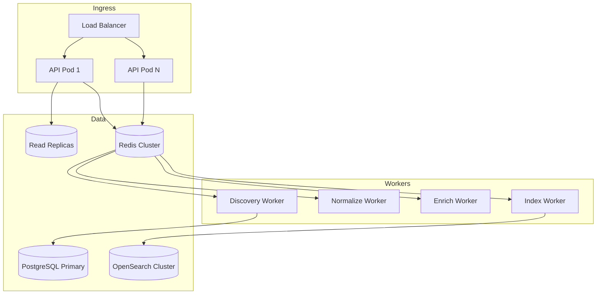

# Scalability & Performance Guide

**Version 2.0** | AI Lead Intelligence Platform — Phase 5

---

## Table of Contents

1. [Performance Requirements](#1-performance-requirements)
2. [Scalability Architecture](#2-scalability-architecture)
3. [Horizontal Scaling](#3-horizontal-scaling)
4. [Caching Strategy](#4-caching-strategy)
5. [Database Optimization](#5-database-optimization)
6. [OpenSearch Optimization](#6-opensearch-optimization)
7. [Connector Performance](#7-connector-performance)
8. [Pipeline Optimization](#8-pipeline-optimization)
9. [Multi-Region](#9-multi-region)
10. [Capacity Planning](#10-capacity-planning)

---

## 1. Performance Requirements

| Operation | Target (p95) | Max |
|-----------|-------------|-----|
| Sync discovery (≤25 results) | 5s | 10s |
| Async job queue time | 2s | 30s |
| Full async pipeline | 45s | 120s |
| Search preview (query parse) | 500ms | 2s |
| Connector health check | 3s | 10s |
| OpenSearch query | 200ms | 1s |
| API autocomplete | 100ms | 500ms |

| Throughput | Target |
|------------|--------|
| Concurrent discovery jobs | 500 |
| Discovery jobs/hour (platform) | 10,000 |
| Connector API calls/min | 5,000 |
| Index writes/sec | 2,000 |

---

## 2. Scalability Architecture



### 2.1 Stateless Design

- API pods: fully stateless, scale on CPU/request rate
- Workers: stateless except in-flight task context
- All state in PostgreSQL, Redis, or OpenSearch

---

## 3. Horizontal Scaling

### 3.1 API Tier

| Metric | HPA Trigger |
|--------|-------------|
| CPU | > 70% for 5 min |
| Request rate | > 1000 req/min per pod |
| Min replicas | 3 |
| Max replicas | 20 |

### 3.2 Worker Tier

| Worker Queue | Scale Trigger | Min | Max |
|-------------|---------------|-----|-----|
| `discovery.jobs` | depth > 100 | 2 | 16 |
| `discovery.normalize` | depth > 200 | 2 | 8 |
| `discovery.enrich` | depth > 100 | 2 | 8 |
| `discovery.index` | depth > 500 | 2 | 12 |

### 3.3 Connector Concurrency

Per-provider connection pools:

```python
CONNECTOR_POOLS = {
    "apollo": {"max_concurrent": 10, "per_org": 3},
    "clearbit": {"max_concurrent": 20, "per_org": 5},
    "hunter": {"max_concurrent": 15, "per_org": 5},
}
```

Enforced by Redis semaphore per `connector:org_id`.

---

## 4. Caching Strategy

### 4.1 Cache Layers

| Layer | Data | TTL | Key Pattern |
|-------|------|-----|-------------|
| L1 (in-process) | Connector registry, taxonomies | 5 min | — |
| L2 (Redis) | Lookup results (domain→company) | 1h | `cache:lookup:{domain}` |
| L2 (Redis) | Normalized taxonomies | 24h | `cache:taxonomy:{type}:{hash}` |
| L2 (Redis) | Rate limit counters | sliding window | `rl:{org}:{connector}` |
| L3 (PostgreSQL) | Golden records | Permanent | — |

### 4.2 Cache Invalidation

- Provider data: TTL-based (no active invalidation)
- Tenant config change: explicit purge `cache:org:{org_id}:*`
- Entity update: invalidate lookup cache for affected domains

### 4.3 Cache-Aside Pattern

```python
async def lookup_company(domain: str, org_id: UUID) -> NormalizedCompanyDTO:
    cache_key = f"cache:lookup:{org_id}:{domain}"
    cached = await redis.get(cache_key)
    if cached:
        return deserialize(cached)
    result = await connector.lookup(domain)
    await redis.setex(cache_key, 3600, serialize(result))
    return result
```

---

## 5. Database Optimization

### 5.1 Key Indexes

```sql
CREATE INDEX idx_discovery_jobs_org_status_created
  ON discovery_jobs(organization_id, status, created_at DESC);

CREATE INDEX idx_companies_org_domain
  ON companies(organization_id, domain);

CREATE INDEX idx_contacts_org_email
  ON contacts(organization_id, email);
```

### 5.2 Read Replicas

- API read endpoints (job list, results) → read replica
- Write endpoints (execute, import) → primary
- Replication lag alert: > 5s

### 5.3 Connection Pooling

```python
# PgBouncer transaction mode
pool_size = 20
max_overflow = 10
pool_recycle = 3600
```

### 5.4 Partitioning

`discovery_jobs` partitioned by `created_at` (monthly) for tables > 10M rows.

---

## 6. OpenSearch Optimization

### 6.1 Index Design

```json
{
  "settings": {
    "number_of_shards": 3,
    "number_of_replicas": 1,
    "refresh_interval": "5s"
  },
  "mappings": {
    "properties": {
      "name": {"type": "text", "fields": {"keyword": {"type": "keyword"}}},
      "domain": {"type": "keyword"},
      "confidence": {"type": "float"},
      "embedding": {"type": "knn_vector", "dimension": 384}
    }
  }
}
```

### 6.2 Bulk Indexing

- Batch size: 500 documents per bulk request
- Worker concurrency: 4 bulk threads
- Use index aliases for zero-downtime reindex

### 6.3 Query Optimization

- Filter on `org_id` (routing key) before text search
- Use `search_after` for deep pagination (not `from/size`)
- Cache frequent autocomplete queries in Redis

---

## 7. Connector Performance

### 7.1 Parallel Execution

```python
# Execute up to 3 connectors in parallel per job
async with asyncio.TaskGroup() as tg:
    for connector in selected:
        tg.create_task(execute_connector(connector, request))
```

### 7.2 Request Optimization

| Technique | Application |
|-----------|-------------|
| Field selection | Request only needed fields from provider |
| Pagination | Fetch first page sync; background pages async |
| Batching | Enrichment: batch 10 domains per API call |
| Compression | `Accept-Encoding: gzip` on all HTTP calls |
| Keep-alive | Shared `httpx.AsyncClient` per connector instance |

### 7.3 Timeout Budget

| Stage | Budget |
|-------|--------|
| Per connector call | 30s |
| Full parallel execution | 35s (max of parallel) |
| Normalization | 5s per 100 records |
| Entity resolution | 10s per 100 candidates |
| Enrichment | 60s (background) |

---

## 8. Pipeline Optimization

### 8.1 Stage Parallelization

```text
Connector Execution (parallel)
  → Normalization (batch, single-threaded per batch)
  → Entity Resolution (parallel per block)
  → Confidence (vectorized, single pass)
  → Enrichment (parallel per entity, rate-limited)
  → Index (async, non-blocking)
```

### 8.2 Early Exit

- If sync request and first connector returns ≥ `page_size` high-confidence hits → skip remaining connectors
- If tenant credits = 0 → fail fast before connector calls

### 8.3 Batch Processing

| Operation | Batch Size |
|-----------|-----------|
| Normalization | 100 records |
| Entity resolution blocking | 500 candidates |
| OpenSearch bulk index | 500 documents |
| Enrichment | 10 entities per provider call |

---

## 9. Multi-Region

### 9.1 Architecture

| Region | Components |
|--------|-----------|
| US-East (primary) | Full stack |
| EU-West | API + workers (GDPR data residency) |
| Global | OpenSearch cross-cluster replication |

### 9.2 Data Residency

- EU tenant data stored in EU PostgreSQL + OpenSearch
- Connector calls originate from EU workers (IP allowlisting)
- No cross-region data transfer without explicit consent

### 9.3 Failover

- DNS failover to secondary region
- Redis Global Datastore for queue replication
- PostgreSQL cross-region read replica (promote on failover)

---

## 10. Capacity Planning

### 10.1 Sizing Formula

```text
API pods = ceil(peak_rps / 200)
Discovery workers = ceil(peak_jobs_per_min × avg_job_duration_min / worker_concurrency)
Index workers = ceil(peak_records_per_min / 500)
```

### 10.2 Growth Projections

| Metric | Current | 6 Month | 12 Month |
|--------|---------|---------|----------|
| Tenants | 50 | 200 | 500 |
| Jobs/day | 5K | 25K | 75K |
| Records indexed | 2M | 10M | 30M |
| Connector API calls/day | 50K | 250K | 750K |

### 10.3 Cost Optimization

| Lever | Savings |
|-------|---------|
| Aggressive lookup caching | −40% connector calls |
| Early exit on sync search | −25% connector calls |
| Incremental enrichment (not full) | −30% enrichment credits |
| Spot instances for batch workers | −60% compute cost |
| OpenSearch index lifecycle (warm→cold) | −20% storage |

### 10.4 Load Testing Schedule

| Test | Frequency | Environment |
|------|-----------|-------------|
| Steady-state baseline | Weekly | Staging |
| 2x projected peak | Monthly | Staging |
| Failover drill | Quarterly | Production (off-peak) |